# Getting Started with YAAT

This guide walks you through your first YAAT session — from launching the app to issuing your first command. It assumes you've already installed everything from the [Installation Guide](INSTALL.md).

## What is YAAT?

YAAT is a tool for ATC (air traffic control) training instructors and RPOs (Remote Pilot Operators). You use it to control simulated aircraft while students view them on their radar scopes in [CRC](#glossary) (Consolidated Radar Client).

**Key concepts:**

- **Room** — an isolated training session. Each room has its own aircraft, weather, and participants. Multiple rooms can run simultaneously on the same server.
- **Scenario** — a predefined set of aircraft with starting positions, flight plans, and spawn timing. Loading a scenario populates the room with traffic.
- **RPO** — a YAAT user who controls simulated aircraft by issuing commands. Multiple RPOs can work the same room.
- **Student** — a trainee using CRC to practice radar/tower operations. Students see the simulated traffic but don't use YAAT directly.

**There's nothing to host.** VATSIM controllers and students use the public YAAT server, **YAAT1** (`https://yaat1.leftos.dev`): YAAT has it selected the first time you connect, and students reach it from CRC (see [Helping Students Connect CRC](#helping-students-connect-crc)).

## Step 1: Launch YAAT

Launch YAAT the same way you launch any other application:

- **Windows:** open the Start menu → type **YAAT** → click the YAAT shortcut. Or, if you grabbed the portable, unzip it into an empty folder and double-click `Yaat.Client.exe` inside.
- **macOS:** open the Applications folder → YAAT. Or, if you grabbed the portable, unzip it and double-click the `Yaat.Client.app` bundle inside.
- **Linux:** run the AppImage (`./YaatClient-<ver>-linux.AppImage`) — it bundles everything and doesn't need to be unzipped.

YAAT opens to an empty main window — no server connection yet. That happens in Step 3.

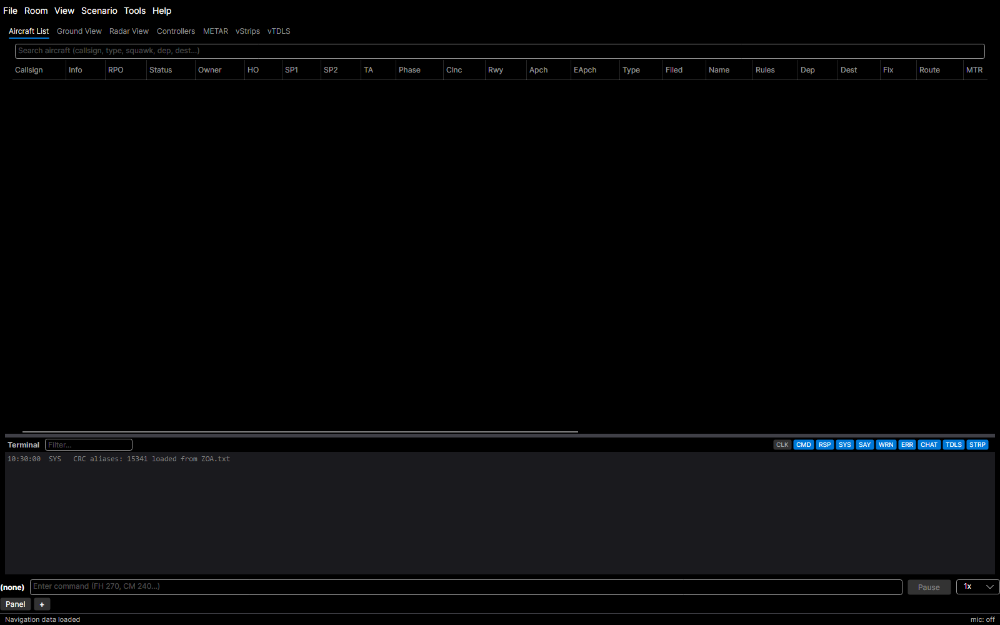

Building YAAT from source to contribute, or hosting your own server? That's covered in the Installation Guide's [Building from source](INSTALL.md#building-from-source); you don't need it to train on VATSIM.

## Step 2: Sign In with VATSIM

YAAT verifies your identity through **VATSIM sign-in** — you no longer type your CID. When you connect to a server (Step 3), your browser opens to the VATSIM login page; after you authorize, YAAT receives your verified **CID, name, and controller rating** straight from VATSIM and remembers your sign-in between launches.

One field stays yours to set, under **Tools > Settings**, in the **General** section — your operating **initials** (e.g., "JE", "AB"), suggested from your VATSIM name and shown in the terminal so other RPOs can see who issued each command. Your **[ARTCC](#glossary)** is filled in automatically from your VATSIM/VATUSA profile when you sign in (US controllers from VATUSA, everyone else from their VATSIM subdivision) and updates on its own if you transfer facilities — there is no ARTCC field to enter.

> **Who can connect:** YAAT1 admits you to **create rooms and load scenarios** if you hold a VATUSA mentor role or a VATSIM Instructor rating (I1/I2/I3) or higher. Any other signed-in VATSIM controller can connect as an **[RPO](#glossary)**: you wait on a "waiting for room assignment" screen until an instructor pulls you into a room, then work the position like any room member (but you can't create rooms or load/unload scenarios). Students being trained connect with [CRC](#glossary) and are unaffected.

## Step 3: Connect and Create a Room

1. **File > Connect** opens the connect dialog

   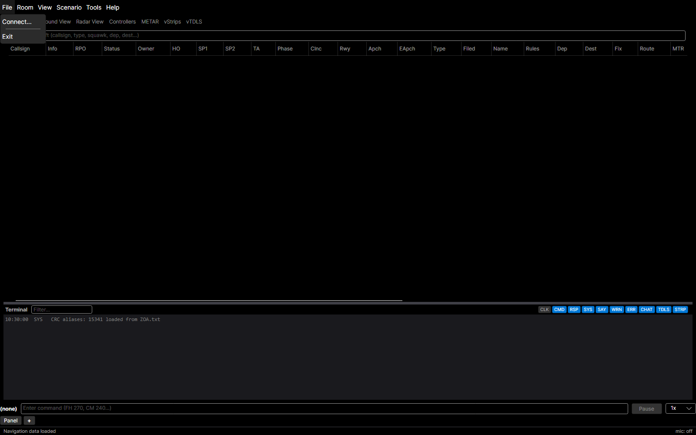

   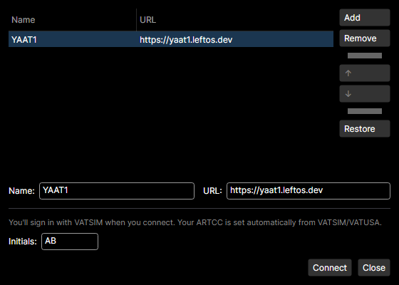

2. Leave **YAAT1** selected: it's the public YAAT server every VATSIM controller and student uses. Change the server only if your instructor runs a separate one and gives you its URL.
3. Click **Connect**. The first time you connect to a given server, your browser opens to **VATSIM sign-in** — authorize, and YAAT receives your verified identity. YAAT remembers both the URL and your sign-in, so you don't repeat either next time.
4. The **room list** appears. Either:
   - **Create** a new room (give it a name), or
   - **Join** an existing room that another instructor created

   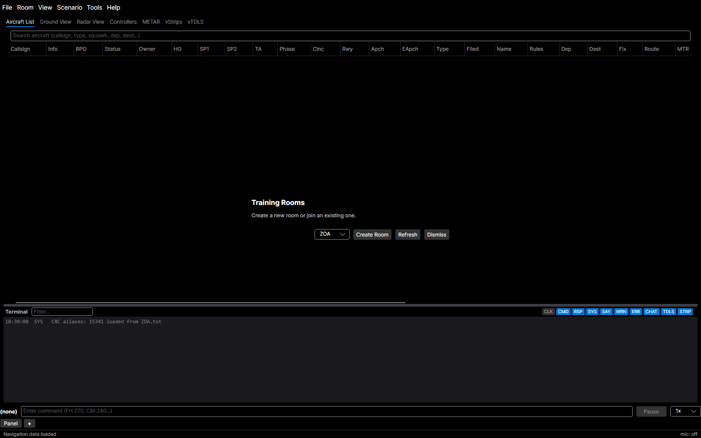

5. You're now in a room, ready to load traffic

## Step 4: Load a Scenario

1. **Scenario > Load Scenario...** opens the scenario browser

   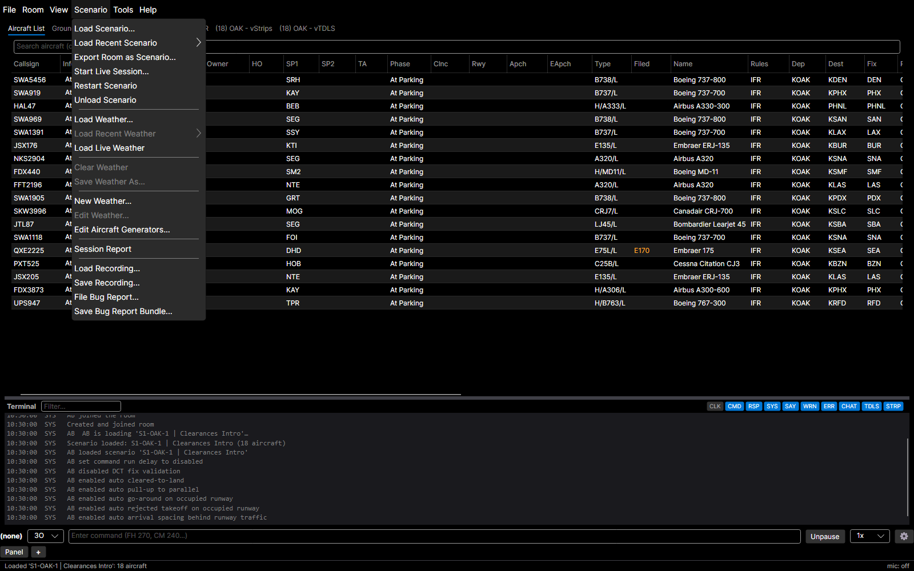

2. Two tabs:
   - **ARTCC Scenarios** — training scenarios from the [vNAS](#glossary) data API for your ARTCC. Use the Airport filter to narrow results.
   - **Local Files** — browse for ATCTrainer-format JSON scenario files on your machine
3. Select a scenario and click **Load** (or double-click)

   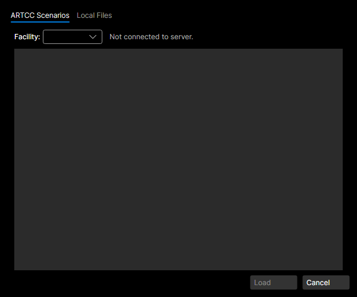

Aircraft spawn at their configured starting positions. The window title updates to show the room and scenario name.

## Step 5: Issue Your First Command

With a scenario loaded, you'll see aircraft in the **Aircraft List** (the main grid). Try these:

1. **Select an aircraft** — click a row in the grid, or type a callsign in the command bar and press **Numpad +**
2. **Issue a command** — with an aircraft selected, type a command and press **Enter**:

| Try this | What it does |
|----------|-------------|
| `FH 270` | Fly heading 270 |
| `CM 100` | Climb and maintain 10,000 ft |
| `SPD 250` | Maintain 250 knots |
| `CM 050, FH 090` | Climb to 5,000 ft **and** turn to 090 simultaneously |

You can also prefix any command with a callsign: `UAL123 FH 270`.

The **terminal panel** (below the grid) shows command confirmations, errors, and aircraft responses.

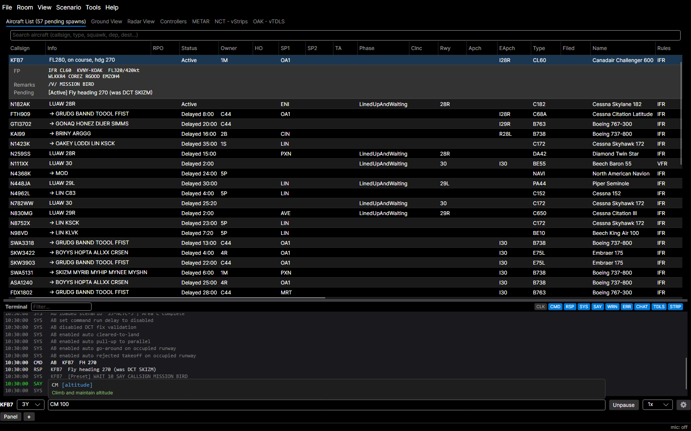

## Step 6: Explore the Views

YAAT has three main views, accessible via tabs or pop-out windows (**View** menu):

- **Aircraft List** — data grid with all aircraft state (altitude, speed, heading, phase, etc.)
- **Ground View** — airport surface map for tower operations. Right-click aircraft or taxiway nodes for context menus (taxi routes, hold short, cross runway).
- **Radar View** — STARS-style scope for approach/departure. Shows targets, video maps, and data blocks. Right-click for heading, altitude, and approach options.

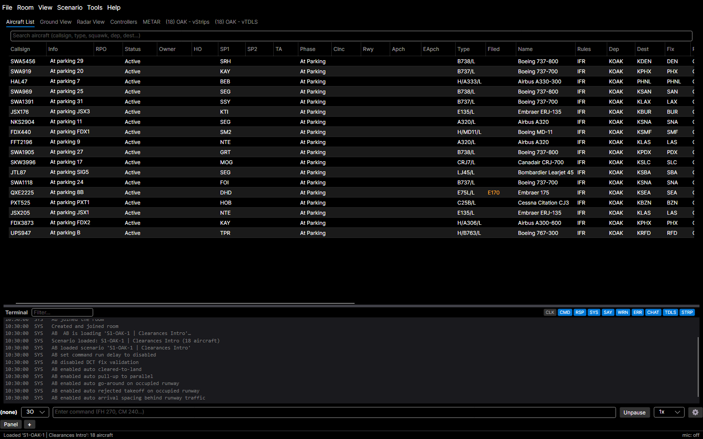

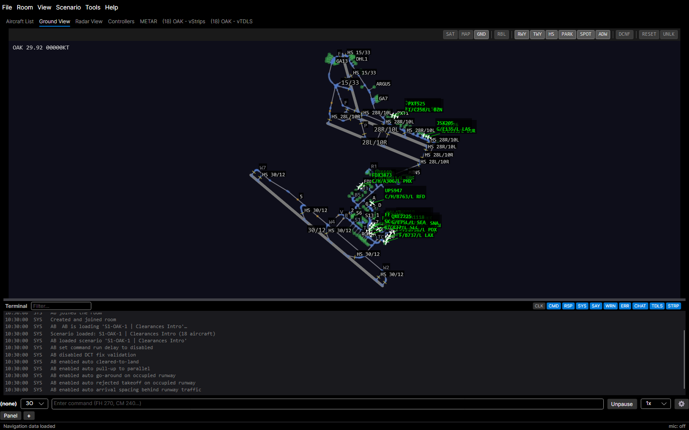

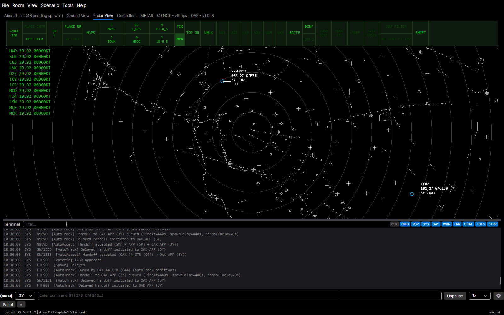

## Step 7: Load Weather (Optional)

Weather affects aircraft performance — headwinds reduce ground speed, tailwinds increase it.

- **Scenario > Load Weather...** — browse ARTCC or local weather profiles
- **Scenario > Load Live Weather** — fetch real-world METARs and winds aloft
- **Scenario > New Weather...** — create a custom weather profile

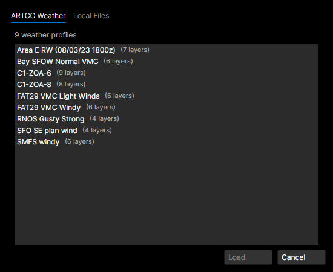

## Helping Students Connect CRC

If you're setting up a training session with students, see the [CRC Setup section](USER_GUIDE.md#connecting-crc-for-students) in the User Guide for how to configure CRC to connect to YAAT1.

## Next Steps

- **[Command Reference](COMMANDS.md)** — complete list of every command, alias, and example
- **[User Guide](USER_GUIDE.md)** — detailed documentation of all features, views, settings, and workflows

## Glossary

| Term | Definition |
|------|-----------|
| **ARTCC** | Air Route Traffic Control Center — a facility that manages airspace (e.g., ZOA = Oakland Center, ZLA = Los Angeles Center) |
| **ATC** | Air Traffic Control |
| **CRC** | Consolidated Radar Client — the VATSIM radar client that students use to work scopes |
| **RPO** | Remote Pilot Operator — a YAAT user who controls simulated aircraft |
| **VATSIM** | Virtual Air Traffic Simulation Network — a community for online ATC and pilot simulation |
| **vNAS** | Virtual National Airspace System — VATSIM's infrastructure for facility data, nav data, and scenarios |
