# YAAT User Guide

YAAT (Yet Another ATC Trainer) is an instructor/[RPO](#glossary) desktop client for air traffic control training. It works alongside [CRC](#glossary) (the [VATSIM](#glossary) radar client) — you control simulated aircraft in YAAT while students view them on CRC's radar display.

**New to YAAT?** Start with the [Getting Started guide](GETTING_STARTED.md) for installation, first connection, and your first scenario.

## Table of Contents

- [Interface Overview](#interface-overview)
  - [Main Window](#main-window)
  - [Tabs and Pop-Out](#tabs-and-pop-out)
  - [Terminal Panel](#terminal-panel)
  - [Command Bar](#command-bar)
  - [Keyboard Shortcuts](#keyboard-shortcuts)
- [Views](#views)
  - [Aircraft List](#aircraft-list)
  - [Ground View](#ground-view)
  - [Radar View](#radar-view)
  - [Flight Strips](#flight-strips)
  - [vTDLS](#vtdls)
  - [Flight Plan Editor](#flight-plan-editor)
  - [Copying View Settings](#copying-view-settings)
- [Scenarios and Weather](#scenarios-and-weather)
  - [Loading a Scenario](#loading-a-scenario)
  - [Unloading a Scenario](#unloading-a-scenario)
  - [Loading a Weather Profile](#loading-a-weather-profile)
  - [Viewing METARs](#viewing-metars)
  - [Loading Live Weather](#loading-live-weather)
  - [Weather Editor](#weather-editor)
  - [Weather Timelines (V2 Format)](#weather-timelines-v2-format)
  - [Arrival Generators Editor](#arrival-generators-editor)
- [Solo Training](#solo-training)
- [Commands](#commands)
  - [Compound Commands](#compound-commands)
  - [Helicopter operations](#helicopter-operations)
- [Simulation Controls](#simulation-controls)
  - [Timeline / Rewind](#timeline--rewind)
  - [Bookmarks](#bookmarks)
  - [Save / Load Recordings](#save--load-recordings)
- [Multi-User Features](#multi-user-features)
  - [Aircraft Assignments](#aircraft-assignments)
  - [Room Members](#room-members)
  - [Students Panel](#students-panel)
  - [Controllers](#controllers)
- [Connecting CRC for Students](#connecting-crc-for-students)
- [Customization](#customization)
  - [Autocomplete](#autocomplete)
  - [Macros](#macros)
  - [Favorite Commands](#favorite-commands)
  - [Command History](#command-history)
  - [Settings](#settings)
  - [Window State](#window-state)
- [Glossary](#glossary)

---

## Interface Overview

### Main Window


The YAAT window has three areas:

1. **Tab area** (top) — three views: Aircraft List, Ground View, Radar View
2. **Terminal panel** (bottom) — scrolling log of commands, responses, warnings, and errors
3. **Command bar** (bottom edge) — where you type commands

The menu bar provides access to File (connect/disconnect), Scenario (load/unload/weather), Room (members/students), View (pop-out windows), and Settings.

#### Planned server maintenance

When the server restarts for a planned deploy or upgrade, YAAT saves your active training room and pauses the scenario. An **amber banner** appears at the top of the main, radar, and ground windows with a live countdown (for example, "Server restarting for planned maintenance — session resumes in ~30s"). **Command input is disabled** while the countdown runs.

After the server is back, the client **automatically rejoins the same room**. A short **green confirmation** appears (for example, "Reconnected to your room — session resumed at T+182s"), then the banner dismisses. Aircraft, routes, phases, strips, ASDEX/ERAM layout, line numbers, and in-flight coordination items are restored from the save point; the scenario stays **paused** at the moment of the restart so you can resume when ready.

This applies only to **planned** restarts announced by the server. An unexpected crash does not restore the session. Operators deploying the hosted server can read [docs/session-persistence.md](docs/session-persistence.md).

### Tabs and Pop-Out

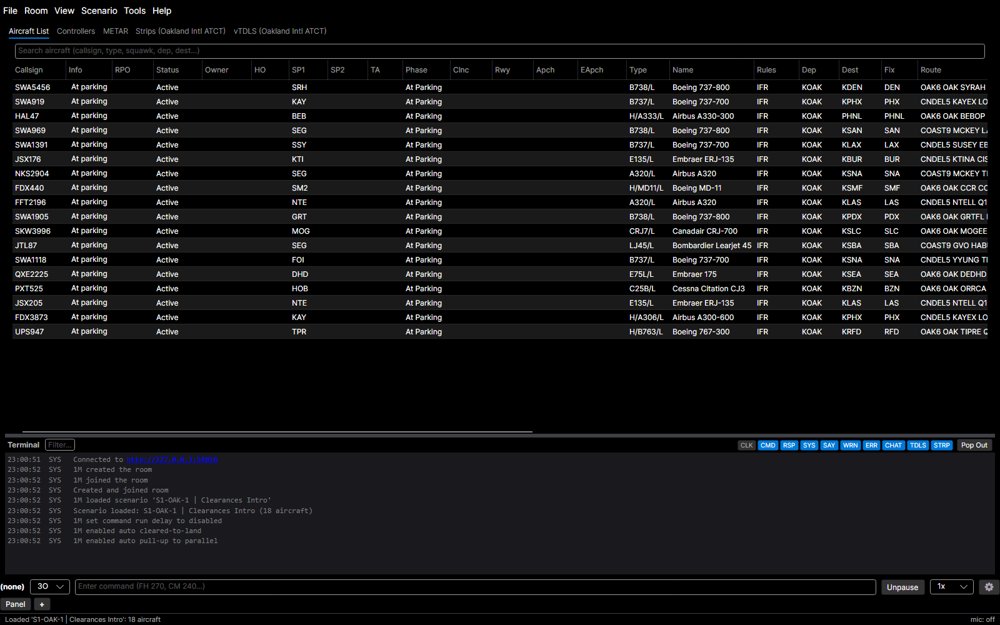

Each view can be popped out into its own window via **View > Pop Out Aircraft List / Ground View / Radar View / Controllers / METAR**. When a view is popped out, its tab disappears from the main window and a separate window opens. Close the pop-out window (or uncheck the menu item) to dock it back as a tab.

All views can be popped out simultaneously. Pop-out state and window positions are remembered across sessions.

**Window Profiles** save and restore named window arrangements — geometry, dock/pop-out state, and DataGrid columns. Use **View > Window Profiles** to save the current layout under a name, switch between saved profiles, or rename and delete them. Useful for keeping separate GC and LC layouts and switching between them in one click.

**Copy View Settings** (**View > Copy View Settings**) compares your current view settings against another source — a different scenario or a saved window profile — and copies only the sections you tick. The dialog shows each group side by side (map position, video maps, range, PTL, brightness, labels, filters, window geometry, pop-out/dock state, and the Aircraft List column layout) and highlights the rows that differ, so you can see exactly what would change before applying. Map-position rows are flagged when the source is a different airport.

**Always on Top:** Press **Ctrl+Shift+T** (configurable in Settings > Advanced) while a pop-out window is focused to pin it above all other windows. You can also toggle this per window in Settings > Display > Windows (Main Window, Ground View, Radar View, Aircraft List, Terminal, Flight Strips, Favorites). On Windows, the toggle is also available in the title-bar system menu (right-click the title bar or click the window icon). On macOS, the toggle is in the menu bar under Window → Always on Top while the pop-out is focused. On Linux, your window manager's title-bar context menu typically provides a native "Always on Top" item that reflects the same state.

### Terminal Panel

The terminal panel shows a scrolling history of all commands and server feedback, visible to all connected [RPOs](#glossary).

#### Entry Format

Each line shows:
```
HH:MM:SS  CMD  AB  UAL123  FH 270
```
- **Timestamp** — when the entry was received
- **Kind tag** — entry category (CMD, RSP, SYS, SAY, WRN, ERR, CHAT)
- **Initials** — who issued the command
- **Callsign** — which aircraft was targeted
- **Message** (colored by type):
  - **White** — command echo (CMD)
  - **Light gray** — server response/feedback (RSP)
  - **Gray** — system message (SYS)
  - **Green** — SAY (instructor messages)
  - **Orange** — warnings (WRN)
  - **Red** — errors (ERR)
  - **Cyan** — chat messages (CHAT)

#### Filters

The terminal header includes toggle buttons to filter entries by kind: **CMD**, **RSP**, **SYS**, **SAY**, **WRN**, **ERR**, **CHAT**. Click a toggle to hide/show that kind. Hidden entries remain in the backing store — toggling a filter back on restores all entries. All entries are always written to the client log file regardless of filter state. Filter state persists across sessions.

#### Multi-User Visibility

All RPOs connected to the same scenario see each other's commands in their terminal.

#### Chat Messages

Type a message prefixed with `'`, `/`, or `>` to send a text chat to all RPOs in your scenario:

```
'Switching to RNAV approach
>Ready for next aircraft
```

#### Resizing and Pop Out

Drag the splitter bar between the aircraft grid and terminal panel to resize them. Click the **Pop Out** button in the terminal header to undock the terminal into a separate floating window. The command input bar moves to the terminal window. Click **Dock** (or close the window) to return it to the main window.

#### Warnings

Warning messages appear when the simulator detects potential issues:

- **Missed FRD condition**: `Missed condition at SUNOL R090 D020 (closest: 2.3 NM)` — an aircraft passed through an FRD trigger point without getting close enough.
- **Illegal approach intercept**: `Illegal intercept: turned on final 5.2nm from threshold (min 9.0nm) [7110.65 §5-9-1]` — an aircraft was vectored onto final closer than the minimum intercept distance.

### Command Bar

The command bar at the bottom is where you type and send commands. See [Commands](#commands) for details.

### Keyboard Shortcuts

> **macOS:** Substitute **⌘ (Cmd)** for **Ctrl** in all shortcuts below.

Keys marked *(default)* are configurable under **Settings > Advanced / Keybinds**.

#### Command Input

| Key | Action |
|-----|--------|
| Enter | Send command. If a suggestion is highlighted, expand it first (toggle in **Settings > Advanced > Command Input**) |
| Tab | Accept the highlighted suggestion (or first if none highlighted) |
| Up / Down | Navigate suggestions, or recall command history |
| Esc | Dismiss suggestions, else deselect aircraft and clear input |
| Alt+Up / Alt+Down | Cycle command variant (signature-help overload — e.g. the multiple forms of `PUSH`) |
| Numpad + | Select aircraft matching the typed callsign *(default)* |

#### Global / Window

| Key | Action |
|-----|--------|
| ~ (tilde) | Focus the command input from anywhere in the app *(default)* |
| Ctrl+T | Take control of the selected aircraft *(default)* |
| Ctrl+Shift+T | Toggle window always-on-top *(default)* |
| Ctrl+B | Drop a quick timeline bookmark *(default)* |
| Right Ctrl | Push-to-talk for speech recognition *(default)* |

#### Radar View

| Key | Action |
|-----|--------|
| Esc | Exit heading mode, or cancel route / range-ring placement |
| Enter | Confirm the drawn route |
| Backspace | Undo the last route waypoint |
| Click | Place a route waypoint (while drawing) |
| Ctrl+Click | Open the flight-plan editor for an aircraft |
| Scroll | Zoom in / out |

Route drawing and heading mode start from the aircraft right-click menu.

#### Ground View

| Key | Action |
|-----|--------|
| Esc | Cancel route drawing |
| Backspace | Undo the last waypoint |
| Click | Place a taxi-route waypoint (while drawing) |
| Ctrl+D | Toggle the debug-info overlay |

#### Aircraft List

| Key | Action |
|-----|--------|
| Ctrl+Plus | Increase grid font size |
| Ctrl+Minus | Decrease grid font size |
| Ctrl+0 | Reset grid font size |
| Esc | Clear the search box and refocus the grid |
| Double-click | Open the flight-plan editor for a row |

#### vTDLS

| Key | Action |
|-----|--------|
| F4 | Dump the selected item |
| F10 | Close the flight-plan editor |
| F12 | Send the clearance |

**Flight Strips** have an extensive set of bay/strip keyboard shortcuts — see [Flight Strips ▸ Keyboard shortcuts](#keyboard-shortcuts-1).

---

## Views

### Aircraft List

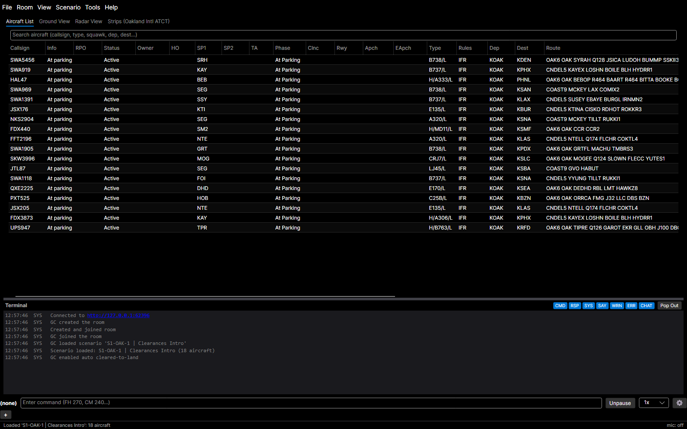

The default view. Shows all aircraft in your scenario, grouped into **Active** and **Delayed** sections. Click the group header row to collapse or expand each section. Use **View > Reset Aircraft List Layout** to restore defaults.

| Column | Description |
|--------|-------------|
| Callsign | Aircraft callsign (e.g., UAL123) |
| Info | Smart status — contextual summary (see [Info Column](#info-column)) |
| Status | Spawn status (Active, Delayed, etc.) |
| Type | Aircraft type code (e.g., B738/L) |
| Name | Human-readable aircraft type (e.g., "Boeing 737-800", "Cessna Skyhawk 172") |
| Rules | Flight rules ([IFR](#glossary) / [VFR](#glossary)) |
| Dep / Dest | Departure and destination airports |
| Route | Filed route |
| P.Alt | Planned cruise altitude (e.g., 035, VFR, VFR/035, OTP/035) |
| Remarks | Flight plan remarks |
| Clnc | Clearance shorthand (e.g., CL = cleared to land, TG = touch and go) |
| Apch | Active approach ID (e.g., ILS28R) |
| EApch | Expected approach |
| Squawk | Assigned transponder code |
| Hdg | Current heading |
| Alt | Current altitude (ft) |
| IAS | Indicated airspeed (kts) |
| Mach | Mach number (shown when applicable) |
| GS | Ground speed (kts) |
| Wind | Wind at aircraft altitude (direction/speed) |
| VS | Vertical speed (fpm) |
| RPO | Assigned controller initials (see [Aircraft Assignments](#aircraft-assignments)) |
| Owner | Track owner (sector code, e.g., "2B", or callsign) |
| HO | Pending handoff target |
| SP1 | Scratchpad 1 text |
| SP2 | Scratchpad 2 text |
| TA | Temporary altitude assignment |
| Phase | Current phase name (e.g., Downwind, FinalApproach, TakeoffRoll) |
| Rwy | Assigned runway |
| AHdg / AAlt / ASpd | Assigned targets — AHdg shows the next fix name when navigating, or heading when under vectors |
| Dist | Distance in NM from the reference fix (see [Distance Column](#distance-column)) |
| Pending Cmds | Numbered pending command blocks. Shows `[Active]` for the current block, then `[1]`, `[2]`, etc. for queued blocks |

Click an aircraft row to select it, or type a callsign in the command input and press the aircraft select key. The selected row is highlighted and expands to show a details pane beneath it; the highlight stays visible even after focus moves to the command input. Press **Esc** to deselect. Click a column header to sort; click again to reverse.

Drag column headers to rearrange. **Right-click any column header** to open the Column Chooser, where you can show/hide columns and reorder them. The Column Chooser also has an **alternating-row shading** toggle if you prefer striped rows. Click **Reset to Defaults** to restore the original layout.

**Show only active aircraft:** Use the checkbox in the Column Chooser to hide delayed aircraft. Column order, widths, visibility, sort state, and the active-only filter are remembered across sessions.

**Alternating row colors:** A checkbox in the Column Chooser shades every other row for easier scanning. It's on by default; turn it off for plain uniform rows. The setting is remembered across sessions.

**Import/Export layouts:** Use the **Export...** and **Import...** buttons in the Column Chooser to share grid layouts. Different training levels may benefit from different layouts — export one for each level and swap as needed.

**Right-click context menu:** Phase-aware. The list right-click mirrors the radar/ground menu's one-click items so you can act on any aircraft without finding it on a scope. Includes a **Command…** item that opens a focused free-text command popup, Edit flight plan, Delete, RPO assignment, Track ops (Track / Drop / Accept / Cancel handoff / Acknowledge pointout), Squawk presets (random / VFR / normal / standby / Ident), Coordination (Release / Hold / Recall / Acknowledge), "Ask pilot to say..." (altitude / heading / speed / mach / position / expected approach), and phase-aware items: ground phases show Push back, Hold position, Resume taxi, Cross/LUAW for the runway being held short of, landing items on Final Approach, Exit left/right on Landing, Cancel takeoff/landing clearance; airborne aircraft get a Tower submenu with the runway-aware landing/option/T&G items. Items that need free-text input or filtered popups (Direct to fix, Hold at fix, Heading/Altitude/Speed dropdowns) remain reachable via the **Command…** popup.

**Zoom:** Use **Ctrl+Plus** / **Ctrl+Minus** to adjust font size. **Ctrl+0** resets to default (12pt). Also configurable in **Settings > Display**. Range: 8-24pt.

#### Info Column

The **Info** column shows a contextual summary of each aircraft's state.

**Color coding:**
- **White** — normal status (phase description, taxi route, navigation info)
- **Gold/amber** — warning that needs attention (pending handoff, no altitude assignment)
- **Red** — critical alert requiring immediate action (on final or landing without clearance)

**Alert conditions** (highest priority first):

| Condition | Text | Color |
|-----------|------|-------|
| On final approach without landing clearance | "No landing clnc" | Red |
| Landing without clearance | "Landing — no clnc!" | Red |
| Handoff in progress | "HO → {sector}" | Gold |
| Airborne, no phase/SID/STAR, no altitude assignment, no nav route | "No altitude asgn" | Gold |

**Phase-based status** (white, when no alerts apply): Describes the current phase — e.g., "Taxi to RWY 28R via A B C", "LUAW 28R", "Departing 28R, hdg 270, ↑ 3,000", "ILS28R → CEPIN DUMBA AXMUL", "Left downwind 28R", "Landing 28R".

**Departing aircraft** add their lateral clearance and climb target after the runway: the lateral part is the SID name, "hdg 270" (with "left/right turn" when a turn direction was assigned), "→ {fix}", "on course", "runway heading", or "{left/right} traffic" for closed traffic; the vertical part is "↑ {altitude}" for the climb target. Examples: "Departing 28R, OAK5, ↑ 5,000", "Departing 28R, → VPMID, ↑ 3,000", "Departing 28R, right traffic, ↑ 1,400".

**No-phase fallback** (white, when no phase is active): Shows climb/descent arrows with altitude ("↑ FL350", "↓ 5,000"), navigation route ("→ OAK SFO LAX"), or "On ground" / "FL350, on course".

If the aircraft has an assigned heading, ", hdg {heading}" is appended to the Info text.

The Info column is searchable — type status text in the search box to filter aircraft.

#### Aircraft Detail Panel

Selecting an aircraft row expands a detail panel below it:

| Section | Shown when | Content |
|---------|------------|---------|
| Phases | Aircraft is tower-managed | Phase sequence with active phase in brackets |
| Pattern | Aircraft is in the pattern | Traffic direction (Left/Right traffic) |
| Clearance | A clearance has been issued | Clearance type and runway |
| FP | Aircraft has a flight plan | Filed route and cruise altitude |
| Remarks | Flight plan has remarks | Flight plan remarks text |
| Nav | Aircraft has a navigation route | Remaining waypoints in the route |
| Pending | Queued command blocks exist | Numbered pending commands |

Sections with no data are hidden.

#### Distance Column

The **Dist** column shows distance in nautical miles from a reference fix. Defaults to the scenario's primary airport.

To change the reference fix, **middle-click** the "Dist" column header. A flyout appears where you can type a fix name or [FRD](COMMANDS.md#fix-radial-distance-frd). Press **Enter** or click a suggestion to apply, **Escape** to cancel.

### Ground View

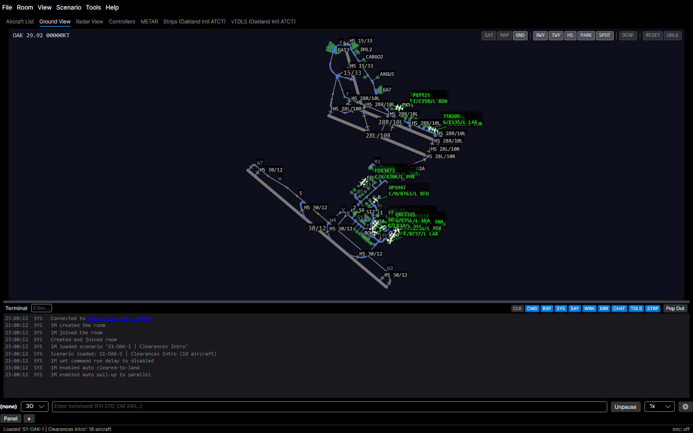

An interactive airport surface map showing taxiways, runways, and aircraft positions. Useful for tower operations.

- **Pan**: right-click and drag
- **Zoom**: mouse wheel (hold **Ctrl** for fine zoom)
- **Rotate**: Shift + mouse wheel (1° per notch)
- **Select aircraft**: click an aircraft triangle on the map

**Datablock.** Each aircraft's ground datablock shows the callsign, then its CWT wake category and type as `cwt/type` with the destination (e.g. `E/B738 SFO`) — matching the radar view; an unknown type or category just shows whichever part is known. Airborne aircraft add an altitude line, and a hold / squawk-standby / auto-yield status line and any instructor note appear below.

**Right-click context menus:**
- **Anywhere on the ground (with aircraft selected)** — the click snaps to the nearest node, so the menu appears even on an open stretch of runway or taxiway with no node directly under the cursor: up to 4 route options ("Taxi via T U W") computed via K-shortest paths. Routes that cross runways automatically append crossing commands. Also: "Push to {spot}" (parking nodes), "Draw taxi route...", "Custom taxi...", and "Warp here".
- **On an aircraft** — items vary by phase:
  - *At Parking*: "Push back" (default), "Push back, face {taxiway}" per connected edge, "Push back to..." submenu listing the closest 30 named parking/spot/helipad nodes (sorted by distance)
  - *Pushback / Taxiing / Following*: "Hold position"
  - *Taxiing*: "Hold short of..." submenu listing intersecting runways and taxiways; "Follow..." and "Give way to..." submenus listing nearby ground aircraft (closest 12 by distance)
  - *Holding Short*: "Resume taxi", "Cross {rwy}", "Line up and wait", "Cleared for takeoff" — all for the runway the aircraft is holding short of
  - *Holding After Exit*: "Resume taxi"
  - *Lined Up*: "Cleared for takeoff", "Cancel takeoff clearance"
  - *On the ground (most phases)*: "Preset taxi route" submenu listing per-airport SOP routes when applicable, "Draw taxi route..."
  - *Takeoff*: "Cancel takeoff clearance"
  - *Final Approach*: "Cleared to land {rwy}", "Go around {rwy}", "Cancel landing clearance"; for **VFR** aircraft also "Touch and go {rwy}", "Stop and go {rwy}", "Low approach {rwy}", "Cleared for the option {rwy}" (these option clearances are hidden for IFR aircraft) — runway shown in label when assigned
  - *Landing / Runway Exit*: "Exit left", "Exit right" (fixed-wing only)
  - All phases include "Delete"
  - *With a different on-ground aircraft selected*: the "Follow.../Give way to..." candidate submenus are replaced by direct "{selected}: give way to {clicked}" and "{selected}: follow {clicked}" items issued to the **selected** aircraft — pick the traffic by right-clicking it instead of hunting a 12-item submenu

**Auto-delete on hold-short.** For busy tower / local scenarios where landing aircraft pile up at the post-runway hold-short, type `ONHS DEL` against the landing aircraft. The auto-delete fires the moment the aircraft transitions into the *Holding After Exit* phase (i.e., it has rolled out, taken the runway exit, and stopped at the next intersecting taxiway). The pilot still calls "clear of runway" before the delete runs. While the auto-delete is armed, the radar / Tower Cab datablock shows a trailing `*` on the callsign. Issue `NODEL` to cancel — that strips the queued auto-delete and also re-arms `AutoDeleteExempt` so scenario-level auto-delete will leave the aircraft alone too.

**Expedite a runway exit ("without delay").** When you need a landed aircraft off the runway fast — to land or depart the next one — add `EXP` to its exit command (`ER EXP`, `ER W5 EXP`, `EL EXP`, `EXIT A3 EXP`), or type a bare `EXP` to one that is rolling out or already exiting. The pilot takes the *earliest* reachable exit instead of the first comfortable one, braking harder (a max-effort rate, e.g. ~7.5 kts/s for a jet vs the normal firm 5) to make it, keeps the higher turn-off speed at a high-speed exit, and brakes firmly to a stop at the hold-short. `EXP` combines with `NODEL` in any order. This reduces runway occupancy at the cost of a firmer rollout — the controller phrase is "exit … without delay".

**Taxiing from where the aircraft already is.** A `TAXI` clearance need not name the taxiway the aircraft currently occupies — issue just the continuation (`TAXI W` to an aircraft sitting on W5, `TAXI E RWY 28R` to one on C) and the current taxiway is added to the route automatically when it joins the first cleared taxiway directly. The aircraft is never warned about the taxiway it is already on, and a `TAXI` issued just after a runway exit also clears finishing the crossing of that same runway. See [Command Reference](COMMANDS.md) for details and the across-a-runway exception.

**Turn-direction hints.** Prefix a taxiway in a `TAXI` clearance with `>` (right) or `<` (left) to tell the aircraft which way to turn onto it — `TAXI >A B <C D` means right onto A, then B, left onto C, then D (no space between the glyph and the letter). On the first taxiway the hint picks the start direction relative to where the aircraft is pointed; on later taxiways it prefers the junction whose turn matches. It is a preference, not a constraint: if only the other direction is reachable the aircraft still taxis there and the TAXI echo notes that the requested turn couldn't be made, and an unprefixed taxiway keeps the router's own pick. The same `>`/`<` glyphs mean *face*/*tail* in a `PUSH` command — they are turn hints only in `TAXI`.

**Cross and hold just past.** `TAXI <twy> CROSS <rwy>` with no taxiway named past the crossing (e.g. `TAXI G CROSS 28R`) sends the aircraft toward and across that runway, then holds it clear just past the far side awaiting further instructions. The named runway sets the direction, so this works even when the taxiway crosses two runways — an aircraft that just exited the parallel 28L heads at 28R, not back across 28L. Add an onward taxiway, parking `@`, or spot `$` to keep it moving; a destination in the clearance (e.g. `RWY 30 TAXI G CROSS 28R`) makes `CROSS 28R` a plain crossing pre-clearance instead.

**Tail over the runway, and clearing it.** When you hold an aircraft short of a taxiway whose hold line sits closer than the aircraft's own length past a runway it just crossed (e.g. `TAXI G B HS B` across SFO 01L/19R), it can't be both short of the taxiway and clear of the runway — so it stops at the taxiway line with its tail over the runway bars, the TAXI echo flags it'll be unable to clear the runway, and a terminal note warns the runway isn't clear. To resolve it, issue `CLRWY` (alias `CLEARRWY`): the aircraft pulls forward just until it's clear of the runway and holds, and the warning clears. It enters the taxiway minimally rather than driving on to the next junction.
- **On empty space**: left-click to deselect the current aircraft

**Selecting vs. targeting.** Left-click selects the aircraft you're working. Right-clicking a *different* aircraft no longer changes the selection — it opens that aircraft's menu (and, when both are on the ground, the relative give-way / follow actions above), so you can keep one aircraft selected while pointing at others as traffic.

**Automatic ground yields.** When the simulator slows one ground aircraft for another — a converging path or an in-trail follow — the slowed aircraft's ground datablock shows a **→{callsign} (auto)** badge naming the traffic it is yielding to, so an automatic slowdown is never unexplained. Its right-click menu spells it out as **Yielding to** (converging) or **Following** (in trail). A give-way you issue yourself still takes precedence over the automatic one.

**Runway-end click target:** When an aircraft is selected, a small amber dot appears at every runway threshold. Left-click a dot to open the same "Taxi to runway" submenu produced by right-clicking a hold-short node — but anchored at the threshold, so you don't have to hunt for the right hold-short node. The submenu still offers the RWY (taxi onto the runway end), HS (hold short), and progressive crossing variants.

**Draw taxi route mode:** Right-click a node or aircraft and select "Draw taxi route..." to enter draw mode. Click nodes to add waypoints — the route is computed via A* between consecutive waypoints. Hover shows a dashed preview. Right-click to finish. Backspace undoes the last waypoint, Escape cancels.

**Preset taxi routes:** Right-click an aircraft on the ground and select "Preset taxi route" to issue an SOP-aligned taxi command in one click. Routes are loaded from per-airport JSON files bundled with YAAT under `Data/TaxiRoutes/{ARTCC}/{airport}-routes.json` — for example, FLL's "DEP 10R via T-T3-B" lives at `Data/TaxiRoutes/ZMA/kfll-routes.json`. Each route has a display name, a whitespace-separated path of taxiway names (whatever you'd type after `TAXI` in the command bar), and an optional destination (runway hold-short, parking, or spot):

```jsonc
{
  "airportId": "KFLL",
  "routes": [
    {
      "name": "DEP 10R via T-T3-B",
      "path": "T T3 B",
      "destinationRunway": "10R",
      "tags": ["dep", "10R"]
    }
  ]
}
```

Selecting a preset is identical to typing the equivalent `TAXI` command (`TAXI T T3 B RWY 10R` in the example above). Routes that aren't reachable from the aircraft's current position are silently dropped from the menu — for example, an OAK departure route won't appear when right-clicking an aircraft at SFO. Restart YAAT to pick up edits to the route JSONs.

**Debug overlay:** Press **Ctrl+D** to toggle node IDs, names, types, and edge labels on the ground map. Useful for finding node IDs for manual `#nodeId` taxi commands.

**Controls bar** (top-right corner):
- **Layer toggles** — **SAT** (satellite background image), **MAP** (video map overlay), **GND** (YAAT ground layout)
- **Label filters** — **RWY** and **TWY** toggle labels on/off. **HS**, **PARK**, and **SPOT** are tri-state: labels+icons → icons only → hidden. Hovering over a hidden element temporarily shows it.
- **RESET** — reset view to fit the airport
- **LOCK / UNLK** — lock or unlock pan, zoom, and rotation.

**Per-scenario persistence** — Ground view settings (pan, zoom, rotation, label filters, lock) are saved independently for each scenario.

When weather is loaded, wind direction/speed and altimeter setting are displayed in the top-left corner.

### Radar View

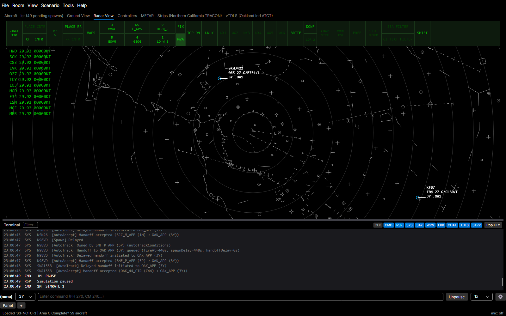

A simplified [STARS](#glossary)-style radar display showing aircraft targets, video maps, and navigation fixes. Useful for approach/departure operations.

- **Pan**: right-click and drag
- **Zoom**: mouse wheel (hold **Ctrl** for fine zoom)
- **Select aircraft**: click a target on the display

**DCB bar** (top of the radar view):
- **RNG +/-**: increase/decrease display range
- **MAP**: toggle individual video maps
- **Map shortcuts**: up to 6 quick-toggle buttons for frequently used map groups
- **RR**: range ring size spinner; **PLACE RR** positions the center, **RR CNTR** resets to center
- **FIX**: toggle fix name overlay
- **LOCK**: lock/unlock pan and zoom
- **TOP-DN**: toggle top-down display mode
- **BRITE**: adjust brightness per video map category
- **SHIFT**: switch to the AUX menu (second DCB page)
- Range display shows current range in NM

**AUX menu** (press SHIFT in the DCB bar):
- **HISTORY**: history trail dots — set count (0-10) showing past radar returns at ~5-second intervals; brightness via **HST** in BRITE menu
- **PTL**: predicted track lines — adjust length (in minutes); **PTL OWN** shows lines for your tracked aircraft, **PTL ALL** shows lines for all aircraft

**Right-click context menus:**
- **On an aircraft**: phase-aware groups (Heading, Altitude, Speed, Navigation, Hold, Approach, Procedures, Tower, Pattern) plus always-visible Track, Data Block, Squawk, Ask pilot to say, Coordination, Display, Sim Control, RPO. Approach offers per-runway visual-approach clearance with a smart default to the aircraft's assigned runway / active or expected approach runway. Procedures offers a Join STAR picker (smart-defaults to a filed STAR detected in the route) and Join radial outbound/inbound (pick fix → enter bearing). Tower runway-aware items (Cleared to land, Touch and go, Cleared for the option, Go around, etc.) show the assigned runway in their label. The Tower and Pattern submenus list only the commands valid for the aircraft's current state — departure clearances (Line up and wait, Cleared for takeoff) for aircraft on the ground, landing/option clearances while on approach or in the pattern, and runway exits after touchdown; the VFR-only items (touch-and-go, stop-and-go, low approach, the option, and pattern maneuvers) are hidden for IFR aircraft, and the submenu is dropped entirely when nothing applies. Speed values adapt to aircraft type — `ApproachSpeed` to altitude-resolved `ClimbSpeed` in 10-kt steps. Pattern submenu includes in-pattern maneuvers (turn crosswind/downwind/base, extend pattern leg, lateral offset left/right for in-pattern spacing, short/normal approach, 360s, 270s, circle airport); 360s, 270s, and VFR holds fly at a slow holding speed and resume normal speed afterward. Display submenu controls per-aircraft scope items (leader direction 1–9 numpad, J-ring radius, cone radius, blank/unblank target). Squawk gains a "Squawk random" one-click. "Ask pilot to say..." submenu issues SAY-class commands (altitude, heading, speed, mach, position, expected approach, custom).
- **On a *different* aircraft (with one already selected)**: traffic actions issued to the **selected** aircraft — "{selected}: report {clicked} in sight" (RTIS), and once it has reported that traffic in sight, "{selected}: follow {clicked}". Right-clicking a different aircraft keeps your current selection.
- **On the map**: always shows [FRD](COMMANDS.md#fix-radial-distance-frd) header (nearest fix + radial + distance) and "Copy FRD". With aircraft selected, also: "Fly heading {hdg}", "Direct to {FRD}", "Append direct to {FRD}", "Hold at {FRD} (left/right)", "Warp here ({FRD})"

**Datablocks** show three lines: (1) callsign (with `*` suffix for VFR), (2) altitude in hundreds + ground speed in tens + aircraft type/weight category, (3) RPO assignment (in brackets), track owner TCP, a pending outgoing point-out the student sent (the recipient's sector with an asterisk, e.g. `3E*`), handoff indicator, and scratchpads when set. An aircraft approaching final without a landing clearance gets a flashing red `NoLndgClnc` line appended; opt out in **Settings > Display > Radar Display**. When an instructor [note](#assigning-a-note-to-an-aircraft) is set, an extra amber line is appended at the bottom of the block.

#### Assigning a Note to an Aircraft

A **note** is a freetext reminder you can pin to a specific aircraft — "watch wake", "exam: vector to final", "trainee struggling". It shows as an extra amber line at the bottom of the aircraft's datablock on **both** the radar and ground views and follows the aircraft across the two views, reconnects, and recordings. Notes are **instructor-only**: they are never sent to the students' CRC scopes. Each note is a single line, max 40 characters.

Set or edit a note any of these ways:

- **Command bar**: type `NOTE Watch wake` to set, or a bare `NOTE` to clear.
- **Radar right-click** → **Data Block → Note…** (opens a text-entry popup).
- **Ground right-click** → **Note…**, or **Aircraft List right-click** → **Note…**.
- **EuroScope tag**: click the amber note line (when one is already set).

#### TPA J-Rings and Cones

The radar right-click **Display** menu offers **J-ring** and **Cone** submenus — instructor-only proximity tools that emulate the STARS TPA J-Ring (`*J`) and Cone (`*P`) on **your** radar without touching the student's CRC scope. Pick a preset distance (or type `JRING 3` / `CONE 5`, 1–30 NM) to draw a blue ring of that radius, or a blue cone of that length projecting along the target's track, with the size labelled beside it; **Clear** (or a bare `JRING` / `CONE`) removes it. A track shows one or the other at a time, just like STARS. The Cone matches CRC's razor-thin 2° wedge by default — widen it for legibility under **Settings > Display > Overlays > "Instructor TPA cone half-angle"**.

#### EuroScope-Style Interactive Tags

Enable **Settings > Display > Radar Display > "EuroScope-style interactive tags"** to switch the radar tag layout to a EuroScope pseudopilot-style block where individual fields are clickable. The setting is global and off by default. With it on, every aircraft data block has four lines:

```
ABC CALLSIGN                 ← owner initials + callsign  ('--' if uncontrolled)
TYPE/CWT  DEST               ← aircraft type / weight category, destination
080 (120) ASP(180) AHDG(270) ← current alt, assigned alt, assigned spd, assigned hdg
RWY28L .SCRA +SCRB           ← assigned runway + scratchpad 1/2 + handoff target
```

Empty assigned fields show their identifier (`ASP`, `AHDG`, `(---)`) so the click target is always present.

| Click on… | Opens |
|---|---|
| **Owner** initials (or `--` if no RPO assigned) | **Left-click**: take RPO control (assign aircraft to yourself). **Right-click**: opens the RPO assignment menu — Take control / Give up control / Give control to *(submenu of other RPOs in the room)* / Unassign. |
| **Destination** field | Enters **draw-route** mode — left-click waypoints on the map; right-click the last waypoint to confirm, Esc to cancel. |
| Current or assigned **altitude** field | Altitude flyout (FL010..FL400 in 1000-ft steps). Opens scrolled to the current altitude with a roughly ±5,000 ft window visible; the rest is reachable by scrolling. Selection dispatches `CM` or `DM` based on whether the picked FL is above or below the aircraft. |
| Current or assigned **speed** / `ASP` | Speed flyout (80..350 kt + Resume Normal Speed + **FAS** at the bottom, labelled with the aircraft-specific final approach speed). Opens scrolled to the current speed with a ±60 kt window visible. Dispatches `SPD`, `RNS`, or `RFAS`. |
| **AHDG** field | Enters **heading mode** — see below. |
| Assigned **runway** field | Runway flyout listing every runway end at the aircraft's departure (if on ground) or destination (if airborne) airport, sorted numerically. Dispatches `RWY <designator>`. Includes a Clear option. |
| **Scratchpad 1/2** (`.XXX` / `+XXX`) | Text-entry popup with the current value pre-filled, plus EuroScope-convention preset chips (CLEA / NOTC / ST-UP / PUSH / TAXI / DEPA). Enter submits, Esc cancels. |
| **Note** line (amber, bottom of tag when set) | Text-entry popup pre-filled with the current note. Enter submits, the Clear button (or a bare submit) clears it. |
| **Squawk** | VFR / Standby / Normal / Ident / Random Squawk quick actions. For specific 4-digit codes use the typed command bar (`SQ 1234`). |
| **Handoff** indicator | Text-entry popup for `HO <position>`. When an inbound handoff is pending, an "Accept handoff" button appears. |

##### Heading Mode

Two flows are supported, mirroring EuroScope's pseudopilot UX:

- **Drag**: press-and-hold on `AHDG`, drag to a point on the map (the cursor turns to a crosshair, an elastic vector and turn-radius arc draw live), release on the target point. The bearing aircraft → release-point is computed (converted to magnetic) and dispatched as `FH <heading>`.
- **Click-to-confirm**: click `AHDG` and release without dragging — the mode stays active. Move the cursor anywhere; the live preview follows. Left-click on the map to confirm.

Headings snap to the nearest **5°** — the visual line, label, and dispatched `FH` value all reflect the same snapped value.

The preview shows a turn-anticipation arc (standard rate, radius derived from current ground speed) curving from the current heading into the new heading, plus a straight line to the cursor and a label `"275M  3.2nm  0:48"` (heading magnetic / distance / ETA at current GS).

**Cancel** at any time with **Esc** or right-click. The mode does not commit any command if cancelled.

For a primary-source reference on the EuroScope conventions this mode mirrors, see [`docs/euroscope/pseudopilot.md`](docs/euroscope/pseudopilot.md).

#### Speech Bubbles

Enable **Settings > Display > Overlays > "Show speech bubbles for SAY and pilot transmissions"** to overlay a transient bubble below the aircraft's datablock whenever a SAY-family command (`SAY`, `SAYF`, `SALT`, `SHDG`, `SPOS`, `SSPD`, `SMACH`, `SEAPP`) or an RPO pilot transmission (clear-of-runway, midfield position report, "have N123 in sight", etc.) is reported for that aircraft. The bubble auto-clears after a few seconds — duration scales with text length (4 s floor, 12 s ceiling) so short calls don't blink and long position reports stay long enough to read. A new transmission for the same aircraft replaces the previous bubble.

- **Click a bubble** to dismiss it early. Click-and-drag still pans the map normally — only a deliberate click clears the bubble.
- **Render order** — aircraft with an active bubble are drawn on top of neighbors, so the bubble and its datablock are never obscured by overlapping datablocks.
- **Off by default** (opt-in). SAY and pilot bubbles are disabled entirely in solo-training mode, where the pilot voice TTS already plays the transmission audibly.
- **Works on the Ground view too** — same pref, same rendering.
- **Ground aircraft surface on the Radar view** when no Ground view is currently showing their airport. Taxiing aircraft are normally hidden on the radar, but if one makes a transmission while no visible Ground view is presenting its airport — you're on the radar, on a Ground view for a different airport, or the Ground view is docked behind another tab (Aircraft List, Strips, …) — its bubble pops onto the radar so the prompt isn't missed. When a Ground view is already showing that airport, the bubble stays there and isn't duplicated onto the radar.
- **"Always show ground aircraft bubbles on the Radar view"** (opt-in, nested under the speech-bubble toggle) overrides that — ground aircraft bubbles then appear on the radar even when a Ground view for their airport is open and in focus.
- **Duration multiplier** — the nested **"Duration multiplier"** value (0.25–4.00, default 1.00) scales how long every bubble lingers. The length-based 4–12 s base is multiplied by this factor, so 2.00 keeps bubbles up roughly twice as long.
- **Amber WARN bubbles** (opt-in) — tick **"Also show WARN messages as speech bubbles (amber)"** to also surface warning-channel messages (e.g. a cleared command queue, or a vector off procedure with no altitude) as an amber bubble on the relevant aircraft, distinct from the green pilot/SAY bubbles. WARN bubbles also show in solo-training mode, since warnings are for you (the controller) rather than the pilot.

#### Mirroring the Student's STARS Scope

The instructor radar can color and shape each aircraft's data block to match what the **student** sees on their STARS scope, so you can tell at a glance which tracks they own, which are pointed out to them, and how they've arranged their leader lines. These options live under **Settings > Display > Radar Display > Student Scope Sync** and only take effect when the scenario defines a student position.

- **Sync datablock colors** (on by default) — each data block takes the student's STARS color: **white** = the student owns the track, **green** = owned by another controller (or untracked), **yellow** = pointed out to the student, **cyan** = highlighted by the student. An explicit RPO assignment tint still overrides the STARS color, and your own selection/highlight still take top priority.
- **Mark limited datablocks with (LDB) / (PDB)** (on by default) — when the student sees only a limited block (an unassociated track) the callsign line is suffixed **(LDB)**; when they see a partial block (an associated track owned by another controller) it's suffixed **(PDB)**. You keep the full block; the marker just tells you what the student sees.
- **Collapse datablocks to match the student** (off by default) — instead of the marker, render the reduced block the student actually sees: a one-line limited block for unassociated tracks, a short partial block for tracks owned by another controller.
- **Sync leader-line direction** (off by default) — point each data block's leader line in the direction the student set in STARS. Data blocks you've dragged keep their position; use **Reset to student position** in the data block's right-click **Display** menu to snap one back so the leader sync re-applies.

Video maps load automatically from the vNAS data API based on your [ARTCC](#glossary) ID.

**Per-scenario persistence** — Radar view settings (maps, center, zoom, range rings, PTL, brightness, lock) are saved independently for each scenario.

When weather is loaded, wind and altimeter are displayed in the top-left corner in STARS green.

### Flight Strips

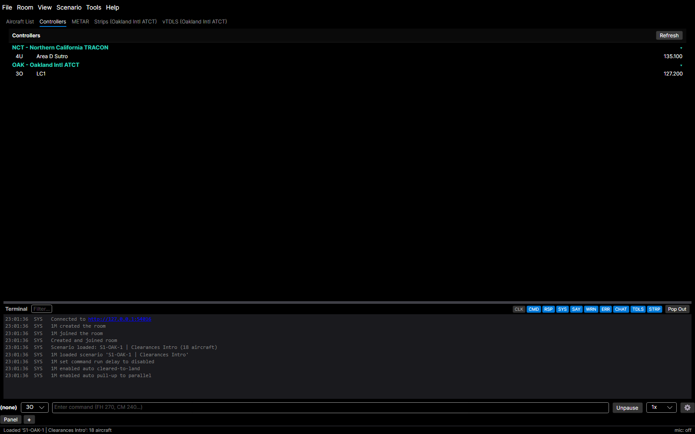

The **Strips** tab is a YAAT-side reimplementation of CRC's vStrips. It renders the same flight-strip bays, racks, drag/drop, and keyboard shortcuts a real vStrips client would, so an instructor can push, annotate, and manage strips without students needing CRC's vStrips open.

Strip state is owned by the server and broadcast to every client in the room — including any real CRC + vStrips clients connected to the same room. Mutations from CRC and the embedded tab all converge on the same authoritative state. The same view is also available in any browser at `/vstrips/` on the server (no install required), backed by the WASM [`Yaat.VStrips.Web`](tools/Yaat.VStrips.Web/) bundle. The browser strips (and TDLS) apps support the usual page-refresh shortcuts — **F5** and **Ctrl+R** (**Cmd+R** on macOS) — to reconnect after a hiccup.

#### Opening the tab

The Strips tab appears next to Aircraft List / Ground View / Radar View as soon as the server tells the client which strip bays the student position can access. There is one **student entry** for the position you connected as, plus optional extra entries for any other facility your position can see (commonly an ATCT and its parent TRACON).

- **View → Strips → New Strips Tab…** opens a picker of accessible facilities and adds a new tab. Useful when you control a tower position and want both the local and TRACON bays visible at once.
- **View → Strips → Pop Out Strips (X)** detaches the tab into its own window. The student entry can be popped out and re-docked but not closed. Non-student entries also get a **Close Strips (X)** action.
- Each tab is titled `Strips (FacilityName)` so multiple strip tabs/windows can be told apart at a glance.

#### Header bar

Across the top of every strip view:

- **Facility button** (leftmost) — shows the current facility name. Click to switch this view to another accessible facility in place. Equivalent to CRC's leftmost facility indicator.
- **Bay buttons** — one per bay accessible from the position. **Own** bays render filled in neutral grey; **external** bays (linked from a sibling facility, e.g. a tower's parent TRACON) render with a thin outlined style and an **↗** suffix in context menus.
- **Zoom controls** (− / % / +) — scales the racks area without affecting the header. Range 50%–150% in 10% steps; default 80% fits two racks comfortably on a 1080p screen.
- **Trash zone** — drop a strip on the red bin to delete it.
- **Printer** toggle — opens the printer modal (see below). Bound to **Tab** as well.

#### Current METAR

When weather is loaded, a thin **METAR bar** sits above the header showing the current training METAR — so students working the browser strips view see the same weather as instructors and RPOs, not just the controllers with a radar/METAR window. It is scoped to the **facility currently shown**: the airport for a tower, or all of the TRACON's airports. Switching the facility button re-scopes the bar.

The bar shows the primary airport's raw METAR on one line; click the **▸** chevron to expand it to every in-scope airport, **▾** to collapse. The text is selectable so you can copy it. The bar hides itself when no weather is loaded.

#### Bays and racks

Selecting a bay button shows that bay's racks side by side. Each rack is a fixed-width column and renders strips **bottom-up FIFO** — the newest strip lands at the visual bottom and older strips stack upward. Bays scroll horizontally if they overflow the window.

Bay layout (number of racks per bay, which bays are own vs external, whether separators are locked, whether arrivals get a separate printer) comes from the ARTCC config. There is no client-side override.

#### Strip types

| Type | What it is |
|------|------------|
| **Departure strip** | Full-width strip printed from a filed IFR departure flight plan. 18 field slots including a 3×3 annotation grid (boxes 10–18). Auto-printed on aircraft spawn — see [Auto-printing](#auto-printing). |
| **Arrival strip** | Full-width strip auto-printed when an airborne aircraft is within 20 minutes of destination. Same layout as departures. Only rendered if the position's ARTCC config enables arrival strips. |
| **Half-strip** | Compact freeform note up to 6 lines, occupying either the left or right side of a rack slot. Created via the rack right-click menu, the `HSC` command, or **Ctrl+Shift+H**; the cursor lands in the new strip's first cell so you can type immediately. |
| **Separator** | Thin colored divider (handwritten / white / red / green) with optional freeform label. Locked facilities allow handwritten only. Created via the rack right-click menu, the `SEP` command, or **Ctrl+Shift+S**; the cursor lands in the new separator's label so you can name it immediately. |
| **Blank strip** | Empty placeholder for manual annotation. Created from the printer modal or the rack right-click menu; when added to a rack the cursor lands in its first annotation cell so you can type immediately. |

#### Working with strips

**Selecting:** click a strip to select it; **Esc** deselects. Plain arrow keys move selection between adjacent strips; **Ctrl+arrows** move the selected strip itself.

**Drag-drop:**
- Drag any strip onto another rack (same bay or another bay's button in the header) to move it.
- Drag onto the **trash zone** in the header to delete.
- A drop preview shows where the strip will land. Drops on rack padding or empty space below the last strip resolve to the rack's tail.

**Right-click on a strip** — opens a context menu:
- **Offset / Un-offset** — shifts the strip horizontally so the callsign column stays visible above the next rack
- **Slide** (half-strip only) — toggles between left/right half-strip
- **Edit lines** (half-strip only) — opens the inline editor with lines joined by ` / `
- **Edit label** (separator only) — opens the inline editor for the separator's label
- **Push to {bay}** — append to rack 1 of the chosen bay (external bays show **↗**)
- **Push all in rack to {bay}** — bulk move every strip in the source rack
- **Delete**

**Right-click on empty rack space** — opens a creation menu:
- **Add half-strip**
- **Add separator** (with handwritten / white / red / green submenu, or only handwritten if separators are locked for the position)
- **Add blank strip**
- **Push all to {bay}** — when the rack already has strips

**Editing annotations on a full strip:**
- Click any of the nine annotation cells (boxes 10–18) to open an inline editor
- **Tab / Shift+Tab** moves to the next / previous annotation cell
- Typing **`?`** substitutes a checkmark **✓** live; the server normalizes any `?` on `AN` commands the same way
- **Esc** cancels without committing

#### Printer modal

The printer modal is a centered overlay reachable via the **Printer** toggle, **Tab**, or **Esc** (when nothing is selected). The racks stay visible behind the modal, so dropping a strip from the printer onto a rack updates immediately without dismissing the modal.

- **Request Strip** — type a callsign and click to ask the server to print that aircraft's strip
- **Print Blank Strip** — adds a blank to the printer queue
- **Departure printer carousel** — ❮ ❯ arrows step through queued strips, **N/M** counter shows position
  - **Move to Bay** — opens a bay picker for the visible strip
  - **Move All to Bay** — bulk-moves the entire queue
  - **Delete** — discards the visible strip
- **Arrival printer carousel** — only present when the ARTCC config enables separate arrival/departure printers (`EnableSeparateArrDepPrinters`); otherwise arrivals share the departure queue.

#### Auto-printing

Strip printing is driven by the server based on student position type:

| Position type | Suffixes | Departure spawn | Arrival within 20 min |
|---------------|----------|------------------|------------------------|
| Tower | `_TWR`, `_LOC` | First own bay whose name starts with "Ground", else printer queue | Auto-prints to first matching bay if arrival strips enabled |
| Ground / Clearance | `_GND`, `_DEL` | Departure printer queue | — |
| Approach / Departure | `_APP`, `_DEP` | No spawn print — strip appears in the position's matching bay on takeoff roll | Bay matching position display name |
| Center / unknown | `_CTR`, other | Departure printer queue | — |

#### Keyboard shortcuts

> Strips need keyboard focus. Click anywhere in the strip view first.

| Key | Action |
|-----|--------|
| Click strip | Select |
| Esc | Deselect → if nothing selected, toggle printer panel |
| Arrow keys | Move selection between adjacent strips |
| Ctrl+arrows | Move the selected strip |
| Shift+← / → | Toggle offset on the selected strip |
| Ctrl+Shift+← / → | Slide a half-strip; cycle separator style (handwritten → white → red → green) |
| Enter | Edit half-strip lines / separator label |
| Ctrl+1..9 (with full strip selected) | Edit annotation box 10..18 |
| Tab | Toggle printer panel |
| PageDown / PageUp | Next / previous bay |
| Ctrl+Alt+1..9 | Push selected strip to bay N — or, if nothing selected, switch to bay N |
| Ctrl+Alt+← / → | Cycle this view to the previous / next accessible facility |
| Ctrl+Shift+H | Add a half-strip in the selected strip's rack (or rack 1) |
| Ctrl+Shift+S | Add a handwritten separator (cycle styles afterwards with Ctrl+Shift+→) |
| Delete / Backspace | Delete selected strip |

#### Command surface

Every strip mutation is also available as a [command](COMMANDS.md#strip--data-operations) — the UI just builds the canonical form for you. Useful when you want to script a flow, drive strips from a macro, or work without leaving the command bar.

| Verb | Effect |
|------|--------|
| `STRIP {bay}[/{rack}[/{index}]]` | Push the selected aircraft's full strip to a bay |
| `STRIPD` / `STRIPO` | Delete / toggle offset on the selected aircraft's strip |
| `AN {box} [text]` | Write or clear annotation box (1–9 = boxes 10–18) |
| `HSC {bay}[/{rack}] line\line\…` | Create a half-strip (max 6 lines) |
| `HSA [bay[/rack]] key\new1\…` | Amend by lookup key (auto-search across bays without bay arg) |
| `HSD [bay] key` | Delete by lookup key |
| `HSM` / `HSO` / `HSS` | Move / toggle offset / slide |
| `SEP H\|W\|R\|G bay[/rack[/index]] [label]` | Create separator |
| `SEPE bay/rack/index new-label` / `SEPD bay[/rack] label-or-position` | Edit / delete separator |
| `BLANK [bay[/rack[/index]]]` / `BLANKD bay[/rack]` | Create / delete blank |

Half-strip verbs run in two modes: with no aircraft selected, every line you type goes on the strip; with an aircraft selected, the callsign becomes line 1 and the lookup key automatically. See the [Half-Strips section in COMMANDS.md](COMMANDS.md#half-strips) for the full disambiguation rules.

#### Persistence

Pop-out state for the student strips entry is saved in `preferences.json` under the `VStrips` key. The popped-out window's geometry is saved separately. Bay layouts, zoom level, and selection are not persisted — they're driven by the server config and reset on each scenario load.

### vTDLS

The **vTDLS** tab is YAAT's emulation of vNAS's [Tower Data Link Services](https://tdls.virtualnas.net/) web app — the Pre-Departure Clearance (PDC) console real controllers use to issue clearances over data-link. It opens next to **Strips** under **View → vTDLS** as soon as the server tells the client which TDLS facilities the student position can access (typically the position's own ATCT, plus any consolidated child facilities when working a parent TRACON).

vTDLS state lives on the server and broadcasts over SignalR — there is no CRC topic counterpart, so trainees do not see a vTDLS view in their CRC. The same display is also available in any browser at `/vtdls/` on the server (no install), backed by the WASM `Yaat.VTdls.Web` bundle. While connected, **Tools → Open TDLS in Browser** opens that page in your default browser with your CID/initials/ARTCC/room prefilled — the vTDLS counterpart to **Open Strips in Browser**.

#### Lists

- **DCL** (top, full width, column-wrapping) — Pending PDCs. A callsign appears here automatically when a flight plan is filed at a TDLS-configured facility (no controller action needed, just like real life). Pre-files generate entries too.
- **PDC** (bottom-left) — Sent and Wilco'd clearances. Items stay in this list until the aircraft is tracked on STARS by any controller (it has left clearance delivery), or the 2-hour TTL fires.
- **CPDLC** (bottom-right) — Permanently empty. VATSIM does not simulate CPDLC; the panel is rendered for visual parity with upstream.

#### Issuing a PDC

Click a callsign in the DCL list to open the flight-plan editor at the bottom of the view. Pick a SID and transition from the dropdowns — the FE-configured defaults (Expect, Initial Alt, Dep Freq, Climbout, Contact Info, Local Info, etc.) auto-populate the empty fields. Edit any field as needed. The footer status reads **CLEARANCE TYPE: PDC** when every mandatory field is filled and **MANDATORY FIELD NOT SET — <fields>** otherwise; the **Send** button is disabled until the editor reports valid.

- **Send (F12)** — issues the PDC. The pilot's clearance is applied silently (no voice readback) and RPOs in the room see a terminal entry: `[TDLS PDC sent at OAK] Expect=10 MIN, SID=OAKLAND4.ALTAM, Maintain=5000, DepFreq=120.9`. Roughly 3 seconds later the item auto-flips to Wilco.
- **Dump (F4)** — removes the PDC. Terminal: the (facility, callsign) pair can no longer be auto-queued this session. Clearance must now be given by voice.
- **F10** — closes the flight-plan editor without sending; the DCL entry stays.

Click a callsign in the **PDC** list to re-open the editor on the clearance that was sent, **read-only** — the fields show exactly what was issued, every dropdown is disabled, and there is no Send button (a sent PDC can't be edited or resent). The footer reads **CLEARANCE TYPE: PDC — SENT (READ ONLY)**. Dump (F4) still works.

#### Multi-facility tabs

- **View → vTDLS → New vTDLS Tab…** opens a picker of accessible TDLS facilities and adds a new tab. Useful when working a parent TRACON whose child ATCTs are unstaffed top-down (e.g. NCT with OAK/SFO/SJC/SMF/RNO).
- **View → vTDLS → Pop Out vTDLS (X)** detaches a tab into its own window. The student entry can be popped out but not closed. Non-student entries get a **Close vTDLS (X)** action.
- Each tab is titled `vTDLS (FacilityName)` so multiple tabs/windows are distinguishable.

#### Persistence

Pop-out state for the student vTDLS entry is saved in `preferences.json` under the `VTdls` key. Per-facility window geometry persists under `VTdlsView:{facilityId}`. Pending and Sent items survive `prepare-restart` snapshots; the Dumped lockout persists across restart too. Per-facility configs are re-fetched from the vNAS data-api on session restore.

### Flight Plan Editor

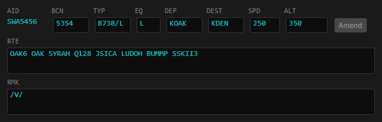

Double-click an aircraft row in the Aircraft List to open its Flight Plan Editor (FPE). You can also **Ctrl+Left-Click** an aircraft symbol or datablock in the Ground View or Radar View.

The FPE shows editable flight plan fields: beacon code, aircraft type, equipment suffix, departure, destination, cruise speed, altitude, route, and remarks. The ALT field accepts 3-digit altitude codes (e.g., `035` for 3,500ft) or prefixed formats: `VFR`, `VFR/035`, `OTP/035`.

Edit any field, then click **Amend** to send the changes to the server. The Amend button is only enabled when at least one field differs from the current flight plan.

### Copying View Settings

Use **View > Copy View Settings...** to open a comparison dialog that copies view settings into the current scenario. Pick a source — another **scenario** (its Ground and Radar view settings, including selected video maps, range, PTL, brightness, labels, and filters) or a saved **window profile** (window geometry, pop-out/dock states, and the Aircraft List column layout). The dialog shows your current value next to the source value for each setting, grouped into sections, and highlights the ones that differ. Tick the sections you want and choose **Copy Selected** — matching sections start unticked, so you only copy real changes. When the source scenario is at a different airport, the map-position rows are flagged, since copying them moves your view to that airport.

---

## Scenarios and Weather

### Loading a Scenario

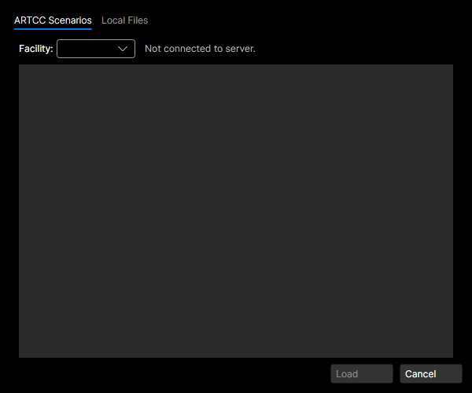

**Scenario > Load Scenario...** opens a dialog with two tabs:

- **ARTCC Scenarios** (default) — lists training scenarios from the [vNAS](#glossary) data API for your configured ARTCC. Use the Airport filter to narrow by primary airport. Requires an ARTCC ID set in Settings.
- **Local Files** — browse a local folder for ATCTrainer-format JSON scenario files. Supports Facility and Rating filters.

Select a scenario and click **Load** (or double-click). Aircraft spawn at their configured starting positions. The window title shows the room name and scenario name. To switch scenarios, load a new one — a confirmation dialog appears if one is already active.

When a scenario has multiple difficulty levels, YAAT shows a **Scenario Setup** dialog before loading. In solo training, the same dialog can also show workload pacing sliders for scenarios that have parking spawns or arrival generators. See [Solo Training](#solo-training).

Both API and local scenarios appear in the **Scenario > Load Recent Scenario** menu for quick reloading.

### Unloading a Scenario

**Scenario > Unload Scenario** removes all aircraft from the current scenario. A confirmation dialog appears if multiple clients are connected.

### Hold for Release

Model the departure-release coordination a TRACON provides to satellite towered airports: an IFR departure can't take off until you release it. Type `HFR <airport>` (e.g. `HFR SJC`) to arm a field — its IFR departures are then **held**. A departure that would appear airborne or lined up on the runway stays off-scope until released; a departure taxiing out **holds short** of the runway rather than taking it. VFR departures are never held.

Release them in any of these ways:

- `REL <airport>` (or `CTOA <airport>`) — release the next pending departure at that field.
- `REL <callsign>` — release a specific aircraft (also available as a one-click **Release (HFR)** item in the aircraft's radar right-click menu).
- `REL <airport> <minutes>` — release the field's whole held queue, auto-spaced by that many minutes (e.g. `REL SJC 2`).
- `HFROFF <airport>` — disarm the field; anything still held is auto-released.

A **Releases** button on the command bar (visible while any field is armed) opens a live rundown of what's held at each field, with per-departure and per-field release buttons. Released aircraft don't appear instantly — they take off after a short, realistic delay.

### Timers

Set a countdown reminder with `TIMER <mm:ss|seconds> [message]` (alias `TMR`). When it expires, a green SAY line appears in the terminal — your message, or `timer expired` if you didn't give one. Duration accepts `5:00`, `1:30`, or bare seconds like `90`.

- `TIMER 5:00 release the next SWA` — a **global** instructor reminder; on expiry the terminal shows `TIMER → release the next SWA`.
- `<callsign> TIMER 2:00 ready to copy` — attribute the timer to an aircraft; on expiry it reads as a SAY from that aircraft (`N172SP → ready to copy`).

Timers count in **sim time** — they pause when the sim is paused and run faster at higher sim rates. A **timers** button on the command bar shows the soonest timer's live countdown; its flyout lists every running timer with a one-click cancel (`✕`). You can also cancel from the command bar with `TIMER CANCEL <id>` or clear them all with `TIMER CANCEL ALL`.

### Loading a Weather Profile

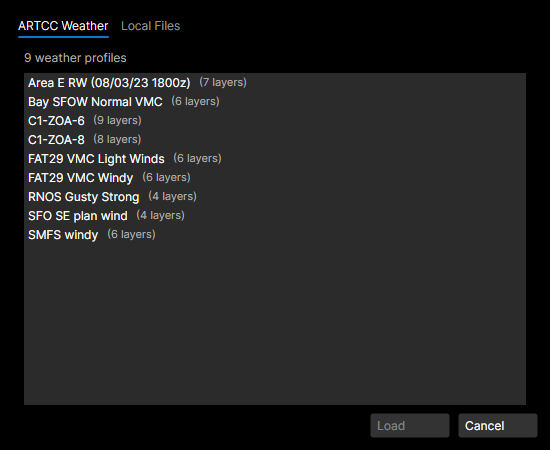

**Scenario > Load Weather...** opens a dialog with two tabs:

- **ARTCC Weather** (default) — lists weather profiles from the vNAS data API. Each entry shows the name and wind layer count.
- **Local Files** — browse a local folder for ATCTrainer-format weather JSON files.

Select a profile and click **Load** (or double-click). Weather is room-level and persists across scenario loads/unloads. Both API and local weather profiles appear in **Scenario > Load Recent Weather**.

The active weather name is shown in the terminal when weather is loaded or cleared.

**Speed note:** Speed commands (`SPD`, `CM`, `DM`) assign [IAS](#glossary) (indicated airspeed). Aircraft ground speed — visible on the radar scope and aircraft grid — is derived from IAS + wind at altitude. Aircraft flying into a headwind show a lower ground speed than their assigned IAS. Aircraft on the ground are unaffected by wind.

### Viewing METARs

The **METAR** tab in the main window lists the METAR string for each airport in the currently active weather, with the station id labeled. The text is selectable so you can copy it; pop the tab out via **View > Pop Out METAR**. The list reflects whatever weather is loaded — the scenario's default weather or a profile you loaded over it. With **no weather loaded**, it shows default standard conditions (calm wind, 10SM, clear, 29.92) for each of the scenario's airports rather than nothing.

For loaded weather profiles and timelines, the METARs are **reconstructed from the live simulated conditions** and re-issued like real observations: a routine METAR each hour at **:53Z**, plus an off-cycle **SPECI** whenever the wind, visibility, ceiling, or precipitation changes significantly (a basic subset of the real FAA SPECI criteria). The reported observation reflects the conditions at the moment it was issued and then holds steady until the next one — a realistic reporting lag. **Live weather** (Load Live Weather) keeps its real-world METARs unchanged.

### Loading Live Weather

**Scenario > Load Live Weather** fetches real-world METARs and winds aloft from aviationweather.gov. Requires a room, an ARTCC ID, and navdata.

Live weather builds wind layers from FAA Winds and Temperatures Aloft (FD) data at standard levels (3000–39000 ft) and a surface layer averaged from METARs. Wind directions are converted from true to magnetic heading automatically.

**Clear weather:** **Scenario > Clear Weather** removes the active weather profile. All aircraft return to IAS = GS behavior.

**Save weather:** **Scenario > Save Weather As...** exports the active weather profile to a JSON file.

### Weather Editor

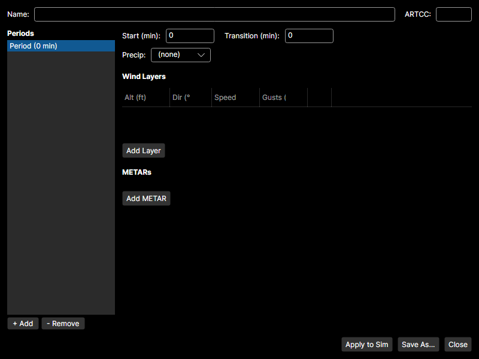

**Scenario > New Weather...** opens the weather editor with a single empty period.

**Scenario > Edit Weather...** opens the editor pre-populated with the active weather. If a timeline is active, all periods are restored.

The editor has two panels:

- **Left panel** — period list. Use **+ Add** to create new periods and **- Remove** to delete the selected one (minimum one period). Each period shows its start time.
- **Right panel** — selected period details: start time (minutes), transition duration (minutes), precipitation type, wind layers grid (altitude, direction, speed, gusts), and METARs list.

**Saving format:** If the editor has a single period, it saves as a v1 weather profile (compatible with ATCTrainer). With two or more periods, it saves as a v2 weather timeline.

- **Apply to Sim** sends the weather to the server immediately. The editor stays open.
- **Save As...** exports to a JSON file without sending.
- **Close** closes the editor.

Only one editor window can be open at a time.

### Weather Timelines (V2 Format)

YAAT supports a **v2 weather JSON format** that defines time-based weather evolution with multiple periods. Wind layers interpolate smoothly during transitions while METARs and precipitation change instantly at the period boundary.

**V2 JSON structure:**

```json
{
  "name": "SFOW → SFOE transition",
  "artccId": "ZOA",
  "periods": [
    {
      "startMinutes": 0,
      "transitionMinutes": 0,
      "precipitation": "None",
      "windLayers": [
        { "altitude": 3000, "direction": 280, "speed": 12 }
      ],
      "metars": ["KSFO 031753Z 28012KT 10SM FEW200"]
    },
    {
      "startMinutes": 20,
      "transitionMinutes": 10,
      "precipitation": "Rain",
      "windLayers": [
        { "altitude": 3000, "direction": 250, "speed": 15 }
      ],
      "metars": ["KSFO 031853Z 25015G22KT 6SM -RA"]
    }
  ]
}
```

**How transitions work:**

- `startMinutes` — simulation elapsed time (in minutes) when this period activates.
- `transitionMinutes` — duration (in minutes) over which wind layers blend from the previous period.
- At `startMinutes`, METARs and precipitation snap to this period's values immediately.
- Wind layers interpolate linearly over the transition window, handling the 360°/0° boundary correctly.
- If `transitionMinutes` is 0, all weather changes instantly.

**Loading:** Load v2 weather files using **Scenario > Load Weather... > Local Files** — files with a `periods` array are detected automatically. The v1 format continues to work.

**Rewind:** Weather timelines are fully compatible with the rewind system. Rewinding past a transition boundary restores the correct interpolated weather.

### Arrival Generators Editor

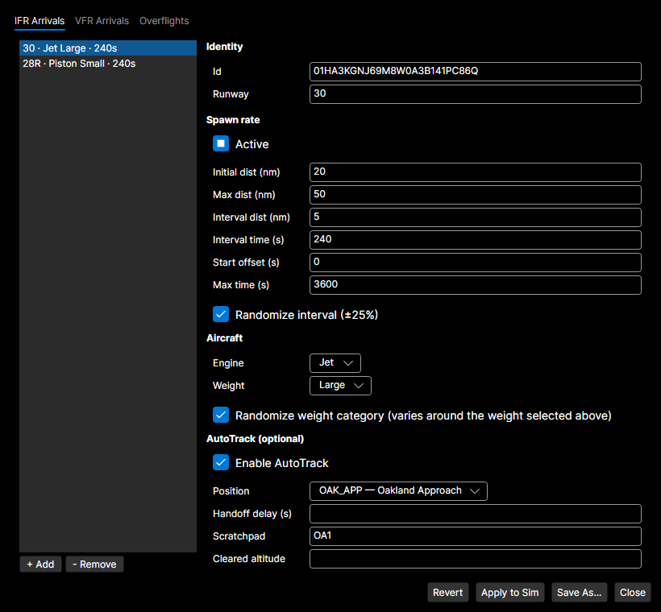

**Scenario > Edit Arrival Generators...** opens an editor for the live arrival-generator list of the currently loaded scenario. Edits take effect immediately on the running sim — no scenario reload needed. The original scenario file on disk is untouched; use **Save As...** to persist a tuned variant to a new JSON file for later reuse.

The editor has two panels:

- **Left panel** — generator list with **+ Add** / **- Remove** buttons. Each row summarizes its runway, engine, weight category, and interval time.
- **Right panel** — selected generator details, grouped into Identity (id, and an editable runway box that suggests the airport's runways plus any already used by the loaded generators — you can also type a runway directly), Spawn rate (initial/max/interval distances, interval/start-offset/max time, randomize-interval toggle), Aircraft (engine type, weight category, randomize-weight toggle — checking **Randomize weight category** keeps the weight box active and uses it as the centre of a realistic mix bounded to nearby classes, so a Small/SmallPlus generator stays light and mixes in general-aviation traffic while a Large/Heavy one never spawns below the regional feed), and an optional AutoTrack block (position, handoff delay, scratchpad, cleared altitude) — applied to every arrival the generator spawns, so each one comes up owned by that position with the scratchpad set and hands off to the student after the delay, just like a scenario aircraft.

**Reschedule on Apply:** When you click **Apply to Sim**, every generator is rescheduled from now. Aircraft already spawned by previous generators keep flying; only future spawns are affected.

- **Apply to Sim** sends the new generator list to the server and applies it immediately.
- **Revert** restores the editor to the state it had when the window was opened (does not undo edits already applied to the sim).
- **Save As...** writes the loaded scenario JSON with the edited `aircraftGenerators` array to a new file.
- **Close** closes the editor.

**Recording / replay:** Edits are recorded as a `RecordedArrivalGeneratorsChange` action and replay deterministically with the same reschedule semantics.

**Validation:** Empty/duplicate ids, unknown engine types, unknown weight categories, or runways that don't exist on the active airport are reported in the status line and prevent the apply.

---

## Solo Training

Solo Training lets one controller run a session without separate RPOs. YAAT simulates the pilots with text readbacks, optional spoken audio, pilot-initiated requests, and training safeguards, while you still issue the controller instructions.

The full student-facing tutorial is now [Solo Training Guide](SOLO_TRAINING.md). Start there if you are new to YAAT, new to RPO-style command tools, or learning how `RSP`, `SAY`, Session Report scoring, pilot requests, and solo-mode command differences work together.

Use these USER_GUIDE sections as the UI reference while following the tutorial:

- [Settings](#settings) - enable Solo Training Mode and optional pilot voice.
- [Loading a Scenario](#loading-a-scenario) - load ARTCC scenarios or local ATCTrainer-format files.
- [Arrival Generators Editor](#arrival-generators-editor) - inspect and edit generated arrival workload.
- [Command Bar](#command-bar) - type commands and read terminal feedback.
- [Commands](#commands) - quick command introduction and links to the full command reference.

For syntax, mode-specific restrictions, and examples, see [Command Reference: Solo Training Command Differences](COMMANDS.md#solo-training-command-differences).

---

## Commands

YAAT has a comprehensive command system for controlling aircraft. Commands are typed in the command bar and sent with **Enter**. **Help → Command Cheatsheet** opens [`docs/command-cheatsheet.html`](docs/command-cheatsheet.html) in your default browser — a filterable, searchable reference covering every verb.

**Quick examples:**

| Command | What it does |
|---------|-------------|
| `FH 270` | Fly heading 270 |
| `CM 100` | Climb and maintain 10,000 ft |
| `SPD 250` | Maintain 250 knots |
| `CM 050, FH 090` | Climb to 5,000 **and** turn to 090 simultaneously |
| `CM 100; LV 050 FH 270` | Climb to 10,000; at 5,000 ft, turn heading 270 |
| `TAXI S T U` | Taxi via taxiways S, T, U |
| `CLAND` | Cleared to land |
| `CLAND 28R` | Cleared to land on runway 28R (a following aircraft is cleared even before it has its own runway) |
| `CWT` | Caution wake turbulence |
| `CAPP ILS28R` | Cleared ILS Runway 28R approach |
| `CLBRV` | Cleared through/to enter/out of Bravo airspace |
| `STBY` | Acknowledge pilot contact without issuing a maneuver |
| `ATXI @H1` | Helicopter air-taxi to helipad H1 |

Commands support chaining (`;` sequential, `,` parallel), conditional triggers (`LV` at altitude, `AT` at fix), and aliases from both ATCTrainer and VICE.

In solo training, VFR aircraft respect FAA Class B/C entry gates: Class B requires `CLBRV`; Class C requires the pilot's initial call plus a successful controller command using that aircraft's callsign. Use `STBY` or `ROGER` when you only want to establish two-way communications.

**See the [Command Reference](COMMANDS.md) for the complete list of every command, alias, syntax detail, and example.**

### Compound Commands

Compound commands let you give several instructions in one command line. Think of the line as a list of **blocks**. A block may contain one command, or several commands that start together. Blocks may start immediately, wait their turn, or wait for a trigger such as an altitude, fix, taxiway, or distance from final.

#### Use `,` for simultaneous instructions

A comma keeps commands in the same block. Use it when the instructions should start at the same time, especially when they affect different control surfaces:

```
FH 270, CM 050, SPD 210
```

The aircraft turns to heading 270, climbs to 5,000 ft, and maintains 210 knots at the same time. The speed assignment does not cancel the turn, and the altitude assignment does not cancel the speed. Each command writes to its own target.

If a condition starts the block, every command after the condition shares that trigger:

```
AT SUNOL FH 180, DM 030, SPD 210
```

At SUNOL, the aircraft turns to 180, descends to 3,000 ft, and slows to 210 knots together.

When a comma is followed by a condition keyword (`AT`, `LV`, `ATFN`, `ONHO`, `GIVEWAY`, `BEHIND`), YAAT treats that as a new block. For example, this is accepted as two blocks:

```
CM 020, AT OAK30NUM CM 014
```

The aircraft starts climbing to 2,000 ft now, then descends to 1,400 ft when OAK30NUM is reached.

#### Use `;` for ordered blocks

A semicolon separates blocks. Use it when the next instruction should wait for the previous block or for its own trigger:

```
FH 270; FH 180
```

The aircraft turns to 270 first, then turns to 180 after the first turn is complete.

If the previous block mixes lateral movement with altitude or speed, the next block can advance when the lateral part is done while the altitude or speed target continues. For example:

```
FH 270, CM 100; FH 180
```

The second turn waits for the heading-to-270 part, not necessarily for the climb all the way to 10,000 ft. If you want a later instruction to happen at an altitude, use `LV` or numeric `AT`.

#### Word aliases: `AND` and `THEN`

If you find the punctuation hard to read, you can use `AND` in place of `,` and `THEN` in place of `;` (both case-insensitive). `FH 270 AND CM 050 THEN FH 180` means exactly the same thing as `FH 270, CM 050; FH 180`. The aliases are skipped inside `SAY` / `SAYF` literal text, so a message like `SAYF READING YOU LOUD AND CLEAR` is transmitted verbatim.

#### Use `LV` and `AT` for triggers

`LV <altitude> <command>` starts a block when the aircraft reaches an altitude. Altitudes use the same format as `CM` and `DM`: `050` means 5,000 ft, `5000` means 5,000 ft, and AGL forms such as `KOAK+010` are accepted.

```
CM 100; LV 050 FH 270; LV 100 DCT SUNOL
```

The aircraft climbs to 10,000 ft. While it is still climbing, it turns heading 270 at 5,000 ft. At 10,000 ft, it proceeds direct SUNOL.

`AT <token> <command>` starts a block when a place or condition is reached:

| Form | Meaning | Example |
|------|---------|---------|
| `AT SUNOL` | Fix reached or sequenced | `AT SUNOL SPD 180` |
| `AT SUNOL090` | Radial crossed | `AT SUNOL090 FH 270` |
| `AT SUNOL090020` | Fix-radial-distance point reached | `AT SUNOL090020 FH 270` |
| `AT 050` | Altitude reached, same as `LV 050` | `AT 050 FH 270` |
| `AT B` | Taxiway reached while taxiing | `AT B SPD 10` |
| `AT $5` | Named spot reached | `AT $5 RNS` |
| `AT @TERM2` | Parking/helipad reached | `AT @TERM2 FCA` |
| `AT B/C` | Intersection of two taxiways reached | `AT B/C SPD 5` |

Conditional blocks can fire while an earlier block is still active, as long as no ordinary untriggered block is sitting between them. This is what makes staged commands work:

```
DCT VPCOL OAK30NUM VPMID; AT OAK30NUM CM 014
```

The aircraft keeps flying the route to VPMID. When OAK30NUM is sequenced, it starts descending to 1,400 ft without abandoning the rest of the route.

#### Use `SPD X UNTIL Y` for staged speeds

`SPD X UNTIL Y` is shorthand for "maintain this speed now, then resume normal speed when Y happens."

If `Y` is a number, it means nautical miles from the assigned runway threshold:

```
SPD 210 UNTIL 10
```

The aircraft maintains 210 knots, then resumes normal speed at 10 NM final. This is shorthand for:

```
SPD 210; ATFN 10 RNS
```

You can chain distance-based speed reductions:

```
SPD 210 UNTIL 10; SPD 180 UNTIL 5
```

The aircraft maintains 210 knots until 10 NM final, slows to 180 knots, then resumes normal speed at 5 NM final.

If `Y` is a fix, the speed is cancelled when that fix is reached or sequenced:

```
SPD 180 UNTIL AXMUL
SPD 180 AXMUL
```

Both forms mean maintain 180 knots until AXMUL, then resume normal speed. The second form is the ATCTrainer-style alias.

YAAT automatically cancels ATC speed assignments at 5 NM final, and new speed assignments inside that boundary are rejected. Use `RNS` when you want to cancel a speed assignment earlier.

#### Queue and phase clearing

YAAT validates a compound command before applying it. If a later block is invalid, the aircraft state is left unchanged.

When a new command replaces queued work, YAAT clears only conflicting control surfaces:

| New command | Clears pending | Preserves pending |
|-------------|----------------|-------------------|
| Heading, turn, `DCT`, hold | Lateral blocks | Altitude and speed blocks |
| `CM`, `DM`, `CVIA`, `DVIA` | Vertical blocks | Lateral and speed blocks |
| `SPD`, `RNS`, `RFAS`, `MACH` | Speed blocks | Lateral and altitude blocks |
| Tower/ground phase commands | Usually all flight-control dimensions | Status/display commands |

This means adjusting speed does not cancel a turn, and issuing a heading does not cancel a previously queued altitude trigger unless that queued block also contained lateral work. If a queued block is dropped, YAAT adds a terminal warning naming the lost block. Note that the supersede-on-conflict behavior applies only to **immediate** commands; commands gated by a precondition (`AT`/`ONHO`/`WAIT`/`BEHIND`/…) are additive and never cancel each other (see below).

##### The conditional list

Precondition-gated commands — `AT`/`LV`, `ONHO`, `ATFN`, `BEHIND`, and `WAIT`/`WAITD` — collect into a single **conditional list**: each fires when its own trigger is met, and issuing one never cancels the others. So a departure can carry `WAIT 120 RWY 18L TAXI N B`, `ONHO CM 120`, and `AT 6000 DCT MUNCH` simultaneously — it taxis, then climbs on handoff, then turns at 6,000 ft. Executing one (e.g. the taxi firing) leaves the rest pending. `SHOWAT` (alias `SHOWCOND`) lists them, and they appear in the **Pending Cmds** column.

`CXL` / `CLR` / `DELAT` / `DELCOND` / `DC` clears the conditional list, but it does not undo the target that is already active. If you want to stop an active direct route or heading hold too, issue a lateral command such as `FPH` before clearing:

```
FPH
CXL
```

Use `DELAT 2` (or `DELCOND 2` / `DC 2`) to delete a single conditional by its `SHOWAT` index — including a pending `WAIT`/`BEHIND` deferral.

Aircraft in a phase, such as taxi, takeoff, approach, pattern, landing, or holding, are phase-managed. A direct command during a phase can be accepted, rejected with a reason, or clear the phase after validation. Conditional commands do not clear the phase when issued; they wait in the queue and fire when their trigger is reached. Pure status/display instructions such as squawk, ident, SAY-class reports, and report-in-sight commands do not cancel phases or clear the flight-control queue.

### Helicopter operations

Helicopters are detected automatically from the ICAO type designator (`H60`, `EC35`, `R44`, etc.) and get a dedicated set of commands for vertical takeoff, hover, and air-taxi:

| Command | Effect |
|---------|--------|
| `ATXI @H1` | Air-taxi to helipad/parking spot H1 — single command lifts off, cruises at 100 ft AGL / 40 KIAS, lands |
| `LAND H1` | Land at named spot H1 (helipad, parking, ramp) without the cruise leg |
| `CTOPP` | Cleared for takeoff, present position — vertical liftoff to a hover, holds at 25 ft AGL awaiting further instructions. `CTOPP +0XX` hovers at a higher AGL; `CTOPP <hdg>` / `OC` / `DCT FIX` lift vertically then depart |
| `HPP` | Hover in place (no orbit, no movement) |
| `HFIX SUNOL` | Navigate to fix SUNOL and hover (no orbit) |

`ATXI` accepts every destination form: bare or `@`-prefixed parking/helipad IDs, bare or `$`-prefixed taxiway spots, and runway designators (targets the named threshold). Helicopters can also use the standard tower commands (`CTO`, `CLAND`, `LUAW`, etc.) when assigned to a runway — typical for IFR ops.

While a helicopter is mid-air-taxi (or on final to a spot via `LAND`), `HPP` hovers it in place (re-issue `ATXI`/`LAND` to continue); any normal airborne command — `FH`, a turn, `CM`/`DM`, `SPD`, `DCT` — pulls it out of the relocation and flies the new clearance (a bare heading holds its current altitude). The ground `HOLD`/`RES` verbs don't apply to an airborne helicopter.

**See [Helicopter Commands in COMMANDS.md](COMMANDS.md#helicopter-commands)** for all departure modifiers, spawning helicopter aircraft, and the full command list.

---

## Simulation Controls

At the bottom-right of the window:

- **Pause/Resume** button — toggle simulation pause
- **Sim rate dropdown** — speed up the simulation (1x, 2x, 4x, 8x, 16x)

Pause and sim rate are scoped to your room — they don't affect other rooms.

### Timeline / Rewind

When a scenario is loaded, a timeline bar appears below the menu. It shows elapsed time and provides rewind controls:

- **|◀** — rewind to the start of the scenario
- **-30s / -15s** — rewind 30 or 15 seconds back from current time
- **Elapsed time** — displayed in mm:ss format

After rewinding, the simulation enters **Playback Mode**. The timeline bar shows "PLAYBACK" and a "Take Control" button. In playback mode:

- The simulation replays all previously recorded commands at their original timestamps
- Terminal entries broadcast normally — you can watch commands execute as they happened
- The simulation auto-pauses when it reaches the end of the recorded tape
- Press **Take Control** — you'll be asked to confirm, since this ends the replay and discards the playback timeline — or issue any command to exit playback and resume live operation

### Bookmarks

Mark highlight moments on the timeline so you can scrub back to them later (a go-around, a conflict, a teaching point). Bookmark controls sit at the right end of the timeline bar:

- **🔖** — add a bookmark at the current position and type an optional name. Leave the name blank to keep the timestamp default ("Bookmark 14:32"). The default keybind **Ctrl+B** drops an unnamed bookmark instantly (configurable under **Settings > Quick Bookmark Key**).
- **◀🔖 / 🔖▶** — jump to the previous / next bookmark.
- **Bookmarks ▾** — a list of all bookmarks (time + name); click one to jump, or use the ✎ / ✕ buttons to rename or delete.

Bookmarks also appear as gold ticks on the rail above the slider — click a tick to seek, or right-click it to Rename/Delete. Bookmarks work in both live and playback modes.

Bookmarks are saved into the recording when you **Save Recording** or **Save Bug Report Bundle**, and reappear when you load that recording — so your highlight marks travel with the file for debriefs. They are kept in memory during a live session; if you close without saving a recording, they are not retained. (After **Take Control** exits playback, existing bookmarks are kept; any beyond the current live time sit at the right edge of the bar.)

### Save / Load Recordings

Under the **Scenario** menu:

- **Save Recording...** — exports the current session (scenario + all recorded actions) to a `.yaat-recording.zip` file
- **Load Recording...** — loads a previously saved recording; enters playback mode at t=0

Recordings are self-contained archives that include the scenario definition, RNG seed, weather state, periodic state snapshots, and all user actions with timestamps. They can be shared between users for review or training.

---

## Multi-User Features

### Aircraft Assignments

When multiple instructors/RPOs are in the same room, aircraft can be assigned to specific members for sole control.

**Context menu:** Right-click an aircraft in the Aircraft List, Ground View, or Radar View:
- **Take control** — assign the aircraft to yourself
- **Give up control** — unassign the aircraft
- **Give control > [initials]** — assign to another room member
- **Unassign** — remove any assignment

Multi-select works: select multiple aircraft, right-click, and the actions apply to all selected.

**Keybind:** Press **Ctrl+T** (configurable) with an aircraft selected to take control instantly.

**Terminal commands:**
- `TAKE` — assign the selected aircraft to yourself
- `GIVE XX` — assign to the member with initials XX
- `GIVEUP` — unassign the selected aircraft

All three support callsign prefix: `AAL123 TAKE`, `AAL123 GIVE AB`, `AAL123 GIVEUP`.

**Enforcement:** Once any assignment exists in the room, commands to aircraft assigned to someone else are rejected. The error shows who the aircraft is assigned to.

**Override:** Prefix your command with `** ` (double asterisk + space) to bypass the assignment check.

**Visual indicators:**
- The **RPO** column shows assigned controller initials
- The radar datablock shows `[INITIALS]` on line 3
- Optional color tint: in **Settings > Advanced > Radar Display**, enable **Tint my assigned aircraft** (default green `#00FF00`)

Assignments are cleared when a member leaves, an aircraft is deleted, or the scenario is unloaded.

### Room Members

Open **Room > Members...** to see everyone in the current training room:

- **Instructors** — YAAT clients in the room (initials, CID, ARTCC). Click **Kick** to remove.
- **CRC Students** — CRC clients bound to the room (display name, position, active status). Click **Kick** to remove.

The panel updates in real-time as members join or leave.

### Students Panel

Open **Room > Students...** to manage CRC clients:

**In Room** — CRC clients currently bound to your room. Click **Kick** to remove (they return to the lobby).

**Lobby** — CRC clients not in any room. Click **Pull** to bring a client into your room.

**Notes:**
- CRC clients with a CID matching a YAAT client in a room are automatically bound to that room
- If all YAAT clients leave a room, CRC clients are automatically unbound to the lobby
- Use **Refresh** to manually re-fetch both lists

### Controllers

The **Controllers** tab in the main window lists the controllers in the current room in CRC's style, so you don't have to open CRC just to check who's covering what frequency. It combines live CRC-connected controllers with the scenario's auto-connect ATC positions. Pop it out into its own window via **View > Pop Out Controllers**.

Controllers are grouped by facility (the header shows the facility id and name). Each row shows:

- the **handoff/sector ID** (e.g. `4U`),
- the **position name** (matching CRC — the position name, not the callsign), and
- the **frequency**, right-aligned (e.g. `135.100`).

Inactive/standby positions are dimmed. Hover a row to see the callsign and controller name (scenario positions are marked). The list refreshes automatically when controllers connect or disconnect and when a scenario is loaded or unloaded; use **Refresh** to re-fetch on demand.

---

## Connecting CRC for Students

[CRC](#glossary) (Consolidated Radar Client) is the VATSIM radar client that students use to work scopes. Connecting CRC to your YAAT server lets students see and interact with the simulated traffic you're controlling. This section is for **mentors/instructors** setting up CRC for their students.

### Option A: Setup Script (Recommended)

The YAAT repo includes a PowerShell script that configures CRC automatically:

```powershell
cd path/to/yaat
.\Setup-CrcEnvironment.ps1
```

This finds the student's CRC installation via the registry and creates or updates its `DevEnvironments.json` with two entries:

- **YAAT1** → `https://yaat1.leftos.dev` (hosted server)
- **YAAT Local** → `http://localhost:5000` (local development)

To add only specific servers, use the `-Servers` parameter:

```powershell
.\Setup-CrcEnvironment.ps1 -Servers @(@{Name="YAAT1";Url="https://yaat1.leftos.dev"})
```

### Option B: Manual Configuration

If the student doesn't have the YAAT repo, or is on macOS/Linux:

1. Find the CRC installation folder (check `HKCU:\Software\CRC\Install_Dir` in the registry, or look in `%LOCALAPPDATA%\Programs\crc`)
2. Create or edit `DevEnvironments.json` in that folder:

```json
[
  {
    "name": "YAAT1",
    "clientHubUrl": "https://yaat1.leftos.dev/hubs/client",
    "apiBaseUrl": "https://yaat1.leftos.dev",
    "isDisabled": false,
    "isSweatbox": false
  },
  {
    "name": "YAAT Local",
    "clientHubUrl": "http://localhost:5000/hubs/client",
    "apiBaseUrl": "http://localhost:5000",
    "isDisabled": false,
    "isSweatbox": false
  }
]
```

### How Students Connect

Once CRC is configured:

1. Make sure the YAAT server is running (or use the hosted YAAT1 server)
2. Have the student restart CRC (it reads `DevEnvironments.json` on startup)
3. In CRC's environment selector, the student chooses **YAAT1** (or **YAAT Local**)
4. The student connects with their VATSIM credentials
5. In YAAT, open **Room > Students...** and click **Pull** to bring the student into your room — they immediately start seeing your room's traffic

If the student's VATSIM CID matches a YAAT client in the room, they're pulled in automatically.

---

## Customization

### Autocomplete

As you type in the command bar, a popup appears with matching suggestions:

- **Command verbs** — matching verbs with syntax hints (e.g., `FH  Fly Heading {270}`)
- **Callsigns** — aircraft matching what you've typed, showing type and route
- **Command arguments** — context-specific options after typing a verb:
  - **CTO modifiers** — direction and traffic pattern modifiers for cleared-for-takeoff (IFR: heading only; VFR: all modifiers including pattern, on-course, direct-to)
  - **Runway designators** — for ELD, ERD, EF, CROSS, CLAND, LAHSO, CVA
  - **Fix names** — for DCT, DCTF, HFIX, CFIX, DEPART, AT conditions
- **Macros** (yellow) — when typing `!`, matching macro names with parameter hints

Suggestions are context-aware: after `;` or `,` separators, suggestions reset. When the input starts with a callsign, suggestions use that aircraft's data (route fixes, flight rules). Autocomplete and signature help are turned off entirely when the line is a [chat message](#chat-messages) (it starts with `'`, `/`, or `>`), so chat text that happens to read like a command never pops a suggestion popup.

#### Fix Suggestion Priority

Fix suggestions use two tiers:

1. **Route fixes** (teal) — fixes from the target aircraft's flight plan (departure, destination, route, expanded SIDs/STARs)
2. **Navdata fixes** (white) — all other matching fixes

Route fixes always appear first.

### Macros

Macros let you define reusable command shortcuts. A macro maps a `!NAME` to a command expansion.

#### Defining Macros

Open **Settings > Macros** to create, edit, and manage macros. Each macro has a **Name** (e.g., `BAYTOUR`, `HC`) and an **Expansion** (the commands to expand to).

**Worked example — a one-key OAK terminal taxi route:**

1. Open **Tools > Settings > Macros**.
2. Click **Add Macro**. A new row appears.
3. Set **Name** to `OAK30TRM` and **Expansion** to `TAXI W V T`.
4. Close the Settings window.
5. Select an aircraft on the OAK ramp, then type `!OAK30TRM` and press Enter — the aircraft is cleared to taxi via W, V, T.

Macros are well suited to multi-step procedures that you want to invoke as a single token. Use favorites (below) for one-click presets that don't require typing.

#### Parameters

| Style | Expansion | Invocation | Result |
|-------|-----------|------------|--------|
| Positional | `FH &1, CM &2` | `!HC 270 5000` | `FH 270, CM 5000` |
| Named | `FH &hdg, CM &alt` | `!FC 270 5000` | `FH 270, CM 5000` |

Named parameters serve as documentation — the autocomplete popup shows `!FC &hdg &alt`. Arguments are always supplied positionally.

#### Usage

Type `!` followed by the macro name:

- `!BAYTOUR` → `DCT VPCOL VPCHA VPMID`
- `!HC 270 5000` → `FH 270, CM 5000`
- `!HC 270 5000; DCT SUNOL` → macro + compound: `FH 270, CM 5000; DCT SUNOL`

Macros work anywhere in a compound command. Command history records the original macro text, not the expansion.

#### Import / Export

- **Export All** / **Export Selected** — save macros to a `.yaat-macros.json` file
- **Import** — load macros from a file, with a selection dialog for conflicts

### Favorite Commands

The favorites bar sits below the command input and provides quick-access buttons for frequently used commands.

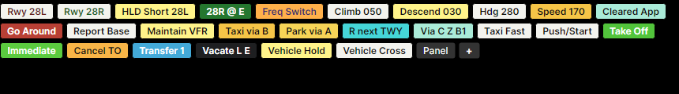

- **Click** a favorite to execute immediately. If text is in the command input (e.g., a callsign), the favorite command is appended.
- **Ctrl+Click** a favorite to append its command text without sending (joined with `,`).
- **Right-click** a favorite to edit its label, command text, ground override, category, visibility scope, button colors, button size, or delete it.
- Click **+** to add a new favorite.
- Click **Panel** or use **View > Open Favorites Panel...** for a larger pop-out panel with **Air**, **Ground**, **Vehicle**, and **Airport** tabs.
- In the pop-out panel, set **Cols** for a fixed grid, click **Batch** to add a screenful of blank slots to the active tab, then right-click each slot to fill in its label and command. Click **Blank** for a single extra slot. Blank slots reserve button-sized space so you can line up commands in predictable positions; click-hold-drag favorites or blank slots to rearrange them, or right-click to move left/right, insert blanks before/after, change category/scope/size, or delete. The same drag and move controls are available from the main favorites bar.
- **Right-click the command input** with text present to choose **Save as favorite…** — the add dialog opens with the command pre-filled, so you only need to type a label.

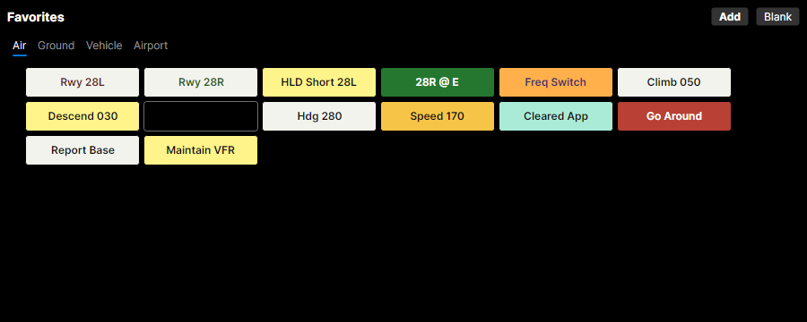

Each favorite has a **label** (displayed on the button) and **command text** (the command to execute). A favorite can also have an optional **ground command override**. When the selected aircraft is on the ground, that override is sent instead of the default command. Favorites and blank slots have a **scope**:

- **Global** favorites appear everywhere.
- **Scenario** favorites appear only when the current scenario is loaded.
- **Airport** favorites appear when the current scenario's primary airport matches, even across different scenarios for that airport.

Airport-specific favorites are useful for airport- or position-specific presets that don't apply elsewhere. For example, while running a FLL departure scenario you can save `T T3 B` as a favorite labeled "T3 B" with **Airport (FLL)** selected — that button appears for other FLL scenarios too, while staying hidden at other airports.

### Command History

The command bar remembers your last 50 commands. Navigate with Up/Down arrows:

- **Up** — recall the previous command
- **Down** — move forward through history (or restore what you were typing)
- If you type something first, only history entries starting with that text are shown
- Commands are stored in uppercase; retyping the same command with different casing updates one history entry

### Settings

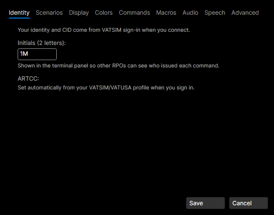

Open **Settings** to configure:

- **Identity** — VATSIM CID, user initials (required), [ARTCC](#glossary) ID, and an optional **Training access key** (see below)
- **Scenarios** — Solo Training Mode, auto-accept handoff settings, auto-delete aircraft override, simulation shortcuts (auto-clear to land, auto-cross runways), validate DCT fixes against route
- **Commands** — Alias editor for customizing command verbs. Use **Reset to Defaults** to restore built-in aliases.
- **Macros** — Define reusable command shortcuts (see [Macros](#macros))
- **Audio** — Input device (microphone for push-to-talk speech recognition) and output device (used for pilot text-to-speech and the SAY/warning notification chime)
- **Speech** — STT and TTS settings, including optional solo pilot voice, the Piper voice-pack install/remove controls, and **opt-in speech-sample capture** for sharing problem cases with the devs (see [Speech recognition debugging](#speech-recognition-debugging))
- **Display** — Font sizes for aircraft list, radar datablock, radar tag flyouts, ground datablock, ground labels, **terminal** (output + command input), and the **interface** (tabs, buttons, lists, and the Controllers / METAR panels) — each independently configurable, range 8–24. Plus **Strips Zoom** and **vTDLS Zoom** page-zoom percents (50–200%) that scale the whole Strips / vTDLS panel uniformly (Strips also has on-panel zoom buttons; the value is remembered across restarts). Also: command signature help placement; **EuroScope-style interactive tags** toggle (see [Radar View > EuroScope-Style Interactive Tags](#euroscope-style-interactive-tags)); **No landing clearance warning** toggle (flashes a red `NoLndgClnc` line on the radar datablock for aircraft on final without a landing clearance); ground display options (start with datablocks hidden); per-window always-on-top toggles
- **Colors** — Radar display colors (assignment tint, unassigned tint, selected aircraft color) and ground view colors
- **Advanced** — Aircraft select keybind, focus command input keybind, take control keybind, always-on-top keybind, and server admin mode

#### Training Access Key

ARTCC scenarios marked with a required controller rating (Student3 / Controller1 / Instructor1 — OTS, advanced, or instructor material) are hidden by default in the ARTCC scenarios picker. To unlock them, paste the key your facility Training Administrator gave you into **Settings → Identity → Training access key** and save.

The single key field covers three hierarchical tiers, and a higher-tier key automatically unlocks every lower tier:

- An **S3 key** unlocks Student3-rated scenarios (S3 OTS).
- A **C1 key** unlocks Controller1-rated scenarios *and* Student3 scenarios.
- An **I1 key** unlocks Instructor1-rated scenarios *and* Controller1 *and* Student3.

When the picker opens it asks the server which scenarios your key unlocks. Hidden scenarios never reach your client — instead an inline note shows how many are filtered. If your ARTCC hasn't set up gating yet, all scenarios are visible regardless of whether you have a key.

The **Local Files** tab is not gated. Trainer authors and developers can load any scenario JSON they have on disk.

#### Simulation Shortcuts

Optional shortcuts in **Settings > Scenarios > Simulation Shortcuts** simplify tower operations for trainees. The values you set here are your **defaults**, applied when *you* load a scenario; they no longer change a session that's already running. To adjust these for the live session — which affects every RPO in it — use the session-settings (⚙) flyout on the command bar instead.

- **Auto-clear aircraft to land** — Aircraft on final are automatically cleared to land without requiring a CLAND command. Configured per position type (GND, TWR, APP, CTR). Defaults: GND on, TWR off, APP on, CTR on — so only tower controllers must issue explicit landing clearances.
- **Aircraft cross runways automatically** — Taxiing aircraft cross runways without stopping for a CROSS command. Explicit hold-short commands and destination runway hold-shorts still apply.
- **Pull up to parallel runway after landing** — When an aircraft lands and vacates between two parallel runways, it automatically taxis up to hold short of the parallel runway (e.g. SFO 19L exit G → 19R, OAK 28L exit G/H → 28R) instead of stopping at the landing runway's exit — but only when the parallel hold-short is the next thing along the same taxiway with no intersection in between. A bare `CROSS` then takes it across without a prior TAXI. **On by default**; the aircraft still always waits for an explicit CROSS before entering the parallel.
- **Show sim-initiated pilot transmissions as pilot speech (RPO mode)** — Auto-generated pilot reports (traffic in sight, holding short, going around, midfield/short-final reminders, lost-sight, etc.) render in green with the spelled-out spoken form ("November one seven two sierra papa, holding short runway two eight right.") instead of the default orange Warning text ("N172SP holding short runway 28R at B"). Default off — preserves prior behavior on upgrade.
- **Audible alert on pilot transmissions** — Plays a short two-tone chime when a sim-initiated pilot transmission appears in the terminal. Independent of the visual setting above so you can take just the audio. The ding does not fire on AS-prefix `SAY`-class transmissions you typed yourself.

#### Auto-Accept

Handoffs to unattended positions can be automatically accepted after a configurable delay. Enable in **Settings > General > Auto-accept handoffs**.

#### Command Run Delay

A teaching aid that makes aircraft take time to comply with your instructions, simulating how long a real pilot needs to read back the clearance and set up the FMC / autopilot panel. Set a **min–max range (seconds)** in **Settings > General > Command run delay** (or live, per session, in the session-settings flyout on the command bar). Each command waits a random delay in that range before the aircraft acts — set both to the same number for a fixed delay, or set the max to 0 to turn it off (the default). A few seconds (3–8) is realistic.

When a delay is active you get an immediate terminal acknowledgement — *"Pilot complying in 5s"* — so you know the command was received and the aircraft is about to respond; the heading/altitude/speed/route change (and, in solo training, the pilot's read-back) then plays out after the delay. In **solo training mode** this acknowledgement is hidden — you only hear the pilot's read-back — so you can't tell exactly how long the aircraft will take to comply, just as a real controller can't. Track and coordination commands are never delayed, and **frequency changes** (e.g. `CON`) switch immediately — only the pilot's flight-deck actions lag. Commands you time yourself with `WAIT`/`BEHIND` keep their own timing and don't get an extra reaction delay; conditional commands (`LV`/`AT`) take the delay to *arm* and then fire when the condition is met (so with a large delay an `AT FIX` action can begin slightly past the fix). The delay is a blanket reaction model — it does not shorten for "expedite"/"immediately"-style urgency.

#### Auto-Delete

Scenarios can define an `autoDeleteMode` that removes aircraft after landing or parking. Override in **Settings > General > Auto-Delete Aircraft** (options: "Use Scenario Setting", "Never", "On Landing", "On Parking").

To exempt a specific aircraft, append `NODEL` to `CLAND`, `TAXI`, `EL`, `ER`, or `EXIT` commands.

#### Speech recognition debugging

If push-to-talk recognition is misbehaving for you, opt-in capture saves the audio plus a per-stage trace locally so you can review what happened — and, when you find a bad one, send it to the devs as a small bundle.

**Enable capture.** In **Settings → Speech**, tick **"Save my push-to-talk samples locally for review"** and pick a retention cap (10–500 MB; oldest samples drop when full). Nothing leaves your machine until you explicitly export — see below. Use **Open samples folder** to browse the on-disk store, or **Delete all saved samples** to wipe everything.

**Speech Debug window.** Click the mic-status indicator (top-right of the main window) and pick **"Show speech recognition debugging…"**. The window shows recent push-to-talk sessions as a flowchart — mic → Whisper → callsign extract → rule mapper → LLM fallback → final command — with playback for any session whose audio is still on disk. Sessions appear here even with capture off (in-memory trace only); audio playback and export require capture on.

**Export a bundle for the devs.** Tick the rows you want to share (only rows with saved audio are checkable), then click **Export selected…** to save a `.yaat-speech-sample.zip` bundle. The bundle includes the WAV recordings, per-stage transcripts, and active scenario context (callsigns, fixes, runways) — no other YAAT state is included. Attach the bundle to a GitHub issue and we'll feed it back into the pipeline.

Use **Export this sample…** on a single session if you only want to share one.

### Window State

YAAT remembers window size and position for the main window and all pop-out windows across sessions. Pop-out state (which views are in separate windows vs. tabbed) is also persisted.

---

## Glossary

| Term | Definition |
|------|-----------|
| **ARTCC** | Air Route Traffic Control Center — a facility managing a region of airspace (e.g., ZOA = Oakland Center, ZLA = Los Angeles Center) |
| **ATC** | Air Traffic Control |
| **CIFP** | Coded Instrument Flight Procedure — FAA database of instrument approaches, [SIDs](#glossary), and [STARs](#glossary) |
| **CRC** | Consolidated Radar Client — the [VATSIM](#glossary) radar client that students use to work scopes |
| **ERAM** | En Route Automation Modernization — the FAA's center radar system |
| **FRD** | Fix-Radial-Distance — a compact format for specifying a point in space relative to a navigation fix (see [COMMANDS.md](COMMANDS.md#fix-radial-distance-frd)) |
| **IAS** | Indicated Airspeed — the speed shown on the aircraft's airspeed indicator, before wind correction |
| **IFR** | Instrument Flight Rules — flight conducted under instrument procedures and ATC separation |
| **METAR** | Meteorological Aerodrome Report — a standardized weather observation format |
| **RPO** | Remote Pilot Operator — a YAAT user who controls simulated aircraft |
| **SID** | Standard Instrument Departure — a published departure procedure with waypoints and altitude/speed constraints |
| **STAR** | Standard Terminal Arrival Route — a published arrival procedure |
| **STARS** | Standard Terminal Automation Replacement System — the FAA's terminal radar system |
| **TCP** | Terminal Control Position — a sector identifier in STARS (e.g., "2B" = subset 2, sector B) |
| **VATSIM** | Virtual Air Traffic Simulation Network — a community for online ATC and pilot simulation |
| **VFR** | Visual Flight Rules — flight conducted visually without instrument procedures |
| **vNAS** | Virtual National Airspace System — VATSIM's infrastructure for facility data, nav data, and scenarios |
