# CRC Controller Manual

Welcome to the Consolidated Radar Client (CRC)! CRC is a next-generation controlling client that simulates many of the real-world systems used by controllers across the United States National Airspace System (NAS) for use on the [VATSIM](https://vatsim.net/) network by [VATUSA](https://www.vatusa.net/) controllers. CRC is part of the [vNAS](https://virtualnas.net/) system and is designed to work seamlessly with other vNAS software including [vStrips](https://strips.virtualnas.net/) and [vTDLS](https://tdls.virtualnas.net/). It features five types of Controlling Displays: [Tower Cab](tower-cab.md), which simulates visually controlling aircraft from inside an air traffic control tower, [SAID](said-saab.md) ground surveillance, [ASDE-X](asdex.md) ground radar, [STARS](stars.md) terminal radar, and [ERAM](eram.md) en route radar.

This manual is intended to help controllers get started with this software and serves as the centralized source of documentation for the various systems simulated within CRC.

> ℹ️ If you are a Facility Engineer seeking configuration documentation, please see the [vNAS Data Admin website documentation](../vnas-data-admin/overview.md).

## Contents

- [Requirements](#requirements)
- [Installation](#installation)
- [Profiles](#profile-setup)
- [General Settings](#general-settings)
- [Controlling Windows](#controlling-windows)
- [Messages Window](#messages-window)
- [Flight Plan Editor](#flight-plan-editor)
- [Controller List](#controller-list)
- [Voice Switch](#voice-switch)
- [Session Management](#session-management)
- [Tower Cab](tower-cab.md)
- [SAID](said-saab.md)
- [ASDE-X](asdex.md)
- [STARS](stars.md)
- [ERAM](eram.md)

## Requirements

- Windows 10 or Windows 11 operating system (Windows 10 1709 or higher is required for Browser Tabs)
- Video adapter with support for OpenGL 3.2 or greater
- Mouse or trackpad with middle-click functionality (required for some features)
- Internet connection

> ⚠️ There is a known bug in Discord where screen-sharing causes some applications, including CRC, to crash. To ensure Discord does not crash CRC while screen-sharing, the **Use our advanced technology to capture your screen** option must be **disabled** in Discord's **Voice & Video** options.

## Installation

*Reserved*

## Profile Setup

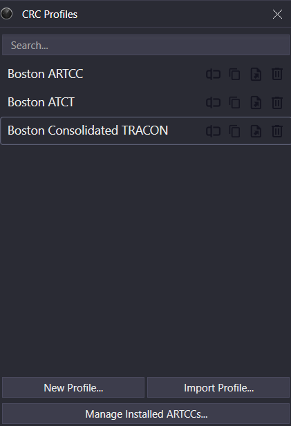

*The CRC Profiles window*

The CRC Profiles window appears after launching CRC. CRC Profiles save preferred controlling setups including window sizes and positioning, Controlling Display settings, [Bookmarks](#bookmarks), and more. Typically, a Profile is created for each controlled facility, such as one for the Boston TRACON and one for the Boston ARTCC. It may also be helpful to create a Profile for a particular airspace configuration. Profiles are [added](#creating-a-profile), [edited](#renaming-a-profile), [deleted](#deleting-a-profile) and [launched](#launching-a-profile) from the CRC Profiles window. However, before creating a Profile, at least one ARTCC must be [installed](#installing-an-artcc).

### Installing an ARTCC

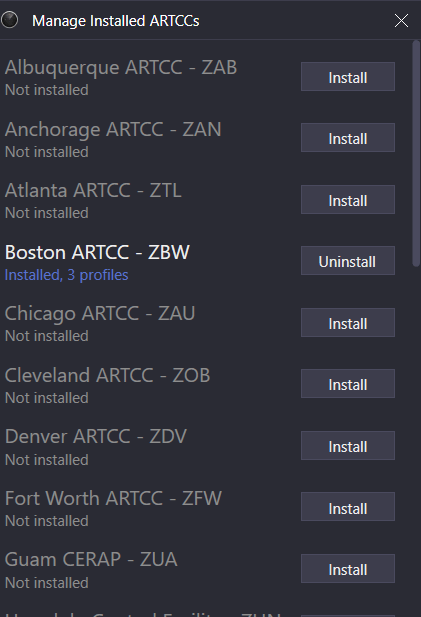

*Managing installed ARTCCs*

In order to control a position within an ARTCC or one of its child facilities, that ARTCC's data must first be installed. ARTCC data is managed by clicking the **Manage Installed ARTCCs...** button on the CRC Profiles window, which opens the Manage Installed ARTCCs window. An ARTCC's data is installed by clicking the corresponding **Install** button to the right of the desired ARTCC. Installed ARTCC data can be uninstalled by clicking the **Uninstall** button.

> ℹ️ An ARTCC cannot be uninstalled if one or more Profiles have been created for that ARTCC. In order to uninstall that ARTCC's data, all corresponding Profiles must first be [deleted](#deleting-a-profile).

### Creating a Profile

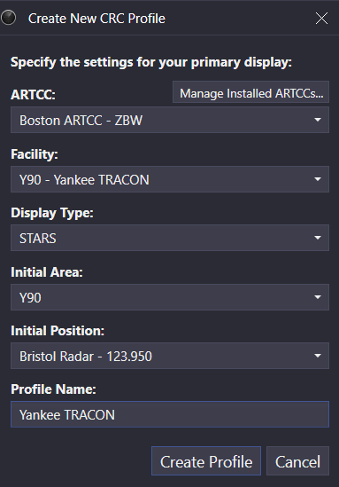

*Creating a new profile*

To create a Profile, click the **New Profile...** button on the CRC Profiles window. The new Profile's ARTCC must first be selected. If no ARTCCs are installed, click the **Manage Installed ARTCCs...** button to first [install an ARTCC](#installing-an-artcc).

Next, select the Profile's primary facility from the **Facility** dropdown menu. CRC is designed with VATSIM's top-down workflow in mind, so Controlling Displays for child facilities may be added to the Profile. However, the Profile may only be used to sign in to the VATSIM network as one of the primary facility's positions. The Profile's primary facility cannot be changed after the Profile is created.

Next, select the primary display type from the **Display Type** dropdown menu. A given facility type requires one of the primary display types listed below in [Table 1](#table-primary-display-types). The Profile's primary display type cannot be changed after the Profile is created.

Table 1 - Primary display types

| Facility Type | Primary Display Type(s) |
| --- | --- |
| ARTCC | ERAM |
| TRACON | STARS |
| ATCT/TRACON | STARS, Tower Cab, ASDE-X or SAID (if available) |
| ATCT/RAPCON | STARS, Tower Cab, ASDE-X or SAID (if available) |
| ATCT | Tower Cab, STARS (if available), ASDE-X or SAID (if available) |

Next, if STARS is selected as the primary display type, the initial STARS area and position must be selected for the STARS display. Note that this area and position can be changed after the Profile is created.

Finally, enter a name for the Profile and click **Create Profile** to launch the new Profile.

### Launching a Profile

Profiles are launched by double-clicking the Profile's name in the CRC Profiles window.

> ℹ️ `Enter` launches the selected Profile. CRC automatically selects the most recently used Profile.

> ℹ️ Profiles can also be launched through a jump list by right-clicking the CRC icon in the Windows taskbar and selecting the desired Profile.

### Importing and Exporting Profiles

Profiles can be imported by clicking the **Import Profile...** button on the CRC Profiles window. After importing, the imported Profile appears in the Profiles list.

Profiles can be exported by clicking the corresponding **Export Profile** (file with an arrow) button to the right of the desired Profile.

> ℹ️ SAID, ASDE-X, and STARS pref sets are stored independently of profiles so that they may be used across profiles. Pref sets are stored in the `/PrefSets` directory within the CRC installation path (by default `%localappdata%/CRC/PrefSets`).

### Renaming a Profile

Profiles can be renamed by clicking the corresponding **Rename Profile** (cursor over textbox) button to the right of the desired Profile, then entering a new name and pressing `Enter` to save.

Profiles can also be renamed in the [Profile Settings](#profile-settings) window.

### Copying a Profile

Profiles can be copied by clicking the corresponding **Make a copy** (two files) button to the right of the desired Profile. The copied Profile is named the same as the original Profile with " - Copy" appended to the end of the name.

### Deleting a Profile

Profiles can be deleted by clicking the corresponding **Delete Profile** (trash can) button to the right of the desired Profile.

> ⚠️ Deleting a Profile is irreversible.

### Saving a Profile

Profiles are not automatically saved when exiting CRC. To save a Profile, open a Controlling Window's menu (hamburger icon on the left of the top toolbar) and select **Save Profile**. Profiles can also be duplicated and saved under a new name by selecting the **Save Profile As...** option in a Controlling Window's menu, and then entering a new name.

> ℹ️ `Ctrl`+`S` saves a Profile.

> ℹ️ `Ctrl`+`Shift`+`S` opens the **Save Profile As...** window.

### Switching Profiles

Profiles can be switched by selecting the **Switch Profile...** option in a Controlling Window's menu.

> ℹ️ `Ctrl`+`Shift`+`P` opens the CRC Profiles window.

### Profile Settings

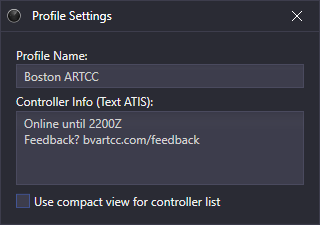

*The Profile Settings window*

Profile settings are accessed through a Controlling Window's menu by selecting **Profile Settings...**. The Profile Settings window contains the following settings:

- **Profile Name**: the name of the Profile
- **Controller Info**: information displayed to pilots. This can contain helpful information such as expected logoff time, pilot resources, or a feedback link.
- **Use compact view for controller list**: The Controller List will show only the facility ID for each facility, and only the handoff ID and frequency for each controller.

The following variables may be used in the Controller Info field:

Table 2 - Controller Info variables

| Variable | Description |
| --- | --- |
| `$myrealname` | Your Real Name set in [General Settings](#general-settings) |
| `$radioname` | The primary position's radio name such as "Boston Center" |
| `$freq` | The primary position's frequency |

> ℹ️ Controller Info was formerly referred to as "Text ATIS" in legacy clients.

> ℹ️ `Ctrl`+`P` opens the Profile Settings window.

### Exiting a Profile

A Profile (and CRC) is exited by selecting the **Exit** option from a Controlling Window's menu.

> ℹ️ `Alt`+`F4` exits a Profile.

## General Settings

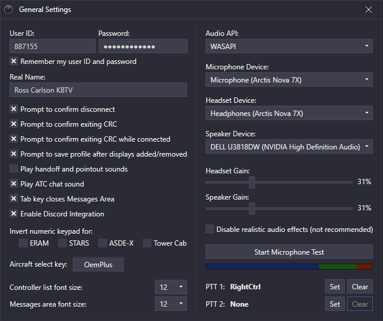

*The General Settings window*

General settings are accessed through a Controlling Window's menu by selecting **General Settings...**. The General Settings window contains the following settings:

- **User ID**: your VATSIM CID
- **Password**: your VATSIM password
- **Remember my user ID and password**: saves the **User ID** and **Password** between controlling sessions
- **Real Name**: your real name or CID to display to pilots and other controllers on the network
- **Prompt to confirm disconnect**: displays a confirmation prompt prior to disconnecting from the network
- **Prompt to confirm exiting CRC**: displays a confirmation prompt prior to exiting CRC
- **Prompt to confirm exiting CRC while connected**: displays a confirmation prompt prior to exiting CRC when connected to the network
- **Prompt to save profile after displays added/removed**: displays a confirmation prompt prior to saving a profile after displays have been added or removed
- **Play handoff and pointout sounds**: plays an unrealistic sound when receiving a handoff or point out
- **Play ATC chat sound**: plays a sound when a new message is received in the [ATC chat](#atc-chat)
- **Tab key closes Messages window**: allows the `Tab` key to be used to close the [Messages window](#messages-window)
- **Enable Discord Integration**: displays current CRC session information for live network connections as a Discord activity status
- **Invert numeric keypad for:**: inverts the numeric keypad when setting data block positions (for use with modified keyboards)
- **Aircraft select key**: selects an aircraft ID in the Messages window
- **Controller List font size**: sets the font size for the Controller List
- **Messages window font size**: sets the font size for the Messages window
- **Audio API**: choose which audio API you wish to use (generally you can leave it at the default unless you encounter audio issues)
- **Microphone Device**: select the audio device you wish to use as your microphone
- **Headset Device**: select the audio device to designate as the headset device
- **Speaker Device**: select the audio device to designate as the speaker device
- **Headset Gain**: here you can set the output level of your headset device
- **Speaker Gain**: here you can set the output level of your speaker device
- **Disable realistic audio effects**: this will disable VHF audio effects
- **Start/Stop Microphone Test**: click this button to enable/disable the microphone input level meter (use Windows audio settings to modify your microphone input level)
- **PTT 1/2**: click the `Set` and `Clear` buttons to set or clear your PTT (Push-To-Talk) buttons

> ℹ️ `Ctrl`+`G` opens the General Settings window.

## Controlling Windows

A CRC Profile is made up of one or more Controlling Windows. These windows have one or more tabs each containing a Tower Cab, SAID, ASDE-X, STARS, or ERAM Controlling Display. One window with a single tab is created upon profile creation with the selected primary display type. Controlling windows can also contain [Browser Tabs](#browser-tabs).

> ℹ️ Holding `Ctrl` while positioning a window snaps the window to the edge of the display or other windows.

### Window View Settings

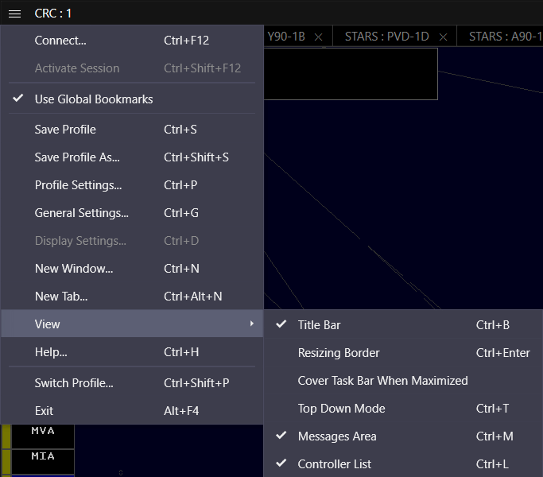

*Window view settings*

Window view settings are accessed through the Controlling Window's menu (hamburger icon on the left of the top toolbar) by selecting the **View** submenu. The following options are available in the **View** submenu:

- **Title Bar**: displays the title bar across the top of the window

  > `Ctrl`+`B` toggles display of the title bar.
- **Resizing Border**: increases the size of the window's border to facilitate resizing

  > `Ctrl`+`Enter` toggles display of the resizing border.
- **Top Down Mode**: displays unrealistic Ground Targets and configured Video Maps in STARS and ERAM displays

  > `Ctrl`+`T` toggles Top-Down mode (TDM).
- **Messages Area**: displays the [Messages window](#messages-window)

  > `Ctrl`+`M` toggles display of the Messages window.
- **Controller List**: displays the [Controller List](#controller-list)

  > `Ctrl`+`L` toggles display of the Controller List.

### Adding a New Window

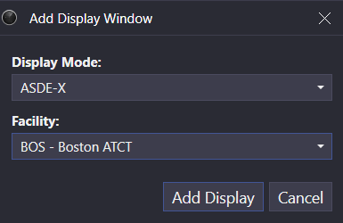

*Adding a new window*

To add a new window, select the **New Window...** option from a Controlling Window's menu. The display's mode and facility, as well as its STARS area and position, if applicable, must be selected, similarly to creating a new Profile. For more information on this process, please see the [Creating a Profile](#creating-a-profile) section of the documentation.

> ℹ️ `Ctrl`+`N` opens the Add Display Window dialog.

### Adding a New Tab

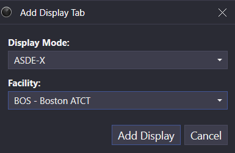

*Adding a new tab*

To add a new tab to an existing window, select the **New Tab...** option from the Controlling Window's menu. The display's mode and facility, as well as its STARS area and position, if applicable, must be selected, similarly to creating a new Profile. For more information on this process, please see the [Creating a Profile](#creating-a-profile) section of the documentation.

> ℹ️ `Ctrl`+`Alt`+`N` opens the Add Display Tab dialog.

### Managing Tabs

Tabs are managed by using the following keyboard commands:

Table 3 - Tab management keyboard commands

| Keyboard Command | Description |
| --- | --- |
| `Ctrl`+`Tab` | Selects the next tab |
| `Ctrl`+`Shift`+`Tab` | Selects the previous tab |
| `Ctrl`+`Shift`+`Page Up` | Moves the tab to the left |
| `Ctrl`+`Shift`+`Page Down` | Moves the tab to the right |
| `Ctrl`+`W` | Closes the tab |

### Browser Tabs

When adding a new display window, or when adding a new tab to an existing window, one of Display Mode options is "Browser". This allows you to add web browser tabs to your display windows, and those browser windows are saved as part of your profile. This is helpful when you use the same websites during every controlling session, such as vTDLS, vStrips, ARTCC reference documents, an IDS application, etc.

Selecting the Browser display mode option causes two new fields to appear:

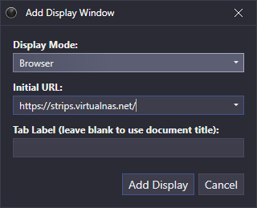

*Adding a Browser Tab*

- In the "Initial URL" text box, enter the URL to load into the tab initially, or select a commonly-used URL from the dropdown. This URL will be loaded into the browser tab when you first launch the profile. You can then navigate to other linked pages within that browser tab just as you would in a regular browser.
- You can enter a tab label in the second text box, or leave this box blank to use the page title as the tab label.

To edit these settings for an existing browser tab, press `Ctrl`+`D` to open the browser display settings window:

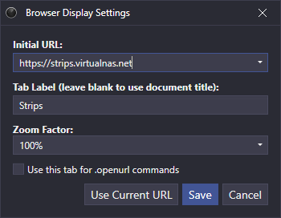

*Browser Display Settings*

This window has two additional options:

- A dropdown from which you can choose a zoom factor for the tab. This zoom factor applies to any page loaded into the browser tab.
- A checkbox which allows you to target this browser tab when an .openurl command is entered.

Pressing the `Use Current URL` button will copy the URL that is currently loaded in the browser tab into the Initial URL text box.

> ℹ️ `Ctrl`+`D` opens the Display Settings window

Since the normal browser search keybind (Ctrl+F) is used for opening the Flight Plan Editor in CRC, you cannot use it for searching browser tabs. Instead, use the `F3` key to search the content on a browser tab.

> ℹ️ `F3` opens the search box in a browser tab

To control the volume of sounds generated by applications loaded into browser tabs (such as the strip printing sound in vStrips), you can adjust the output level in Windows Volume Mixer for the application named "Microsoft Edge WebView2". Adjusting the volume of CRC will not affect sounds generated by browser tabs.

As mentioned above, you can configure CRC to direct any URLs opened with the .openurl command to a specific browser tab using the checkbox on the browser tab display settings window. You can also have such URLs opened in a new browser tab by selecting the following option in the hamburger menu for one of your display windows:

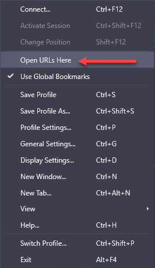

*Hamburger Menu*

In order for this option to work, you cannot have any browser tabs configured to be the recipient of .openurl commands. If no browser tab is configured to receive .openurl commands, and no display window is configured to receive them as a new tab, then the URL will be opened in your default browser as normal.

### Bookmarks

Bookmarks are used to save and recall views within a Profile. By default, Controlling Windows are affected by global Bookmarks, meaning the state of all windows is saved and recalled through a single Bookmark. A window can be opted out of global Bookmarks and instead maintain a local set of Bookmarks by deselecting the **Use Global Bookmarks** option from the window's menu. When a Bookmark is set or recalled, the active window determines if the Bookmark is global or local.

In addition to saving the active tab, Bookmarks save the following settings in each display mode:

Table 4 - Display settings saved in Bookmarks

| Display Mode | Saved Settings |
| --- | --- |
| ERAM | - Display center - Display range - TDM enabled - Active GeoMap filters |
| STARS | - Display center - Display range - TDM enabled - Active Video Maps |
| ASDE-X | - Main window display center - Main window display range - Main window display rotation |
| SAID | - Main window display center - Main window display range - Main window display rotation |
| Tower Cab | - Display center - Display range - Display rotation |

#### Setting a Bookmark

To set a Bookmark, use the `Ctrl`+`Alt`+`0` through `Ctrl`+`Alt`+`9` keyboard command, where the digit is between 0 through 9. The Bookmark is saved to that number. To set additional Bookmarks, enter the `.##.` [Dot command](#dot-commands) in the [Messages window](#messages-window), where `##` is the Bookmark's number.

#### Recalling a Bookmark

To recall a Bookmark, use the `Ctrl`+`0` through `Ctrl`+`9` keyboard command, where the digit is between 0 through 9 corresponding to a set Bookmark. To recall additional Bookmarks, enter the `.##` Dot command in the Messages window, where `##` is the Bookmark number to recall.

### Help Window

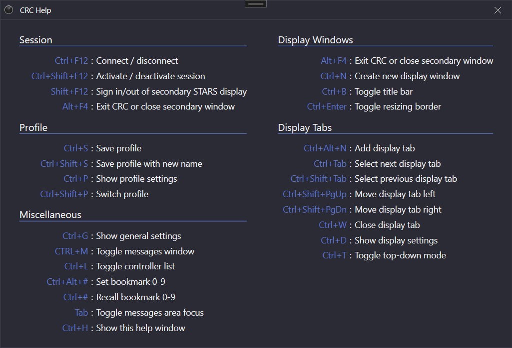

*The Help window*

The CRC Help window contains many common keyboard shortcuts and is opened from a Controlling Window's menu by selecting **Help...**.

> ℹ️ `Ctrl`+`H` opens the Help window.

## Messages Window

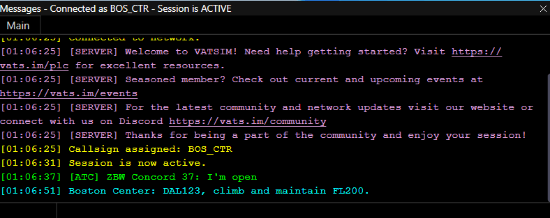

*The Messages window*

The Messages window allows for communication with text pilots, coordination with other nearby controllers, and private messaging with other connected VATSIM users.

> ℹ️ `Ctrl`+`M` or `Tab` opens the Messages window.

### The Frequency's Text Chat

To communicate with text pilots over the frequency's text chat, select the **Main** tab, type a message, and press `Enter` to send. Your message will be sent on any frequencies for which you have TX enabled in the [Voice Switch](#voice-switch).

To select an aircraft, enter a unique portion of the aircraft's callsign, and press the aircraft select key (defined in the [General Settings](#general-settings) window). The selected aircraft's full callsign appears in the selected aircraft box to the left of the text input area. Until the selected aircraft is cleared with `Esc` or a new aircraft is selected, sent messages are prefaced with the aircraft's callsign.

> ℹ️ Unlike legacy clients, a message sent over the frequency's text chat is not prefaced by your callsign (e.g. `BOS_CTR`). Instead, the message is prefaced by your primary position's radio name (e.g. `Boston Center`).

### ATC Chat

To communicate with nearby controllers in the ATC chat, select the **Main** tab, type a message prefaced by a `/`, and press `Enter` to send. ATC chat messages are displayed in green.

> ℹ️ Unlike legacy clients, a message sent over the ATC chat by a known controller (a controller appearing in the [Controller List](#controller-list)) is not prefaced by the sending controller's callsign (e.g. `BOS_CTR`). Instead, the message is prefaced by the sending controller's primary facility's ID and position (e.g. `ZBW Concord 37`).

> ℹ️ Instructor positions are appended with an `(I)`, while a student positions are appended with an `(S)`.

### Private Messages

When a private message (PM) is received from another user, a PM tab appears to the right of the **Main** tab. To send a PM to another user, use the `.msg` [Dot command](#dot-commands):

> ℹ️ `.msg <callsign> <message>`

To open a PM tab with another user, use the `.chat` Dot command:

> ℹ️ `.chat <callsign>`

### Dot Commands

Dot commands are simple commands entered in the [Messages window](#messages-window). They are prefaced by a `.` and may require one or more parameter(s). Pressing `Enter` or the aircraft select key executes a Dot command. The following table describes each Dot command built into CRC:

Table 5 - Dot commands

| Command | Description |
| --- | --- |
| `.##.` | Sets Bookmark number `##` |
| `.##` | Recalls Bookmark number `##` |
| `.acinfo` | Displays information about the selected aircraft including engine count/type, class, and wake category |
| `.am RTE <route>` | Sets the route of the currently selected aircraft |
| `.atis <callsign>` | Requests the controller information from the specified callsign |
| `.autotrack <airport ID>` | Toggles automatic tracking of departures from the specified airport |
| `.chat <callsign>` | Opens a private message chat with the specified callsign |
| `.clear` | Clears message history |
| `.contactme <callsign>` | Sends a contact me to the specified callsign |
| `.copy` | Copies message history to the clipboard |
| `.fp <aircraft ID>` | Opens the flight plan editor for the specified aircraft |
| `.metar <station ID>` or `.wx <station ID>` | Displays the most recently available METAR for the specified station |
| `.msg <callsign> <message>` | Sends a private message to the specified callsign |
| `.openurl <url>` | Opens the specified URL |
| `.reloadaliases` | Reloads the list of available [Aliases](#aliases) |
| `.showlogs` | Opens the CRC logs directory |
| `.showprofiles` | Opens the CRC profiles directory |
| `.ver <callsign>` | Displays client version info for the specified user |
| `.wallop <message>` | Sends a message to all supervisors |
| `.lasttx` | Shows which callsigns are currently transmitting or were recently transmitting on voice |
| `.echo <message>` | Echoes the given text back to you in the Messages Area. Useful for quick reference aliases. See formatting notes below. |
| `.note <message>` | Adds the given text to the Notes tab in the Messages Area. Useful for quick reference aliases. See formatting notes below. |

The following string replacements are performed on the text sent with the `.echo` and `.note` commands, to allow formatting the output:

Table 6 - .echo and .note formatting

| String | Replacement |
| --- | --- |
| `\n` | Line break |
| `\s` | Non-breaking space |
| `\t` | Four non-breaking spaces |

> ℹ️ Left-clicking an aircraft while holding `Alt` opens the [Messages window](#messages-window) and begins a `.wallop` message for the aircraft.

> ℹ️ Additional Dot commands available only to supervisors are not listed above.

### Aliases

Aliases are short Dot commands defined by Facility Engineers that serve as shortcuts for executing more lengthy commands. For example, an ARTCC might define a `.dm` Alias that is invoked with an altitude (i.e. `.dm 10000`) to send the message `descend and maintain 10000` to a text pilot.

Personal Aliases can be defined by creating a `MyAliases.txt` file in the `/Aliases` directory within the CRC installation path (by default `%localappdata%/CRC/Aliases`). `MyAliases.txt` must contain one Alias definition per line with a space separating the Alias and the replacement text or command.

> ℹ️ For more information on defining Aliases, please see the [Aliases](../vnas-data-admin/aliases.md) section of the vNAS Data Admin website documentation.

## Flight Plan Editor

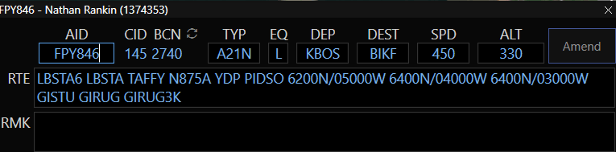

*The Flight Plan Editor*

The Flight Plan Editor (FPE) facilitates flight plan creation, retrieval, and amendment. It can be opened using the `.fp` [Dot command](#dot-commands), the `Ctrl`+`F` keyboard shortcut, or display-specific commands. Opening the FPE using the `Ctrl`+`F` keyboard shortcut, or pressing `Ctrl`+`F` while the FPE is already open, allows a flight plan to be created or retrieved for the aircraft ID entered into the **AID** box.

> ℹ️ Unlike legacy clients, flight plans can be created or edited for aircraft not connected to the network, such as pre-filed flight plans.

From left to right, top to bottom, the Flight Plan Editor contains the following fields:

- **AID**: the aircraft ID (callsign). An existing flight plan's AID cannot be edited.
- **CID**: the assigned computer ID
- **BCN**: the assigned beacon code. Clicking the **recycle** button (circular arrows) assigns a new beacon code.
- **DEP**: the departure airport
- **DEST**: the destination airport
- **SPD**: the cruising speed in KTAS
- **ALT**: the cruising altitude in 100s of feet MSL. `VFR` or `OTP` (VFR on-top) may also be entered, as well as an altitude prepended with `VFR/`.
- **RTE**: the flight plan's routing
- **RMK**: the flight plan's remarks

> ℹ️ Unlike legacy clients, altitudes are expressed in hundreds of feet.

> ℹ️ Unlike legacy clients, VFR flight plans are not received by vNAS (and by extension CRC), except for remarks. A flight plan is designated as VFR by entering `VFR` into the **ALT** field, or by prepending an altitude with `VFR/` (e.g. `VFR/055`).

> ℹ️ vNAS attempts to strip out extraneous routing data, such as step climbs and "DCT", as well as extraneous remarks from flight plans.

> ℹ️ Unlike legacy clients, full voice capability is assumed if `/v/` is not specified in the remarks.

> ℹ️ `Ctrl`+`F` opens the Flight Plan Editor and allows an aircraft ID to be entered.

> ℹ️ Left-clicking an aircraft while holding `Ctrl` opens the Flight Plan Editor with the aircraft's ID.

## Controller List

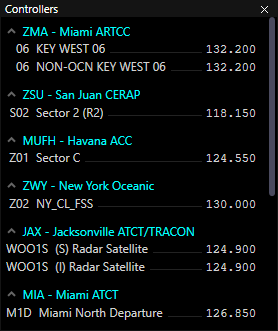

*The Controller List*

The Controller List displays information regarding relevant nearby controllers.

> ℹ️ `Ctrl`+`L` toggles display of the Controller List.

> ℹ️ Unlike legacy clients, CRC's Controller List does not display all nearby controllers. Instead, only relevant facilities are displayed to decrease clutter. For example, a controller working Providence ground would not appear in the Controller List of a controller working Boston ground as the two facilities do not neighbor one another.

Controller positions are grouped by facility. Unknown controllers are grouped under the **Other** category, ATISes are grouped under the **ATIS** category, and observers are grouped under the **Observers** category.

Controllers with [activated](#activating-and-deactivating-a-session) sessions display their primary frequency in the Controller List for all of their open positions, including any open secondary position(s). Controllers with deactivated sessions, as well as observers, are displayed in gray.

Controller entries in the Controller List that are eligible to receive handoffs display their full handoff ID in the first column. However, it may be possible to use a shorter ID, such as shortening the STARS to ERAM handoff ID of `C37`to just `C` when there is only one overlying controller online.

Hovering over a controller in the Controller List displays the controller's callsign and name in a tooltip. Double-clicking a controller opens a new [private message](#private-messages) tab with the controller.

Clicking the arrow at the left side of a group header will collapse or expand that group. When a group is collapsed, the number of entries in that group will be shown in parentheses.

> ℹ️ Your position(s) are displayed in the Controller List in teal.

> ℹ️ Secondary positions are displayed in the Controller List in italics. Secondary positions are only visible to other vNAS controllers and are not visible to pilots or controllers using legacy or foreign controlling clients.

> ℹ️ Unlike legacy clients, controllers are identified in the Controller List by their position name, not their callsign.

> ℹ️ Instructor positions are prefaced by an `(I)`, while a student positions are prefaced by an `(S)`.

### Compact Controller List

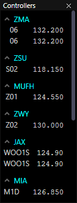

*Compact Controller List*

When the Controller List is in compact mode (see the [Profile Settings](#profile-settings) section) facility names and position names are not shown.

## Voice Switch

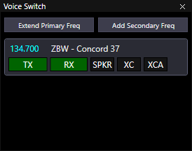

*The Voice Switch*

The Voice Switch is used for enabling your primary and secondary frequencies for transmit and/or receive on voice and text, routing frequencies to your speaker device, extending your primary frequency across additional transceiver sets, and enabling cross-coupling on one or more frequencies.

> ℹ️ `Ctrl`+`I` toggles display of the Voice Switch.

### Transceiver Sets

The Facility Engineer creates radio transceivers in order to provide the necessary coverage for all positions in the ARTCC. Each position is then associated with a set of these transceivers. Each row in the Voice Switch represents one of these transceiver sets.

When you launch a profile, CRC will automatically add your primary frequency to the Voice Switch if you have connected to the network previously using the selected profile. If you have never connected to the network using the profile, the Voice Switch will be blank until you select a primary position and connect to the network.

### Enabling Transmit & Receive

When you connect to the network, your primary frequency will automatically be enabled for receive. The RX button will have a green background. When you activate your session, your primary frequency will automatically be enabled for both transmit and receive, as shown in the screenshot above. If you deactivate your session, your primary frequency (as well as any secondary frequencies) will revert to receive-only mode.

### Secondary Frequencies

To add a secondary frequency, click the `Add Secondary Freq` button. A popup will appear where you can select the facility and position for which you want to add the frequency:

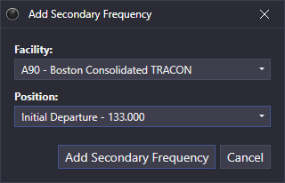

*Add Secondary Frequency*

Secondary frequencies are not automatically enabled for transmit or receive. You can click the `TX` button to enable the frequency for both transmit and receive, or click the `RX` button to enable it for receive-only.

Here, the user has added a frequency in the underlying Boston TRACON, so that they can temporarily cover the frequency while the controller steps away, and enabled it for both transmit and receive:

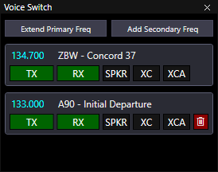

*Secondary Frequency Added*

Notice that secondary frequency rows have a red button with a trash can icon. Click this button to delete the secondary frequency.

You can also add secondary frequencies for positions within your primary facility, as the user has done here:

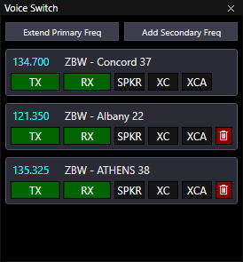

*Secondary Frequencies in Primary Facility*

> ℹ️ Secondary frequencies are saved with the profile.

### Extending Your Primary Frequency

CRC allows you to extend the coverage of your primary frequency by adding transceiver sets from other positions. To do this, click the `Extend Primary Freq` button. A popup will appear where you can choose the position from which you want to add transceivers. Here, the user has added two extensions to their primary frequency:

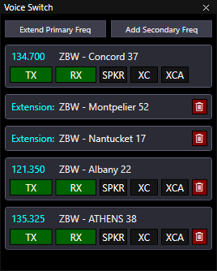

*Primary Frequency Extensions*

> ℹ️ You can only extend your primary frequency using positions within your primary facility.

> ℹ️ You can only extend your primary frequency while connected to the network.

> ℹ️ Primary frequency extensions are not saved with the profile.

### Audio Routing

By default, frequencies are routed to your configured headset device. To route a frequency to your configured speaker device, click the `SPKR` button. It will be shown with a green background. To route the frequency back to your headset device, click the `SPKR` button again. It will be shown with a dark gray background.

### Cross-Coupling Frequencies

Cross-coupling enables you to tie all of the transceivers for a frequency together such that if two pilots are out of range of each other, but each is within range of at least one of your transceivers, the pilots will be able to hear each other because their transmissions will be re-broadcast by all transceivers in the frequency.

To enable this functionality, click the `XC` button for the frequency you wish to cross-couple. The button will be shown with a green background while cross-coupling is enabled. Click the button again to disable cross-coupling.

You can also cross-couple multiple frequencies together. This is done by clicking the `XCA` button. This will automatically enable cross-coupling within the frequency, and thus both the `XC` and `XCA` buttons will be shown with a green background.

For more information on how cross-coupling works, refer to the [AFV User Guide](https://audio.vatsim.net/downloads/manual.pdf).

### Scrolling the Voice Switch

If the Voice Switch window is too small to show all of the frequencies at once, you can scroll the view with the mouse wheel. A scrollbar will **not** be shown.

## Session Management

### Connecting to VATSIM

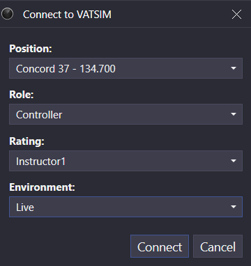

*Connecting to VATSIM*

After entering your VATSIM CID and password in the [General Settings](#general-settings) window, you can connect to the VATSIM network by selecting the **Connect...** option from a Controlling Window's menu (hamburger icon on the left of the top toolbar). Prior to connecting, a position in the primary facility, your role, VATSIM rating, and environment must be selected.

> ℹ️ Selecting the **Observer** role allows you to connect to any network as any position. However, functionality is limited to read-only operations.

> ℹ️ Selecting the **Instructor** or **Student** role displays an `(I)` or `(S)`, respectively, next to your position in the [Controller List](#controller-list) and [chat](#messages-window) messages.

> ℹ️ Unlike legacy clients, your frequency and callsign are assigned based on your position and do not need to be manually set.

> ℹ️ `Ctrl`+`F12` opens the Connect to VATSIM window.

### Activating and Deactivating a Session

When you are ready to begin controlling, activate your session by selecting the **Activate Session** option from a Controlling Window's menu. This activates the frequency and allows functions to be executed on Controlling Displays. To deactivate your session, select the **Deactivate Session** option from a Controlling Window's menu.

> ℹ️ Activating a session was formerly referred to as "priming" in legacy clients.

> ℹ️ `Ctrl`+`Shift`+`F12` toggles the activation state of your session.

### Changing an Active ERAM or STARS Position

Starting with version 1.6.0, you can move from one active ERAM or STARS position to another without reconnecting. Any tracks that you own will be transferred to the new position,
unless there is another controller working the same position that you are moving away from. In that case, the tracks will continue to be owned by that position.

> ℹ️ `Shift`+`F12` to change an active position.

You can only move to another position within the same facility, and you can only move to a STARS position for which you don't already have a display open. Your primary frequency will change to the new position's frequency, and your previous frequency will be added as a secondary frequency in the voice switch. Your VATSIM callsign will **not** be changed.

### Disconnecting from VATSIM

To disconnect from the VATSIM network, select the **Disconnect** option from a Controlling Window's menu.

> ℹ️ `Ctrl`+`F12` disconnects an active connection from the VATSIM network.
