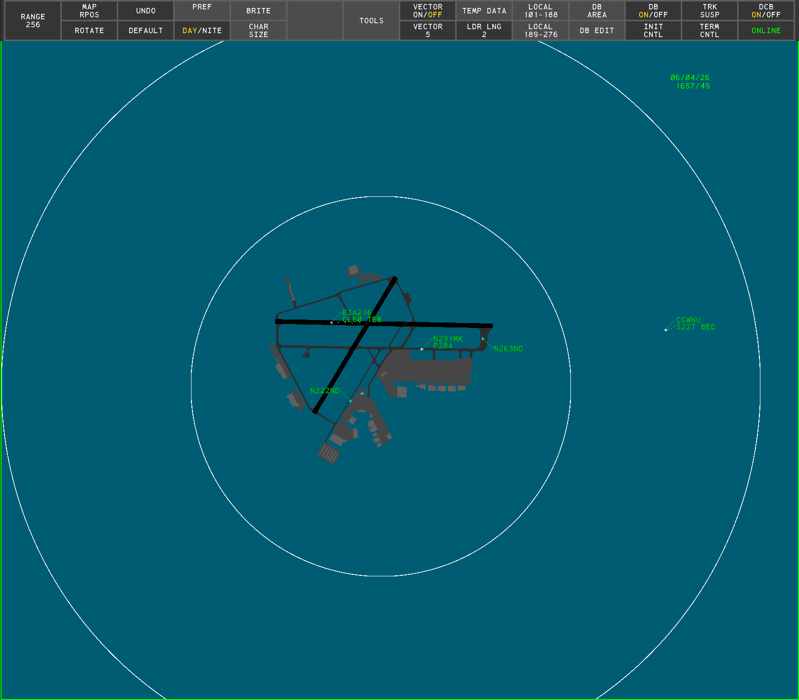
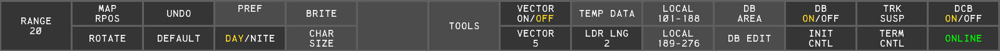
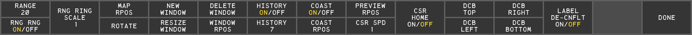
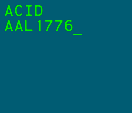

# SAID (Saab)

*A SAID (Saab) display*

Surface Awareness Initiative System (SAID) is a ground surveillance system used to monitor aircraft on the airport surface. SAID is produced by multiple vendors; this page documents the **Saab** implementation. Saab's SAID is very similar to their [ASDE-X](asdex.md) product. This page documents only the ways in which Saab's SAID differs from ASDE-X. For any topic not covered here, refer to the [ASDE-X documentation](asdex.md).

> ℹ️ Because SAID-derived information may only be used as a reference, SAID cannot be selected as a primary display type.

## Display Map

The Display Map functions as it does in ASDE-X, except SAID supports a maximum range of 100 NM (3-6076 in hundreds of feet).

### Range Rings

SAID can overlay range rings centered on the display. Range rings are toggled with the **RNG RNG ON/OFF** button on the [Tools](#tools-submenu) DCB submenu.

##### To set the range ring spacing:

1. Left-click the **RNG RING SCALE** button on the Tools DCB submenu
2. Scroll to set the desired ring spacing
3. Left-click or press `Enter`

*or*

1. Left-click the **RNG RING SCALE** button on the Tools DCB submenu
2. Type the desired ring spacing, in NM
3. Press `Enter`

## Targets

> ⚠️ SAID does not display primary targets. An aircraft is only displayed when its transponder is turned on.

Unlike ASDE-X, which displays primary targets, SAID has no unknown target icon (see [ASDE-X - Targets](asdex.md#targets)). However, when an aircraft is squawking a beacon code that does not correlate to an existing flight plan, it is displayed as an **unidentified aircraft**.

*An unidentified aircraft*

## Label De-Confliction

Label De-Confliction automatically repositions overlapping Data Block labels so they do not overlap. It is toggled with the **LABEL DE-CNFLT ON/OFF** button on the [Tools](#tools-submenu) DCB submenu.

> ℹ️ Label De-Confliction is unavailable when the display range is greater than 50,000 feet.

## Display Control Bar

*The Main DCB menu*

### Main Menu

The SAID Main menu contains the following button:

- **ONLINE/OFFLINE**: a status indicator showing the connection to the network. **ONLINE** is displayed when connected; **OFFLINE** is displayed when disconnected.

### Tools Submenu

*The Tools DCB submenu*

The SAID Tools submenu contains the following buttons:

- **RNG RNG ON/OFF**: toggles display of [range rings](#range-rings)
- **RNG RING SCALE**: controls the [range ring spacing](#to-set-the-range-ring-spacing)
- **LABEL DE-CNFLT ON/OFF**: toggles [Label De-Confliction](#label-de-confliction)

## Preview Area

*The Preview Area*

SAID's Preview Area displays the following lines:

Table 1 - Preview Area lines

| Line | Description |
| --- | --- |
| 1 | System response line |
| 2 | Functional feedback line 1 |
| 3 | Functional feedback line 2 |

> ℹ️ When disconnected from the VATSIM network, the message **MSDP COMMS FAIL START** is displayed in the Preview Area. When reconnected, this message is replaced with the **MSDP COMMS FAIL END** message.
