# vStrips Controller Manual

Virtual Flight Strips (vStrips) is a web application that simulates the paper flight progress strips used by real-world controllers. vStrips is used in conjunction with other vNAS clients, such as CRC. This manual is intended to teach controllers how to utilize vStrips to maintain situational awareness and coordinate with other controllers in the terminal environment on the VATSIM network.

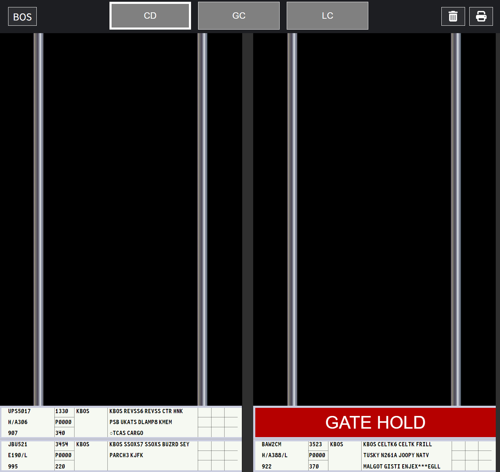

*A vStrips display*

> ℹ️ vStrips is accessed at <https://strips.virtualnas.net/>.

> ℹ️ This guide is intended for controllers. If you are a Facility Engineer seeking flight strips configuration documentation, please see the [Flight Strips Configuration](../vnas-data-admin/facilities.md#flight-strips-configuration) section of the vNAS Data Admin website documentation.

> ⚠️ In order to interact with strips, your controlling session must be activated on your primary controlling client.

> ⚠️ vStrips does not currently support touch-based input. An iOS app is in development.

## Logging In

Logging in to vStrips requires selecting an environment and authenticating through [VATSIM Connect](https://auth.vatsim.net/). Upon logging in to your VATSIM account and authorizing vNAS access, you are redirected back to the vStrips login page. vStrips then searches for your active position on a primary vNAS client, such as CRC.

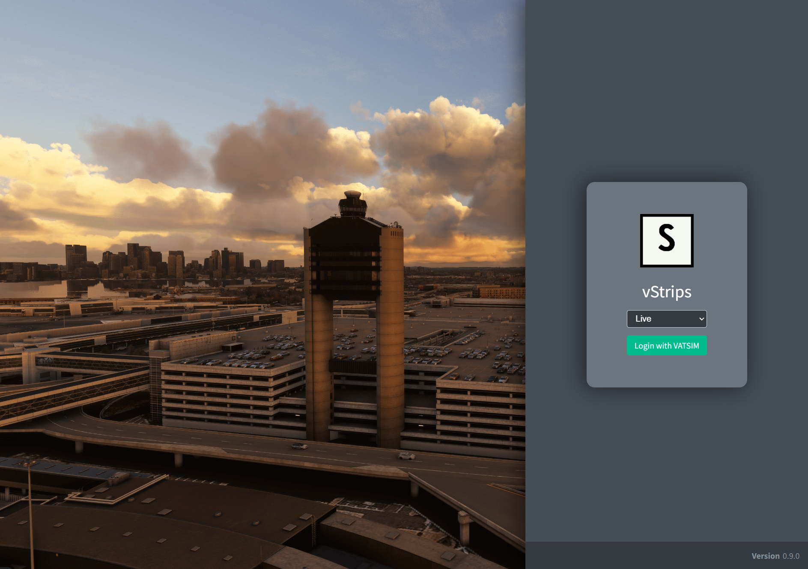

*vStrips login page*

If you are not logged in to a primary vNAS client, the message **No vNAS Connection** is displayed:

*No vNAS connection*

If you are working a facility that does not utilize flight strips, the message **No Facility Available** is displayed:

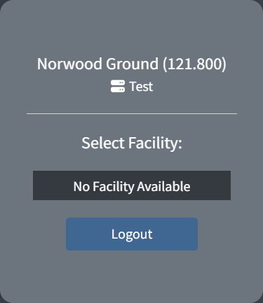

*No facility available*

If you are working a facility that supports flight strips, that facility appears in the selection menu.

If you are working a facility that assumes responsibility for one or more flight strip facilities when consolidated top-down, those child facilities also appear in the selection menu. For example, ACK, BOS, and MHT all utilize flight strips. When working A90 (the parent TRACON), all three facilities appear in the selection menu. For more information, see the [Facility Menu](#facility-menu) section of the documentation.

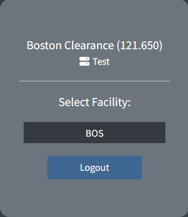

*Selecting a facility*

## vStrips Window Layout

The header across the top of vStrips contains a facility button that displays the active facility ID and can be used to open the [Facility Menu](#facility-menu), drop zones for each internal and linked external bay (**Clearance**, **Ground**, and **Local** in [Figure 6](#img-header)), a trash drop zone for deleting strips, and the [flight strip printer](#flight-strip-printers) menu button.

*The vStrips Window Header*

**Terminology:**

*Rack* - Simulated vertical metal rails upon which flight strips are ordered

*Bay* - A collection of flight strip racks typically associated with one position

Facilities contain a set of bays. Each bay contains vertical racks to organize flight strips. To view a bay, click on its drop zone on the header. Only one bay is viewed at a time, and the currently selected bay is indicated by a white outline around its drop zone.

Bays owned by a different facility may be linked for the purpose of [pushing flight strips](#moving-and-pushing-strips) between facilities (e.g. linking an ATCT with its TRACON). Unlike internal bays, however, external bays cannot be selected for viewing. Facility Engineers are responsible for configuring linked bays.

> ℹ️ Flight strip bays in vStrips are shared between controllers. If a controller moves, updates, or deletes a flight strip, the change is seen by all other controllers with access to that strip bay.

> ⚠️ Once the last controller exits a facility on vStrips, the flight strips remain for five minutes. After five minutes, the facility is closed and all bays are cleared of flight strips (excluding [separators](#separators)). If a controller opens a facility after it has been closed, the appropriate flight strips are reprinted.

## Strip Types

### Departure Flight Strips

Departure flight strips contain flight plan information for flights departing the facility, as well as nine boxes for controller annotations in accordance with local operating procedures. Departure flight strips are printed to a facility's [flight strip printer](#flight-strip-printers) when a flight plan departing that facility, or any underlying facility, is initially filed.

If the flight plan is amended by a controller, a new departure flight strip is printed with the appropriate revision number. When a revised flight strip is printed, any outdated flight strips for that flight plan are removed from the printer.

> ⚠️ Outdated flight strips that were previously moved to a flight strip bay are not automatically edited or deleted and must be manually removed by a controller.

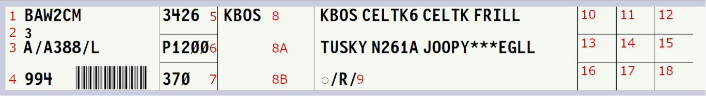

*A departure strip*

A departure flight strip displays the following fields:

Table 1 - Departure strip fields

| Field | Description |
| --- | --- |
| 1 | Aircraft ID |
| 2 | Revision number |
| 3 | [Equipment](#equipment) |
| 4 | CID |
| 5 | Beacon code |
| 6 | Proposed departure time |
| 7 | Requested altitude |
| 8 | Departure airport |
| 8A-8B | Annotation space |
| 9 | Route, destination, and remarks |
| 10-18 | Annotation space |

> ℹ️ A revision number is not initially displayed on flight strips. Once a flight plan is amended, a new flight strip is printed containing the appropriate revision number, beginning at 1.

> ℹ️ When a route or remarks are truncated, ******* is displayed.

#### Equipment

Equipment contains the aircraft type followed by the equipment suffix. In facilities without CWT, `H/` is prefixed to heavy aircraft. In facilities with CWT, the CWT category as depicted in [Table 1](#table-dep-strip-layout) is prefixed.

Table 2 - CWT category

| Category | Description |
| --- | --- |
| A | Super |
| B | Upper Heavy |
| C | Lower Heavy |
| D | Non-Pairwise Heavy |
| E | B757 |
| F | Upper Large |
| G | Lower Large |
| H | Upper Small > 15,400 lbs |
| I | Lower Small < 15,400 lbs |

#### Annotations

Flight strips are annotated by selecting one of the 11 annotation boxes and inserting text. A check mark (✓) is inserted by pressing `Shift` + `/` (`?`).

### Arrival Flight Strips

Arrival flight strips contain limited flight plan information for flights arriving at the facility, as well as nine boxes for controller annotations. Arrival flight strips are printed to a facility's flight strip printer when an airborne aircraft is less than 20 minutes from arrival.

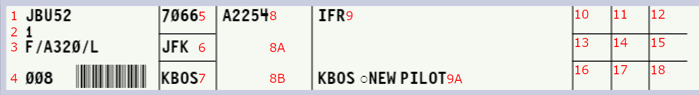

*An arrival strip*

An arrival flight strip displays the following fields:

Table 3 - Arrival strip fields

| Field | Description |
| --- | --- |
| 1 | Aircraft ID |
| 2 | Revision number |
| 3 | [Equipment](#equipment) |
| 4 | CID |
| 5 | Beacon code |
| 6 | Previous fix |
| 7 | Coordination fix |
| 8 | Estimated time of arrival |
| 8A-8B | Annotation space |
| 9 | Flight rules |
| 9A | Destination and remarks |
| 10-18 | Annotation space |

### Blank Flight Strips

Blank flight strips are printed through the flight strip printer menu and are edited by controllers in accordance with local procedures.

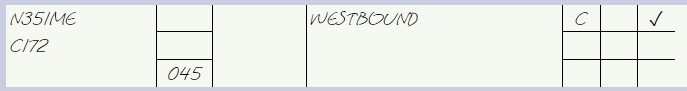

*A blank strip*

> ℹ️ Information printed onto a flight strip appears in block capitals while controller-input data is styled like handwriting.

### Half-Strips

Half-strips provide a way to enter free text onto a flight strip. They can be useful when creating a flight strip for an aircraft without a flight plan, such as a VFR aircraft or an aircraft remaining in the pattern. Half-strips can also be used to jot down notes or to pass information between controllers for coordination purposes.

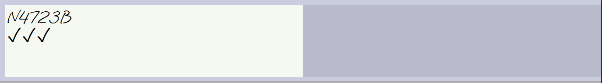

*A half-strip*

To add a half-strip, right-click and select **Add half-strip**. To slide the half-strip to the other side of the holder, right-click on the half-strip, and select **Slide**.

## Strip Bay Management

### Separators

Separators are used to separate and organize stacks of flight strips within a rack. To create a separator, right-click an empty rack space and select **Add separator**.

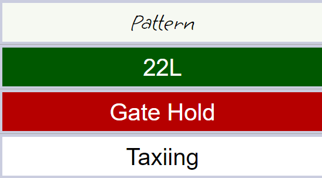

*Separators*

To edit a separator's style or label, right-click on the separator and choose the appropriate option.

> ⚠️ ARTCC staff may elect to lock separators. When separators are locked, only handwritten separators may be created, edited or deleted.

### Offsetting Strips

Flight strips are offset by right-clicking the strip and selecting **Offset**. This slides the strip out of the rack to serve as a visual reminder.

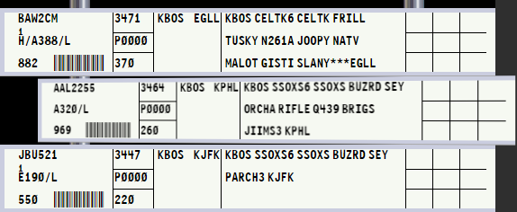

*An offset strip*

### Moving and Pushing Strips

Flight strips are moved by dragging the flight strip to a different position in the same bay, including across racks.

To move a strip between bays, drag and drop the strip onto the appropriate bay's drop zone in the header to place it on top of the bay's first rack.

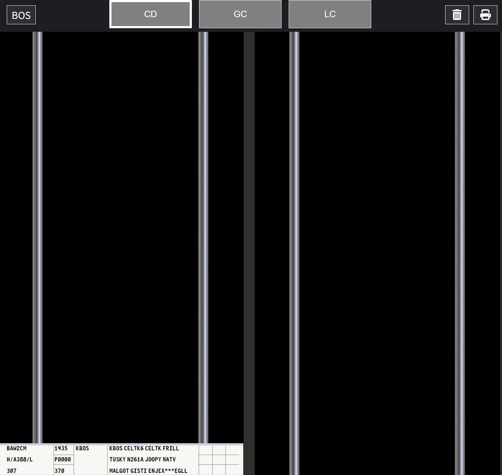

*Moving a flight strip between bays*

Alternatively, a strip can be dragged and held above a drop zone to view the destination bay. The strip can then be placed in a specific position within the bay (see [Figure 13](#img-strip-movement), moving the strip to **Ground** bay.)

> ℹ️ This method only works when moving a strip between two bays within the same facility.

Instead of dragging and dropping, flight strips can be pushed directly to the top of a bay's first rack by right-clicking a flight strip and selecting **Push...** and then choosing the appropriate bay.

> ⚠️ When pushing a strip to an external bay, the facility's flight strips must be open by at least one controller for the pushed strip to be received. If no one is working that facility's flight strips, the strip is deleted and a warning message appears:

*The push warning*

> ℹ️ Flight strips can be deleted by dragging and dropping over the trash drop zone in the header.

### Disconnected Aircraft

If an aircraft disconnects, any applicable flight strips automatically receive an **X** annotation across the first column. If the aircraft reconnects, the annotation is removed.

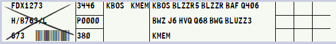

*A disconnected aircraft's flight strip*

> ℹ️ This annotation is not applied to flight strips printed for pre-filed flight plans, even though the aircraft is not yet connected.

## Flight Strip Printers

Flight strip printers are accessed by clicking on the printer icon in the header, or by pressing `Tab`. Facilities can have either one printer that prints all flight strips or two printers: one for departures and one for arrivals. If multiple printers are enabled, the notification badge on the printer icon displays the number of strips in each printer separated by a slash.

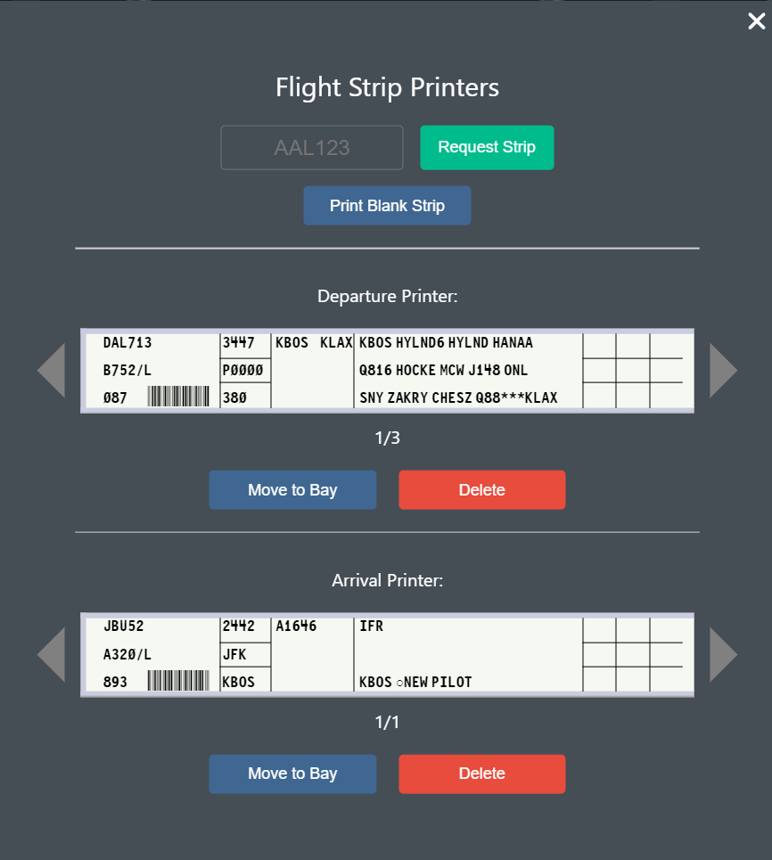

*The flight strip printer menu*

When a flight plan is filed, a departure strip is sent to the departure facility's flight strip printer. If arrival strips are enabled by the Facility Engineer, an arrival strip is printed to the destination facility's printer when an aircraft is less than 20 minutes from arriving.

Additionally, an aircraft's flight strip can be printed by inputting the aircraft's ID and clicking **Request Strip**. Printed flight strips begin to "stack up" in the printer such that the most recently printed flight strip appears first.

Clicking **Move to Bay** moves the displayed flight strip to the selected bay onto the default rack number configured in the [Facility Menu](#facility-menu). If the default rack number is greater than the number of racks in the selected bay, the strip is moved to the last rack. Alternatively, the displayed flight strip can be dragged out of the printer and dropped in the appropriate position, just as flight strips already in a bay are moved.

## Facility Menu

The Facility Menu is opened by pressing `Esc` or by clicking the active facility ID in the header. If multiple facilities are being worked top down, the active facility is switched by selecting a different facility from the **Change Facility** menu. Additionally, sound effects can be enabled or disabled, and the default rack strips are moved to from the printer can be set in the Facility Menu

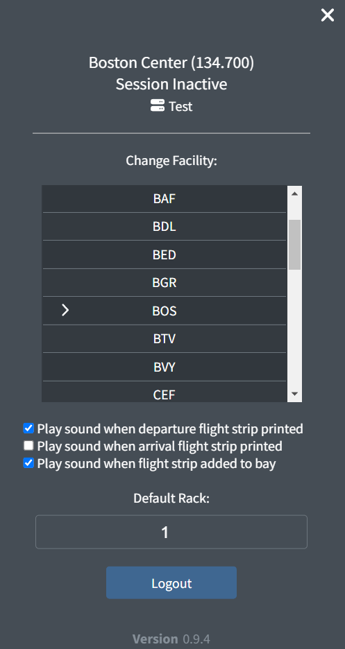

*The Facility Menu*

## Keyboard Shortcuts

The following keyboard shortcuts can be used on vStrips depending on the context or type of strip selected.

**General:**

Table 4 - General keyboard shortcuts

| Action | Key(s) |
| --- | --- |
| Select strip | (`↑`, `↓`, `←`, `→`) |
| Toggle strip offset | `Shift` + click |
| Select strip | `Ctrl` + click |
| Delete strip | `Alt` + click |
| Add half-strip to first rack | `Ctrl` + `Shift` + `H` |
| Add separator to first rack | `Ctrl` + `Shift` + `S` |
| Change to next bay | `Page up` |
| Change to previous bay | `Page down` |
| Change to specified bay number | `Ctrl` + `Alt` + (`1`-`9`) |
| Change to next facility | `Ctrl` + `Alt` + `→` |
| Change to previous facility | `Ctrl` + `Alt` + `←` |
| Toggle printer menu | `Tab` |
| Toggle Facility Menu | `Esc` |

**When any strip is selected:**

Table 5 - Selected strip keyboard shortcuts

| Action | Key(s) |
| --- | --- |
| Move strip | `Ctrl` + (`↑`, `↓`, `←`, `→`) |
| Push strip to specified bay number | `Ctrl` + `Alt` + (`1`-`9`) |
| Delete strip | `Delete` |
| Delete strip | `Backspace` |
| Deselect strip | `Esc` |
| Add half-strip above | `Ctrl` + `Shift` + `H` |
| Add separator above | `Ctrl` + `Shift` + `S` |

**When a departure, arrival, or blank flight strip is selected:**

Table 6 - Selected departure, arrival, or blank strip keyboard shortcuts

| Action | Key(s) |
| --- | --- |
| Edit annotation boxes 10-18 | `Ctrl` + (`1`-`9`) |
| Edit annotation boxes 10-18 in the corresponding position | `Ctrl` + (`Numpad 1` - `Numpad 9`) |
| Offset strip | `Shift` + (`←`, `→`) |

**When a half-strip is selected:**

Table 7 - Selected half-strip keyboard shortcuts

| Action | Key(s) |
| --- | --- |
| Edit half-strip | `Enter` |
| Offset half-strip | `Shift` + (`←`, `→`) |
| Slide half-strip | `Ctrl` + `Shift` + (`←`, `→`) |

**When a separator is selected:**

Table 8 - Selected separator keyboard shortcuts

| Action | Key(s) |
| --- | --- |
| Edit label | `Enter` |
| Cycle style | `Ctrl` + `Shift` + (`←`, `→`) |

**When the printer menu is open:**

Table 9 - Printer menu keyboard shortcuts

| Action | Key(s) |
| --- | --- |
| Add strip to bay | `Enter` |
| Cycle to next strip | `→` |
| Cycle to previous strip | `←` |
| Delete strip | `Delete` |
| Delete strip | `Backspace` |
