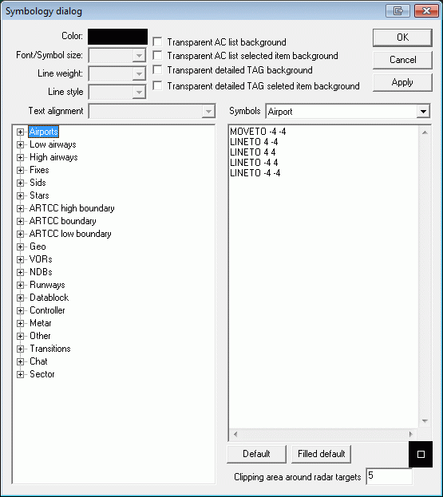

# Display & Symbology Settings

## Symbology Settings

Similar to [[Display Settings]], the settings in the symbology settings window gives a controller some new tools: EuroScope allows to have different colors, line width or fonts for every individual item on the radar screen. Click on Symbology Settings … The following dialog will appear:

<figure>
    
    <figcaption>Fig.  - p.152</figcaption>
</figure>

The settings are quite straight forward, colors can be chosen from a palette, font size can be adjusted as required, .5 (values are also accepted), set line weight to a value of 0-10, select line style from values of solid, dash, dot, dash-dot, dash-dot-dot, and select Text alignment for the elements.

- Airports - set attributes for symbol/name
- Low airways - set attributes for line/name
- High airways - set attributes for line/name
- Fixes - set attributes for symbol/name
- Sids - set line attributes for each Sid (or elements of the SIDs section)
- Stars - set line attributes for each Star (or elements of the STARs section)
- ARTCC high boundary - set line attributes for each high sector boundary
- ARTCC boundary - set line attributes for each sector boundary
- ARTCC low boundary - set line attributes for each low sector boundary
- Geo - set line attributes for Geo data (coastlines, rivers, lakes, other lines of under the Geo section; NOTE: colors are defined in the "'*.sct"' file)
- VORs - set attributes for each symbol/name/frequency
- NDBs - set attributes for each symbol/name/frequency
- Runways - set attributes for each runway centerline, extended centerline and name
- Datablock - set attributes for aircraft datablocks (tags) that are non concerned/notified/assumed/transfer to me initiated/redundant/information/emergency and detailed background/active item background. In case of departing/arriving traffic or flights on even/odd flightlevels, TAG items can also be configured independently from the state of the TAG (assumed, non-concerned, etc…) according to the settings given here.
- Controller - set attributes for controllers in modes normal/breaking/timeout
- Metar - set attributes for normal/modified/timeout METAR info text
- Other - set attributes for wait/distance line/distance values/distance annotation/separation leader/separation leader2/find/valid airway/bad direction airway/unconnected airway/direct no airway/free of conflict/conflict warning/conflict detected/route annotation/freetext/range rings/plane range rings/manual taxi line/manual taxi line ends at predefined point/predefined taxi line/terminal taxi line/list header/normal menu item/disabled menu item
- Transitions - set attributes for individual transitions and transition grids
- Title - set attributes for items on the title line such as datafile/controller/primfreq normal/primfreq breaking/clock
- Chat - set attributes for items related to chat and chat windows, such as text/background/name normal/name unread
- Sector - set attributes for sector line/MSAW area/active sector background/inactive sector background

There are also some check boxes to set some values on or off:

- Transparent AC list background - if selected, the background of the aircraft coordination lists (SIL,SEL,DEP) is transparent.
- Transparent AC list selected item background - if selected, the currently selected aircraft won't be highlighted in the lists.
- Transparent detailed TAG background - if selected, the background of detailed tags will be transparent.
- Transparent detailed TAG selected item background - if selected, the specific item within the detailed tags won't be highlighted.

Every symbol can be customized in the right window using graphic commands. All coordinates are in pixels. They are very simple:

- MOVETO <x> <y> - to move the cursor to the specified location
- LINETO <x> <y> - draw a straight line from the previous position
- POLYGON <x1> <y1> <x2> <y2> ... <xn> <yn>- to draw a freeform polygon (the number of coordinates are limited to about 20)
- ARC <x> <y> <radius> <start angle> <end angle> - to draw part of a circle (angle values are in degrees)
- FILLARC <x> <y> <radius> <start angle> <end angle> - to draw a filled part of a circle
- SETPIXEL <x> <y>- to display an individual pixel

Pressing the Default or Filled default button the symbol changes the actual symbol description with the default one. The Clipping area around radar targets textbox allows to define a squared area (in pixels) around every aircraft where no information can be displayed and thus prevents the anchor line to run to the middle of the symbol. Its maximum value is 50.
