# Pseudopilot Tag Elements

This is the flagship reference for YAAT's EuroScope-style interactive tag mode. It documents how EuroScope's pseudopilot uses the radar tag itself as the primary control surface -- clicking a field opens a flyout, and AHDG supports an elastic vector that draws turn radius live as you drag toward a point on the map.

<figure>
    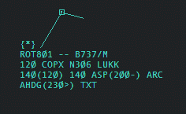
    <figcaption>Fig.  - p.195</figcaption>
</figure>

The main control of the simulator is done from the aircraft tag. The following assumes the default Matias (built in) tag but you may build your own tag. There are multiple optional simulator control tag items available in the tag editor so see the [[TAG Editor]]section of the manual for more information. When using the tag to control the sim-planes you will be using the same assign commands that you use when controlling. However the function to share the cleared altitudes/speeds/DCT is inhibited in the sim therefore the trainee will not be able to see your orders.

- {}, {*}, {TMA} - this field is at the top of the tag and it is used to take control as a pseudopilot. You will not be able to move this plane if you do not assign yourself as the plane's pseudopilot:
  - {*} shows you are the owner,
  - {TMA} shows TMA pseudopilot is owner
  - {} shows there is no pseudopilot assigned and you can take control of it. Pressing on it opens the Simulation pop-up. Then you can Get simulation.
- ROT801 - callsign. Clicking on it when you own the sim-plane lets you transfer simulation to another pseudopilot (if connected).
- COPX - can also be used to give rerouting direct order
- 140(120) - Temp Altitude. When in sim this is expanded to show on the left the altitude set by the controller/trainee and on the right in brackets you can see the assigned altitude in the simulator. Clicking on it opens the Temp Altitude pop-up which sends climb/descent commands to the simulator.
- ASP(200-) - Assigned Speed. This shows on the left the assigned speed set by the controller (if set) and on the right in brackets the speed order for the simulator and the comply instruction.
  - - means less than - the plane will be at the set speed as far as the normal is above that but "'may"' reduce the speed later.
  - + means more than - the plane will be either at or faster then the set speed as far as the normal is below that but may increase the speed later
  - = means fixed - the plane will be exactly at the assigned speed and will not slow down or speed up
  - The Assign Speed pop-up opens when clicking on it. You can assign a speed or clear a speed instruction by pressing --
- ARC - Assigned Rate of Climb. Opens the assigned rate pop-up where you can give a rate of climb/descent restriction order. This is not displayed anywhere.
- AHDG(230>) - Assigned heading. Displays the assigned heading by the controller first then in brackets the simulator assigned heading and the turning direction if the plane is still turning. It has 2 functions:
  - Clicking opens the Heading Assign pop-up where you can assign a heading. It opens centered on the present heading and scrolling up means a right turn while scrolling down means a left turn.
  - Click and drag opens the elastic vector. Just drag off to the direction you want it to fly. The turn radius is also calculated.

## The Simulator Control Ribbon

The Simulator Control Ribbon appears below the main menu area at the top when connecting with "Start Sweatbox Simulator session". It is grouped into the following areas:

- A fixed information area
- Route ribbon
- Status ribbon
- Approach ribbon
- Ground simulator ribbon
- Takeoff ribbon
- Emergency ribbon
- Lights and time acceleration ribbon
- Pause/play button

Clicking on any of the ribbon buttons will expand a ribbon with the functions to the right pushing remaining remaining buttons at the right side of the bar. To open another ribbon either collapse this ribbon first by pressing either button of the expanded ribbon (first or last - shown as pressed) or just press another ribbon button. Some remaining buttons may be right of the expanded ribbon.

## Information Area

It shows the status of the selected plane. Present heading, and commanded heading with direction of turn between as < or > symbol when still turning. Flight level and commanded level. Speed and commanded speed.

## Route Ribbon

The next waypoint along the route. You can click here to type a new point as direct. It sends the plane to a holding pattern over the next waypoint. The holding must be declared in the scenario file. It is the list of the next waypoints. Click here to edit the route in place. Right click to open the Predefined Route menu.

<figure>
    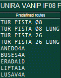
    <figcaption>Fig.  - p.198</figcaption>
</figure>

The Predefined Route is used to quickly insert routes into the routes field (such as Go Around or STARs). It is opened by right clicking on the route sequence of waypoints. The system can also join routes in the middle. First the system finds the closest leg then it inserts the points starting with the end of that segment. Jump to the next waypoint. Skip next waypoint.

## Status Ribbon

The SQ value sent by the plane. Click here to edit the value in place or use the next buttons. Squawk emergency. Squawk radio failure. Squawk the right code, the controller assigned value. Squawk standby. Squawk "C" mode. Squawk ident. This area is an indicator and a button too. The icons indicate if the plane is climbing or descending or does not change its level. It also indicates fast climb and fast descend. Clicking on the button will change the fast to non fast and vice versa. It shows the actual speed restriction. Clicking on the are will change the restriction type in a loop.

- Free - the simulator decides the best speed
- Exact - the plane will follow the speed set by the trainer
- Less than - the plane will be slower then the set speed as far as the normal is above that but may reduce the speed later
- More than - the plane will be faster then the set speed as far as the normal is below that but may increase the speed later

It pauses/resumes the selected plane. Accept handoff from the trainee. Ignores Crash Detection. After two planes collide this button will be pressed. Depress it to cancel the crash mode and resume flight. Delete the plane completely from simulation.

## Approach Ribbon

Runways available for approach. When aircraft is able to start approach from its position this icon is expanded to show the following buttons. Cleared for approach, landing and stopping on the runway waiting for instructions. Cleared for landing and vacate left or right according to the icons. For this you need to have configured the Ground Network for Tower Simulator in the ESE. In version v3.2.1.18 you may define the actual exit taxiway from a drop down list. Cleared for touch and go. Low pass at different elevations from 50 feet to 200 feet above airport.

## Ground Simulator Ribbon

<figure>
    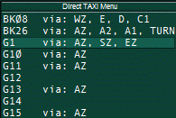
    <figcaption>Fig.  - p.200</figcaption>
</figure>

Opens the Direct Taxi Routing menu. Here you can select any defined end point (defined as gates in [[ESE_Files_Description_v32#Taxiways|ESE > Taxiways]]) and the shortest connected route between the current position and the end point will be calculated and drawn as you move the mouse over the list. Press one and it will taxi via that route. New taxi routing. You use left mouse clicks on the ground map to route the plane and send with right click, as described below: Using Taxi Tools

<figure>
    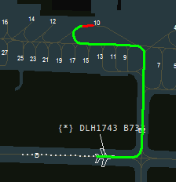
    <figcaption>Fig.  - p.201</figcaption>
</figure>

When you create a new taxi command you get an elastic vector from the present position of the target to the position of the mouse on screen. If the aircraft/vehicle is on a taxiway/road, or at a gate/stand/parking (and if GROUND network has been created in [[ESE_Files_Description_v32#Taxiways|ESE > Taxiways]] you can do the following: When you move the mouse over a taxiway the shortest route over the taxi network is calculated and displayed dynamically in green.

<figure>
    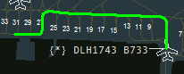
    <figcaption>Fig.  - p.201</figcaption>
</figure>

The route snaps to the beginning or the end of each taxi segment. This is to facilitate taxi to precise positions. If this is not intended and you want a flexible position on the taxiway press and hold Control button on your keyboard. This will make positioning fluid. When you move the mouse over an end point (Gate, Holding Point) a red line appears at the end of the routing displaying the final position of the end point. This is to facilitate correctly selecting the end point.

<figure>
    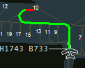
    <figcaption>Fig.  - p.201</figcaption>
</figure>

When you move the mouse over an area that does not have any taxi routing or a routing which is not available for the vehicle you get a straight white line. This allows you to command routes off the ground network. This is the only mode available if the [[ESE_Files_Description#Taxiways|ESE > Taxiways]] section has not been created. It is similar to the old TAXI mode from EuroScope v3.1. Turns are a little bit smoothed.

<figure>
    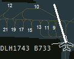
    <figcaption>Fig.  - p.202</figcaption>
</figure>

If the aircraft/vehicle is not on a taxiway or gate/parking or when last selected point in generating the taxi route instruction was off the ground network (white line) you can farther either make a route off the network or you can join a taxiway. When you move the mouse over a taxiway/road a straight yellow line appears to the join point. Subsequently the routing can be done on the taxiway network with green lines.

<figure>
    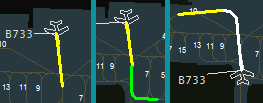
    <figcaption>Fig.  - p.202</figcaption>
</figure>

You create a taxi routing command using the above tools combined by adding multiple points on the map by left clicking to build your route. If using the route network it may be enough to select the destination directly and the shortest taxiway route will be selected. If the route calculated is not the one intended to be followed, first add one or more intermediary restriction points that the route must pass then click the destination. After you have built your route and your are happy you can start it by right clicking anywhere. If you are not happy with the route you have built, before you press right click you can cancel creating the route by pressing Escape on your keyboard. You can also pan the map while you are creating the route by pressing and and dragging with Right Click. If you have sent the taxi order and you want to cancel it you can use the following button to cancel: Hold. Note: The simulator is designed to handle different types of traffic on an airport, such as aircraft, ground service vehicles, follow me, and even even taxiways restricted to specific aircraft. See the [[ESE_Files_Description#Taxiways|ESE > Taxiways]] and the [[Scenario_File#Additional_data|Scenario > Aircraft Additional Data]] on how to create this. Hold position. Aircraft will slow down and stop in the required distance from its speed. The route is still maintained so you can continue taxi. Continue taxi. After a hold position the aircraft will continue taxi on the route. Pushback. This tool works in the same way as the New Taxi Routing but the aircraft is pushing back and moving slower. Manual slew. Allows you to manually send move commands directly to the simulator. Opens the following window:

<figure>
    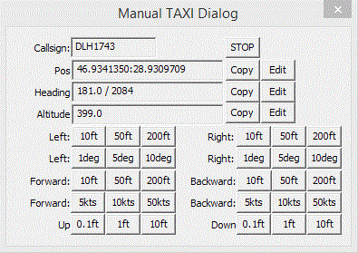
    <figcaption>Fig.  - p.203</figcaption>
</figure>

Here you can:

- read the CALLSIGN, instantly STOP any movement,
- see the present position coordinates, COPY them, or dynamically EDIT them,
- see the present heading in magnetic format and FSD format, and COPY or EDIT it,
- see the present altitude in floating point and COPY or EDIT it,
- move the airplane in 4 axes (left/right, forward/backward, up/down and left/right rotation) by multiple fixed values,
- for the forward/backward axis you can also command a fixed speed constant movement,
- it can also be useful to create the,[[ESE_Files_Description#Taxiways|ESE > Taxiways]] section by moving and copying coordinates.

Follow Me command. With the follower plane selected click the button. A red elastic vector appears. When you move the mouse over another vehicle the line turns green. Click to make it the leader. Both vehicles must be holding position. The follower plane will taxi straight to near the leader and and stop. After select the leader and give new taxi order. The follower will follow close behind on the route. The leader will not accelerate and go too far. If the follower remains too far behind the leader will stop. To leave the Follow Me mode select the follow and give another taxi command, or a Hold order.

<figure>
    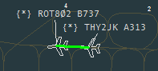
    <figcaption>Fig.  - p.204</figcaption>
</figure>

Follow Me then Hold One Point Behind command. Activate it the same as the Follow Me command. When giving new taxi route to the leader make the taxi route to the point where you want the follower to Hold.

<figure>
    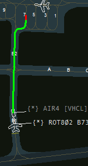
    <figcaption>Fig.  - p.204</figcaption>
</figure>

Then make just one more click where you want the leader to go to get out of the way.

<figure>
    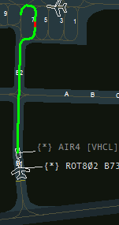
    <figcaption>Fig.  - p.205</figcaption>
</figure>

The follower will stop at the position enter Hold mode and the leader will continue to the final point.

<figure>
    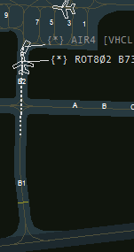
    <figcaption>Fig.  - p.205</figcaption>
</figure>

This is normally used for Follow Me vehicle to guide the aircraft to the parking position, then move to one side to free the aircraft parking. Just taxi the Follow Me vehicle to the taxiway used to vacate by the aircraft, turn around and move a bit forward (to avoid crashing). After the arriving aircraft lands, vacates and stops on the taxiway, select it and press FM-1 button. Then select the Follow Me and create the taxi route to the Gate and press once on the red end point then add one more point a bit to the side where you want the car to come to rest. The aircraft will stop at the gate and the vehicle will park nearby.

<figure>
    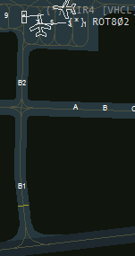
    <figcaption>Fig.  - p.206</figcaption>
</figure>

Taxi Behind Me. Use the elastic vector that appears to give priority to another aircraft. It will remain on the same route but if it is on intersecting routes it will slow down and stop if needed to allow the other aircraft to go ahead of it. Is also used for aircraft on the same route or holding point to stop behind the stopped or slow aircraft in front, not collide and continue taxi only when the aircraft in front has started moving again.

<figure>
    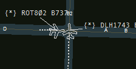
    <figcaption>Fig.  - p.206</figcaption>
</figure>

It is very useful to daisy chain aircraft at the runway holding point. When you lineup an aircraft all the others move forward. Speed change. Speed is completely automated. Vehicles have a maximum speed specified in the Scenario File, taxiways have a maximum speed specified, vehicles slow down before turns, in follow me mode speed is managed on both vehicles as to not go too far apart or collide and the acceleration and slowdown is accurately simulated. But if you want to override the maximum speed you can change here, in knots.

## Takeoff Ribbon

Lineup command. When the aircraft is near the runway it will taxi ahead to it and line up toward the direction which has the most remaining runway. Alternatively you can use new taxi routes to lineup more precisely. Takeoff/Abort Takeoff/Go Around. This button has triple function depending on the state of the aircraft. When pressed when on the ground it will line up the aircraft (if not already done), and takeoff. If during takeoff roll and not yet airborne it will cancel takeoff and start braking. If it is on approach or landing but not yet touched down it will go around and climb to 2000 feet on runway heading.

## Emergency Ribbon

Following functions will only have effect if the tower image connected via the EuroScope FSX Connector. Gear Retracted. You can inhibit any of the gears to come down: Left Main Gear, Right Main Gear or Nose Gear. Gear Collapsed. The selected gear is displayed as in between extended and retracted as collapsed. Engine Smoke. Generates smoke at the selected engine 1 through 4. For 2 engines planes use the first 2 buttons. Engine Fire. Generates engine fire at the selected engine.

## Lights Ribbon

The following functions will only have effect in the tower image connected via the EuroScope FSX Connector. Lights are selected on AUTO. Click to disable automatic mode. On pushback the BEACON, NAVIGATION and WING lights are turned on. On taxi the TAXI lights are added. On LINEUP/TAKEOFF command the STROBE and LANDING lights are turned on and the TAXI light is turned off. After landing and when vacating the TAXI light is turned on and the STROBE and LANDING lights are turned off. When reaching gate end point the taxi light is turned off. After a while all lights are turned off. Turn off AUTOMATIC mode and toggle Beacon lights on or off. Turn off AUTOMATIC mode and toggle Strobe lights on or off. Turn off AUTOMATIC mode and toggle Navigation lights on or off. Turn off AUTOMATIC mode and toggle Landing lights on or off. Turn off AUTOMATIC mode and toggle Taxi light on or off. Turn off AUTOMATIC mode and toggle Wing lights on or off. Turn off AUTOMATIC mode and toggle car Emergency lights on or off. These are turned on for vehicles while moving in AUTO mode. Simulation session acceleration. Press the acceleration rate and the session will be sped up by that rate. To turn off press once more. Pause/play button Toggle Pause/Play for the whole session. Sessions are started as paused and you need to resume them. Opens the obsolete "Simulator (Training) Dialog Box". This was the main way to control the simulation in version 3.1. It has been kept for legacy but some things may not work correctly in it.
