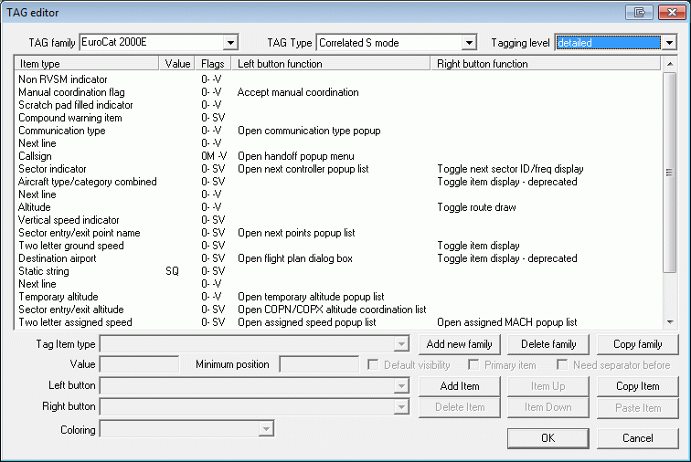

# TAG Editor

## TAG Families

In EuroScope the TAGs are not fixed at all. It is up to the user what he/she would like to see on the radar screen. To define your own TAG displays you should add and edit TAG families. You should define each members of the family, then you can assign the whole family to the layout settings (ASR) files. TAG family is a set of eight TAG definitions:

- Primary only - When only a primary radar contract is detected. This means that the transponder is off.
- Uncorrelated A+C mode - An A+C mode only transponder is active, but the radar target has no correlated flight plan data.
- Uncorrelated S mode - An S mode transponder is active, but the radar target has no correlated flight plan data.
- Correlated A+C mode - An A+C mode only transponder is active, and the radar target has a correlated flight plan.
- Correlated S mode - An S mode transponder is active, and the radar target has a correlated flight plan.
- Flight plan track - When the system moves the flight plan based on external data, but no radar target associated with it.
- Ground S mode - Ground radar with S mode transponders.
- Ground no radar - When no radar at all and the controller can see the planes only by looking out of the window.

Each of the above family members may have three different levels of display:

- Untagged - This is used for aircraft that are not considered by the controller. This type should be as compact as possible, but should contain information enough to provide safe separation. In EuroScope a doubleclick on the TAG will tag it up or down.
- Tagged - This is the normal TAG used for aircraft tracked or considered. It contains far more information therefore needs a little bit more space. Yo can not tag down TAGs that are tracked by you or a handoff initiated to you. All the rest can be down. In the real life Matias system even the concerned aircraft TAG can not be moved to down, but as we have a smaller screen I let it be switched on or off. So if you are a real fun of Matias never let it go down.
- Detailed - Even if the /Tagged up/ TAGs can contain more information still has something that is not necessary always but handy to have it very fast. For that a /Detailed/ TAG member is invented. When you are moving your mouse as you are over a /Tagged up/ TAG it will change to /Detailed/ and you will see even more information about the aircraft. At one time only one TAG can be detailed. And on a detailed TAG you can have several function connected to the part of the TAG.

You must completely define all 8×3=24 TAGs in the family before using it. Also note that the first eight type of TAGs may have less information then available in EuroScope. It is up to you to define only the amount that is really available at that case. As correlation is really deeply coded in EuroScope you can not break the correlated, not correlated boundary, but otherwise the system does not warn you if you display some information that is not available in the real systems.

## How A TAG Is Built Up

Every TAG in EuroScope is built up from TAG items. The available TAG items are defined by the system. All such item has a piece of code that calculates the actual string to be displayed every time. There are items that always have content they are never empty but there can be ones that are sometimes empty and display nothing. There is a special item, the "Next line" item that never displays anything but creates a new line. So that the only thing that you should do is to make a list of these items and it will form a TAG that can be displayed. The following TAG items are defined at this moment in EuroScope:

- Aircraft category - The weight turbulence category of the aircraft. The actual symbols can be modified via the [[General Settings]] dialog.
- Aircraft category with slash - The same as the above one, but starts with a / letter.
- Aircraft type - The sort name of the aircraft type.
- Aircraft type - deprecated - The same as above but can be switched on/off in tagged up TAG. This function is outdated and should no longer be used. It is kept only for compatibility with TAGs created using an old version.
- Aircraft type/category combined - It is a combination of the type and the category separated by a slash. Use it if you would like to hide/show them at once.
- Aircraft type/category combined - deprecated - The same as above but can be switched on/off in tagged up TAG. This function is outdated and should no longer be used. It is kept only for compatibility with TAGs created using an old version.
- Airline name - This item displays the 3 letters airline name according to the ICAO_Airlines datafile.
- Altitude - The actual altitude of the aircraft. Over the set transition level it displays the value in three digits (e.g.: 310, 050), below the transition level it assigns an A (for altitude) and displays two or three numbers (e.g.: A55, A06, A110). The A can be switched off via the [[General Settings]] dialog.
- Assigned departure order - When the plane is assigned to be departed soon it receives a departure order number. This number is displayed in the item (it is rarely used in the TAG itself, but on the advanced aircraft lists).
- Assigned heading - Assigned heading is an attribute of the aircraft. It indicates the heading given to it by the controller. It can be set in EuroScope but not published via the network so far. If no heading is assigned then a static string AHDG is displayed. Otherwise an H plus the heading in three digits (e.g.: H110). This item can also display the content of the scratch pad in case the content is a waypoint along the route in the flight plan (from 2.8h version any valid waypoint)(e.g.: VEBOS)
- Assigned heading (if set) - The same as above but not shown if no heading is assigned.
- Assigned rate - Assigned rate is an attribute of the aircraft. It indicates the climb or descent rate give to it by the controller. It can be set in EuroScope but not published via the network so far. If no rate is assigned then a static string ARC is displayed. If rate is assigned than an R followed by the signed rate value is visible (e.g.: R1500).
- Assigned rate (if set) - The same as above but not shown if no rate is assigned.
- Assigned runway - The assigned departure or arrival runway. The runway can be assigned by the controller, but can be calculated by EuroScope from route, SID/STAR and active runways.
- Assigned SID - The assigned standard departure route. The SID can be assigned by the controller, but can be calculated by EuroScope from route and active runways.
- Assigned speed - Assigned speed is an attribute of the aircraft. It indicates the speed give to it by the controller. It can be set in EuroScope but not published via the network so far. If no speed is assigned then a static string ASP is displayed. If rate is assigned than an S followed by the value is visible (e.g.: S160).
- Assigned speed (if set) - The same as above but not shown if no speed is assigned.
- Assigned squawk - The squawk assigned by the controller.
- Assigned STAR - The assigned standard arrival route. The STAR can be assigned by the controller, but can be calculated by EuroScope from route and active runways.
- Callsign - The callsign of the aircraft. It is never empty and most cases used as primary/main item (see later).
- CLAM warning - The stand alone Cleared Route Adherence Monitoring warning. A static CLAM string when the pilot does not follow the altitude restrictions.
- Clearence received flag - It indicates if the plane has received the clearence flag or not.
- Collision alert indicator - This item is normally empty. But if short term conflict alert is switched on and there are two aircraft closing to break the separation rules defined at [[Conflict Alert Settings Dialog]], it shows the warning: Red point - if the separation will be broken in the defined pre warning time. Red number with the minimum vertical distance - if the separation will be broken in the defined warning time. Yellow point - if the separation will be broken only in case the cleared levels are not maintained by the pilots in the defined pre warning time. Yellow number with the minimum vertical distance - if the separation will be broken only in case the cleared levels are not maintained by the pilots in the defined warning time.
- Communication type - The type of the communication the aircraft is able. The well known /t or /r will be displayed. Note that /v is never displayed by EuroScope as voice is the main form of communication in VATSIM. If the plane is voiceable two SPACE chars are displayed to have a place to popup the communication type menu. If the type can not be extracted from the remark field a /? is shown.
- Communication type (reduced) - The same as the above, but voice communication is really empty there. In that case it will not be possible to popup the selection menu from this item. We suggest using it on the tagged type but not in the detailed.
- Compound warning item - This item combines the following warning flags in this priority order: Emergency indicator MSAW indicator Radio failure indicator Hijack indicator Collision alert Squawk error Duplicated squawk flag CLAM/RAM warning
- Conflicting AC callsign - When the MDCA tool detects a conflict, it saves the callsign of the other AC. It is used in the CARD list.
- Conflict end time - The detected conflict end time.
- Conflict start time - The detected conflict start time.
- Conflict type - The detected conflict type: "'WARN"' or "'ALERT"'.
- Departure aerodrome - The departure airport extracted from the flight plan.
- Destination airport - The destination airport extracted from the flight plan.
- Destination airport - deprecated - The same as above but can be switched on/off in tagged up TAG. This function is outdated and should no longer be used. It is kept only for compatibility with TAGs created using an old version.
- Destination ETA - Estimated time of arrival to destination airport.
- Direct to point name - If a direct is given to the specified aircraft then the name of the point can be displayed by this item.
- Duplicated squawk - If the assigned squawk is used by another aircraft then a static DUPE string. Otherwise empty.
- Emergency indicator - If the aircraft is squawking 7700 then a static EMG string. Otherwise empty.
- Estimate - This item shows the estimate to the relevant waypoint if set.
- Estimate (always) - The same as above but it shows a fix EST if no estimation is set. It is planned for detailed TAGs.
- Final altitude - The final cursing level/altitude defined by the flight plan and might be overwritten by the controller.
- FIR exit point - deprecated - The same as subsequent but can be switched on/off in tagged up TAG. This function is outdated and should no longer be used. It is kept only for compatibility with TAGs created using an old version.
- FIR exit point name - The name of the next point from the flight plan route that is defined as FIR exit point in the sector file extension. If no such point then it is empty.
- Flight Plan Track Status - This item displays the status of the flightplan track.
- Flight rule - The flight plan route I/V/S.
- Ground speed (with N) - The ground speed of the aircraft with an N letter in front.
- Ground speed (with N) - deprecated - The same as above but can be switched on/off in tagged up TAG. This function is outdated and should no longer be used. It is kept only for compatibility with TAGs created using an old version.
- Ground speed (without N) - The ground speed of the aircraft (just the numbers).
- Ground speed (without N) - deprecated - The same as above but can be switched on/off in tagged up TAG. This function is outdated and should no longer be used. It is kept only for compatibility with TAGs created using an old version.
- Ground status - The status of the aircraft in the departure sequence. The following values can be selected and displayed here: ST-UP - when startup is approved PUSH - when pushback is approved TAXI - when the plane is taxiing DEPA - when the plane is about to be departing
- Handoff target ID - The ID of the controller who has is targeted by a handoff request. This item is used rarely now as the Sector indicator does this work also.
- Hijack indicator - If the aircraft is squawking 7500 then a static HIJ string. Otherwise empty. It is inside the code even this squawk is not permitted on VATSIM.
- Holding List / Holding point name - This item is part of the Holding List Plugin and displays the name of the holding fix.
- Holding List / Holding time - This item is part of the Holding List Plugin and displays the time the aircraft is already holding over the holding fix.
- Holding List / Remaining holding time - This item is part of the Holding List Plugin and displays the remaining planned holding time for the aircraft.
- Manual coordination flag - A telephone symbol, that indicates when something needs to be coordinated with an adjacent controller who uses a client that does not support the ongoing coordination feature.
- MSAW flag - Minimum safe altitude warning indicator. Normally empty, but if the plane is inside an MSAW area (see [[ESE Files Description]]), the the static MSAW text.
- Next line - It is a special item. It never displays anything but starts a new line in the TAG. TAGs are always left justified.
- Next line if not empty - The same as the previous but it starts a new line only if the current line is not empty. Using this you can be sure that no empty lines are displayed in the TAG.
- Non RVSM indicator - When an IFR plane that does not indicate RVS equipment in the plane type a static W is displayed. Otherwise it is empty.
- Not cleared or not reached temporary altitude - This is the sector exit or (if not given) the final altitude. If different from temporary, then displayed by three digits 150 or 050. If same as temporary but the aircraft is not at this level then an extra space is added to the beginning. Otherwise empty.
- Not cleared sector entry/exit altitude - It is a combined tag item. If the plane is coming into your sector then sector entry level/altitude is displayed. If inside your sector then the sector exit level/altitude. If the sector entry/exit level is not defined then the requested level is displayed here. This item is changing the color on coordinated values.
- Not reached temporary altitude - It is the temporary or if not set the final altitude. It is displayed only if it is different from the actual level/altitude. If it is reached then empty.
- Owner - The ID of the controller currently tracking the plane. It is an obsolete item. Use the Sector indicator instead.
- Radio failure indicator - If the aircraft is squawking 7600 then a static RDO string. Otherwise empty.
- RAM warning - If the aircraft is more than 5nm away from its calculated route, the RAM warning is shown. RAM is not shown if the plane is on the ground or cleared for approach, has a direct to point or assigned heading. And not shown for VFR plans.
- RVSM indicator - It indicates that the plane is equipped to be able to fly in RVSM airspace. The symbol is strikethrough W. If the plane is non RVSM able then empty.
- Scratch pad filled indicator - If the aircraft scratch pad is not empty a static I string. Otherwise empty. Do not forget that if the content of the scratch pad is a name of a waypoint then the scratch pad itself is considered as empty.
- Scratch pad - The content of the scratch pad if not empty. Once again if the content of the scratch pad is a name of a waypoint then the scratch pad itself is considered as empty.
- Scratch pad (always) - Same as above, but item is always visible. If empty then a static TXT is shown.
- Sector entry point name - The point name along the flight plan route of an aircraft where it should enter the sector. The definition of the sector entry points is once again an extension to the original sector file.
- Sector entry/exit altitude - The altitude where the aircraft should be (as described by the standard procedures) when entering or exiting the sector of the controller who is currently tracking. If no such point is defined in the sector extension file then the final cruising altitude is displayed.
- Sector entry/exit point name - The point name along the flight plan route of an aircraft where it should enter or leave the sector. The definition of the sector entry/exit points is once again an extension to the original sector file.
- Sector exit level - The flightlevel/altitude at which the aircraft is supposed to leave the sector.
- Sector exit point name - The point name along the flight plan route of an aircraft where it should leave the sector. The definition of the sector exit points is once again an extension to the original sector file.
- Sector exit time - The estimated time over the sector exit point. Be careful if you coordinate a point that is far from the sector border, this value might be different from the actual sector exit time.
- Sector indicator - It is a compound item and can show several things. If the aircraft is not tracked by you then is simply shows the current owner ID. -- stands for a non-tracked aircraft. If the aircraft is tracked by you then it calculates which sector is the next along the route and displays the ID of the next controller if he/she is online. There can be -- also if no next sector is defined or the next sector is not controlled (no controller online). When the aircraft within three minutes time to the sector border the next controller ID is changed to the primary frequency. E.g.: AP, BU, NED, 133.20, --.
- Sector indicator (unchangable) - Same as above, but can't be changed by the controller.
- Sector planned entry level - The flightlevel/altitude at which the aircraft is going to enter the sector based on the flightplan.
- Sector planned entry time - The time at which the aircraft is over the planned entry point. Be careful if you coordinate a point that is far from the sector border, this value might be different from the actual sector entry time.
- Simulation indicator - Available only in SweatBox connections. It shows the ID of the pseudo pilot of the plane in brackets {} If you are the pseudo pilot then a * is shown.
- Simulation next waypoint - Available only in SweatBox connections. It shows the name of the next waypoint of the plane. If holding, then H:<holding name>.
- Squawk - The squawk code sending by the aircraft. As it is never empty it is once again a good item to be primary.
- Squawk error indicator - This item is normally empty. But if the squawk sending by the aircraft differs from the assigned squawk it displays an A then the assigned squawk. E.g.: A2602.
- Squawk/callsign - This item shows the squawk of an aircraft unless it is tracked. Then it changes to the callsign of the aircraft. This is very handy to create tiny compact TAGs.
- Static string - It is up to the designer. If you need a static string in the TAG you can add an item like this and specify the text itself. EuroScope does nothing with it just displays.
- Temporary altitude - The assigned temporary altitude. If not set then the assigned final altitude is displayed. Above transition level it is displayed with 3 digits (e.g.: 170, 050), below the transition level it is displayed with an A followed by two or three digits (e.g.: A50, A100).
- Temporary altitude (if set) - Same as above, but hidden if no temporary altitude is set.
- Temporary if different from sector exit - The temporary altitude if set and if different from the sector exit. Otherwise it is empty.
- Tracking controller ID - It is the ID of the controller who is currently tracking the aircraft. It is no more used since the Sector indicator is developed.
- TSSR text - It is a simple static text but built in. For non-squawking aircraft display.
- Two letter assigned speed - Assigned speed is an attribute of the aircraft. It indicates the speed that were given to it by the controller. It is published by a special scratch pad string, that can be interpreted by other EuroScope clients. If no speed is assigned then a static string ASP is displayed. If speed is assigned than an S followed by the first to digits of the value is visible (e.g.: S16).
- Two letter assigned speed (if set) - Same as above, but only visible if a speed is assigned.
- Two letter ground speed - The ground speed of the aircraft with only the first two digits indicated.
- Two letter ground speed - deprecated - The same as above but can be switched on/off in tagged up TAG. This function is outdated and should no longer be used. It is kept only for compatibility with TAGs created using an old version.
- Vertical speed - This is the actual vertical speed value. It is displayed only if climb rate or descending rate is bigger than 100 f/minute. It displays the absolute value without direction sign. The value is the 100th of the actual rate displayed to zero decimal digit (e.g.: 1 - 100 f/minute, 25 - 2500 f/minute). Its value is really far from exact due to the random position updates coming from the planes.
- Vertical speed indicator - It is a small arrow to the UP or DOWN depending on the vertical speed. It is displayed only if the climb rate or descending rate is bigger than 100 f/minute. If you do not have the right EuroScope font installed you will see ^ and | in place of the arrow.

Note: If you have a plug-in loaded that supports additional TAG items, then these items will appear in the list too.

## Functions From TAG

You are able to change not only the outlook of the TAG but also the behavior. It can be done by assigning functions to TAG items. Each TAG item may have a function associated with the left mouse button click or the right (works for middle too) mouse click. The functions are available only on the detailed TAG. You can assign the following functions:

- Accept manual coordination - This function needs to be assigned to the Manual coordination flag to confirm the manual coordination and hide the manual coordination flag itself.
- Conflict detection tool - It shows the conflict detection for the selected AC. It shows the route with different colors for conflicted paths. It dims all other AC except the conflicting ones. It works a bit different way then the others, as the display is only active while the button is down.
- Conflict detection tool for two planes - It shows the conflict detection between two selected AC. As there are two planes associated with the CARD list only, it has no meaning to assign this function to other than items in that list. It shows the conflict lines as the previous command, but limited to the two planes only.
- Edit scratch pad string - This function adds a text entry box to change the text in the scratch pad. It is not available if someone else is tracking the aircraft.
- Holding List / Holding name editor - This function is part of the Holding List plugin and allows you to change the holding name for the aircraft.
- Holding List / Holding time popup - This function is part of the Holding List plugin and allows you to set the expected holding time for the aircraft.
- Open assigned heading popup list - This function pops up a list with the possible heading values to be assigned. It has no real meaning to add this function other than the assigned heading item. This function is not available if someone else is tracking the aircraft.
- Open assigned MACH popup list - This function pops up a list with the possible mach numbers to be assigned. It has no real meaning to add this function other than the assigned speed item. This function is not available if someone else is tracking the aircraft.
- Open assigned rate popup list - This function pops up a list with the possible climb or descent rate values to be assigned. It has no real meaning to add this function other than the assigned rate item. This function is not available if someone else is tracking the aircraft.
- Open assigned speed popup list - This function pops up a list with the possible speed (IAS) values to be assigned. It has no real meaning to add this function other than the assigned speed item. This function is not available if someone else is tracking the aircraft.
- Open communication type popup - Assigned to the communication type item, this function allows you to change the communication type of the aircraft as you would do it using F9. This function is not available if someone else is tracking the aircraft.
- Open COPN altitude coordination list - This function is part of the ongoing coordination feature and allows you to coordinate an altitude at which an aircraft shall enter your sector from the previous controller. This function is not available if the plane is not coming to your sector or if it has no owner.
- Open COPN point coordination list - This function is part of the ongoing coordination feature and allows you to coordinate a different routing an aircraft shall enter your sector with the previous controller. This works similar to giving a direct, the only difference is, that the direct is a recommendation to the other controller that he accept or refuse. This function is not available if the plane is not coming to your sector or if it has no owner.
- Open COPN/COPX altitude coordination list - This function is part of the ongoing coordination feature and allows you to coordinate an altitude at which an aircraft shall enter or exit your sector with adjacent controllers. You can use it to assign direct points within your sector. If the plane has owner ans is going to come to your sector then it opens the COPN point list. If you are tracking the AC the it opens the COPX point list. In that list all points are masked if it is going to start a coordination and with which controller or not.
- Open COPX altitude coordination list - This function is part of the ongoing coordination feature and allows you to coordinate an altitude at which an aircraft shall leave your sector with adjacent controllers. This function is not available if someone else is tracking the aircraft.
- Open COPX point coordination list - This function is part of the ongoing coordination feature and allows you to coordinate a different routing an aircraft shall leave your sector on with adjacent controllers. This works similar to giving a direct, the only difference is, that the direct is a recommendation to the other controller that he accept or refuse. If you select the point with LEFT click it sets the direct or starts the coordination according with the flags. Using the RIGHT button you can assign direct point beyond the sector exit.
- Open correlate popup - This function is part of Professional Radar Mode and allows you to correlate a radar track and a flightplan track.
- Open estimate popup - This function is part of Professional Radar Mode and allows you to set the estimate crossing time for the aircraft over a waypoint. It is a free text box. The entered value must be in a / format, where the time is a 4 letter ZULU time. Eg. ARSIN/0322.
- Open final altitude popup list - This function pops up a list with the possible final altitude values to be assigned. It has no real meaning to add this function other than the final altitude item. This function is not available if someone else is tracking the aircraft.
- Open flight plan dialog box - This function opens up the flight plan setting dialog box. This function is always available even if someone else is tracking the aircraft. But in that case you will not bale to save changes made in the plan.
- Open FP track status popup - This function allows you to edit the state of the current flightplan track.
- Open ground status popup list - This function pops up a list with the possible ground states ST-UP, PUSH, TAXI, DEPA to be assigned. It has no real meaning to add this function other than the ground status item.
- Open handoff popup menu - This function pops up a menu that allows you to start tracking, to drop track or initiate a handoff to another controller. There are several cases when different items are displayed in this menu: The plane has no owner - In this case you can start tracking it by selecting Assume. Here Refuse has no meaning. A handoff is initiated to you - In this case the menu contains items to Assume or to Refuse the handoff. You are tracking the AC - Then this popup menu the Drop track and the Manual handoff is always available. Selecting the first item will drop the aircraft tracking while the second will pop up another list that contains all online controllers within range. If the sector file extension is prepared and so the next sector can be detected and the controller is online then a simple Handoff menu item appears that will initiate a handoff to the controller calculated by EuroScope.
- Open next controller popup list - This function opens a list with the currently online active controllers, which you can use to override the automatically selected next controller indicated in the Sector indicator item. This function is not available if someone else is tracking the aircraft.
- Open next points popup list - This function opens the same point as the Open COPX point coordination list.
- Open RWY setup popup list - When the plane is on the ground at the departure airport then this function opens a popup list that contains the list of the available runways of the airport. Otherwise the list contains the arrival airport runway list. When you select an item here the FP is amended to hold information about the departure or arrival RWY.
- Open SID setup popup list - It opens a popup menu with the available departure routes. If there is an assigned departure runway then the list contains the SIDs connected to the runway only. When you select an item here the FP is amended to hold information about the departure route.
- Open SQUAWK setup popup list - It opens a popup that holds two items. One is for automatic SQ assignment and another for manual. In that case you can manually enter the SQ value.
- Open STAR setup popup list - It opens a popup menu with the available arrival routes. If there is an assigned arrival runway then the list contains the STARs connected to the runway only. When you select an item here the FP is amended to hold information about the arrival route.
- Open temporary altitude popup list - This function pops up a list with the possible temporary values to be assigned. It has no real meaning to add this function other than the temporary altitude item. This function is not available if someone else is tracking the aircraft.
- Set clearance received flag - This function sets or clears the clearance received flag. It has no real meaning to add this function other than the clearance received item.
- Simulation popup - Available on SweatBox simulations only. It shows the following simulator commands (depending on the actual state): Get simulation Transfer simulation to another pseudo pilot
- Simulator holdings popup - Available on SweatBox simulations only. It shows a list of the defined holdings to select and enter to it.
- Simulator land and vacate popup - Available on SweatBox simulations only. It shows the following simulator commands (depending on the actual state): ILS stop on the RWY ILS vacate left ILS vacate right ILS touch and go ILS low pass at 50-200 ft
- Simulator next waypoints popup - Available on SweatBox simulations only. It shows a list with the next waypoints to proceed to.
- Simulator takeoff popup - Available on SweatBox simulations only. It shows the following simulator commands (depending on the actual state): Line up Takeoff Abort takeoff Go around
- Simulator taxi behind me - Available on SweatBox simulations only. It allows the pseudo pilot to select another AC to taxi behind it.
- Simulator taxi popup - Available on SweatBox simulations only. It shows the following simulator commands (depending on the actual state): Pushback New taxi route Hold position Continue taxiing
- Toggle item display - This function switches on/off the display of the respective item.
- Toggle item display - deprecated - Those functions are old item specific switches that should no longer be used and are only kept for compatibility with TAGs created under the old version.
- Toggle next sector ID/freq display - This function switches between the ID or the frequency of the next controller. It has no real meaning to add this function other than the sector indicator item.
- Toggle route draw - This function switches on/off the display of the calculated route track of the aircraft. It also displays the estimated time of arrival to each point.
- Toggle route prediction points draw - This function switches single/all/off the display point/altitude pairs EuroScope is uses for sector prediction. Use this function as a debugger tool to see why a sector is indicated as next. At first click it shows the points when the sector owner is changing. At second it shows all predicted points. Third click hides the display.
- Track an aircraft - This is a quick start tracking of untracked aircraft.

Note: If you have a plug-in loaded that supports additional TAG functions, then these items will appear in the list too.

## Editing The TAGs

The following dialog box helps you creating new or modifying existing TAGs, TAG families.

<figure>
    
    <figcaption>Fig.  - p.128</figcaption>
</figure>

The built in Matias family can not be modified. It is hard coded into EuroScope and will be rebuilt at every startup. In reality when the system is up it works the very same way as a user defined family. To create your own TAGs you always have to build a complete family. When ready and saved you can select your family in the [[Display Settings]] dialog and save it to the ASR file. In this way the system will remember what TAGs to be used for what display layout. The elements and functions of the editor dialog box:

- TAG Family - In this dropdown list you can switch between your TAG families. It is also used to rename the current family. You can edit the name of the built-in TAG, but it will be ignored on saving.
- TAG Type - This dropdown list is used to toggle between the eight types of the TAGs in the family, dependent on radar identification state. You should define all types to be able to save the family.
- Tagging level - With this dropdown list you can chose the tagging state to edit.
- The item list - Major part of the dialog box is the item list defined for the specified family ans type. If yo select an item here then its data is copied to the controls below and you can change the data there. The order of the items is extremely important as EuroScope will display them in the way it founds them in this list.
- Tag Item type - With this dropdown list you can change the selected item in the list.
- Value editor - This editor is available only if a "free text item" is selected. In this case you can write the string itsef to here.
- Minimum position - You can define the minimum position of the TAG item, counting from the left border to the right. Maximum value is 50.
- Default Visibility check-box - This settings triggers if the item should be visible by default.
- Primary item check-box - The primary item plays an important role in the TAG definition. The line from the aircraft position will point to the center of this item. If the primary item is not visible then no way to connect the TAG with the aircraft position and you will be lost. So select an item the is always visible (squawk, callsign, TSSR etc.). Of course only one primary item can be defined for one TAG. It mark is an "'M"' (:)) letter in the "Flags" column.
- Need separator before check-box - This check box indicates the a space will be added before this item if the current line is not empty so far. That makes it a little bit easier to have some spacing between items.
- Left and Right button function dropdown list - With these combo boxes you can define the function you would like to have when clicking on the item. It is available only for detailed TAGs.
- Coloring dropdown list - You can assign different colors to TAG items. Those colors match the relevant datablock items in the [[Symbology Settings]] dialog.
- OK button - Nothing to say. Saves your edit and closes the dialog. Some tests are executed before saving the TAGs and you may receive error message if something is wrong (e.g.: no primary item selected for a TAG).
- Cancel button - It closes the dialog and discards all changes yo have made.
- Add new family button - It inserts a completely empty family to the system. You can use it if you want to start from a clean paper.
- Copy family button - It copies the content of the selected TAG family into a new name. You can use it if you just want a family that is a little bit different from another.
- Delete family button - Stands for its name. It deletes a family. Of course the built-in family can not be deleted.
- Add Item button - It inserts a new item to the list. If no selected item then it is placed as last. If there is a selected then it will be placed just before the selected. You can immediately start editing it by the bottom controls.
- Delete Item button - It simply deletes the selected item from the list.
- Item Up button - With it you can move your item one up in the list. Sorry I was lazy to write the real drag-and-drop.
- Item Down button - With it you can move your item one down in the list. Sorry again I was lazy to write the real drag-and-drop.
