# Tags

## TAGs in general

An aircraft is shown on the screen as a radar target or flight plan track, and an associated TAG, that shows the controller relevant and available information on the aircraft's situation and flight. In EuroScope, you always have the possibility to customize the outlook and/or the behavior of all TAG items. For further information on customizing the TAGs, see the [[TAG Editor]] page.

## TAG types

As EuroScope simulates the different radar modes it has the chance to show only that amount of information that would be available for the controller at a specific circumstance - even EuroScope always have all information ready due to the nature of VATSIM. Every TAG family has eight different TAG types:

- Primary only - When the transponder is in stand-by mode.
- Uncorrelated A+C mode - When the transponder returns A+C mode data, but there is no correlated flight plan data.
- Uncorrelated S mode - When the transponder returns S mode data, but there is no correlated flight plan data.
- Correlated A+C mode - When the transponder returns A+C mode data and there is a correlated flight plan.
- Correlated S mode - When the transponder returns S mode data and there is a correlated flight plan.
- Flight plan track - When the system calculates positions based on previous data and flight plan, but there is no correlated radar target.
- Ground S mode - In ground mode, when S mode transponder return is available.
- Ground no radar - When no radar at all and we simulate the situation that the controller is just looking out of the window (airline name and aircraft type is available only).

The TAG types correlate with the radar identification state of the aircraft. For further information on this topic, refer to the [[Professional Radar Simulation]] page. Every TAG type has three different states:

- Untagged
- Tagged
- Detailed

Those TAG states correlate with the current usage state of the aircraft on the controller's system. For further information on TAG states, refer to the [[TAG Editor]] page.

## Default Matias TAGs

EuroScope comes with the default and unchangeable Matias TAG family. It really closely simulates the version used by the real Hungarian ANS's system - Matias contains a very rich set of relevant information and is rather similar to what is also used in other real-world workstations, e.g. on Eurocat models. Still, if you want to simulate a different system, you are free to do so.

## Detailed

The Detailed TAG comes visible when you move the mouse over a Tagged TAG. At one time only one TAG can be detailed. And this type has many functions connected to special parts of it.

<figure>
    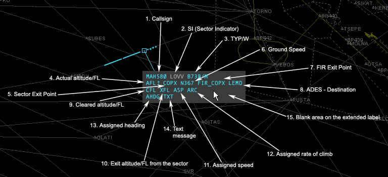
    <figcaption>Fig.  - p.105</figcaption>
</figure>

1. Callsign - It displays the callsign of the aircraft When you are tracking the aircraft there is a popup menu available with left button that allows you to transfer it:

<figure>
    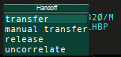
    <figcaption>Fig.  - p.105</figcaption>
</figure>

<figure>
    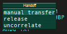
    <figcaption>Fig.  - p.106</figcaption>
</figure>

<figure>
    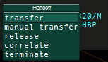
    <figcaption>Fig.  - p.106</figcaption>
</figure>

The first list comes up if there is a controller who is controlling the sector just after yours. The second list is missing the transfer command when no next controller is detected. The third picture show the same menu when clicking on a flight plan track only with no correlated radar target. The functions are the followings:

- transfer - initiates a handoff to the controller next to your sector.
- manual transfer - pops up another list with all the available controllers; select one from the list and a handoff is initiated to him/her.
- release - simple drops the aircraft.
- uncorrelate - uncorrelate the radar target from the flight plan.
- correlate - start correlating the flight plan with a radar target.
- terminate - terminate the flight plan simulation.

When another controller has initiated a handoff to you then another popup menu is available (the first picture displays the initiated handoff):

<figure>
    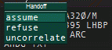
    <figcaption>Fig.  - p.106</figcaption>
</figure>

- assume - accept handoff.
- refuse - refuse handoff.
- uncorrelate - is still available here as well.

2. Sector Indicator - indicates the current or the next sector controller When you are not tracking the aircraft it simply indicates the controller who is tracking it. "--" means no controller owns it. If no owner of the aircraft at all then a left click here starts tracking it. When you are tracking the aircraft it indicates the controller of the next sector. If no online controller who is controlling the next sector then a "--" will appear here. By right button click the controller short ID can be changed to the primary frequency. EuroScope will change the ID to frequency automatically when the aircraft is within 3 minutes to the borderline. You have the chance to override the next controller calculated by EuroScope. Click with the left button on the sector indicator. It opens a popup menu with the reachable controllers. Select one from the list. It will be assumed as next controller independently what sectors are next. The overridden controller is flagged by accepted ongoing coordination color. Select reset to allow EuroScope to detect the next controller based on route and sectors. You also have the possibility to delete next controller by selecting UNICOM.

<figure>
    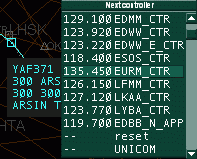
    <figcaption>Fig.  - p.107</figcaption>
</figure>

<figure>
    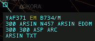
    <figcaption>Fig.  - p.108</figcaption>
</figure>

3. Aircraft type - the type of the aircraft coming from the flight plan By clicking on it with the right button you can toggle its display in the Tagged TAG.The type is followed by the aircraft category sign (by default /H or /M or /L or /J) and the communication type (/r or /t or /?) is here also. Note that from version 3.0 EuroScope never displays the /v as voice is the default communication form on VATSIM and we would like to save spaces. Only the different or unidentified types are flagged. To set the communication type just click on the sign (there are to spaces in the detailed TAG for /v types that allows the mouse clicks). Then a popup menu appears to select the right type.

<figure>
    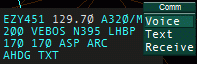
    <figcaption>Fig.  - p.108</figcaption>
</figure>

4. Actual altitude/FL - the actual altitude or flight level of the aircraft Below transition altitude an A letter ()the letter itself is optional) is followed by two or three digits (the altitude value in 100 feet)(A50 or A05 or A115). Above transition altitude the flight level is displayed with three digits (050 or 380). The actual altitude/flight level value may be followed by an arrow pointing up or down. The arrow indicates the altitude change direction (climb or descent). With right button click it toggles the route display of the aircraft. 5. Sector entry/exit point - the next coordination point along the route The coordination points are defined in the EuroScope Sector Extension file (see: [[ESE Files Description]]). If a controller owns both sectors of the coordination point then that one is ignored and the next one will be displayed. In this picture I am Budapest Radar and no approach is online. Therefore the coordination point over VEBOS is not active as I control both sectors. Only the final approach fix from the south (FAPS) is effective as TWR is online.

<figure>
    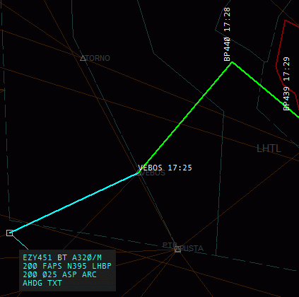
    <figcaption>Fig.  - p.109</figcaption>
</figure>

In the next picture Budapest Approach comes online. Therefore coordination point VEBOS becomes active.

<figure>
    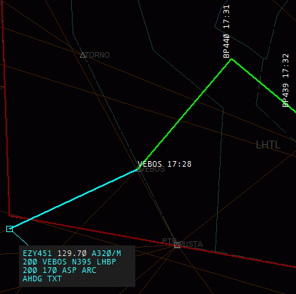
    <figcaption>Fig.  - p.110</figcaption>
</figure>

By a left click on this piece you can select a direct point for the AC. If the selected point is inside the sector of next controller then it initiates an entry or exit point coordination with the previous or the next sector controller. Detailed information about the ongoing coordination can be found in the [[Controller To Controller Communication]] page. 6. Ground speed - the ground speed of the aircraft The format is a letter N (optional) then the ground speed value. By clicking on it with the right button you can toggle its display in the Tagged TAG. 7. FIR exit point - the coordination point along the route where the aircraft leaves the actual FIR The definition of the FIR exit point is similar to the sector exit point. By clicking on it with the right button you can toggle its display in the Tagged TAG. 8. Destination - the ICAO code of the destination airport A left button click on this item opens the [[Flight Plan Setting Dialog]] where you can amend the flight plan. By clicking on it with the right button you can toggle its display in the "Tagged" TAG. 9. Cleared altitude/FL - the altitude or flight level cleared to be reached That is actually the temporary altitude in VATSIM. A left click on this item opens a popup menu with a list of the altitudes and flight levels from ground to FL610. If the aircraft has cleared flight level then it will be selected. Just select one and it will be assigned to the aircraft.

<figure>
    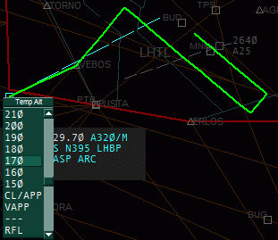
    <figcaption>Fig.  - p.111</figcaption>
</figure>

There are four special elements in this popup list:

- CL/APP - select this items to indicate that the AC is cleared for ILS approach.
- VAPP - select this items to indicate that the AC is cleared for a visual approach.
- -- - this selection clears the temporary altitude setting the final as cleared.
- RFL - this popup menu will open another popup menu that allows you to change the requested flight level/altitude.

<figure>
    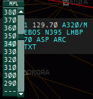
    <figcaption>Fig.  - p.111</figcaption>
</figure>

Note the following behaviors:

- The actual flight level/altitude is selected as default value.
- If you enable Show conflict tool on temporary altitude settings then clicking on this item the system shows up the conflict detection tool, and re scans the possible conflicts whenever you move the mouse to another level/altitude value. You can find more information about it in the [[Probing tools]] page.

Important: When you are the pseudo pilot of the plane in a simulation session, setting the cleared level via the popup menu will drive the simulated aircraft to the specified altitude. 10. Exit altitude/FL from the sector - the coordinated altitude or flight level at the next coordination point If no such point defined then the final cruising altitude. See the pictures again from the sector exit point description. In this picture no approach is online. Therefore no COPX point is active and you can see the final requested level (FL340) there. Conflict detection tool can be activated at a particular aircraft by a hold right-click. It shows the selected plane and all conflicting ones with color coding (yellow for warnings and red for alerts). The tool will not show conflicts when the calculated profile is below the minimum. When approach is online then the coordination point is VEBOS and the coordination altitude is FL170. Clicking on this item with left button the sector entry/exit point altitude popup opens up that allows a coordination with the previous or the next sector controller. Detailed information about the ongoing coordination can be found in the [[Controller To Controller Communication]] page. 11. Assigned speed - the speed assigned to the aircraft If no speed is assigned then a static string ASP . If has an assigned IAS then a letter S then the assigned speed. If a Mach number is set then a M then the assigned Mach. With a left click you can open a popup list with the available values from 120-400. With a right click the Mach values are popped up from 0.60 to 1.00. Select the one to be used. To clear it select the item with "-". Assigned speed/Mach number is propagated to other controllers via scratch pad text in a form SXXX or MXXX. If the other controller uses EuroScope too this type of scratch pad text will be recognized as assigned speed.

<figure>
    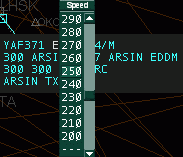
    <figcaption>Fig.  - p.113</figcaption>
</figure>

<figure>
    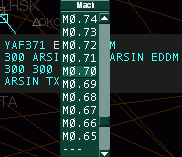
    <figcaption>Fig.  - p.113</figcaption>
</figure>

Important: When you are the pseudo pilot of the plane in a simulation session, setting the assigned speed will drive the simulated aircraft to the specified speed. 12. Assigned rate of climb/descend - the assigned rate of climb or descend to the aircraft. If no rate is assigned then a static string ARC otherwise a letter R then the assigned rate. Similarly to the assigned speed you can select the rate values from the popup list. Assigned rate is propagated to other controllers via scratch pad text in a form RXXXX. If the other controller uses EuroScope too this type of scratch pad text will be recognized as assigned rate. 13. Assigned heading - the assigned heading to the aircraft. If no heading is assigned then a static string AHDG otherwise a letter H then the assigned heading. Similarly to the assigned speed you can select the rate values from the popup list. Assigned heading is propagated to other controllers via scratch pad text in a form HXXX. If the other controller uses EuroScope too this type of scratch pad text will be recognized as assigned rate. When the aircraft is directed to a waypoint using the popup list from /sector exit point/ then the name of the point will be visible here. Heading can also be assigned on the tag by dragging the AHDG item. Required heading value is being set by moving the cursor to the wanted direction, the program draws the expected track of the plane during the item is being dragged. When defining a heading on this way, turning circle is also used and calculated automatically.

<figure>
    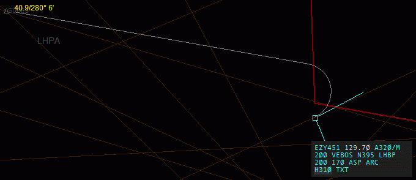
    <figcaption>Fig.  - p.114</figcaption>
</figure>

Important: When you are the pseudo pilot of the plane in a simulation session, setting the assigned heading will drive the simulated aircraft to the specified heading. In this case it is really important to be able to turn the aircraft to the left or to the right. For that the list contains the values from -360 degrees to +360 degrees from the actual heading. Dragging the item (AHDG) will set the specified heading for the simulator too. 14. Text message - the scratch pad Note that if the scratch pad is recognized by EuroScope then the scratch pad remains empty and the appropriate other item is changed. On the other hand if the scratch pad is not empty a static letter I is displayed over the first line. The length of the scratch pad is limited to 60 chars only, but be careful with long texts as other radar clients are limited to 3 or 4 characters only. By clicking on the scratch pad area in the TAG the message itself can be edited there.

<figure>
    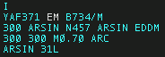
    <figcaption>Fig.  - p.114</figcaption>
</figure>

<figure>
    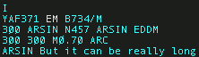
    <figcaption>Fig.  - p.114</figcaption>
</figure>

<figure>
    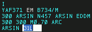
    <figcaption>Fig.  - p.114</figcaption>
</figure>

Tagged The tagged TAG is similar to the detailed but contains less information. The following items are not visible at all:

- assigned speed
- assigned rate
- assigned heading - only if heading is assigned, but if a direct to waypoint is specified then it is visible
- scratch pad

There are also items that can be switched to be displayed or to be hidden. You can switch the following items by a right click:

- aircraft type
- ground speed
- FIR exit point
- destination airport

The altitude display is also different. The logic behind is to display only the values that are different from the other ones. In this way when all three values (actual, cleared/temporary and coordinated/final) are the same then only the actual altitude is displayed. When the cleared/temporary is not defined or equals to coordinated/final, then only the coordinated/final is displayed. And to be easily visible the coordinated/final altitude is not displayed at the beginning of the line but one letter to the right. And finally of course if all three are different (or even if temporary and actual are the same) then all three values are displayed.

## Untagged

The untagged TAG is a really compressed with limited data available. Only the squawk code and the altitude is visible. And also the color of the TAG can be different.

<figure>
    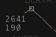
    <figcaption>Fig.  - p.116</figcaption>
</figure>

<figure>
    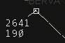
    <figcaption>Fig.  - p.116</figcaption>
</figure>

Here the order is: non concerned, notified and redundant.

## Moving The TAGS

In EuroScope the position of the TAGs related to the plane is not restricted at all. You can freely move them around the screen to any direction and to any distance. Just press with the LEFT button and move. When you are moving the TAG and you press the RIGHT button before releasing it with the LEFT the TAG will "stick" it on the screen in it's present position and will not move with the aircraft's target. Moving the TAG again cancels the sticking state. Tag Up, Tag Down You can tag up and down a tag by double clicking on the track symbol. To revert the tag back to the default position you do the above.
