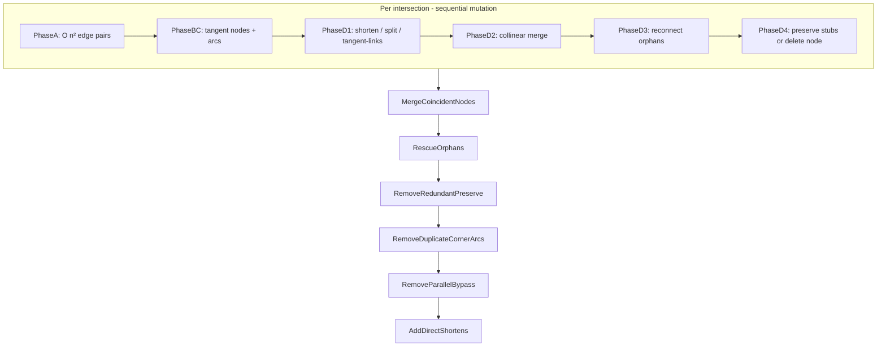
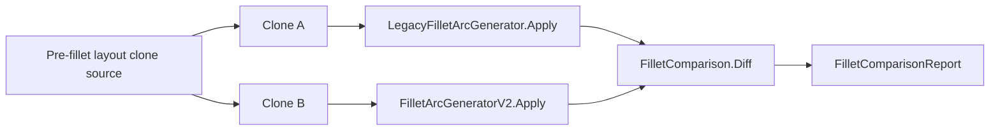
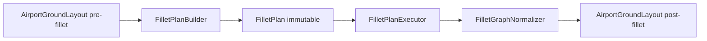
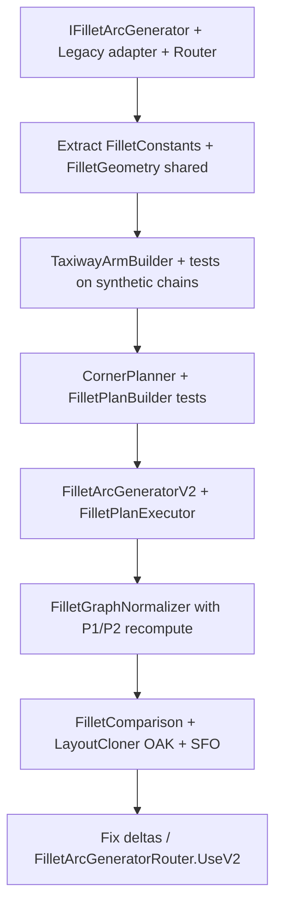

# Clean-Room Fillet Arc Generator (V2)

**Author:** Cursor agent (plan iteration, May 2026)
**Status:** Proposal — not implemented
**Related:** [`docs/ground-layout-generation.md`](../ground-layout-generation.md), [`src/Yaat.Sim/Data/Airport/FilletArcGenerator.cs`](../../src/Yaat.Sim/Data/Airport/FilletArcGenerator.cs)

---

## Summary

Replace the monolithic ~2,800-line [`FilletArcGenerator`](../../src/Yaat.Sim/Data/Airport/FilletArcGenerator.cs) with a **plan-then-execute** pipeline (`FilletArcGeneratorV2`) that implements a shared **`IFilletArcGenerator`** contract alongside a legacy adapter. Production and tests select an implementation via **`FilletArcGeneratorRouter`** (same pattern as [`ITaxiPathfinder`](../../src/Yaat.Sim/Data/Airport/ITaxiPathfinder.cs) / [`TaxiPathfinderRouter`](../../src/Yaat.Sim/Data/Airport/TaxiPathfinderRouter.cs)). A **`FilletComparison`** helper clones a pre-fillet layout and runs every registered implementation for structured diffs. V2 keeps the same geometric intent and graph contract; it eliminates combinatorial edge-pair arc creation and the six post-hoc cleanup passes that correct duplicates, bypass edges, and orphans.

---

## What the current system does

[`FilletArcGenerator.cs`](../../src/Yaat.Sim/Data/Airport/FilletArcGenerator.cs) is invoked once at the end of GeoJSON layout build ([`GeoJsonParser.cs`](../../src/Yaat.Sim/Data/Airport/GeoJsonParser.cs) line 275). It mutates [`AirportGroundLayout`](../../src/Yaat.Sim/Data/Airport/AirportGroundLayout.cs) in place:

| Artifact | Role |
|----------|------|
| `GroundNode` (tangent) | Replaces sharp `TaxiwayIntersection` nodes at turns |
| `GroundArc` | Cubic-bezier fillet between two tangent nodes |
| `GroundEdge` | Shortened straights, tangent-links, preserve stubs |
| `FilletProvenance` | Typed tags for cleanup passes ([`FilletProvenance.cs`](../../src/Yaat.Sim/Data/Airport/FilletProvenance.cs)) |

**Downstream consumers** (must keep working):

- **Ground navigation:** `GroundNavigator` follows `GroundArc` via `CubicBezier` + stored bearings
- **Pathfinding:** `TaxiPathfinder` is arc-aware; exit BFS in `AirportGroundLayout.FindAdjacentHoldShort` prefers arcs over straight shortcuts when seeded correctly
- **Speed constraints:** `GroundArc.MinRadiusOfCurvatureFt` → `MaxSafeSpeedKts`
- **Diagnostics:** `Origin` / `FilletProvenance`, LayoutInspector `--debug-fillets`

### Legacy pipeline (simplified)



### Core geometry (keep verbatim in V2)

These formulas are correct and should be extracted to a **pure** module shared by legacy and V2:

- **Turn angle** between outbound bearings: `180° - |bearingA - bearingB|` (`ComputeTurnAngle`)
- **Collinear** if turn < 15°; **fillet** if turn ≥ 15° (`MinFilletAngleDeg` / `CollinearThresholdDeg`)
- **Tangent distance:** `radius * tan(turn/2)` capped by walk length, intersection caps, `MaxTangentDistFt` (150 ft), type-based max radius (`SelectMaxRadius`: ramp 50, HS exit 150, runway exit 100, default 75 ft)
- **Bezier:** `kappa = (4/3) * tan(sweep/4)`, control points projected along bearings toward intersection (Phase BC)

### Eligibility rules (keep verbatim)

From `IsEligibleForFilleting` and [`docs/ground-layout-generation.md`](../ground-layout-generation.md):

- Only `GroundNodeType.TaxiwayIntersection` with ≥ 2 `GroundEdge` neighbors
- Exclude: centerline-projection origin, shape-point (2 same-taxiway edges), pure runway dead-ends
- **Preserve mode:** exactly 1 RWY + ≥1 taxiway (runway threshold) OR any collinear pair planned → keep intersection + stub edges

### Why a clean-room rewrite is justified

The legacy file accumulated **corrective passes** for symptoms of one root design choice: **every edge pair at an intersection gets its own arc**, then six global passes dedupe/fix:

| Cleanup pass | Symptom it fixes |
|--------------|------------------|
| `RemoveDuplicateCornerArcs` | Same physical corner gets multiple arcs from pair combinatorics (e.g. SFO @268) |
| `RemoveParallelBypassEdges` | Adjacent fillets create parallel collinear chains on same taxiway |
| `AddDirectShortensFromArcAnchors` | Tangent chains need shortcut edges for pathfinding |
| `RescueOrphanedTangentNodes` | Phase D edge rebuild gaps |
| `MergeCoincidentNodes` | Adjacent intersections produce coincident tangents (5 ft) |

A clean-room design should **not create duplicates**, so most of these passes shrink or disappear.

---

## `IFilletArcGenerator` — pluggable implementations

Mirror the pathfinder V2 rollout: a small public interface, thin legacy adapter, router for production, and a test-side comparison helper.

### Contract

File: `src/Yaat.Sim/Data/Airport/IFilletArcGenerator.cs`

```csharp
namespace Yaat.Sim.Data.Airport;

/// <summary>
/// Public contract for fillet arc generation on an airport ground layout.
/// Implementations mutate <paramref name="layout"/> in place (same as today's
/// static <see cref="FilletArcGenerator.Apply"/>). Callers that compare
/// implementations must pass independent layout clones — see
/// <see cref="FilletComparison.Compare"/>.
/// </summary>
public interface IFilletArcGenerator
{
    /// <summary>Stable machine id for logs and diff reports (e.g. "legacy", "v2").</summary>
    string Id { get; }

    /// <summary>Human-readable label for inspector output and test reports.</summary>
    string DisplayName { get; }

    /// <summary>
    /// Apply fillet arcs to all eligible intersection nodes. Returns per-pass
    /// tallies; existing callers may ignore the return value.
    /// </summary>
    FilletStatistics Apply(AirportGroundLayout layout);
}
```

**Design notes:**

- **Single method** — filleting is one atomic pass; no partial API on the interface.
- **`Id` + `DisplayName`** — comparison reports and LayoutInspector name runs without reflection.
- **`FilletStatistics` unchanged** — already returned by legacy `Apply`; stays the cross-implementation metrics record.
- **In-place mutation** — documented on the interface; comparison harness owns cloning (not the implementations).

Optional capability **outside** the interface (V2-only, for debugging):

- `FilletPlanBuilder.Build(layout)` → `FilletPlan` — inspect plan before execute without implementing on `IFilletArcGenerator` (keeps the contract minimal).

### Implementations

| Class | `Id` | Role |
|-------|------|------|
| `LegacyFilletArcGenerator` | `"legacy"` | Delegates to existing static `FilletArcGenerator.Apply` — zero behavior change |
| `FilletArcGeneratorV2` | `"v2"` | Plan-then-execute pipeline (this proposal) |

```csharp
// Legacy adapter — thin wrapper, no duplicated logic
public sealed class LegacyFilletArcGenerator : IFilletArcGenerator
{
    public string Id => "legacy";
    public string DisplayName => "Legacy (pair + cleanup passes)";
    public FilletStatistics Apply(AirportGroundLayout layout) => FilletArcGenerator.Apply(layout);
}

// V2 — public entry delegates to FilletPlanBuilder + Executor + Normalizer
public sealed class FilletArcGeneratorV2 : IFilletArcGenerator
{
    public string Id => "v2";
    public string DisplayName => "V2 (plan-then-execute)";
    public FilletStatistics Apply(AirportGroundLayout layout) { /* ... */ }
}
```

Future experiments (e.g. true circular-arc fillets, different radius tables) add another `IFilletArcGenerator` implementation and register it — no changes to comparison harness or `GeoJsonParser` call site beyond registration.

### Runtime router

File: `src/Yaat.Sim/Data/Airport/FilletArcGeneratorRouter.cs`

Same shape as [`TaxiPathfinderRouter`](../../src/Yaat.Sim/Data/Airport/TaxiPathfinderRouter.cs):

```csharp
public static class FilletArcGeneratorRouter
{
    private static IFilletArcGenerator _current = new LegacyFilletArcGenerator();

    /// <summary>Active implementation. Default: legacy. Not thread-safe across concurrent assignment.</summary>
    public static IFilletArcGenerator Current
    {
        get => _current;
        set => _current = value;
    }

    /// <summary>When true, sets Current to FilletArcGeneratorV2; when false, restores legacy.</summary>
    public static bool UseV2
    {
        set => _current = value ? new FilletArcGeneratorV2() : new LegacyFilletArcGenerator();
    }
}
```

**Production wiring:** [`GeoJsonParser`](../../src/Yaat.Sim/Data/Airport/GeoJsonParser.cs) replaces `FilletArcGenerator.Apply(layout)` with `FilletArcGeneratorRouter.Current.Apply(layout)`. Startup or env (`YAAT_FILLET_V2=1`) sets `UseV2 = true`.

**Tests:** Synthetic unit tests may call `new FilletArcGeneratorV2()` directly; airport comparison tests use `FilletComparison` with an explicit generator list.

### Registry (for multi-way compare)

File: `src/Yaat.Sim/Data/Airport/FilletArcGeneratorRegistry.cs`

```csharp
public static class FilletArcGeneratorRegistry
{
    public static IReadOnlyList<IFilletArcGenerator> All { get; } =
        [new LegacyFilletArcGenerator(), new FilletArcGeneratorV2()];

    public static IFilletArcGenerator? GetById(string id) =>
        All.FirstOrDefault(g => string.Equals(g.Id, id, StringComparison.OrdinalIgnoreCase));
}
```

LayoutInspector `--compare-fillets` and grid tests iterate `All` (or a filtered subset via `--fillet legacy,v2`).

### Comparison harness

File: `tests/Yaat.Sim.Tests/Helpers/FilletComparison.cs` (parallel to [`PathfinderComparison`](../../tests/Yaat.Sim.Tests/Helpers/PathfinderComparison.cs))



```csharp
public sealed record FilletRunResult(
    string GeneratorId,
    FilletStatistics Stats,
    int NodeCount,
    int EdgeCount,
    int ArcCount,
    long ElapsedMs
);

public sealed record FilletComparisonReport(
    IReadOnlyList<FilletRunResult> Runs,
    int ArcCountDelta,
    bool ConnectivityMatch,
    string Summary
);

public static class FilletComparison
{
    /// <summary>
    /// Deep-clone <paramref name="preFilletLayout"/> once per generator, apply each
    /// <see cref="IFilletArcGenerator"/>, then compute structural metrics.
    /// </summary>
    public static FilletComparisonReport Compare(
        AirportGroundLayout preFilletLayout,
        IReadOnlyList<IFilletArcGenerator> generators
    );

    public static string FormatReport(FilletComparisonReport report);
}
```

**Clone requirement:** Implement `AirportGroundLayout.DeepClone()` (or a test-only `LayoutCloner` in `tests/Yaat.Sim.Tests/Helpers/`) that copies `Nodes`, `Edges`, `Arcs`, `Runways`, and rebuilds adjacency — fillet must not run on a shared mutable graph.

**Metrics** (per generator + cross-run deltas):

| Field | Use |
|-------|-----|
| `FilletStatistics` | Arcs created, merges, coincident merges, etc. |
| Node/edge/arc counts | High-level size diff |
| Connectivity | BFS from each hold-short reaches same taxiway branches (must match across implementations unless documented) |
| Corner buckets | `(intersection region, taxiway pair, bearing pair)` → min radius; ±10% tolerance |
| Zero-length edges | Must be zero for all |
| `ElapsedMs` | Performance tracking (informational) |

**Parameterized tests:**

```csharp
[Theory]
[MemberData(nameof(FilletArcGeneratorRegistry.All))]
public void SFO_Fillet_ParityOrDocumentedDelta(IFilletArcGenerator generator) { ... }

[Fact]
public void SFO_LegacyVsV2_ComparisonReport() =>
    FilletComparison.Compare(preFillet, FilletArcGeneratorRegistry.All);
```

### Deprecation path for static `FilletArcGenerator`

1. Introduce `IFilletArcGenerator` + `LegacyFilletArcGenerator` + router (behavior unchanged).
2. Implement `FilletArcGeneratorV2` : `IFilletArcGenerator`.
3. Switch default via `UseV2` when parity achieved.
4. Delete static `FilletArcGenerator` class body; keep a one-line obsolete redirect only if needed briefly — project rule prefers delete over shim.

---

## V2 architecture: plan-then-execute

New namespace/folder (keeps legacy untouched):

```
src/Yaat.Sim/Data/Airport/
  IFilletArcGenerator.cs
  FilletArcGeneratorRouter.cs
  FilletArcGeneratorRegistry.cs
  LegacyFilletArcGenerator.cs   # adapter → static FilletArcGenerator (until deleted)
  FilletArcGeneratorV2.cs       # IFilletArcGenerator implementation
  Fillet/
    FilletConstants.cs          # thresholds + radii (single source)
    FilletEligibility.cs
    FilletGeometry.cs           # pure math: turn, radius, bezier build
    TaxiwayArm.cs               # one outbound direction from an intersection
    TaxiwayArmBuilder.cs        # replaces WalkTaxiway + per-pair walks
    CornerSpec.cs               # one physical corner (two arms)
    CornerPlanner.cs            # intersection → CornerSpec[]
    FilletPlan.cs               # immutable airport-wide plan
    FilletPlanBuilder.cs        # layout → FilletPlan (read-only)
    FilletPlanExecutor.cs       # FilletPlan → mutate layout
    FilletGraphNormalizer.cs    # coincident merge + P1/P2 recompute (small)

tests/Yaat.Sim.Tests/Helpers/
  FilletComparison.cs           # side-by-side IFilletArcGenerator runs
  LayoutCloner.cs               # deep clone pre-fillet layout (or on AirportGroundLayout)
```



### 1. `TaxiwayArm` — walk once per outbound edge

Replace repeated `WalkTaxiway` calls inside the O(n²) pair loop with **one arm per deduped edge** at the intersection:

```csharp
// Conceptual shape
sealed record TaxiwayArm(
    GroundEdge RootEdge,
    string TaxiwayName,
    double BearingFromIntersectionDeg,
    PolylineChain Chain,           // intersection → … → terminal
    double AvailableLengthFt,
    double IntersectionCapFt,      // DistToFirstIntersectionFt equivalent
    bool EndsAtShapePoint,
    bool IsRunwayCenterline);
```

`PolylineChain` stores ordered segments + cumulative distances so `OffsetAlongArm(ft)` returns `(lat, lon, bearingToIntersection)` without re-walking during pair planning.

**Shape-point / runway protection** stays identical to legacy: arms stop at shape-point nodes and runway centerlines; `EndsAtShapePoint` drives split-vs-consume in the executor (same semantics as `LandsInManualArc` / `SplitEdge`).

### 2. `CornerSpec` — one corner, one arc (eliminates duplicate-corner pass)

Instead of enumerating all edge pairs, build corners from **arm pairs** with dedup key:

`(intersectionId, normalizedTaxiwayPair, bearingA°, bearingB°)` — same clustering idea as `RemoveDuplicateCornerArcs` but applied **before** arc creation.

For each qualifying arm pair:

- Compute turn angle; classify: **Collinear** | **Fillet** | **Skip** (same as legacy thresholds)
- Compute **one** radius/tangent distance using both arms' caps (same min-of-caps logic as Phase A)
- If multiple pairings would share the same corner key, keep the placement with **largest achievable radius** (same policy as duplicate-corner dedup)

Collinear pairs do not create arcs; they set `PreserveIntersection = true` on the intersection plan (same as `PlannedMerges` → preserve stubs).

### 3. `FilletPlan` — immutable, diffable

```csharp
sealed record FilletPlan(
    IReadOnlyList<IntersectionPlan> Intersections,
    IReadOnlySet<int> ExcludedShapePointNodeIds);

sealed record IntersectionPlan(
    int IntersectionNodeId,
    bool PreserveNode,
    IReadOnlyList<CornerSpec> Corners,
    IReadOnlyList<CollinearPair> CollinearPairs);

sealed record CornerSpec(
    int ArmAIndex, int ArmBIndex,
    double RadiusFt, double TurnAngleDeg,
    TangentCut CutA, TangentCut CutB,
    BezierSpec Bezier);
```

`FilletPlanBuilder` reads the layout **without mutation** (only builds arms from the initial straight-edge graph). This enables:

- Unit tests on plans without graph side effects
- LayoutInspector dump of planned corners vs executed result

### 4. `FilletPlanExecutor` — mechanical graph rewrite

Executor responsibilities (mirror Phase B–D but driven by plan records):

| Plan field | Graph effect |
|------------|--------------|
| `TangentCut` on arm | Create/reuse tangent node (5 ft dedupe), shorten chain, tangent-links between multiple cuts on same arm |
| `CornerSpec.Bezier` | Create `GroundArc` + `CornerArcProvenance` |
| `PreserveNode` | Keep intersection; add preserve stubs (same rules as Phase D4) |
| else | Remove intersection node + purge dangling refs |

**Explicit non-goals for V1 of V2 executor** (defer until comparison shows need):

- Do not emit parallel bypass edges; only one straight path per (node, taxiway, bearing-bucket) between tangents
- `AddDirectShortens` becomes unnecessary if the executor never creates multi-hop tangent-only chains that pathfinding cannot use

### 5. `FilletGraphNormalizer` — minimal global pass

Keep only what plan-then-execute cannot avoid:

1. **`MergeCoincidentNodes`** (5 ft, tangent nodes with `SourceIntersectionPosition`) — but **recompute P1/P2** from stored `EdgeBearingAtNode*Deg`, `TurnAngleDeg`, and new node positions (fix documented in ground-layout-generation Issue #4)
2. **`RecomputeDistances`** on all edges/arcs
3. Optional: degenerate-arc removal (radius < 5 ft)

Drop or gate behind parity flag: `RemoveDuplicateCornerArcs`, `RemoveParallelBypassEdges`, `RescueOrphanedTangentNodes` — V2 should not need them if the plan is corner-centric.

---

## Side-by-side comparison strategy

All comparison flows go through **`IFilletArcGenerator`** + **`FilletComparison`** — never hard-code `FilletArcGenerator.Apply` vs `FilletArcGeneratorV2.Apply` at call sites.

### Entry points

| Call site | Mechanism |
|-----------|-----------|
| Production default | `FilletArcGeneratorRouter.Current` → `LegacyFilletArcGenerator` until parity |
| Production switch | `FilletArcGeneratorRouter.UseV2 = true` or `YAAT_FILLET_V2=1` at startup |
| GeoJSON build | `GeoJsonParser` calls `FilletArcGeneratorRouter.Current.Apply(layout)` |
| Unit tests (single impl) | `IFilletArcGenerator generator` injected or `[MemberData]` from registry |
| Unit tests (diff) | `FilletComparison.Compare(preFillet, generators)` |
| LayoutInspector | `--fillet <id>` runs one impl; `--compare-fillets` runs `FilletArcGeneratorRegistry.All` |

### Comparison workflow

**`tests/Yaat.Sim.Tests/Fillet/FilletComparisonTests.cs`:**

1. Load real airport via `TestVnasData` + `GeoJsonParser` **without** fillet (add `skipFillet` param to parser or build layout helper)
2. `FilletComparison.Compare(preFilletLayout, FilletArcGeneratorRegistry.All)` — clones per generator internally
3. Assert on `FilletComparisonReport` (tolerances, not exact node IDs):

| Metric | Tolerance |
|--------|-----------|
| Arc count per intersection | ±0 initially; document deltas |
| Min radius per (taxiway pair, corner bearings) | ±10% |
| Graph connectivity (BFS from each hold-short) | must match |
| No zero-length edges | exact |
| Runway edge bearings | ±1° (legacy warning check) |

**`tools/Yaat.LayoutInspector`** (extend per project rules):

- `--fillet legacy` / `--fillet v2` — run one `IFilletArcGenerator` by `Id`
- `--compare-fillets` — run registry (or comma-separated ids), print `FilletComparison.FormatReport`

### Golden tests to port first

From [`FilletArcGeneratorTests.cs`](../../tests/Yaat.Sim.Tests/FilletArcGeneratorTests.cs) and [`FilletDiagnosticTests.cs`](../../tests/Yaat.Sim.Tests/Simulation/FilletDiagnosticTests.cs):

- 90° two-edge, collinear preserve, 3-edge mixed, SFO node 268 corner count
- Parameterize with `[MemberData(nameof(AllGenerators))]` so each test runs against **every** registered `IFilletArcGenerator`, or use a dedicated `[Fact]` that only compares legacy vs v2 via `FilletComparison`

---

## Implementation sequence



### Checklist

- [ ] **interface-router** — Add `IFilletArcGenerator`, `LegacyFilletArcGenerator`, `FilletArcGeneratorRouter`, `FilletArcGeneratorRegistry`; wire `GeoJsonParser` to router (still legacy default)
- [ ] **extract-geometry** — Extract `FilletConstants` + `FilletGeometry` (turn angle, radius caps, cubic bezier build) into `Fillet/` shared by legacy
- [ ] **taxiway-arm** — Implement `TaxiwayArm` + `TaxiwayArmBuilder` with tests matching `WalkTaxiway` / `InterpolateAlongWalk` behavior
- [ ] **corner-planner** — Implement `CornerPlanner` + immutable `FilletPlan` (corner-centric, no duplicate arcs)
- [ ] **executor** — Implement `FilletArcGeneratorV2` + `FilletPlanExecutor` + `FilletGraphNormalizer` (P1/P2 recompute on merge)
- [ ] **comparison-harness** — Add `LayoutCloner`, `FilletComparison`, `FilletComparisonTests`, LayoutInspector `--fillet` / `--compare-fillets`; run OAK/SFO diff
- [ ] **parity-switch** — After parity or documented improvements: `FilletArcGeneratorRouter.UseV2`, aviation review, delete static `FilletArcGenerator`

### Step detail

0. **Interface first** (no behavior change): introduce `IFilletArcGenerator` + `LegacyFilletArcGenerator` + router; `GeoJsonParser` calls router; existing tests pass unchanged.
1. **Extract-only refactor**: move constants + `ComputeTurnAngle` + bezier build into `Fillet/FilletGeometry.cs`; legacy static class calls into it (still behind adapter).
2. **Arm builder** with tests mirroring `WalkTaxiway` / `InterpolateAlongWalk` on hand-built chains (shape-point stop, runway cap, cycle guard).
3. **Corner planner** with tests for pair dedup (SFO @268 scenario from legacy comments).
4. **`FilletArcGeneratorV2`** implements `IFilletArcGenerator` until synthetic `FilletArcGeneratorTests` pass when parameterized with `v2`.
5. **`FilletComparison`** + `LayoutCloner` + full-airport diff; file `.tmp/fillet-diff-SFO.json` for human review.
6. **Aviation realism review** on radius table (ramp / HS exit / runway exit) before `UseV2 = true` default.

---

## Intentional improvements V2 may diverge on (document, don't hide)

| Area | Legacy behavior | V2 target |
|------|-----------------|-----------|
| Duplicate corners | Create many, dedup later | Plan one arc per corner |
| Parallel bypass straights | Created by adjacent fillets, removed later | Never create |
| Preserve shortcuts confusing BFS | Issue #18 in ground-layout-generation | Prefer single geometric path; tag any remaining shortcut as `FilletEdgeKind.ShortenDirect` only when needed |
| Merge control points | Translate P1/P2 | Recompute from stored bearings |

---

## Files to touch (when implementing)

| File | Action |
|------|--------|
| `src/Yaat.Sim/Data/Airport/IFilletArcGenerator.cs` | **New** public contract |
| `src/Yaat.Sim/Data/Airport/FilletArcGeneratorRouter.cs` | **New** runtime selector (like `TaxiPathfinderRouter`) |
| `src/Yaat.Sim/Data/Airport/FilletArcGeneratorRegistry.cs` | **New** all implementations for compare |
| `src/Yaat.Sim/Data/Airport/LegacyFilletArcGenerator.cs` | **New** adapter to static legacy |
| `src/Yaat.Sim/Data/Airport/FilletArcGeneratorV2.cs` | **New** `IFilletArcGenerator` implementation |
| `src/Yaat.Sim/Data/Airport/Fillet/*` | **New** V2 internal modules |
| `src/Yaat.Sim/Data/Airport/FilletArcGenerator.cs` | Delegate to shared geometry; shrink after V2 parity |
| `src/Yaat.Sim/Data/Airport/GeoJsonParser.cs` | `FilletArcGeneratorRouter.Current.Apply` |
| `tests/Yaat.Sim.Tests/Helpers/FilletComparison.cs` | **New** side-by-side compare (like `PathfinderComparison`) |
| `tests/Yaat.Sim.Tests/Helpers/LayoutCloner.cs` | **New** deep clone for compare |
| `tests/Yaat.Sim.Tests/Fillet/*` | Comparison + parameterized generator tests |
| `tools/Yaat.LayoutInspector/` | `--fillet <id>`, `--compare-fillets` |
| `docs/ground-layout-generation.md` | `IFilletArcGenerator` + comparison workflow |
| `docs/architecture.md` | Interface, router, `Fillet/` folder |

Legacy `FilletArcGenerator.cs` stays behind `LegacyFilletArcGenerator` until V2 reaches parity on OAK/SFO `FilletComparison`; then delete static class (project rule: delete, no shim).
