# What's new

## Right-click menus

An aircraft's right-click menu has a state line under its title (phase, altitude, speed and runway, or taxiway and airport on the ground) and leads with situational quick commands: a strip of icons, each named in full as you point at it, with the rest under All Commands. The strip shows only what the aircraft can take.

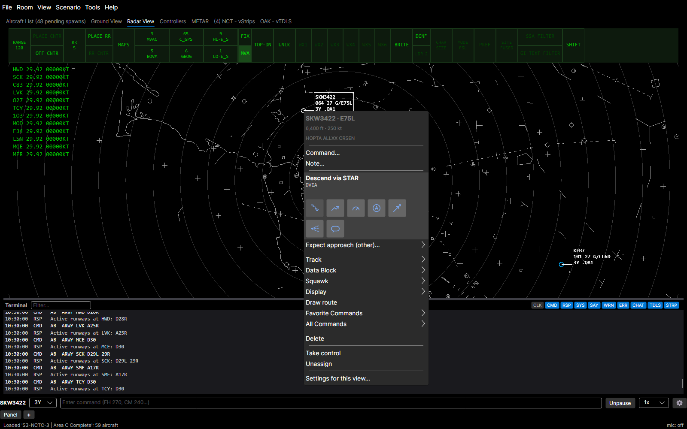

Right-clicking a taxiway, runway or the radar map with an aircraft selected leads with icons such as Taxi here, Push to or Hold left. The menu's title names the aircraft and the place, and the radar adds the distance and bearing.

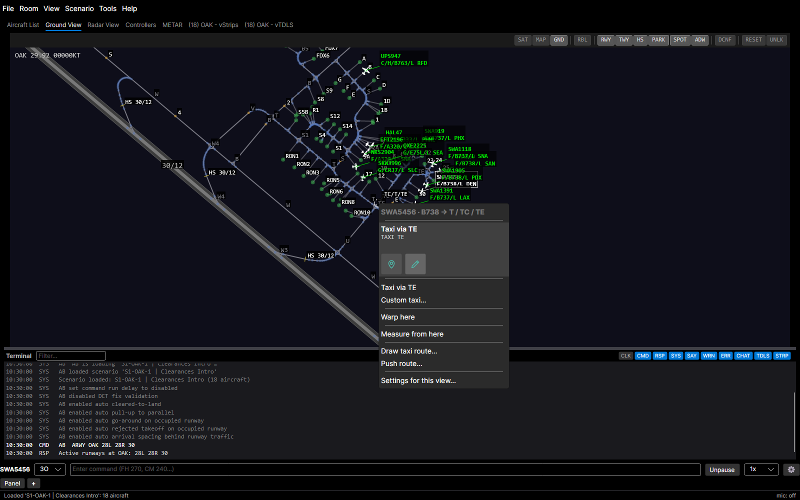

The pickers behind the commands are smarter. Maintain opens at the aircraft's altitude and marks climbs and descents, Assign speed lists the type's own speed range, Direct to lists the route from the fix the aircraft is navigating to, and Report traffic in sight lists the nearest aircraft.

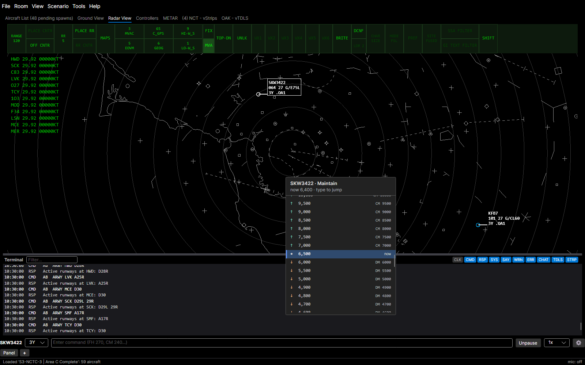

## Exits ahead

For a fixed-wing aircraft on its landing rollout, Exit left and Exit right list the named exits ahead with their distances, the planned one marked. On final, from 5 nm out to 1 nm from the threshold on a full-stop landing, they list the exits the aircraft will be able to make, with distances from the threshold.

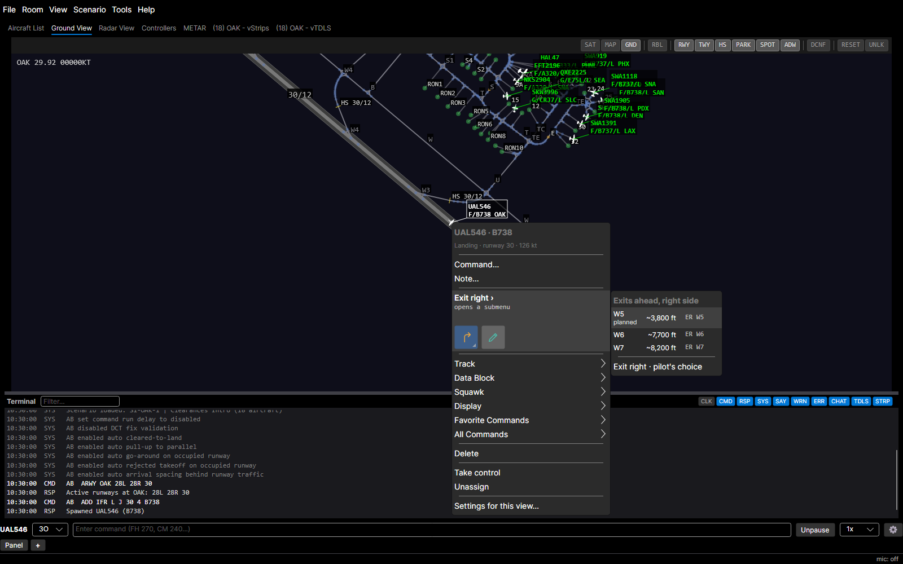

## Quick commands editor

Settings → Input → Quick commands edits each situation's quick commands: add, reorder by dragging, reset, and add custom commands with their own label.

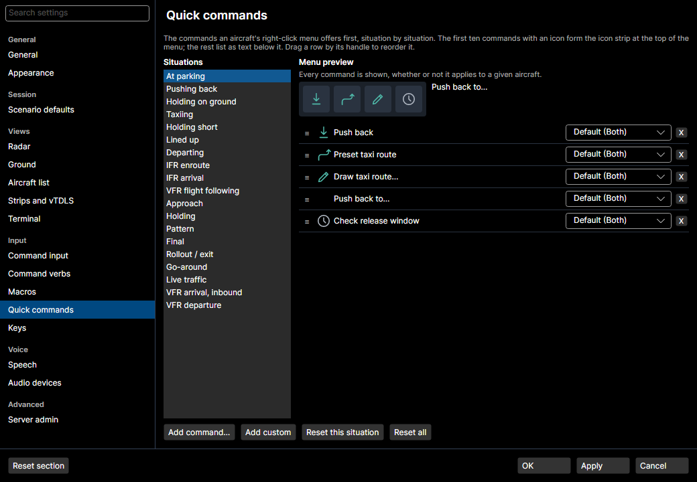

## Settings

Settings is a searchable sidebar of sections with links between related settings, a Reset section button on each, and OK, Apply and Cancel. Ctrl+, opens it from any window, and Settings › Keys warns when two actions share a key.

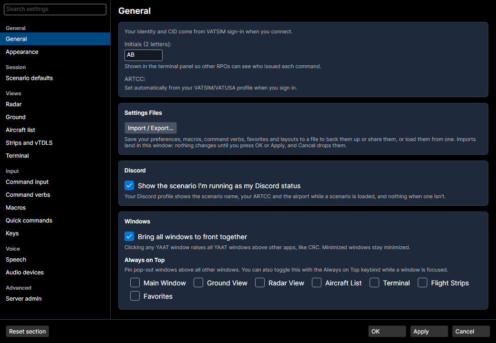

The Keys section lists every keybind, including the Ctrl+Shift pop-out keys for each view.

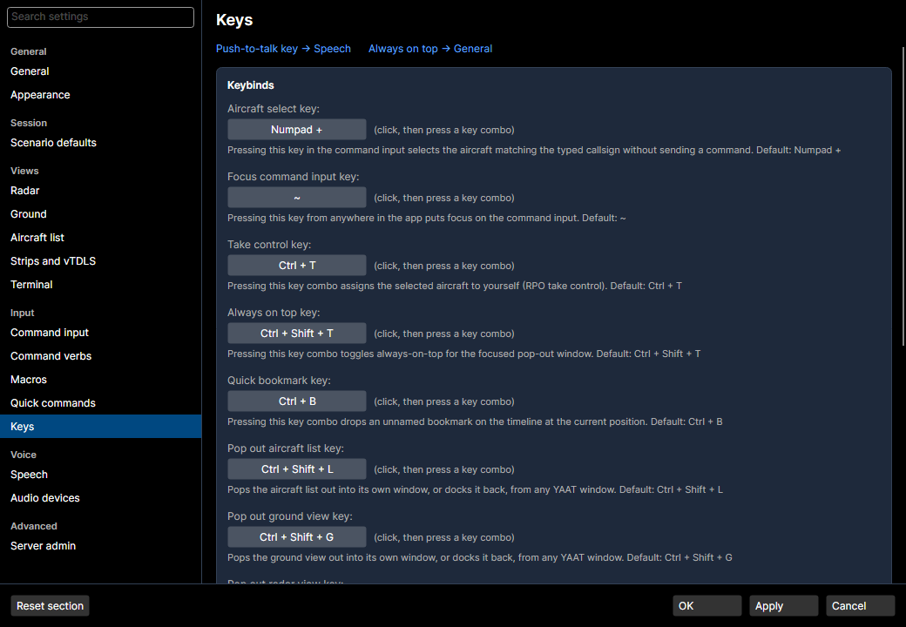

## Scenario defaults

Settings › Scenario defaults sets the solo parking call-up interval and arrival generator rate for new rooms, and lists the settings only the room changes. The session flyout's auto-accept is a checkbox with a 0 to 60 second delay.

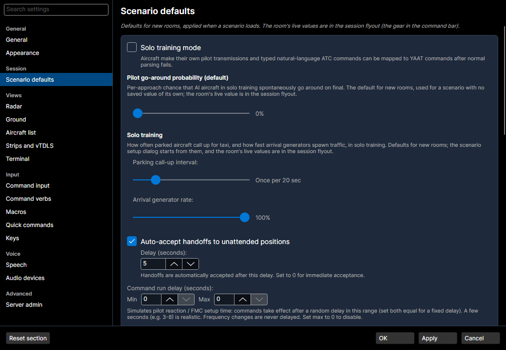

## Import / Export

Tools › Import / Export… saves or loads your settings, macros, verbs, favorites, columns and layouts in one file. It backs up your settings before each import and says what each item's import will change.

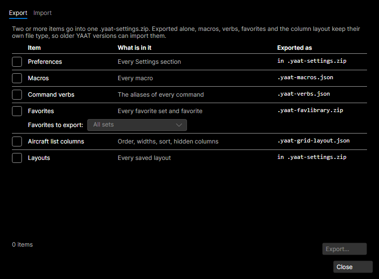

## View menu and layouts

The View menu groups its items into Windows, Bars and Layout submenus, each item showing its hotkey. A layout saves the window arrangement and the open Strips and vTDLS tabs.

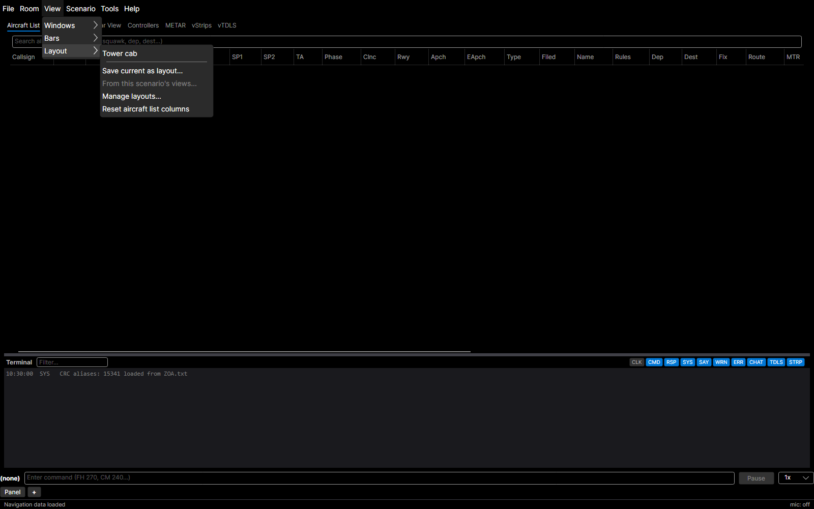

## Active runways

`ARWY OAK 28L 28R` sets an airport's active runways for the room. A mentor who loads a scenario with no saved active runways, in a room that is not solo training, is asked for them once, with a guess from the scenario's spawns, presets and expected approaches filled in. Scenario › Active Runways… shows the room's active runways, one row per airport, once a scenario is loaded.

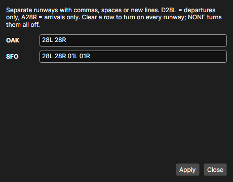

## Range/bearing labels

In the radar and ground views, a range/bearing measurement's label moves clear of data blocks and aircraft, pushing auto-placed data blocks aside while every side is covered.

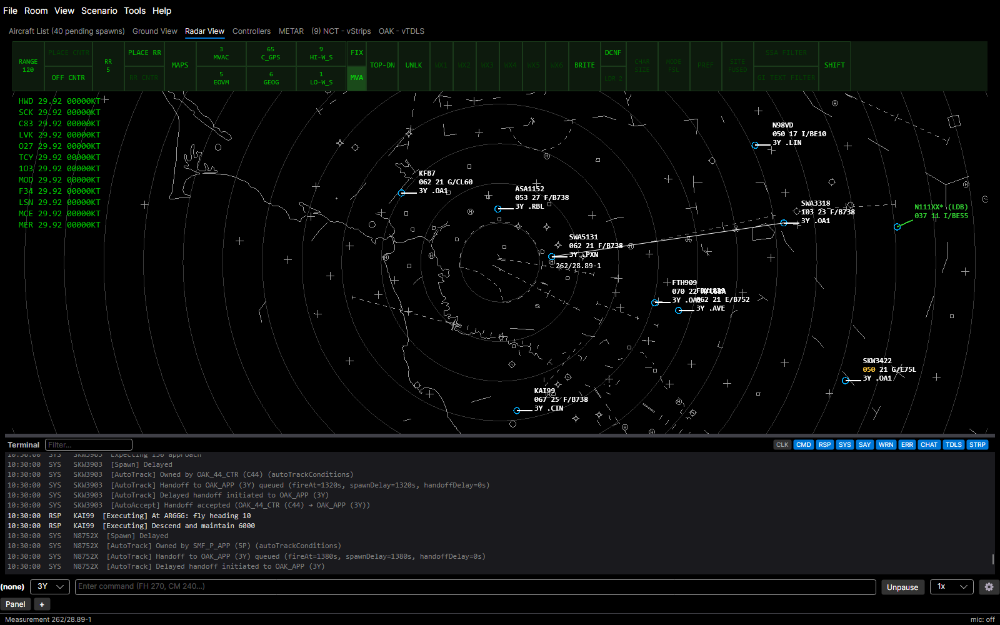

## Room traffic feed

Each room serves every aircraft in it, ground and air, as a VATSIM-style datafeed for tools like vTBFM, once a scenario is loaded; before that the feed answers 503. Tools › Copy traffic feed URL copies the room's feed address while you are connected and in a room.
