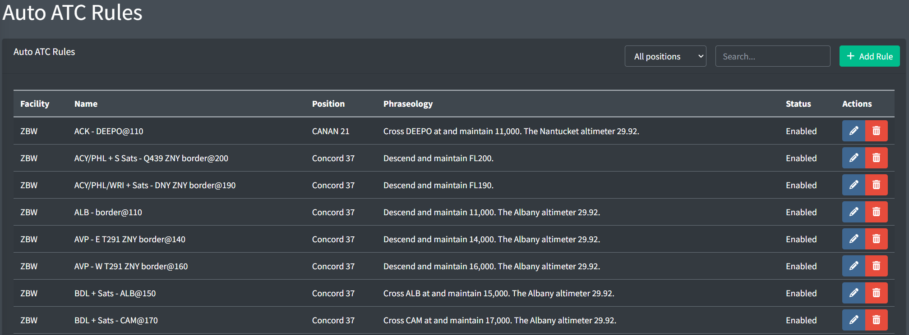
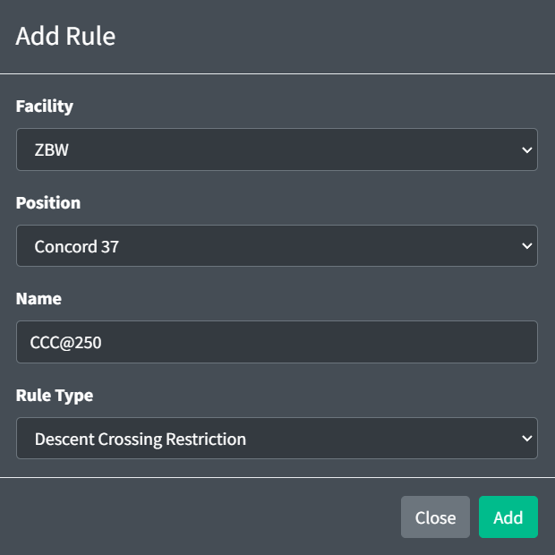
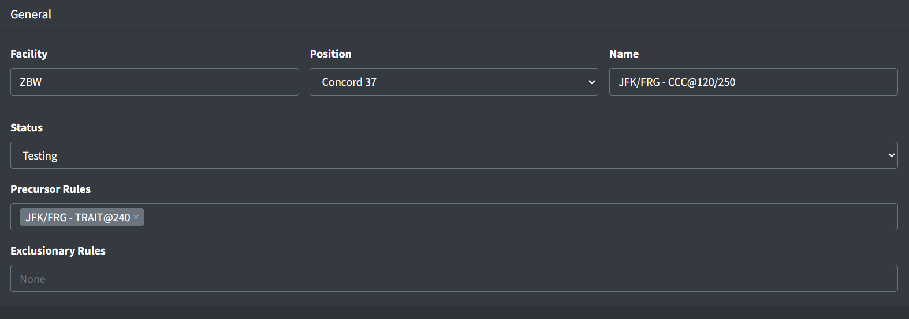
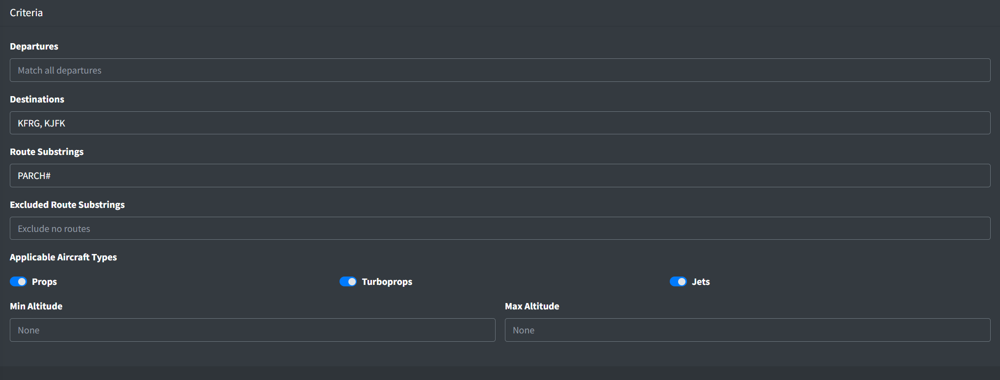
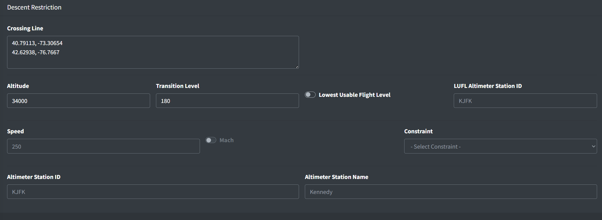
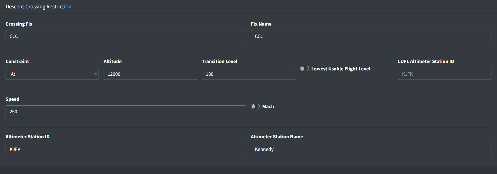
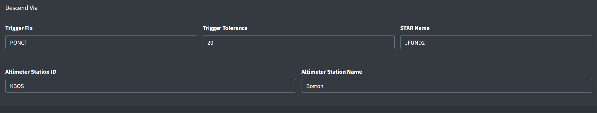
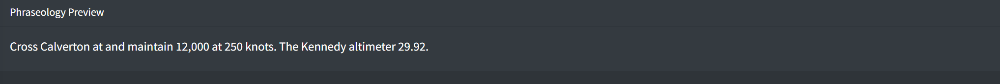

# Auto ATC Rules

Auto ATC sends pilots simple ATC instructions when ATC is offline. This not only improves the experience of flying without ATC, but aids online controllers by ensuring pilots still receive the instructions typically given by neighboring offline facilities.

> ℹ️ This new feature is still under ongoing development. If you are unable to tailor the existing rule criteria or restriction types to your facility's needs, please do not hesitate to reach out through the [vNAS Discord server](https://discord.gg/MFtQbd9Svs) so we can improve Auto ATC.

*Auto ATC Rules page*

## Adding a Rule

*Adding a rule*

When adding an Auto ATC rule, you must specify the rule's owning facility and position, name and rule type.

> ℹ️ For more information on rule fields, please see the [General configuration](#general) section of the documentation.

### Rule Types

Auto ATC currently supports the following types of rules:

Table 1 - Auto ATC rule types

| Type | Example Phraseology |
| --- | --- |
| [Descent Restriction](#descent-restriction) | *"Descend and maintain FL240."* |
| [Descent Crossing Restriction](#descent-crossing-restriction) | *"Cross BASYE at and maintain 8,000. The Stewart altimeter 29.92."* |
| [Descend Via Restriction](#descend-via-restriction) | *"Descend via the JFUND2 arrival. The Boston altimeter 29.92."* |

## General

*Auto ATC rule general configuration*

An Auto ATC rule contains the following general fields:

- **Facility:** the rule's owning facility. Currently, Auto ATC only supports rules owned by ARTCC facilities.
- **Position:** the rule's owning position. This is the position that is typically responsible for issuing the restriction associated with the rule.
- **Name:** a simple name to identify the rule within the Data Admin website
- **Status:** the rule's status. If set to "Testing", the rule will only be enabled on the Test server.
- **Precursor Rules:** a list of rules that, if applicable to the flight, must be invoked prior to the current rule being invoked. If a precursor rule is not applicable to the flight, it is ignored. If a precursor rule includes a descent altitude, the aircraft must execute the descent prior to the current rule being triggered. All applicable precursor rules must be invoked and met prior to the current rule being invoked.

  > **ℹ️ Example**
  >
  > Suppose an arrival includes two rules: an initial crossing at FL240, and a secondary crossing at 10,000. To ensure the FL240 rule is sent to the pilot prior to the 10,000 rule, the FL240 rule should be added as a precursor rule to the 10,000 rule. This requires the FL240 rule to be first sent to the pilot, and the aircraft to be at or below FL240 before the 10,000 rule to be sent.
- **Exclusionary Rules:** a list of rules that, if invoked, prevent the current rule from later being invoked.

  > **ℹ️ Example**
  >
  > Suppose aircraft should be instructed to descend and maintain 11,000 before entering a TRACON's airspace. If one Descent Restriction rule is not sufficient to cover all possible entries into the TRACON, multiple rules can be created with different criteria, all instructing aircraft to descend to 11,000. To ensure only one of these rules is invoked for a given flight, the other 11,000 restriction rules should be listed in the rules's Exclusionary Rules lists.

  > ⚠️ Exclusionary rules are not mutually exclusive by default. In order for two rules to be mutually exclusive, the opposite rule must appear in the exclusionary rules list of both rules.

## Criteria

*Auto ATC rule criteria*

An Auto ATC rule contains the following criteria fields:

- **Departures:** a comma separated list of applicable departures. A flight must have departed from one of a given rule's departures for the rule to be applied. If no departures are specified for a given rule, flight plan departures not considered when determining if the rule is applicable.
- **Destinations:** a comma separated list of applicable destinations. A flight must be inbound to one of a given rule's destinations for the rule to be applied. If no destinations are specified for a given rule, flight plan destinations not considered when determining if the rule is applicable.
- **Route Substrings:** a comma separated list of applicable route substrings. A flight must contain at least one of a given rule's route substrings in its flight plan route for the rule to be applied. If no route substrings are specified for a given rule, flight plan routes are not considered when determining if the rule is applicable, unless excluded route substrings are specified.
- **Excluded Route Substrings:** a comma separated list of non-applicable route substrings. A flight must not contain any of a given rule's excluded route substrings in its flight plan route for the rule to be applied.

> ℹ️ The wildcard `#` can be used to represent any digit in a route substring, such as for a DP or a STAR.

> ⚠️ Route substrings are matched directly to a flight plan's route string. Do not use NAS (dot) notation.

- **Min and Max Altitude:** the min and max applicable altitude. A flight must be above/below a given rule's min/max altitude for the rule to be applied. The min altitude may be omitted to signify "at or below". Likewise, the max altitude may be omitted to signify "at or above". If no altitudes are specified for a given rule, aircraft altitudes are not considered when determining if the rule is applicable.

  > ℹ️ Descent restrictions are not sent to aircraft that are already at or below the restriction, regardless of the rule's min or max altitude.
- **Applicable Aircraft Types:** the aircraft types applicable to the rule. If a given flight's aircraft type is not known, the aircraft type is not considered when determining if a rule is applicable.

  > ⚠️ Do not overly restrict rules. For example, all aircraft types should be considered "applicable" even if a rule is for a STAR that is only applicable to jets. This allows an aircraft that has mistakenly filed a STAR that is not applicable to their aircraft type to receive the Auto ATC restriction for the STAR.

## Descent Restriction

*Auto ATC descent restriction*

An Auto ATC descent restriction contains the following fields:

- **Crossing Line:** a list of coordinates that form a line marking where aircraft should reach the altitude restriction.
- **Altitude:** the altitude restriction
- **Transition Level:** if the altitude is greater than or equal to the transition level, it will be sent to pilots as a flight level
- **Lowest Usable Flight Level:** if enabled, the aircraft is instructed to descend to the lowest usable flight level (LUFL)
- **LUFL Altimeter Station ID:** the weather station used to determine the lowest usable flight level. Note this altimeter setting is not sent to the aircraft.
- **Speed:** an optional speed restriction
- **Mach:** if enabled, denotes the speed is in tenths of Mach 1. If disabled, denotes the speed is in knots.
- **Constraint:** the type of speed restriction constraint ("Maintain", "Do not exceed", "Or greater")
- **Altimeter Station ID:** an optional weather station to send the altimeter setting to the aircraft
- **Altimeter Station Name:** the name of the altimeter weather station

## Descent Crossing Restriction

*Auto ATC descent crossing restriction*

An Auto ATC descent crossing restriction contains the following fields:

- **Crossing Fix:** a fix where the restriction is applied. The fix does not need to appear in a flight plan route. For example, an FRD can be specified for a restriction prior to a fix in the flight plan route.
- **Fix:** the name of the crossing fix that is sent to the aircraft
- **Constraint:** the type of altitude restriction constraint ("At", "At or below", "At or above")
- **Altitude:** the altitude restriction
- **Transition Level:** if the altitude is greater than or equal to the transition level, it will be sent to pilots as a flight level
- **Lowest Usable Flight Level:** if enabled, the aircraft is instructed to descend to the lowest usable flight level (LUFL)
- **LUFL Altimeter Station ID:** the altimeter station used to determine the lowest usable flight level. Note this altimeter setting is not be sent to the aircraft.
- **Speed:** an optional speed restriction
- **Mach:** if enabled, denotes the speed is in hundredths of Mach 1. If disabled, denotes the speed is in knots.
- **Altimeter Station ID:** an optional weather station to send the altimeter setting to the aircraft
- **Altimeter Station Name:** the name of the altimeter weather station

## Descend Via Restriction

*Auto ATC descend via restriction*

An Auto ATC descend via restriction contains the following fields:

- **Crossing Line:** a list of coordinates that form a line marking where aircraft should receive the descend via instruction.
- **STAR Name:** the name of the descend via STAR
- **Altimeter Station ID:** an optional weather station to send the altimeter setting to the aircraft
- **Altimeter Station Name:** the name of the altimeter weather station

## Phraseology Preview

*Phraseology preview*

The phraseology preview displays an example message similar to the messages sent to aircraft.

> ℹ️ Auto ATC rules may be tested on the Test server. They are disabled on both Sweatbox servers.
