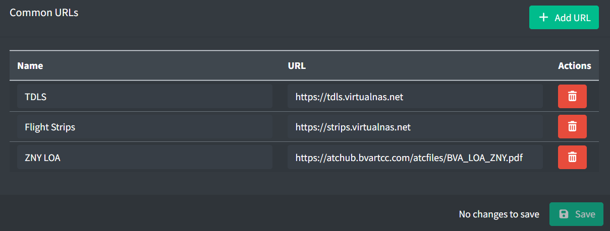

# Common URLs

Common URLs provide controllers with a set of URLs for resources commonly used by a facility. These may include URLs to applications and documentation referenced while controlling.

*Common URLs*

A common URL contains the following fields:

- **Name:** the name of the resources accessed via the URL.
- **URL:** the URL.
