# Facilities

vNAS facilities mimic the real-world locations that employ a set of air traffic controllers to work a defined airspace. Some examples include the Boston ARTCC, Potomac Consolidated TRACON, and Kennedy ATCT. Facilities contain a set of positions worked by controllers, for example ZBW's "Concord 37" position on 134.700, or BOS's "Local Control West" position on 128.800. Facilities also contain configuration data for the systems used by its controllers, such as ERAM, STARS, ASDE-X, and TDLS.

When connecting to VATSIM on CRC, controllers must first select the facility they want to work. They must then select one of the facility's defined positions to be assigned a login callsign and frequency. The selected position also limits what type of systems the controller can use. For example, selecting the Boston TRACON facility and "Rockport" position would require the controller to utilize STARS.

By default, each ARTCC has a predefined ARTCC facility. This facility cannot be removed, nor can additional ARTCC facilities be created.

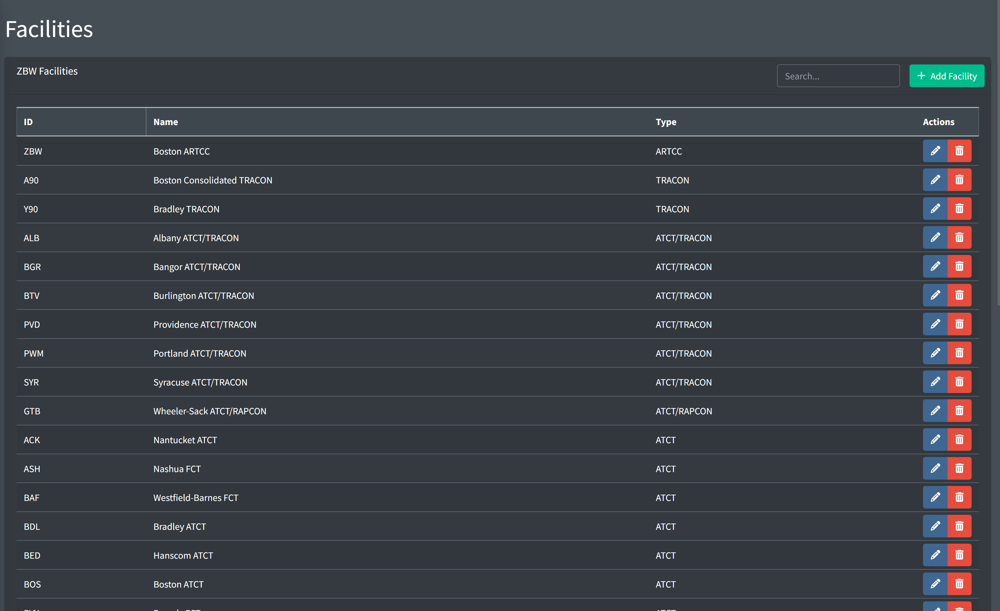

*Facility page*

## Adding a Facility

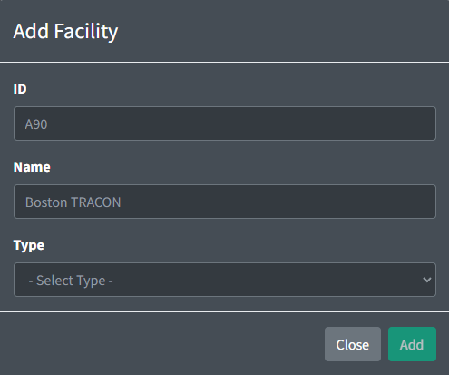

*Adding a facility*

When adding a facility, you must specify the facility's ID, name, and type. If adding an ATCT facility, you must also specify its parent facility. All TRACON's parent facilities are automatically set to the ARTCC facility.

### Facility IDs

Facility IDs consist of three letters and/or numbers. For facilities that utilize an airport identifier as its ID, the three-letter **FAA** ID should be used, as opposed to the four-letter ICAO ID.

Table 1 - Facility ID examples

|  Valid Facility IDs |  Invalid Facility IDs |
| --- | --- |
| BOS | KBOS |
| OGG | PHOG |
| A90 |  |
| PCT |  |

### Facility Names

Facility names should contain the facility's primary name, as well as the facility's type to differentiate between two facilities with the same primary name (such as "Boston ATCT" and "Boston TRACON"). Names should not include the facility's ID.

Table 2 - Facility name examples

|  Valid Facility Names |  Invalid Facility Name |
| --- | --- |
| Boston ATCT | BOS |
| Potomac Consolidated TRACON | Boston |
| Midway ATCT | BOS ATCT |
| Albany ATCT/TRACON | Boston Tower |

### Facility Types

Different facility types allow for the hosting of different vNAS systems as follows:

Table 3 - Facility type system support

| Type | ERAM | STARS | ASDE-X | SAID | Tower Cab | TDLS | Flight Strips |
| --- | --- | --- | --- | --- | --- | --- | --- |
| ARTCC |  |  |  |  |  |  |  |
| TRACON |  |  |  |  |  |  |  |
| ATCT/TRACON |  |  |  |  |  |  |  |
| ATCT/RAPCON |  |  |  |  |  |  |  |
| ATCT |  |  |  |  |  |  |  |

> ⚠️ Facilities that combine an ATCT with a TRACON ("up/down facilities") should use the combined facility type, as opposed to being split into two separate facilities.

> ℹ️ ATCT facilities that underlie a facility that hosts a STARS system may utilize a feed from this STARS system to allow for the creation of local STARS positions (such as a radar tower). For more information, please see the [ATCT Positions](#positions_3) section of the documentation.

> ℹ️ ASDE-X and TDLS are optional systems that may be hosted by applicable facility types, but are not required.

### Parent Facilities

A facility's parent facility is the facility that assumes responsibility for its child facility in a top-down workflow. For example, BOS ATCT's parent facility is the A90 TRACON, and the A90 TRACON's parent facility is the ZBW ARTCC.

> ⚠️ If an ATCT has a STARS feed from an overlying TRACON, the overlying TRACON must be selected as the ATCT's parent facility.

## Deleting a Facility

A facility cannot be deleted if it has child facilities, or is referenced in any way by another facility's configuration.

---

## ARTCC Facility

### General

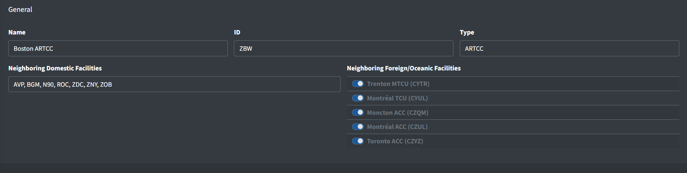

*ARTCC general configuration*

An ARTCC facility contains the following general fields:

- **Neighboring Domestic Facilities:** a list of facility IDs for domestic (vNAS) facilities that laterally neighbor the ARTCC. When positions from these facilities are staffed they will appear in the CRC controller list.

  > ⚠️ Do not include facilities that underlie the ARTCC (child and grandchild facilities).

  > ℹ️ Note that this field is simply labeled "Neighboring Facilities" for ARTCCs that do not neighbor foreign or oceanic facilities.
- **Neighboring Foreign/Oceanic Facilities**: a pre-populated list of foreign and oceanic facilities that neighbor the ARTCC. When positions from these facilities are staffed they will appear in the CRC controller list.

  > ⚠️ This list is hardcoded and may only be changed by a vNAS administrator. If you spot an error, please reach out to an administrator through the [vNAS Discord server](https://discord.gg/MFtQbd9Svs).

  > ℹ️ Note that this field does not appear for ARTCCs that do not neighbor foreign or oceanic facilities.

### ERAM Configuration

#### General

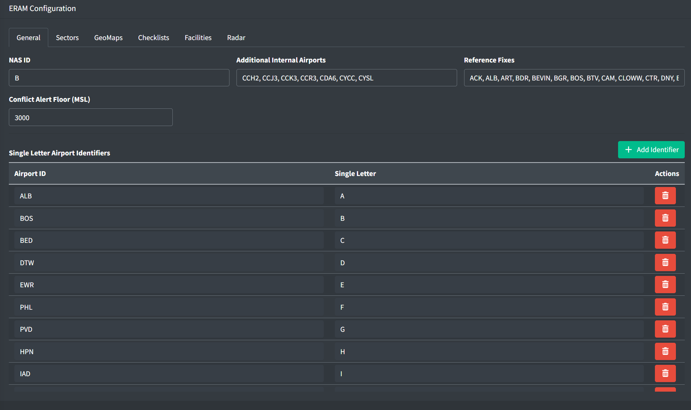

*ERAM general configuration*

An ARTCC's ERAM configuration contains the following general fields:

- **NAS ID:** a unique single letter ID used to identify the ARTCC for handoffs.

  > ⚠️ This ID is hardcoded and may only be changed by a vNAS administrator. If you spot an error, please reach out to an administrator through the [vNAS Discord server](https://discord.gg/MFtQbd9Svs).
- **Additional Internal Airports:** a list of airport IDs that are outside the ARTCC's control, yet should be considered internal for the purpose of beacon code allocation. This allows internal NAS beacon codes to be assigned to traffic departing the ARTCC and arriving at an external airport if, due to the proximity of the airport to the ARTCC, that traffic will never be handed off to an external facility. Some examples include CYCC and CYSL, two Canadian airports that are controlled by ZBW.

  > ℹ️ Utilize four-letter ICAO IDs only for international airports. FAA IDs should be used for all domestic airports.

  Table 4 - Additional internal airport ID examples

  |  Valid Additional Internal Airport IDs |  Invalid Additional Internal Airport IDs |
  | --- | --- |
  | DRM | KDRM |
  | 1B2 | K1B2 |
  | CYCC | YCC |
- **Reference Fixes:** a list of fixes used to compute fix/radial distances when issuing route amendments. They are usually the ARTCC's primary VORs.
- **Conflict Alert Floor:** the minimum altitude in feet MSL that conflict alerts should be detected.

##### Single Letter Airport Identifiers

Single letter airport IDs allow a single letter to be displayed in field E of an aircraft's FDB if an aircraft's destination matches one of the configured airport IDs. A single letter airport ID contains the following fields:

- **Airport ID:** the airport's ID
- **Single Letter:** the letter to display in field E

#### Sectors

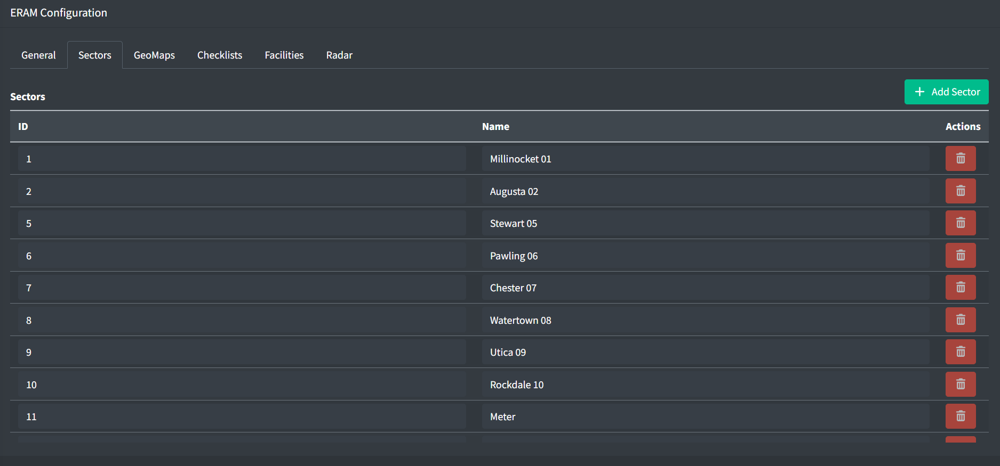

*Sectors*

An ERAM sector contains the following fields:

- **ID:** the numeric ID of the sector
- **Name:** the name of the sector
  >  Examples: `Kauai 02`, `Concord 37`

> ℹ️ Sectors imported from ERAM adaptation data may not be deleted

#### GeoMaps

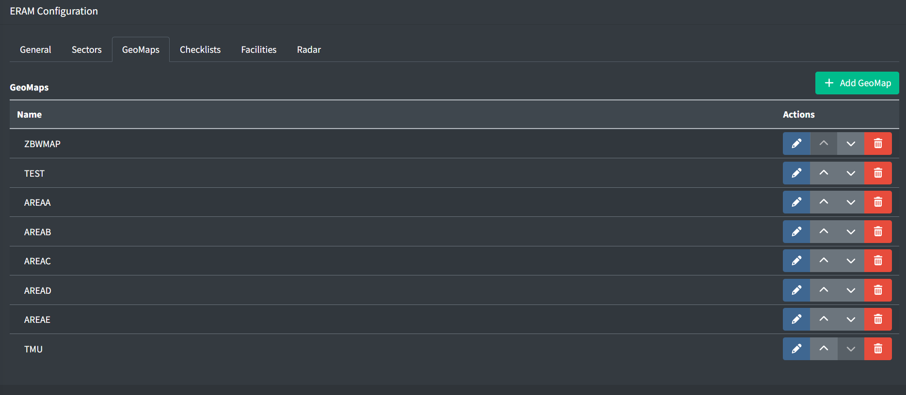

*GeoMaps*

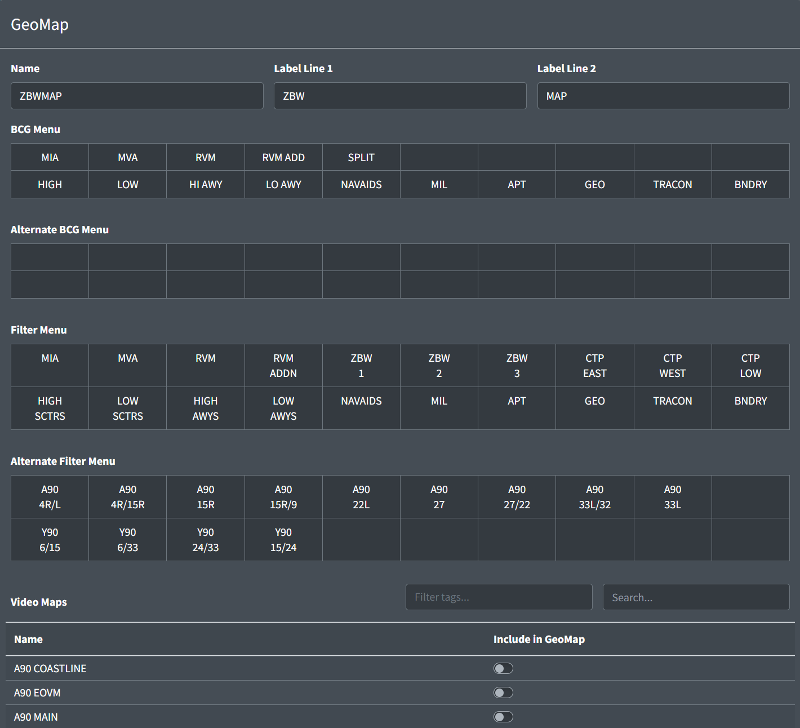

*Editing a GeoMa*

A GeoMap contains the following fields:

- **Name:** the name of the GeoMap displayed in the Data Admin website.
- **Label Lines 1 and 2:** the two lines of text displayed on the GeoMap's button in ERAM.
- **BCG Menu**: a set of 20 one-line labels displayed on the GeoMap's 20 Brightness Control Group (BCG) buttons in ERAM.
- **Alternative BCG Menu**: a set of 20 additional one-line labels displayed on the Alternative BCG Menu for use with Alternative Filters
- **Filter Menu**: a set of 20 two-line labels displayed on the GeoMap's 20 Filter Menu buttons in ERAM.
- **Alternative Filter Menu**: a set of 20 additional two-line labels displayed on the Alternative Filter Menu. These filters should be unrealistic or less frequently used, such as RVM maps for working top-down.
- **Video Maps**: the set of video maps to include in the GeoMap.

  > ℹ️ For more information on creating and uploading video maps, please see the [Video Maps](video-maps.md) section of the documentation.

#### Checklists

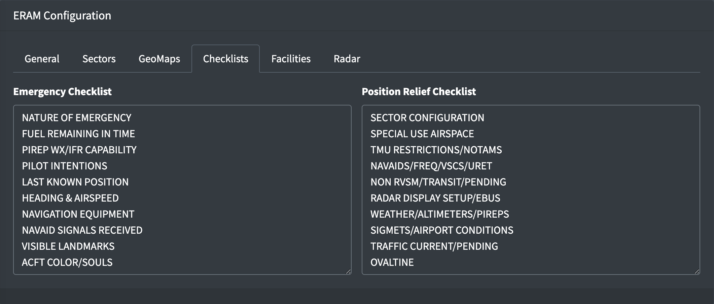

*Checklist items*

Emergency and position relief checklists are the list of items for the ARTCC's ERAM checklists. Each checklist should have one item per line, with a maximum of 10 lines.

#### Facilities

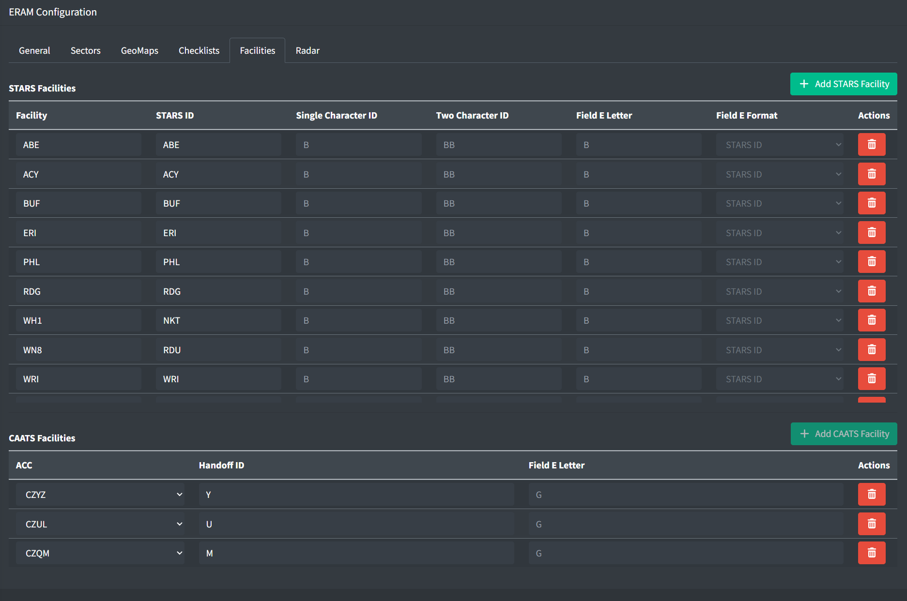

*The facilities tab*

The facilities tab contains configuration on other facilities surrounding and internal to the ARTCC.

##### STARS Facilities

STARS facilities allow you to configure the STARS facilities known by the ERAM system. A STARS facility contains the following fields:

- **Facility**: the facility ID of the STARS facility

  > ℹ️ If the STARS facility is either a child of the ARTCC or listed in the neighboring facilities list, it will be eligible for automated handoffs. If the facility is neither a child nor a neighbor, automated handoffs cannot be completed to the facility. These STARS facilities only require a STARS ID to be specified, for display in ERAM data blocks.
- **STARS ID**: a unique three character ID for the facility, which can used to initiate handoffs as described below

The following fields are only valid for STARS facilities with automated handoffs (child or neighbor):

- **Single Character ID**: an optional unique single letter, which can used to initiate handoffs as described below
- **Two Character ID**: an optional unique two letter ID for display in ERAM data blocks
- **Field E Letter**: an optional single letter other than the Single Character ID for display in ERAM data blocks
- **Field E Format**: one of the following formats for referencing this facility in ERAM data blocks:

  - **One Letter and Subset**: `B1D`, where `B` is the Single Character ID (or Field E Letter if defined), `1` is the subset, and `D` is the sector ID (subset and sector ID are defined by the STARS facility)
  - **Two Letters**: `BOD`, where `BO` is the Two Character ID and `D` is the sector ID
  - **Two Letters and Subset**: `BO1D`, where `BO` is the Two Character ID, `1` is the subset, and `D` is the sector ID
  - **One Letter and STARS ID**: `ABOA`, where `A` is the Field E Letter, and `BOA` is the STARS ID
  - **STARS ID**: `BOA`, where `BOA` is the STARS ID. This is only for STARS facilities without automated handoffs.

Given a STARS facility that is either a neighbor or child (automated handoffs are enabled) with a STARS ID of `BOA` and a Single Character ID of `B`, a handoff to sector `D` in subset `1` could be initiated using any of the following references:

- **B** (Single Character ID)
- **BOA** (STARS ID)
- **B1D** (Single Character ID + Subset + Sector ID)
- **BOA1D** (STARS ID + Subset + Sector ID)

##### CAATS Facilities

For ARTCCs that neighbor one or more CAATS (Canadian) facilities, CAATS facilities allow you to configure the CAATS facilities known by the ERAM system. A CAATS facility contains the following fields:

- **ACC**: the ACC ID of the CAATS facility

  > ℹ️ All Canadian TCU (approach) facilities are children of an ACC and only the parent ACC needs to be specified in this list.
- **Handoff ID**: a unique one letter ID for handoffs with this ACC or one of its child facilities
- **Field E Letter**: an optional one letter ID to replace the ACC's handoff ID when displayed in ERAM data blocks

##### Coordination Fixes

For ARTCCs that neighbor one or more non-US facilities that support NAM Common Coordination (currently MMZT, MMTY, and MMID), the list of coordination fixes is used to generate flight plan transfer coordination messages.

#### Radar

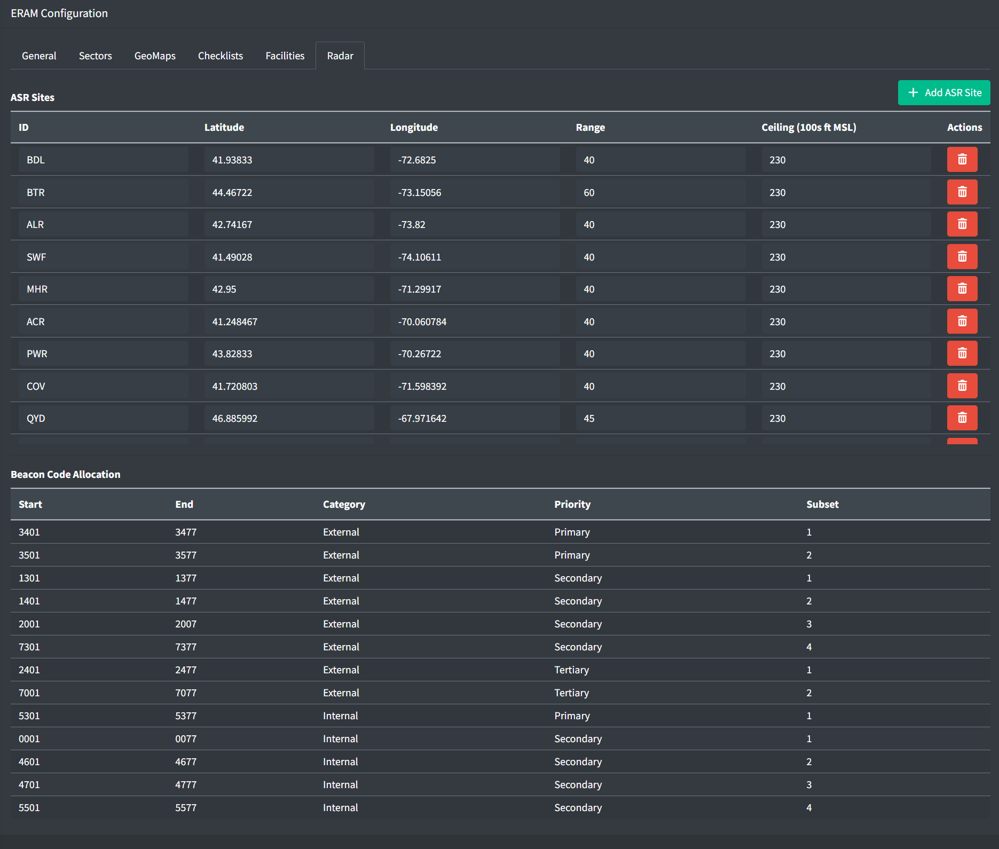

*The radar tab*

The radar tab contains configuration for different radar facilities within ERAM.

##### ASR Sites

Airport Surveillance Radars (ASRs) are used by ERAM to determine areas of reduced lateral separation requirements. An ASR Site contains the following fields:

- **ID:** the three or four letter identifier of the ASR
- **Latitude and Longitude:** the location of the ASR
- **Range:** the range of the ASR in nautical miles
- **Ceiling:** the ceiling of the ASR in hundreds of feet MSL

##### Beacon Code Allocation

The beacon code allocation table is pre-populated with data from [JO 7110.66](https://www.faa.gov/regulations_policies/orders_notices/index.cfm/go/document.information/documentID/1040351) - the National Beacon Code Allocation Plan. Each beacon code bank contains starting and ending beacon codes, whether the bank is utilized for traffic internal to or external to (departing) the ARTCC, the bank's priority ranking, as well as its subset within the ranking.

> ⚠️ If you spot an error, please reach out to an administrator through the [vNAS Discord server](https://discord.gg/MFtQbd9Svs).

Unlike legacy clients, an ARTCC's beacon code bank will be used for all flight plans originating within the ARTCC. If the flight plan will remain within the ARTCC, it will receive an Internal beacon code. If the flight plan will depart the ARTCC, it will receive an External beacon code. This beacon code bank will be drawn from to automatically assign to new flight plans, as well as when a controller from **any** underlying facility manually requests a beacon code.

### Positions

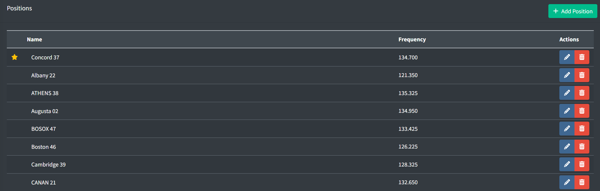

*Positions*

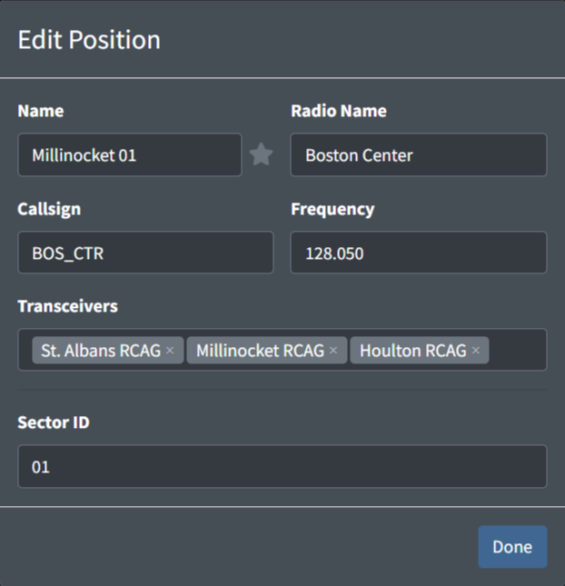

*Editing a position*

> ℹ️ Controllers working an ARTCC position must use ERAM as their primary system.

> ℹ️ A position can be "starred" to bring it to the top of the position list. This can be useful when designating a consolidated position.

An ARTCC position contains the following fields:

- **Name:** the name of the position. This is how a controller identifies a facility's position to sign in to.

  Table 5 - ARTCC position name examples

  |  Valid Position Names |  Invalid Position Names |
  | --- | --- |
  | Concord 37 | 37 Boston |
  | ATHENS 58 | 58 |
  | Gardner 36 | B36 |
  | Boston 46 | Boston Center |

  > ℹ️ Some en route facilities (such as ZLA) do not specify position names. In this case, naming positions as `Sector ##` is preferred so messages from that position will read `ZLA Sector ##`.
- **Star:** a way to designate primary/consolidated positions. This does not have any functional behavior besides displaying starred positions at the top of the sign on list with a star.
- **Radio Name:** the callsign a controller working the position identifies as on the radio

  >  Examples: `Boston Center`, `New York Center`
- **Callsign:** the callsign the controller will log in to the VATSIM network as

  >  Examples: `BOS_CTR`, `CHI_81_CTR`

  > ℹ️ Note that duplicate callsigns will automatically be prevented, so if all positions are assigned the `BOS_CTR` callsign and two controllers log in to split ZBW, the first will be assigned the default callsign of `BOS_CTR`, while the second will be assigned the callsign `BOS_1_CTR`.
- **Frequency:** the frequency assigned to the position

  >  Example: `134.700`
- **Transceivers:** the transceivers assigned to the position
- **Sector ID:** the two digit ID assigned to the sector used for handoffs

  >  Examples: `08`, `37`

---

## TRACON and RAPCON Facilities

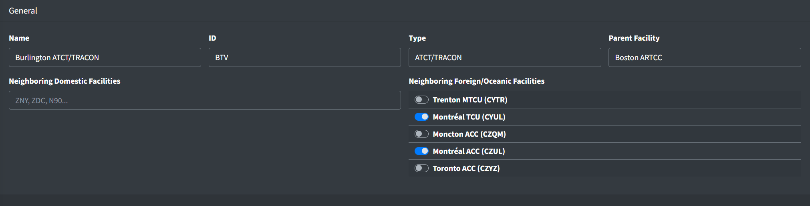

*TRACON general configuration*

### General

A TRACON facility contains the following general fields:

- **Neighboring Domestic Facilities:** a list of facility IDs for domestic (vNAS) facilities that laterally neighbor the TRACON. When positions from these facilities are staffed they will appear in the CRC controller list.

  > ⚠️ Do not include the TRACON's parent ARTCC, or facilities that underlie the TRACON (child facilities).

  > ℹ️ Do include facilities that might not neighbor the TRACON, but could work a neighboring facility top-down. For example, N90 borders PVD while ZNY does not. However, since ZNY might assume N90's airspace, PVD's list of neighboring facilities should include both `N90` and `ZNY`.

  > ℹ️ Note that this field is simply labeled "Neighboring Facilities" for TRACONs within ARTCCs that do not neighbor foreign or oceanic facilities.
- **Neighboring Foreign/Oceanic Facilities**: a list of foreign and oceanic facilities that neighbor the TRACON. When positions from these facilities are staffed they will appear in the CRC controller list.

  > ℹ️ Note that this field does not appear for ATCTs within ARTCCs that do not neighbor foreign or oceanic facilities.

### STARS Configuration

#### General

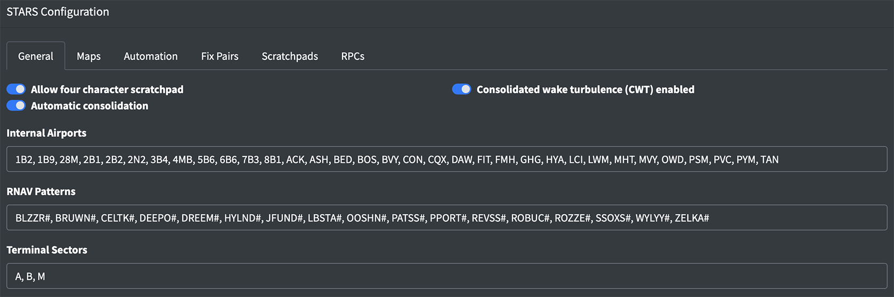

*STARS general configuration*

A TRACON's STARS configuration contains the following general fields:

- **Allow four character scratchpad:** allows controllers to input a fourth character in a datablock's scratchpad.
- **Consolidated Wake Turbulence Enabled:** enables consolidated wake turbulence instead of weight classes.
- **Automatic consolidation:** enables automatic consolidation of TCPs using defined ownership.
- **Internal Airports:** a list of all towered and untowered airport IDs that underlie the TRACON.

  > ⚠️ Do not utilize a four letter ICAO ID for airports with an FAA ID.

  > ℹ️ Do list all towered and untowered airports, including child facilities.
- **RNAV Patterns:** a list of RNAV patterns used to determine if an aircraft is on RNAV routing. For flights on RNAV routing, an RNAV symbol appears in the data block based on the aircraft's category:

  Table 6 - RNAV data block symbols

  | Symbol | Category |
  | --- | --- |
  | M | RNAV and Jumbo |
  | B | RNAV and Heavy |
  | L | RNAV and B757 |
  | R | RNAV and not Jumbo, Heavy or B757 |

  RNAV patterns can contain a `#` to represent any digit. For example, `BLZZR#` would match both `BLZZR4` and `BLZZR5`.

  >  Example: `BLZZR#, BRUWN#`
- **Terminal Sectors:** a list of single character identifiers for the Terminal Sectors of a TRACON.

##### Area Configurations

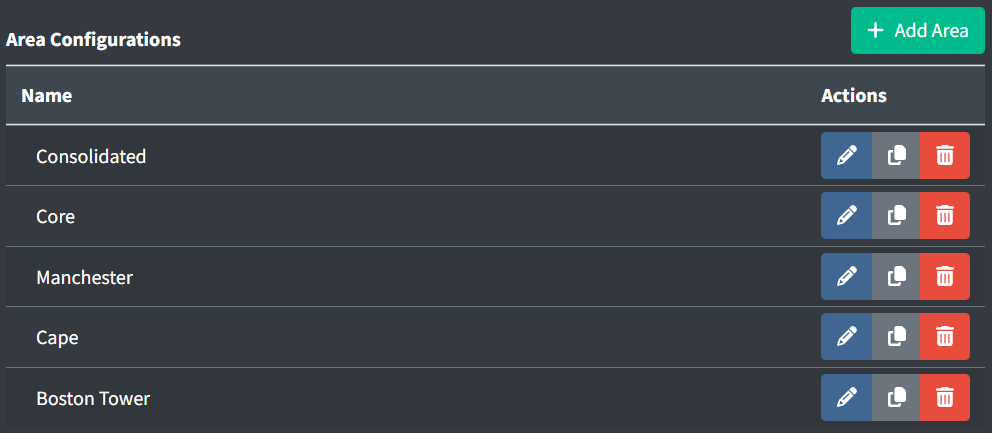

*STARS area configurations*

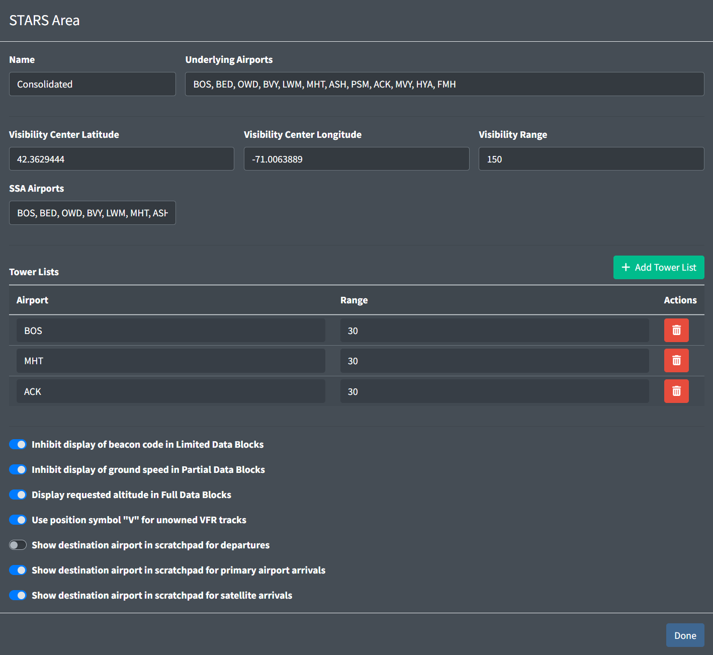

*Editing a STARS area*

STARS Areas are a new feature of CRC that allow large STARS systems to be broken up into smaller areas with unique configuration settings and video maps. Positions are tied to an area, so the video maps and settings can differ between positions within the same facility. There are a few ways to utilize this new feature:

- If you have a large TRACON with multiple distinct areas, you might consider creating an area for each. For example, A90 (Boston Consolidated TRACON) has three areas that are never consolidated: MHT, Core, and Cape. The ZBW FE may elect to create one area for each, so when working a position, controllers are only presented with the video maps and configuration relevant to the airspace being worked.
- If a large TRACON with multiple areas can be consolidated under one position, you may elect to create a "Consolidated" area. This area would include video maps for all areas being worked. For more information on how to create a duplicate position for working this consolidated area, please see the [STARS Positions](#positions_1) section of the documentation.
- If an underlying ATCT has a radar tower, you may elect to create an area dedicated to this tower. This would allow you to configure settings specific to that airport, such as only displaying that single airport in the SSA.

Area configurations contain the following fields:

- **Name**: the name of the area to be displayed in the Data Admin website.

  >  Examples: `Cape`, `Consolidated`, `Boston Tower`
- **Underlying Airports**: a list of airport IDs that underlie the STARS area.
- **Visibility Center**: the target visibility center for the area

  > ℹ️ The Visibility Center can be left empty for ATCT/TRACONs and ATCT/RAPCONs to default to the airport's location.
- **Visibility Range**: the target visibility range for the area, centered at the Visibility Center
- **SSA Airports**: a list of airport IDs to include in the SSA.

  > ⚠️ Airports IDs must also be in the facility's internal airports list.

  > ℹ️ Airports will appear in the SSA in the order they are entered here.
- **Tower Lists**

  > ⚠️ Areas must have at least one, but no more than three tower lists.

  > ℹ️ The first tower list's airport will be considered the area's primary airport.

  Tower lists contain the following fields:
  - **Airports:** the ID of the tower list's airport.

  ```
  !!! warning "Airports IDs must also be in the facility's internal airports list."
  ```

  - **Range**: the range in nautical miles an arrival must be within the airport to be added to the tower list.
- **Data Block options:** a set of self-explanatory data block options.

##### STARS Handoffs

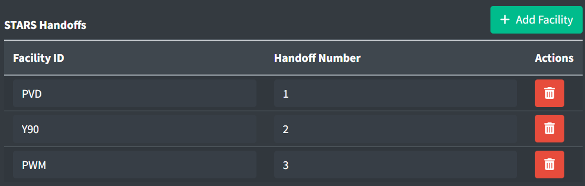

*STARS handoffs*

STARS handoffs allow you to configure handoffs to other STARS systems. Each STARS handoff must contain a [neighboring](#general_2) facility's ID and a unique handoff number.

Controllers will use this handoff number to direct a handoff to its associated STARS facility. For example, if PVD's identifier is `1` and a controller directs a handoff to `Δ1G`, the track will be sent to PVD's sector G.

##### Beacon Code Allocation

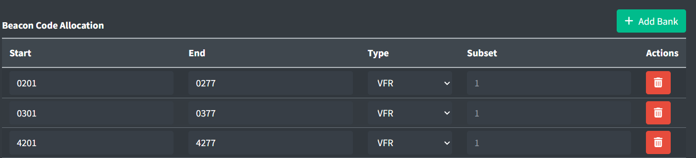

*Beacon code allocation table*

Unlike legacy clients, vNAS beacon codes will be allocated from the ARTCC's NAS code bank. However, TRACONs can also maintain a bank of internal beacon codes.

Beacon code banks contain the following fields:

- **Start/End:** the starting and ending beacon codes for the bank.

  > ⚠️ Start and end beacon codes must be discrete (cannot end in `00` such as `1300`).
- **Type:** if an aircraft is assigned a VFR beacon code, MSAW processing will be inhibited.
- **Subset:** an optional field. If provided, only positions within the same subset will be able to assign beacon codes from the bank.

#### Maps

##### Video maps

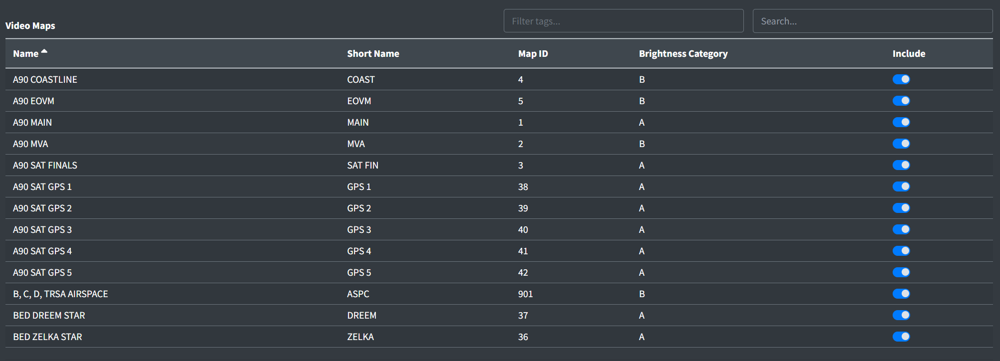

*Video maps*

The Video Maps table contains the list of video maps to include in the STARS system.

> ⚠️ Only selected video maps and video maps eligible to be selected will appear in the table. Video maps are eligible to be selected if they have a STARS ID that does not match any currently selected video map's STARS ID.

> ℹ️ For more information on creating and uploading video maps, as well as editing STARS IDs, please see the [Video Maps](video-maps.md) section of the documentation.

##### Map Groups

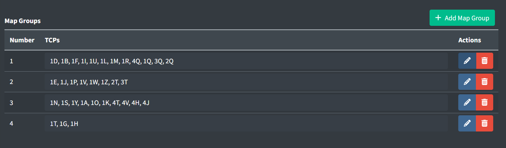

*Map Groups*

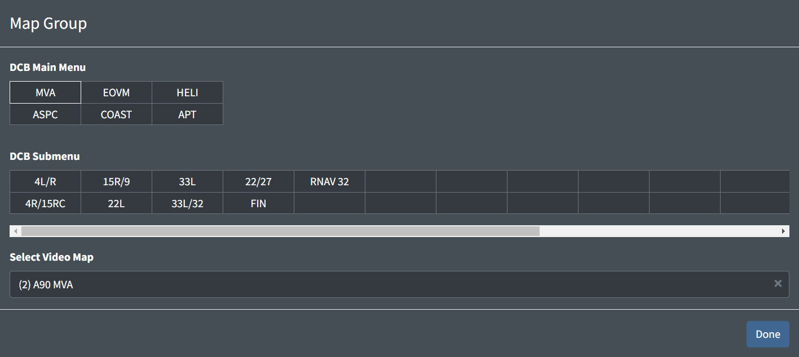

*Editing a Map Grou*

Map groups contain the following fields:

- **TCPs:** a list of the TCPs (Subset + Sector ID) to assign the map group to. Please see the [STARS Positions](#positions_1) section of the documentation for more information on assigning Subsets and Sector IDs.

  > ⚠️ TCPs cannot be duplicated either within a map group or between map groups.
- **DCB Main Menu:** up to six video maps that appear in the main DCB menu
- **DCB Submenu:** up to 32 additional video maps to appear in the DCB Maps submenu

Video maps are assigned by first selecting a cell, then choosing a video map from the dropdown. Video maps in the dropdown display their STARS ID in parenthesis. Note that only video maps selected in the facility's video maps list will appear in the dropdown.

#### Automation

##### TCPs

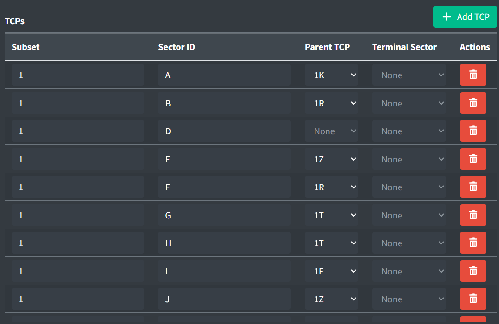

*TCPs table*

TCPs (Terminal Control Positions) define all logical positions in a TRACON.

TPCs contain the following fields:

- **Subset:** the STARS system subset to which the TCP belongs.

  >  Examples: `1`, `2`
- **Sector ID:** the TCP's ID.

  >  Examples: `D`, `M`
- **Parent TCP:** the TCP that typically assumes control of this TCP when it is not active.

  > ⚠️ Only assign logically similar parent TCPs. For example, do not assign a TRACON TCP as the parent of an ATCT TCP.
- **Terminal Sector:** the Terminal Sector that this TCP belongs to.

##### Configuration Plans

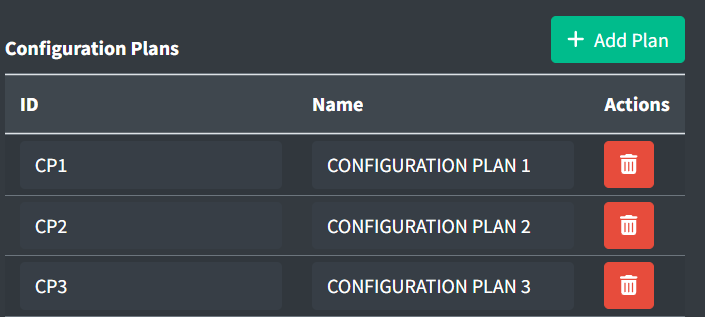

*Configuration plans table*

Configuration plans are used to select which sets of values will be applied for routing and consolidation decisions throughout STARS.

Configuration plans contain the following fields:

- **ID:** the configuration plan's ID.
- **Name:** the name of the configuration plan for display in the Data Admin website.

##### ATPA Volumes

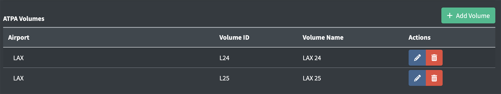

*ATPA Volumes*

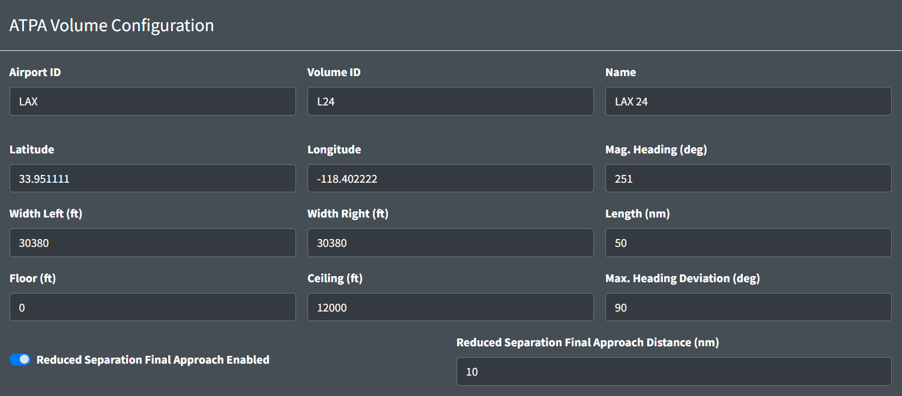

*Editing an ATPA Volume*

ATPA Volumes contain the following fields:

- **Airport ID:** the ID of the airport this volume applies to.
- **Volume ID:** an alphanumeric ID for the volume. Must be unique per TRACON.
- **Name:** a name for the volume.
- **Latitude:** the latitude of the midpoint of the runway's threshold at the approach end.
- **Longitude:** the longitude of the midpoint of the runway's threshold at the approach end.
- **Mag. Heading:** the runway's magnetic heading in degrees.
- **Width Left:** The width in feet of the ATPA Volume left of the runway centerline.
- **Width Right:** The width in feet of the ATPA Volume right of the runway centerline.
- **Length:** The length in nm of the ATPA Volume from the runway threshold.
- **Floor:** the minimum altitude at which an aircraft is eligible for ATPA processing.
- **Ceiling:** the maximum altitude at which an aircraft is eligible for ATPA processing.
- **Max. Heading Deviation:** the greatest allowable difference in degrees between the runway heading and an aircraft's heading for it to remain eligible for ATPA processing.
- **Reduced Separation Final Approach Enabled:** enables 2.5nm reduced separation spacing on final approach.
- **Reduced Separation Final Approach Distance:** the distance in nm from the runway's threshold within which 2.5nm reduced separation spacing is applied (if enabled).

###### ATPA Scratchpad Entries

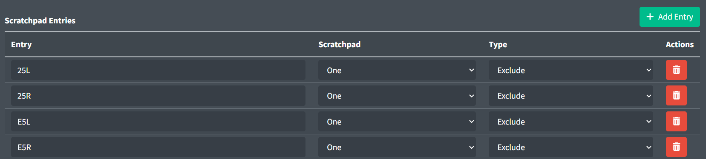

*ATPA Scratchpad Entries*

ATPA Scratchpad Entries contain the following fields:

- **Entry:** the scratchpad entry.
- **Scratchpad:** the scratchpad.
- **Type:** the type of Scratchpad Entry. Exclude entries denote aircraft excluded from ATPA processing. Ineligible entries denote aircraft ineligible for receiving an ATPA cone, but still considered for ATPA processing.

> ℹ️ Exclude entries are primarily used for aircraft not destined to this ATPA Volume's runway, and therefore should be excluded from ATPA processing. Ineligible entries are primarily used for aircraft on visual approach or maintaining visual separation from the preceding aircraft, and therefore do not require an ATPA cone, yet are still considered for ATPA processing for the in-trail aircraft.

###### ATPA TCP Display

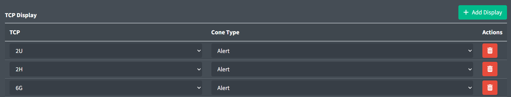

*ATPA TCP Displays*

ATPA Displays contain the following fields:

- **TCP:** the position's TCP (Subset + Sector ID).
- **Cone Type:** the type of ATPA cones to display.

###### ATPA TCP Exclusions

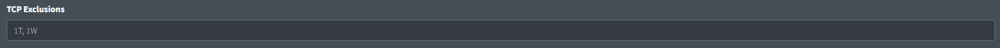

*ATPA TCP Exclusions*

- **TCP Exclusions:** the list of TCPs whose tracks are excluded from ATPA processing.

##### Lists

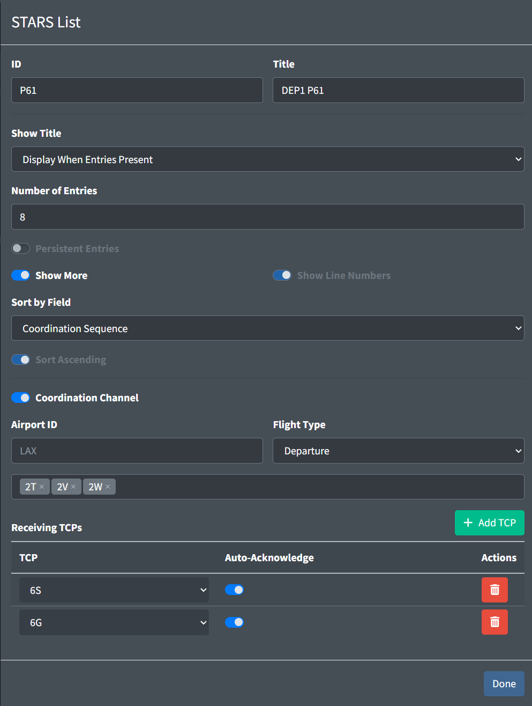

*Editing a list*

Lists configure various types of tabular data displayed in STARS. Currently, only coordination lists are supported.

Lists contain the following fields:

- **ID:** the list's ID.

  > ℹ️ List IDs must contain 2-4 alphanumerics and begin with a P.
- **Title:** the list's title.
- **Show Title:** when enabled, the list's title is shown in STARS.
- **Number of Entries:** initial number of entries the list is capable of displaying.
- **Persistent Entries:** when enabled, entries remain in the list until manually removed.
- **Show More:** when enabled, an indicator is displayed when there are too many entries to fit in the list.
- **Show Line Numbers:** when enabled, line numbers are displayed.
- **Sort by Field:** the list's sorting rules.
- **Sort Ascending:** when enabled, the list entries are sorted in ascending order.

##### Coordination Channel

Coordination Channels configure coordination lists to facilitate information transfer between controllers.

> ℹ️ Enabling a Coordination Channel enforces certain list option values.

Coordination Channels contain the following fields:

- **Airport ID:** the airport ID that must appear in the flight plan's departure or destination for the flight to be eligible for the list. If no airport ID is specified, flight plan departures and destinations are not considered when determining if a flight is eligible for the list.
- **Flight Type:** the type of flights eligible for the list.
- **Sending TCPs:** the TCPs eligible to add flights to the list.
- **Receiving TCPs:** the TCPs eligible to acknowledge flights on the list.
- **Auto-Acknowledge:** when enabled, flights are automatically acknowledged by the associated receiving TCP.

#### Fix Pairs

##### Entry/Exit Fix Mappings

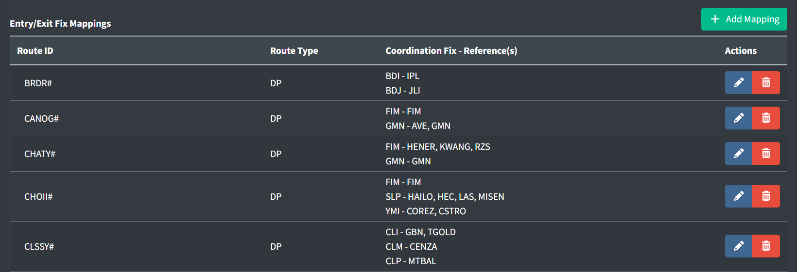

*Entry/Exit Fix Mappings*

Entry/Exit Fix Mappings map routes to Coordination Fixes. These are used by STARS to identify the entry and exit points of a TRACON, TCP routing, automatic flight data amendments, and more.

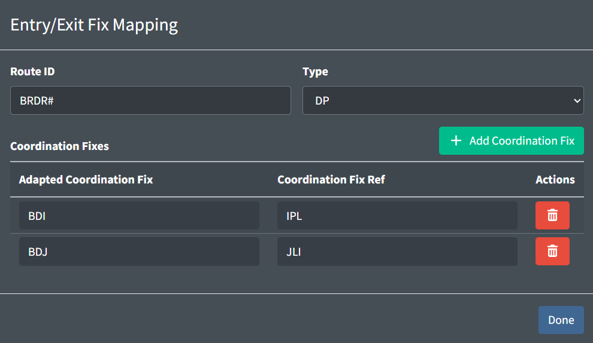

*Editing an Entry/Exit Fix Mapping*

Entry/Exit Fix Mappings contain the following fields:

- **Route ID:** the route's ID.

  > ℹ️ A `#` can be used to match any digit. For example, `LOGAN#` will match both `LOGAN2` and `LOGAN3`.
- **Type:** the route's type.
- **Adapted Coordination Fix:** the three letter entry or exit fix.
- **Coordination Fix Ref:** the fix in an aircraft's route to qualify the aircraft for this coordination fix.

#### Scratchpads

##### Scratchpad Rules

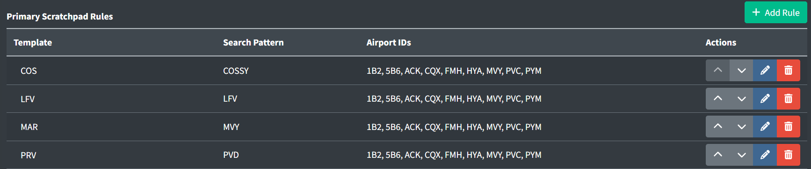

*Scratchpad rules*

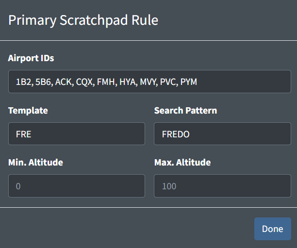

*Editing a scratchpad rule*

Scratchpad rules are used to automatically set a track's primary or secondary scratchpad. They contain the following fields:

- **Airport IDs:** a list of airport IDs that limit the application of the scratchpad to only aircraft with flight plans where the departure airport ID is contained in this list.

  > ⚠️ Airports IDs must also be in the facility's internal airports list.

  > ℹ️ Leaving this list empty will allow this scratchpad to be applied to aircraft with flight plans where the departure airport ID is contained in the facility's internal airports list.
- **Template:** the scratchpad template to be applied to the track.

  > ℹ️ A template may include `###` to be replaced with the aircraft's cruise altitude in hundreds of feet. For example, if the template `P###` were applied to an aircraft with a cruise altitude of FL230, then the scratchpad `P230` would be applied.
- **Search Pattern:** a route template that limits the application of the scratchpad to only aircraft with flight plans where the route begins with the template.

  > ℹ️ A `#` can be used to match any digit. This is helpful when defining SIDs with a variable digit. For example, the search pattern `LOGAN#` will match both `LOGAN2` and `LOGAN3`.
- **Min/Max Altitude:** limits the application of the scratchpad to only aircraft with flight plans where the cruise altitude is greater than the minimum, and less than the maximum altitude in hundreds of feet.

  > ℹ️ One or both of these altitudes may be left empty to remove the minimum and/or maximum altitude limit.

#### RPCs

##### Runway Pair Configuration

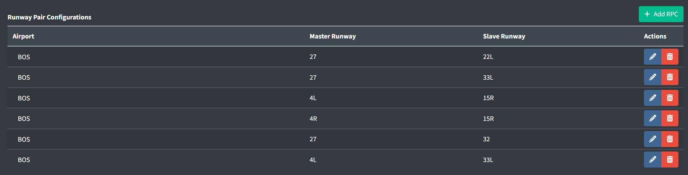

*Runway pair configurations*

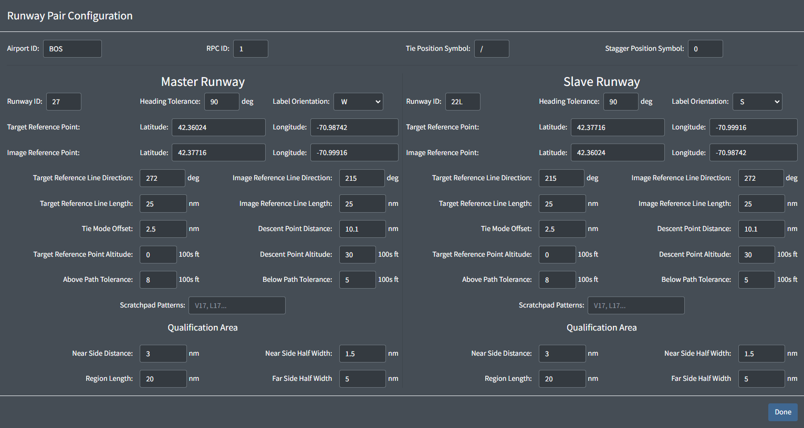

*Editing an RPC*

Runway Pair Configurations contain the following fields:

- **Airport ID:** the ID of the airport to apply the RPC configuration to.

  > ⚠️ The Airport ID must also be in the facility's internal airports list.
- **RPC ID:** a numerical ID, `1`-`8`. An airport's RPCs must all have unique IDs.

  > ℹ️ An airport can have up to 8 RPCs.
- **Position Symbols:** the character that STARS will use as the position symbol for the ghost tracks generated when this RPC is enabled.

The following configuration fields are divided into two areas: one for the **master Runway**, and one for the **Slave Runway**. Each runway has the same set of configuration options. These options describe both the horizontal and vertical qualification rules that determine which aircraft will generate a ghost target on the other runway when this RPC is enabled.

Two lines are defined which allow the CRDA system to determine the location of the qualification regions and where to plot the ghost targets on the associated runway. These lines are referred to as the Target Reference Line (TRL) and the Image Reference Line (IRL). These lines start at the Target Reference Point (TRP) and Image Reference Point (IRP), respectively. Refer to the figure below for an example of how these lines may be defined:

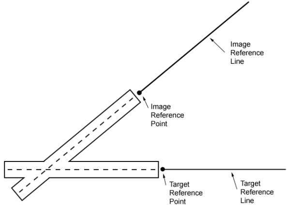

*CRDA reference lines*

The TRP and TRL define where the qualification region is located. Refer to the figure below for how the various parameters define the location and shape of the qualification region.

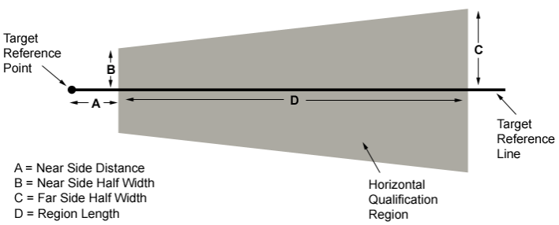

*CRDA qualification region (top down)*

Note that the length of the qualification region is determined by the "Region Length" parameter, not by the TRL length parameter. The TRL length parameter is only used to determine how long the TRL is when drawn on the radar display. The figure below shows a side view of the descent path area.

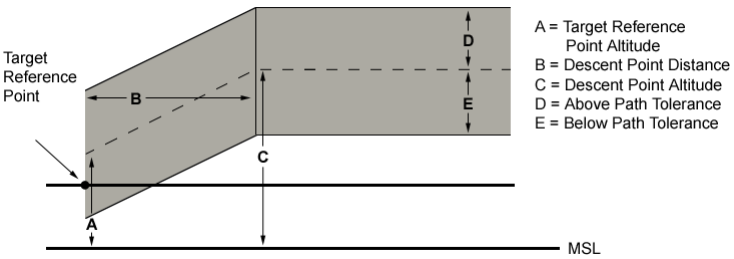

*CRDA descent path area (profile view)*

The grey shaded area indicates the nominal approach and descent path. Targets approaching the runway must be within the boundaries of the horizontal qualification region, and within this approach and descent path in order to be eligible to create a ghost target on the associated runway. Targets must also have a ground track that varies from the TRL heading by no more than the defined Heading Tolerance.

Optionally, you can define scratchpad strings, one of which must exist in the target's scratchpad in order for it to generate ghost targets. If the scratchpad patterns box is left empty, then a target can qualify for ghosting regardless of the contents of its scratchpad. You can enter multiple scratchpad strings. The scratchpad pattern is a partial search. In other words, if the scratchpad patterns box contains `27` and the target's scratchpad is "I27", then that target can generate a ghost if all other qualification parameters are met.

The Label Orientation dropdowns are used to specify in which direction the ghost track data blocks will be oriented.

By default, when a controller enables an RPC, ghosting is activated only for the master runway. Targets approaching the matching runways will be evaluated for ghost eligibility using the defined horizontal and vertical qualification parameters, and if all parameters are met, then a ghost will be generated along the Image Reference Line. The ghost track will be located the same distance from the Image Reference Point as its parent track is from the Target Reference Point.

Controllers can also activate ghosting from the Slave Runway to the Master Runway if desired.

### Positions

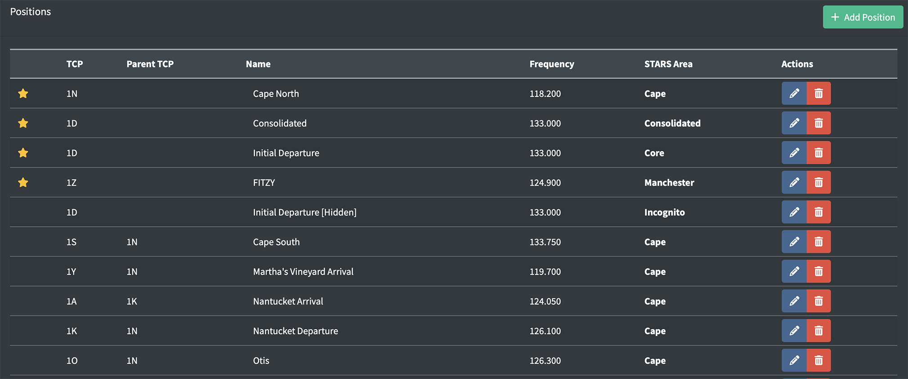

*Positions*

> ℹ️ A position's area name will display in the color of the position's color set.

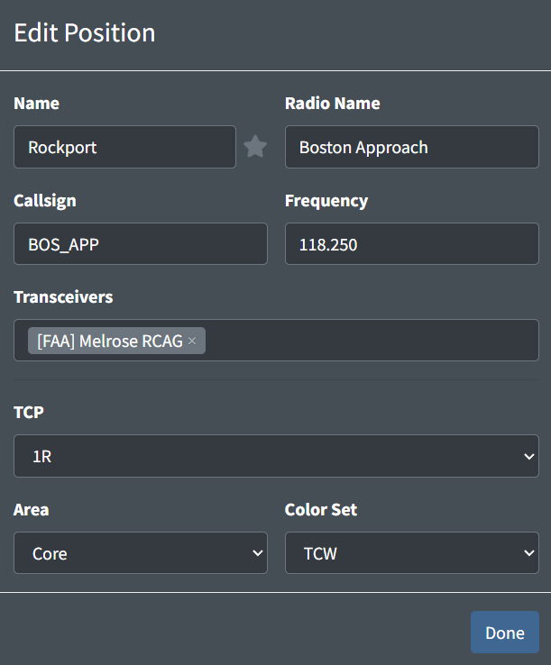

*Editing a position*

Any facility can have multiple positions with the same frequency and/or callsign. This is useful for TRACONs that may have a combined position with different properties from the original de-combined version. For example, consider N90 that consolidates on sector `K`. ZNY's FE may elect to create the following two positions:

Table 7 - Combined and de-combined positions

| Combined Position | De-combined Position |
| --- | --- |
| 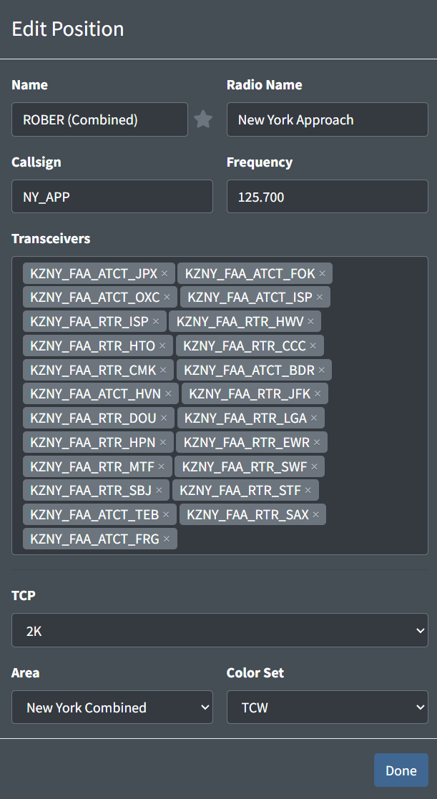 | 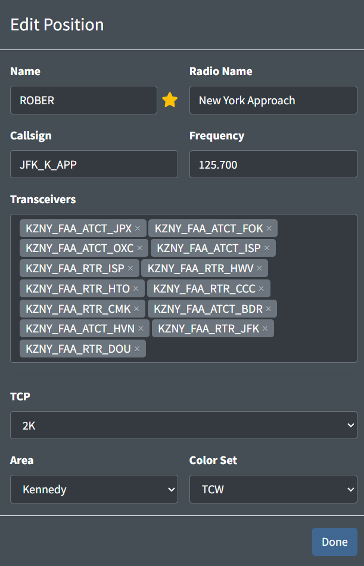 |

Since the combined position is in the `New York Combined` area, controllers will have access to a larger selection of video maps and a STARS system that is configured to work all N90 airports. Likewise, the de-consolidated position is in the `Kennedy` area, and will only have video maps pertinent to that airspace.

A TRACON position contains the following fields:

- **Name:** the name of the position. This is how a controller identifies a facility's position to sign in to.

  Table 8 - TRACON position name examples

  |  Valid Position Names |  Invalid Position Names |
  | --- | --- |
  | Initial Departure | Boston Approach |
  | Rockport | SR |
- **Star:** a way to designate primary/consolidated positions. This does not have any functional behavior besides displaying starred positions at the top of the sign on list with a star.
- **Radio Name:** the callsign a controller working the position identifies as on the radio

  >  Examples: `Boston Approach`, `New York Departure`
- **Callsign:** the callsign the controller will log into the VATSIM network as

  >  Examples: `BOS_DEP`, `CHI_Z_APP`

  > ℹ️ Note that duplicate callsigns will automatically be prevented, so if multiple positions are assigned the `BOS_APP` callsign and two controllers log in to split A90, the first will be assigned the default callsign of `BOS_APP`, while the second will be assigned the callsign `BOS_1_APP`.
- **Frequency:** the frequency assigned to the position

  >  Example: `121.900`
- **Transceivers:** the transceivers assigned to the position
- **TCP:** the TCP assigned to the position
- **Area:** the STARS area to assign the position to. This defines which STARS configuration such as video maps are available for this position.

  > ℹ️ For more information, please see the [STARS Area Configuration](#area-configurations) section of the documentation.
- **Color Set:** the color set to utilize on the STARS display

  > ℹ️ Most TRACON STARS displays should use the `TCW` color set, while RAPCON STARS displays should use the `DOD` color set.

All TRACON positions must use STARS as their primary system.

---

## ATCT Facility

### General

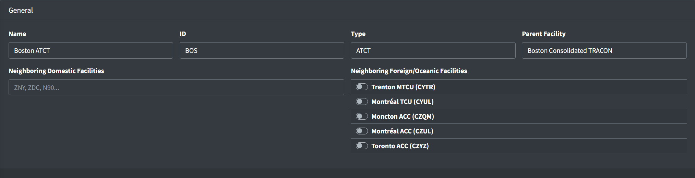

*ATCT general configuration*

An ATCT facility contains the following general fields:

- **Neighboring Domestic Facilities:** a list of facility IDs for domestic (vNAS) facilities that laterally neighbor the ATCT. When positions from these facilities are staffed they will appear in the CRC controller list.

  > ⚠️ Do not include the ATCT's parent facility.

  > ℹ️ Note that this field is simply labeled "Neighboring Facilities" for TRACONs within ARTCCs that do not neighbor foreign or oceanic facilities.
- **Neighboring Foreign/Oceanic Facilities**: a list of foreign and oceanic facilities that neighbor the ATCT. When positions from these facilities are staffed they will appear in the CRC controller list.

  > ℹ️ Note that this field does not appear for ATCTs within ARTCCs that do not neighbor foreign or oceanic facilities.

### Tower Cab Configuration

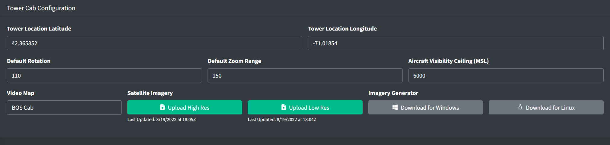

*Tower Cab configuration*

An ATCT's Tower Cab configuration contains the following fields:

- **Tower Location Latitude and Longitude**: the latitude and longitude of the physical air traffic control tower
- **Default Rotation**: the default true-north heading the Tower Cab display is oriented towards
- **Default Zoom Range**: the default range in hundreds of feet the Tower Cab is zoomed to
- **Target Visibility Ceiling**: the maximum altitude in feet MSL the Tower Cab can observe targets at
- **Video Map**: the video map displayed on the Tower Cab display

  > ℹ️ For more information, please see the [Video Maps](video-maps.md) section of documentation
- **Satellite Imagery**: the high and low resolution imagery generated by the Tower Cab Image Generator
- **Image Generator**: Windows and Linux downloads for the Tower Cab Image Generator

  > ℹ️ For more information, please see the [Tower Cab Image Generator](#tower-cab-image-generator) section of documentation.

#### Tower Cab Image Generator

To provide satellite imagery for Tower Cab display backgrounds, facility engineers must generate one high and one low resolution image for the airport. To do so, download the Tower Cab Image Generator from the [Tower Cab configuration](#tower-cab-configuration) inside an ATCT facility's configuration. After extracting the download, open a command-line interface program, such as Command Prompt on Windows, and navigate to the executable's directory.

The Tower Cab Image Generator takes one command line parameter: the airport's FAA ID. For example, to generate imagery for BOS, input the following command:

> `> TowerCabImageGenerator.exe BOS` (Windows)
>
> `$ ./TowerCabImageGenerator BOS` (Linux)

The Image Generator also take an optional secondary command line parameter: a URL to an image tile source such that the `x`, `y`, and `z` (zoom) values are inputted as variables inside curly brackets. For example, to use the USGS NAIP source for BOS, input the following command:

> `> TowerCabImageGenerator.exe BOS "https://gis.apfo.usda.gov/arcgis/rest/services/NAIP/USDA_CONUS_PRIME/ImageServer/tile/{z}/{y}/{x}"` (Windows)
>
> `$ ./TowerCabImageGenerator BOS https://gis.apfo.usda.gov/arcgis/rest/services/NAIP/USDA_CONUS_PRIME/ImageServer/tile/{z}/{y}/{x}` (Linux)

The Image Generator also accepts URLs that utilize the quad key format, inputted with a `{q}` variable.

> ℹ️ The Tower Cab Image Generator requires .NET 6 runtime. If it isn't already installed you can download it here: [Windows](https://dotnet.microsoft.com/en-us/download/dotnet/thank-you/runtime-desktop-6.0.10-windows-x64-installer) [Linux](https://learn.microsoft.com/dotnet/core/install/linux)

> ℹ️ If the image tile URL is omitted, the Image Generator will use the USGS NAIP source by default.

> ⚠️ If imagery is not available for the specified airport, the generator will output a 404 error. In this case, you must specify a different imagery source.

The Image Generator will begin downloading the tiles that make up the larger final image. After the tile download is complete, the Image Generator will construct the high and low resolution images and save them to the output directory. To use these images in a Tower Cab display, upload them to an ATCT's [Tower Cab configuration](#tower-cab-configuration).

> ⚠️ Note that when stitching together tiles, the generator may temporarily use up to 5 or 6 GB of memory.

### SAID Configuration

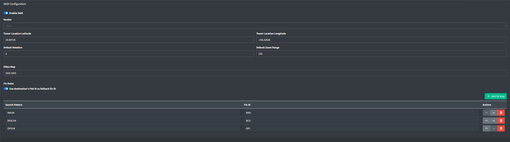

*SAID configuration (Saab)*

Enabling SAID presents the following fields:

- **Vendor:** the vendor of the airport's SAID system
- **Tower Location Latitude and Longitude**: the latitude and longitude of the physical air traffic control tower
- **Default Rotation**: the default true-north heading the SAID display is oriented towards
- **Default Zoom Range**: the default range in hundreds of feet the SAID display is zoomed to
- **Video Map**: the video map displayed on the SAID display. For more information, please see the [Video Maps](video-maps.md) section of documentation

#### Fix Rules

Refer to [ASDE-X Fix Rules](#fix-rules_1)

### ASDE-X Configuration

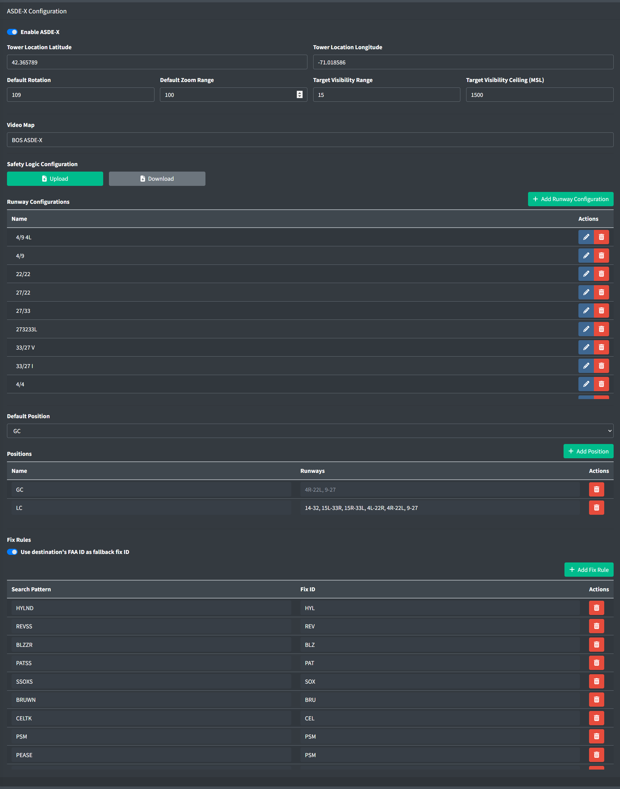

*ASDE-X configuration*

Enabling ASDE-X presents the following fields:

- **Tower Location Latitude and Longitude**: the latitude and longitude of the physical air traffic control tower
- **Default Rotation**: the default true-north heading the ASDE-X display is oriented towards
- **Default Zoom Range**: the default range in hundreds of feet the ASDE-X display is zoomed to
- **Target Visibility Range**: the maximum range in hundreds of feet ASDE-X can observe targets at
- **Target Visibility Ceiling**: the maximum altitude in feet MSL ASDE-X can observe targets at
- **Video Map**: the video map displayed on the ASDE-X display. For more information, please see the [Video Maps](video-maps.md) section of documentation

#### Safety Logic Configuration

The ASDE-X safety logic system relies on runway and hold short bar locations defined in a single GeoJSON file. This file contains a `FeatureCollection`:

Example:

```
{
  "type": "FeatureCollection",
  "features": [...]
}
```

The `FeatureCollection` contains three types of `Features`:

1. Runways (`Polygon`)
2. Taxiways (`Polygon`)
3. Hold short bars (`LineString`)

##### Runways

Runways are defined by a GeoJSON `Polygon` and contain a single property:

- `id`: the runway IDs in order of lowest to highest, separated by " - ".

> ⚠️ Ensure runway IDs are ordered from lowest to highest and are separated by a space, hyphen, space.

Table 9 - Runway ID examples

|  Valid Runway IDs |  Invalid Runway IDs |
| --- | --- |
| 9 - 27 | 9 |
| 18C - 36C | 9-27 |
| 17L - 35R | 27 - 9 |

Example:

```
{
  "type": "Feature",
  "properties": {
    "id": "15L - 33R"
    },
    "geometry": {
      "type": "Polygon",
      "coordinates": [...]
    }
}
```

The runway Polygon coordinates must be defined in the following order:

1. Left corner of the approach end of the lower runway identifier
2. Right corner of the approach end of the lower runway identifier (across the threshold)
3. Left corner of the approach end of the higher runway identifier (along the edge)
4. Right corner of the approach end of the higher runway identifier (across the threshold)
5. Starting corner to close the polygon

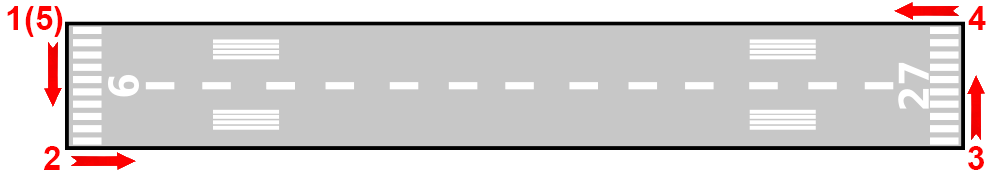

*ASDE-X runway polygon coordinate order*

> ⚠️ Ensure runway corners are defined in the correct order.

##### Taxiways

The ASDE-X Taxiway Arrival Prediction (ATAP) system generates alerts for aircraft that have mistakenly lined up for an approach to a taxiway easily mistaken for a parallel runway, such as taxiways F and C at SFO. Alert taxiways are defined by a GeoJSON `Polygon` and contain a single property:

- `id`: the taxiway ID, such as `M`

Example:

```
{
  "type": "Feature",
  "properties": {
    "id": "M"
    },
    "geometry": {
      "type": "Polygon",
      "coordinates": [...]
    }
}
```

The taxiway Polygon coordinates must be defined in the following order:

1. Left corner of one "approach" end
2. Right corner of the same "approach" end (across the "threshold")
3. Left corner of the other "approach" end (along the edge)
4. Right corner of the "approach" end (across the "threshold")
5. Starting corner to close the polygon

> ℹ️ Alerts will be generated for aircraft approaching either end of the taxiway.

##### Hold short bars

Hold short bars are defined by a GeoJSON `LineString` and contain three optional properties:

- `runwayId`: the runway this hold bar is protecting. The ID should be formatted in the same manner as the runway Polygon's `id` property, such as `9 - 27`.
- `crossRunwayId`: the intersecting runway an aircraft holding short of the `runwayId` runway would be waiting on. The ID should be formatted in the same manner as the runway Polygon's `id` property, such as `9 - 27`.
- `taxiwayId`: used for LAHSO, the taxiway aircraft should hold short of, such as `M`.

There are three types of hold bars, each requiring a different subset of properties:

- **Standard** hold bars denote the intersection of a taxiway with a runway.
- **Runway/Runway** hold bars denote the intersection of a runway with another runway.
- **Taxiway LAHSO** hold bars denote the intersection of a runway with a taxiway aircraft hold short of in LAHSO configurations. These hold bars are never displayed, and are only used for safety logic alert processing.

Table 10 - Hold bar property requirements

| Hold Bar Type | `runwayId` | `crossRunwayId` | `taxiwayId` |
| --- | --- | --- | --- |
| Standard |  |  |  |
| Runway/Runway |  |  |  |
| Taxiway LAHSO |  |  |  |

**Standard** Example:

This example defines a hold bar on a taxiway holding short of runway 9/27:

```
{
  "type": "Feature",
  "properties": {
    "runwayId": "9 - 27"
    },
  "geometry": {
    "type": "LineString",
    "coordinates": [...]
  }
}
```

**Runway/Runway** Example:

This example defines a hold bar on runway 18/36 holding short of runway 9/27:

```
{
  "type": "Feature",
  "properties": {
    "runwayId": "9 - 27",
    "crossRunwayId": "18 - 36"
    },
  "geometry": {
    "type": "LineString",
    "coordinates": [...]
  }
}
```

**Taxiway LAHSO** Example:

This example defines a hold bar on runway 18/36 for aircraft landing on 18/36 that must hold short of taxiway X:

```
{
  "type": "Feature",
  "properties": {
    "taxiwayId": "X",
    "crossRunwayId": "18 - 36"
    },
  "geometry": {
    "type": "LineString",
    "coordinates": [...]
  }
}
```

#### Runway Configuration

By selecting a runway configurations, controllers can specify which safety logic alerts are triggered based on active arrival and departure runways.

> ℹ️ Runway configurations rely on data defined in the safety logic GeoJSON.

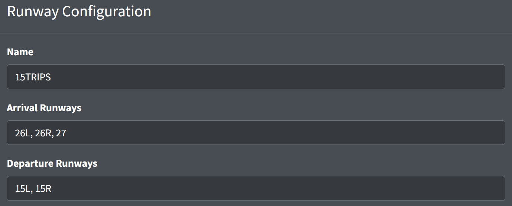

*ASDE-X runway configuration*

A runway configuration contains the following fields:

- **Name**: the configuration name
- **Arrival Runways**: the list of arrival runway IDs
- **Departure Runways**: the list of departure runway IDs

Land and hold short operation (LAHSO) definitions can be defined for a configuration.

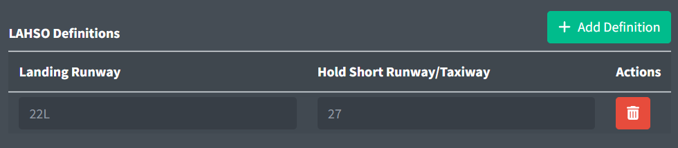

*ASDE-X LAHSO definitions*

LAHSO definitions contain the following fields:

- **Landing Runway**: the landing runway ID
- **Hold Short Runway/Taxiway**: the runway or taxiway ID aircraft hold short of

#### Positions

Each ASDE-X safety logic position contains a set of runway IDs. Controllers will only receive safety logic alerts for runways associated with the positions they have enabled.

- **Default Position**: One position must be marked as the default position. The default position cannot be disabled, and thus alerts for runways associated with the default position will display for all controllers.

#### Fix Rules

Fix rules are used to determine the three letter fix ID in a datablock. They contain the following fields:

- **Search Pattern:** a route template that assigns the fix ID to aircraft with flight plans where the route contains the template

  > ℹ️ A `#` can be used to match any digit. This is helpful when defining SIDs with a variable digit. For example, the search pattern `LOGAN#` will match both `LOGAN2` and `LOGAN3`.
- **Fix ID:** the three letter fix ID to assign

ASDE-X will assign the fix ID of the first matching rule. If none of the rules apply, the destination airport's FAA ID can be used as the fix ID by checking **Use destination's FAA ID as fallback fix ID**. Note that this will only work for destinations with an FAA airport ID.

### TDLS Configuration

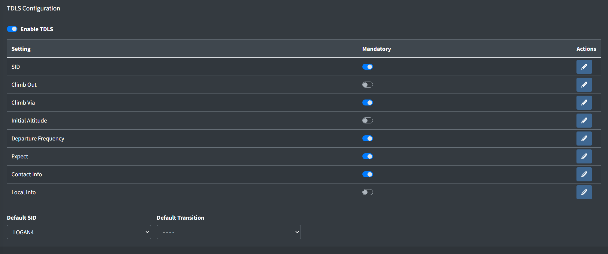

*TDLS configuration*

Enabling TDLS displays a table containing each clearance field. Selecting the "Mandatory" checkbox on a field's row requires controllers to input a selection for that given field prior to sending a clearance.

> ⚠️ Not all fields should be marked as mandatory. For example, a clearance cannot contain both a "climb via" instruction and an initial altitude, so both options should not be marked as mandatory at the same time.

Additionally, the following optional field may be set:

- **Enable DCL Operational Configurations**: enables [Operational Configurations](#operational-configurations)

  > 🛑 Disabling DCL Operational Configurations will also remove all associated SIDs. This cannot be undone.
- **Default SID/Default Transition**: the default SID and transition populated when TDLS is unable to determine an appropriate SID based on an aircraft's flightplan. This will populate the SID and transition fields, as well as any default clearance fields configured for the transition.

#### SID

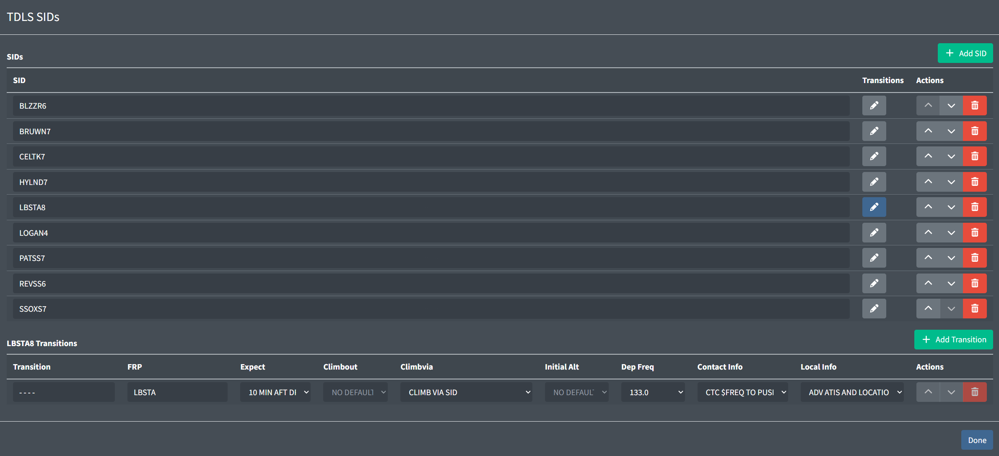

*TDLS SID with transitions*

To edit a SID's transitions, click the corresponding grey pencil icon. This will display a table at the bottom of the modal containing the SID's transitions.

Transitions contain the following fields:

- **Name:** the name of the transition.
- **FRP:** the transition's first route point (FRP). If a flightplan route begins with a waypoint matching a transition's FRP, TDLS will automatically select that transition.
- **Clearance Field dropdowns:** the default value to populate in each clearance field when the transition is selected.

> ⚠️ Note that SIDs must have at least one transition.

#### Clearance Fields

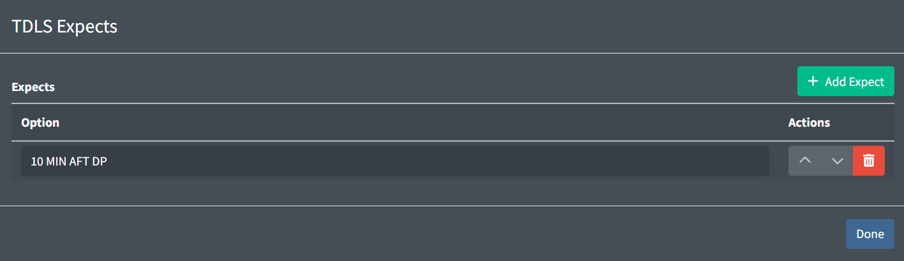

*Editing a clearance field*

TDLS contains the following clearance fields:

- **Climb Out:** instructions for pilots to follow after departure.

  >  Examples: `CARNASIE CLIMB`, `FLY HEADING 150`
- **Climb Via:** instructions for pilots to climb via a SID.

  >  Examples: `CLIMB VIA SID`, `CLIMB VIA SID EXC MAINT 10000FT`
- **Initial Altitude:** the top altitude pilots should initially climb to.

  >  Examples: `5000FT`, `FL230`
- **Departure Frequency:** the departure frequency pilots should expect to contact.

  >  Example: `133.0`

  > ℹ️ Controllers can also input a temporary departure frequency in TDLS. This is useful for sector consolidation, or top-down workflows.
- **Expect:** when a pilot should expect their filed cruise altitude.

  >  Examples: `10 MIN AFT DP`, `10 NM AFT DP`
- **Contact Info:** instructions for pilots to contact a controller after receiving their clearance. You may include the variable `$FREQ` for TDLS to automatically input the controller's primary frequency.

  >  Examples: `CTC 121.65 FOR PUSH`, `CTC $FREQ 5 MIN PRIOR TO PB`
- **LOCAL INFO:** any additional information for pilots to receive with their clearance. You may include the variable `$FREQ` for TDLS to automatically input the controller's primary frequency.

  >  Examples: `ADV ATIS`, `CENTRAL DEICING PROC IN EFFECT`

> ⚠️ Note that all fields are limited to 32 characters.

#### Operational Configurations

> ℹ️ When Operational Configurations are enabled for the first time, existing SIDs and their transitions are copied to the "Master" configuration.

Operational Configurations are used by some facilities to associate various SID and transition defaults with different configurations. For example, a facility may choose to have a West Configuration that applies different defaults to a SID than would be applied in an East Configuration (i.e. different departure frequencies and/or different maintain altitudes).

When enabled, Operational Configurations are edited through the [SID](#sid) modal.

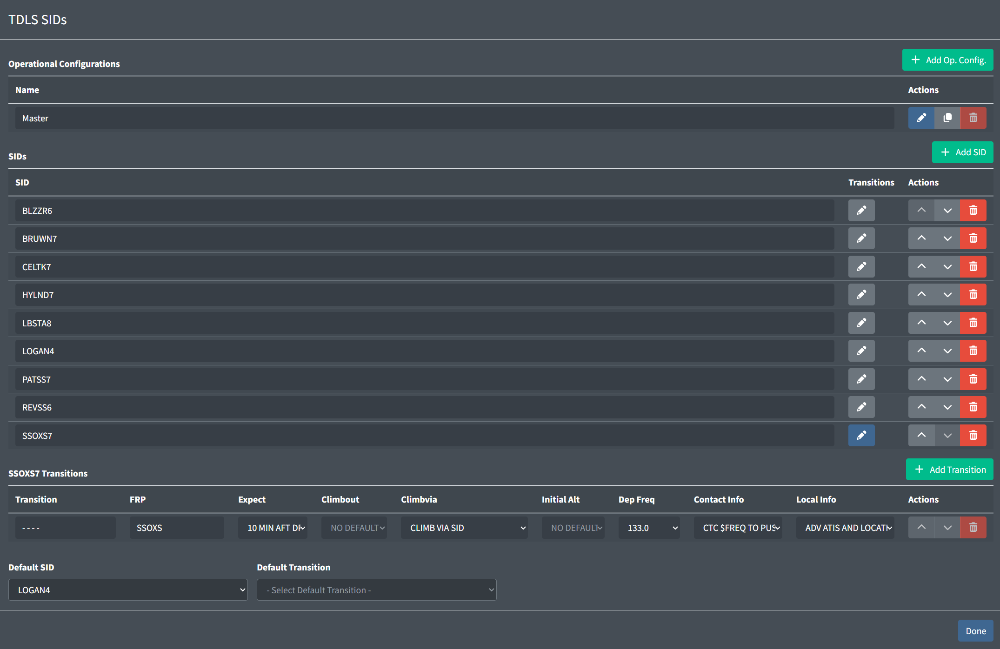

*Operational Configurations*

Operational Configurations contain the following fields:

- **Name:** the name of the Operational Configuration.
- **SIDs and Transitions:** the SIDs and transitions available in the Operational Configuration. Configuring SIDs and their transitions is identical to configuration when Operational Configurations are disabled.
- **Default SID/Default Transition**: the default SID and transition for the Operational Configuration.

### Flight Strips Configuration

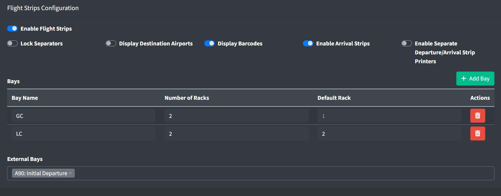

*Flight strips configuration*

Enabling flight strips displays the following configuration options for a facility:

- **Lock Separators:** locks separators so that only handwritten separators can be created, edited, or deleted
- **Display Destination Airports:** displays the destination airport ID on departure strips
- **Display Barcodes:** displays barcodes on departure and arrival strips
- **Enable Arrival Strips:** automatically prints arrival strips for inbound aircraft
- **Enable Separate Departure/Arrival Strip Printers:** enables two separate printers: one for departure strips and one for arrival strips

At least one bay must be added to the configuration's bay table. Each bay can contain between 1 and 5 vertical racks to hold flight strips. A rack may optionally be designated as the default rack strips are pushed to in the bay.

Flight strip bays owned by external facilities can be selected for controllers to push strips to. However, controllers will not be able to view or manipulate strips on these bays.

> ⚠️ A flight strip bay cannot be deleted if it is selected as an external bay in another facility's flight strips configuration.

> ℹ️ Flight strips are available for TRACON and ATCT facilities. However, new flight strips will only be printed at ATCT facilities. Flight strip should only be enabled for TRACON facilities if an underlying ATCT facility will push strips to them.

### Positions

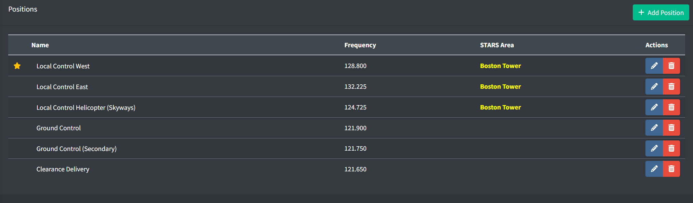

*Positions*

> ℹ️ If a position has STARS enabled, the position's area name will display in the color of the position's color set.

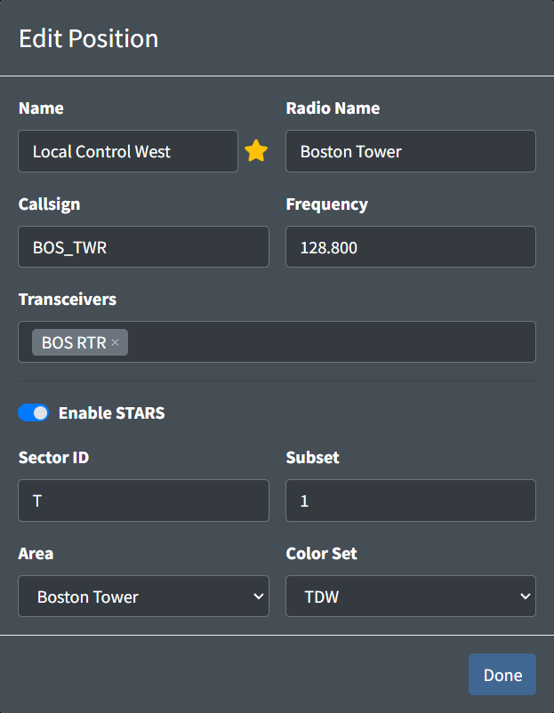

*Editing a position*

An ATCT position contains the following fields:

- **Name:** the name of the position. This is how a controller identifies a facility's position to sign in to.

  Table 11 - ATCT position name examples

  |  Valid Position Names |  Invalid Position Names |
  | --- | --- |
  | Local Control West | Boston Tower |
  | Clearance Delivery | CD |
- **Star:** a way to designate primary/consolidated positions. This does not have any functional behavior besides displaying starred positions at the top of the sign on list with a star.
- **Radio Name:** the callsign a controller working the position identifies as on the radio.

  >  Examples: `Boston Tower`, `Bradley Clearance Delivery`
- **Callsign:** the callsign the controller will log into the VATSIM network as.

  >  Examples: `BOS_TWR`, `ORD_O_GND`
- **Frequency:** the frequency assigned to the position.

  >  Example: `121.900`
- **Transceivers:** the transceivers assigned to the position

If the ATCT facility underlies a facility that hosts a STARS system, STARS can be enabled on its positions.

Enabling STARS displays the following fields:

- **Sector ID:** the ID assigned to the position for use in handoffs.

  >  Examples: `T`, `1V`

  > ⚠️ In most ATCTs, all positions should share the same Sector ID since there is usually only one STARS keyboard.
- **Subset:** the subset of the STARS system to add the position to.

  > ℹ️ For more information, please see the [STARS Configuration](#stars-configuration) section of the documentation.
- **Area:** the STARS area to assign the position to.

  > ℹ️ For more information, please see the [STARS Configuration](#stars-configuration) section of the documentation.
- **Color Set:** the color set to utilize on the STARS display.

  > ℹ️ Most ATCT STARS displays should use the `TDW` color set.

All ATCT positions can use ASDE-X or Cab Mode as their primary system, except for local control positions that have STARS enabled. When STARS is enabled for a local control position, controllers must use STARS as their primary system. Ground and clearance positions with STARS enabled may use STARS on a secondary display.
