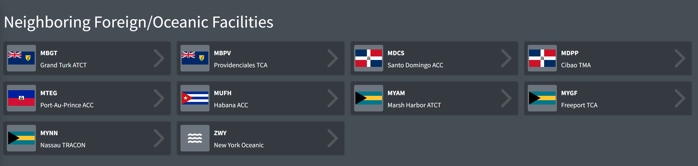
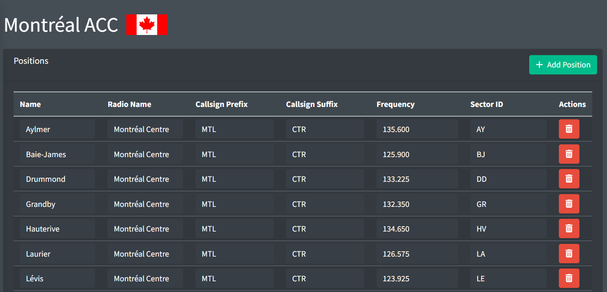
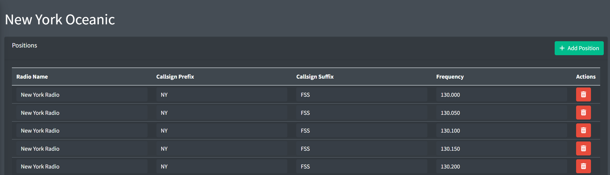

# Foreign/Oceanic Facilities

Foreign and Oceanic facilities contain data for non-vNAS facilities, such as those run by foreign organizations (NavCanada), or oceanic facilities not part of the vNAS system (New York Oceanic). If your ARTCC does not border any of these facilities, the Foreign/Oceanic Facilities module will not appear on the Data Admin website.

> ⚠️ Neighboring Foreign/Oceanic facilities are hardcoded and may only be changed by a vNAS administrator. If you spot an error, please reach out to an administrator through the [vNAS Discord server](https://discord.gg/MFtQbd9Svs).

*The foreign and oceanic facilities page*

## Foreign Facilities

### Positions

*A foreign facility*

Positions contain the following fields:

- **Name:** the optional name of the position. If no name is provided, the VATSIM network callsign is used.

  >  Examples: `Concordia`, `Lévis`
- **Radio Name:** the callsign a controller working the position identifies as on the radio.

  >  Examples: `Toronto Centre`, `Provo Approach`
- **Callsign Prefix:** the callsign prefix used by controllers working this position.

  >  Examples: `TOR`, `TTZP`
- **Callsign Suffix:** the callsign suffix used by controllers working this position.

  >  Examples: `CTR`, `APP`
- **Frequency:** the frequency assigned to the position.

  >  Example: `123.700`
- **Sector ID:** the ID to direct automated handoffs to the position. This value is only available for positions of CAATS (Canadian) facilities.

  >  Example: `CE`, `AN`

> ⚠️ Foreign facilities that border multiple vNAS ARTCCs share a universal list of positions that can be edited by administrators of any neighboring vNAS ARTCC. For example, the list of the Toronto ACC's positions can be edited by ZBW, ZOB, and ZMP administrators.

## Oceanic Facilities

### Positions

*An oceanic facility*

> ℹ️ Only the owning ARTCC may add positions to an oceanic facility.

Positions contain the following fields:

- **Radio Name:** the callsign a controller working the position identifies as on the radio.

  >  Examples: `New York Radio`, `San Francisco Radio`
- **Callsign Prefix:** the callsign prefix used by controllers working this position.

  >  Examples: `NY`, `ZAK`
- **Callsign Suffix:** the callsign suffix used by controllers working this position.

  >  Example: `FSS`
- **Frequency:** the frequency assigned to the position.

  >  Example: `131.950`
