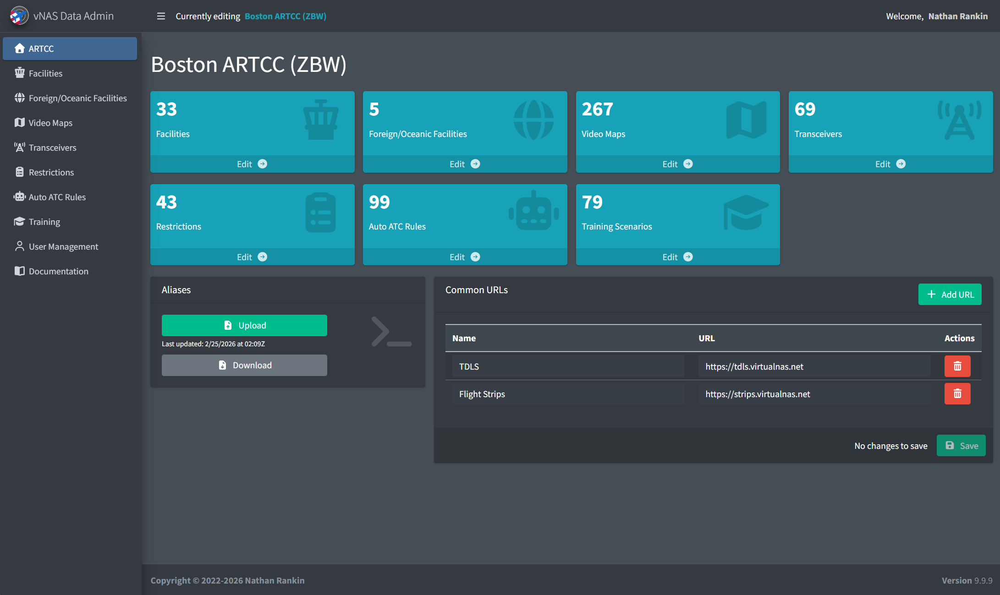
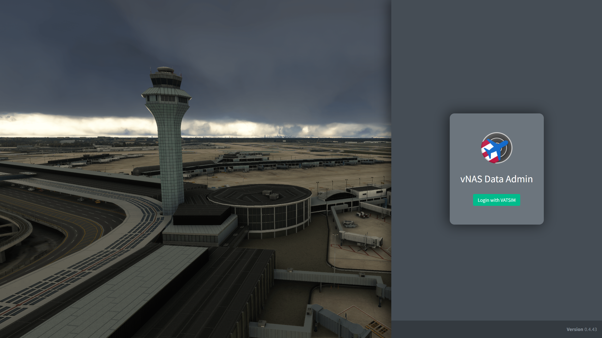
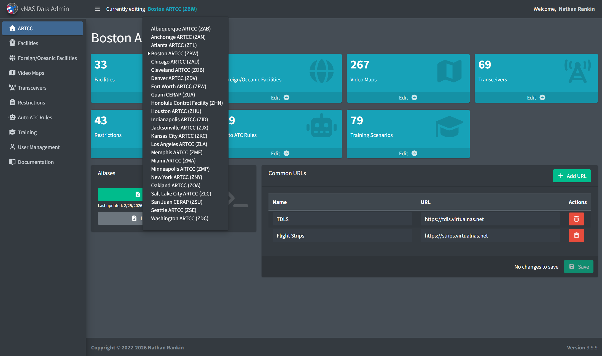
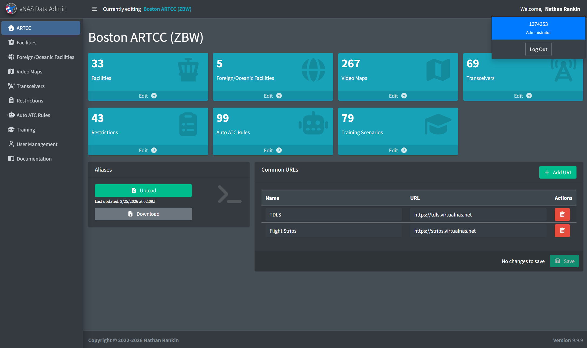

# vNAS Data Admin Documentation

*vNAS Data Admin homepage*

The Virtual NAS (vNAS) Data Admin website provides Facility Engineers (FEs) and other ARTCC administrators a central place to configure ARTCC-related data for vNAS systems, including CRC, vStrips, vTDLS, and ATCTrainer.

> ℹ️ The vNAS Data Admin website is accessed at <https://data-admin.vnas.vatsim.net>.

## Logging In

*Login page*

Logging in to the Data Admin website requires authentication through [VATSIM Connect](https://auth.vatsim.net/). Upon logging in to your VATSIM account and authorizing vNAS access, you are redirected back to the vNAS Data Admin login page. To access the Data Admin website, you must either be an active ATM, DATM, TA, or FE of a VATUSA facility, or have been added by an ARTCC administrator.

---

## Facility Homepage

### Selecting a Facility

*ARTCC selection*

If you have access to multiple ARTCCs, the active ARTCC is switched through the dropdown menu on the top bar.

### Logging Out

*Logout menu*

To log out, click on your name in the top right corner to display a dropdown menu with your VATSIM CID and role. Clicking **Log Out** logs you out of the Data Admin website.
