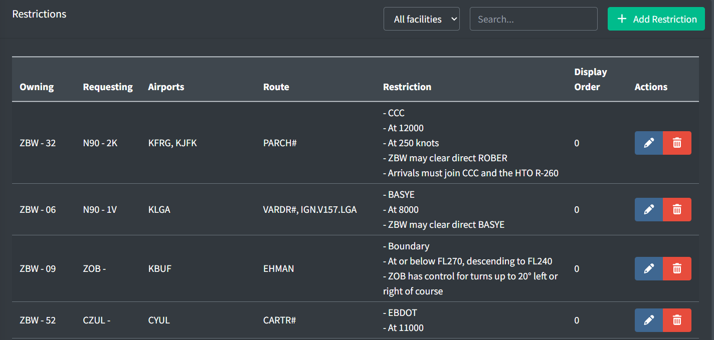
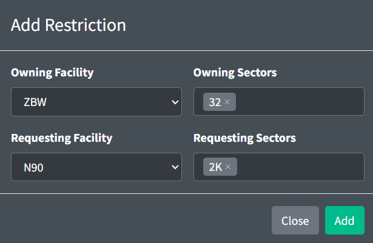
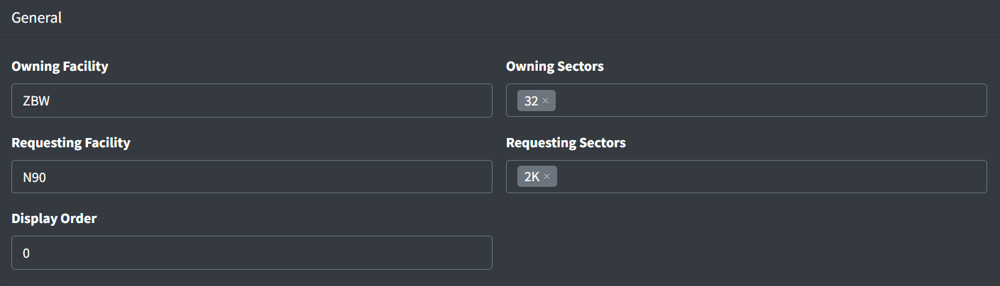
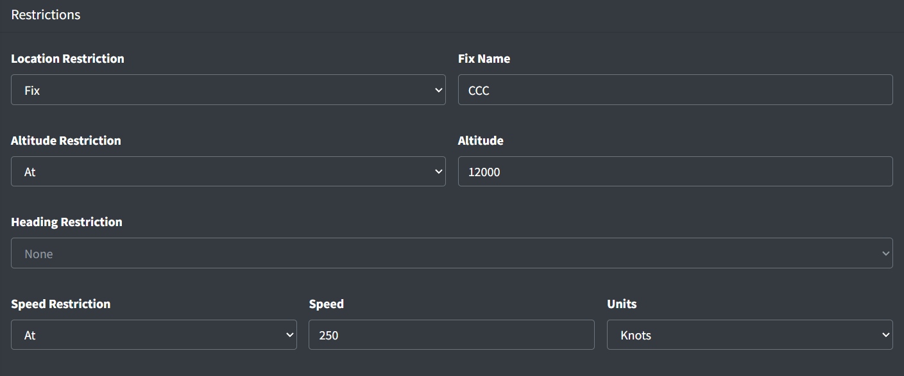

# Restrictions

Restrictions define coordinated items between neighboring sectors and facilities. They specify the conditions under which coordination is required and the coordinated items.

*Restrictions list*

## Airport Groups

*Airport groups*

Airport groups logically group airports, such as by location or relationship. An airport group name can be included in a restriction to specify the restriction applies to all airports in the group.

An airport group contains the following fields:

- **Group Name:** the name of the group used to indicate all included airports.
- **Airport IDs:** the list of IDs of the airports belonging to the group.

## Adding a Restriction

*Adding a restriction*

When adding a restriction, you must specify the owning and requesting facilities. The owning facility is the facility responsible for applying the restriction. The requesting facility is the downstream facility requesting the restriction be applied by the owning facility. The owning and requesting facilities may be the same if the restriction is internal. Owning and requesting sectors may be specified, but are optional.

## General

*Restriction general configuration*

A restriction contains the following general fields:

- **Owning Facility:** the facility that owns and is responsible for applying the restriction.
- **Owning Sectors:** an optional list of sectors within the owning facility responsible for applying the restriction.
- **Requesting Facility:** the facility that is requesting the coordinated items. This is typically the downstream facility.
- **Requesting Sectors:** an optional list of sectors within the requesting facility requesting the coordinated items.
- **Display Order:** a numerical value used to determine the order in which restrictions are displayed. Restrictions with lower numbers appear in lists before those with higher numbers.

> ⚠️ Facilities cannot be updated after a restriction is created.

## Criteria

*Restriction criteria*

The criteria identify the aircraft to which the restriction applies. The following criteria can be specified:

- **Applicable Airports:** an optional comma-separated list of airports and/or [airport group names](#airport-groups) to which the restriction applies. Examples include `KBMG`, `KIND sats`, and `KOSU, KTZR`.
- **Route:** an optional route string that the aircraft’s filed flight plan must match for the restriction to be applicable. Examples include `Q167.ZIZZI` and `DEALE#`.
- **Group Name:** an optional name of a group to which the restriction belongs.
- **Flow:** an optional name of an airport's flow in which the restriction applies.
- **Flight Type:** an optional type of flight to which the restriction applies (departures or arrivals).
- **Applicable Aircraft Types:** the aircraft types to which the restriction applies.

  > ℹ️ Not specifying any aircraft types denotes the restriction is applicable to all aircraft types.

## Restrictions

*Location, altitude, and speed restrictions*

The restrictions specify the coordination items that the requesting facility requests the owning facility to apply.

### Location Restrictions

Location restrictions define where coordinations must occur. A location restriction can be one of the following types:

Table 1 - Location restriction options

| Restriction Type | Description | Examples |
| --- | --- | --- |
| **Fix** | At a specified fix | `WAVEY`, `BRUWN`, `CCC` |
| **Boundary** | The boundary between the owning and requesting facilities or sectors |  |

### Altitude Restrictions

Altitude restrictions define coordinated altitudes. Where required, an altitude restriction may be specified in feet MSL, a flight level, or the lowest usable flight level. An altitude restriction can be one of the following types:

Table 2 - Altitude restriction options

| Restriction Type | Description |
| --- | --- |
| **At** | Aircraft crosses at the specified altitude |
| **At or above** | Aircraft crosses at or above the specified altitude |
| **At or below** | Aircraft crosses at or below the specified altitude |
| **Climbing to** | Aircraft is climbing to a specified altitude |
| **At or above, climbing to** | Aircraft crosses at or above the first specified altitude and is climbing to the second specified altitude |
| **Climbing via** | Aircraft is climbing via the procedure |
| **Descending to** | Aircraft is descending to a specified altitude |
| **At or below, descending to** | Aircraft crosses at or below the first specified altitude and is descending to the second specified altitude |
| **Descending via** | Aircraft is descending via the procedure |
| **Between** | Aircraft crosses at or above the first specified altitude and at or below the second specified altitude |
| **Any of** | Aircraft crosses at any of the specified altitudes |
| **Eastbound** | Aircraft is at an appropriate eastbound altitude |
| **Westbound** | Aircraft is at an appropriate westbound altitude |

> ℹ️ Altitude examples: `10000`, `FL240`, `LUFL`

### Heading Restrictions

Heading restrictions define coordinated headings. A heading restriction can be one of the following types:

Table 3 - Heading restriction option

| Restriction Type | Description |
| --- | --- |
| **Heading** | Aircraft is flying the specified magnetic heading |

### Speed Restrictions

Speed restrictions define coordinated speeds. Speeds may be specified as indicated airspeed in knots, or as a Mach number. A speed restriction can be one of the following types:

Table 4 - Speed restriction options

| Restriction Type | Description |
| --- | --- |
| **At** | Aircraft is at the specified speed |
| **At or greater than** | Aircraft is at or greater than the specified speed |
| **At or less than** | Aircraft is at or less than the specified speed |

## Notes

*Restriction notes*

Notes provide additional information regarding restrictions.

Notes contains the following fields:

- **Type:** the type of note

  - **General:** a general coordination information or context about the restriction.
  - **Control:** a control instruction.
  - **Excludes:** information specifying when the restriction does not apply.
  - **Flow:** information specifying the airport flows in which the restriction applies.
  - **AIT:** information detailing Automated Information Transfer procedures relevant to this restriction.
- **Note:** the text contents of the note to be displayed to controllers.
