# Training

The Training page contains data configuration options for Training Scenarios and Training Airports to be used within vNAS training clients, such as ATCTrainer.

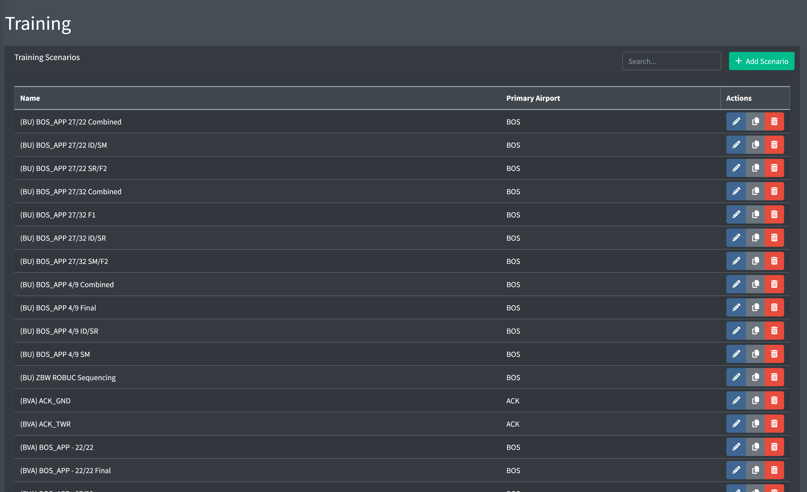

*Training page*

## Adding an Airport

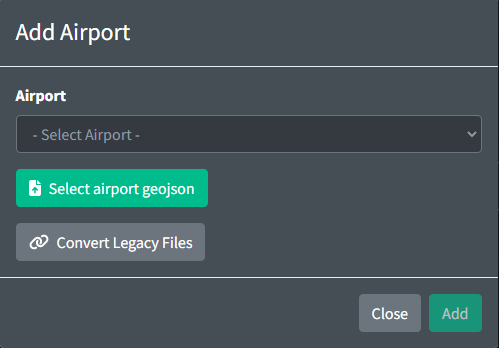

*Adding an airport*

When adding an airport, you must select a facility ID from the list of all available facilities. All training airports must correspond to an ATCT facility.

## Airport GeoJSON Specification

All airports require a GeoJSON file which contains runway, taxiway and parking data. This file can be uploaded when creating an airport.

One Airport is represented by a GeoJSON FeatureCollection:

```
{
  "type": "FeatureCollection",
  "features": []
}
```

All GeoJSON Features must contain the following properties:

- `type`: can be set to one of the following strings: `runway`, `taxiway`, `parking`, or `spot`.
- `name`: a unique string description of the Feature.

### Runway

A Runway element is represented by a GeoJSON LineString. LineStrings contain an array of coordinates. Runways contain the following properties:

- `name`: a unique string containing the name of both ends of the runway separated by `-`. The first identifier is considered the `primary` runway and the second identifier is the `secondary` runway.
- `turnoff`: can be set to one of the following strings: `left`, `right`. This direction is the direction aircraft will attempt to turnoff for the primary runway. The inverse of this value is used for the secondary runway.
- `threshold`: an optional field containing positive integers representing the length of the threshold starting at the first coordinate on the runway in feet. Both values are separated by a `-` so that the first value will be assigned to the primary runway and the second value will be assigned to the secondary runway. If no threshold is given a value of 0 will be assumed for both runways.
- `patternSize`: an optional field containing the distance in nm representing how long the crosswind and base legs of the traffic pattern will be for this runway. If no value is given, the default value from the airport configuration will be used.
- `patternAltitude`: an optional field containing the altitude in feet MSL for aircraft to maintain when in the pattern. If no value is given, the default value from the airport configuration will be used.
- `holdShortDistance`: an optional field containing the distance in feet from the runway centerline that aircraft will use to consider clear of the runway. If not value is given, the default value is used.
- `noTurnoff`: an optional field containing an array of arrays of strings. Each array of strings represents a set of identifiers that will not be allowed to turnoff at this runway. If no value is given, all aircraft will be allowed to turnoff at this runway.

> ℹ️ In the example below, aircraft landing runway 4R will not be able to vacate at taxiways C, H, or F. Aircraft landing runway 22L will not be able to vacate at taxiways F or C.

Example:

```
{
  "type": "Feature",
  "geometry": {
    "type": "LineString",
    "coordinates": [
      [-71.01149, 42.35165],
      [-71.01051, 42.35364],
      [-71.00155, 42.37214],
      [-70.99935, 42.37667]
    ]
  },
  "properties": {
    "type": "runway",
    "name": "4R - 22L",
    "threshold": "1155 - 1199",
    "turnoff": "left",
    "patternSize": 0.5,
    "patternAltitude": 800,
    "holdShortDistance": 200,
    "noTurnoff": [["C", "H", "F"], ["F", "C"]]
  }
}
```

### Taxiway

A Taxiway element is represented by a GeoJSON LineString. LineStrings contain an array of coordinates. Taxiways contain the following optional properties:

- `circular`: a boolean value which defines whether the taxiway start and end points connect.

Example:

```
{
  "type": "Feature",
  "geometry": {
    "type": "LineString",
    "coordinates": [
      [-71.023751, 42.37153],
      [-71.0165, 42.35893],
      [-71.01676, 42.35829]
    ]
  },
  "properties": {
    "type": "taxiway",
    "name": "A",
    "circular": true
  }
}
```

### Parking

A Parking element is represented by a GeoJSON Point. Points contain a single coordinate and the following optional property:

- `heading`: integer in the range [`0`, `359`] representing the heading of an aircraft when parked.

Example:

```
{
  "type": "Feature",
  "geometry": {
    "type": "Point",
    "coordinates": [-71.024203, 42.361508]
  },
  "properties": {
    "type": "parking",
    "name": "A1",
    "heading": 47
  }
}
```

### Taxiway and Ramp Spots

A Spot element is represented by a GeoJSON Point and contains a single coordinate.

Example:

```
{
  "type": "Feature",
  "geometry": {
    "type": "Point",
    "coordinates": [-71.023512, 42.361364]
  },
  "properties": {
    "type": "spot",
    "name": "7"
  }
}
```

### Taxiway and Runway intersections

For taxiways and runways to be considered to be intersecting, they must either share a common point or have points within 100 feet of each other. If two or more points are within 100 feet of each other, they will be considered an intersection between those features and merged into one point. If two features do not have a valid intersection point they will not be considered to be intersecting.

## Editing an Airport

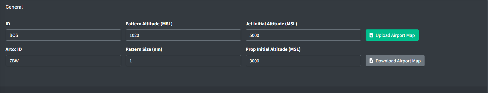

*Airport general configuration*

An Airport contains the following general fields:

- **Pattern Altitude**: the altitude in feet MSL for aircraft to maintain when in the pattern.
- **Pattern Size**: the distance in nm representing how long the crosswind and base legs of the traffic pattern will be by default.
- **Jet Initial Altitude**: the initial altitude of all jet aircraft in feet MSL.
- **Prop Initial Altitude**: the initial altitude of all prop aircraft in feet MSL.

### Aircraft Sets

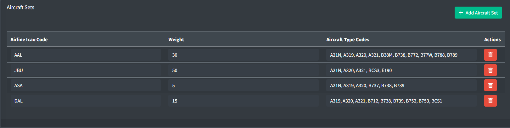

*Aircraft sets list*

Aircraft sets are used to define a set of aircraft and their airline code for use when dynamically generating aircraft.

An Aircraft Set contains the following fields:

- **Airline Icao Code**: the three letter airline ICAO code for the aircraft set.
- **Weight**: a positive integer between 1 and 100 representing the weight of the aircraft set. This value is used to determine the probability of an aircraft set being selected when dynamically generating aircraft.
- **Aircraft Type Codes**: a list of ICAO type codes for the aircraft set. This value is used to determine the aircraft type when dynamically generating aircraft.

  > ℹ️ The type codes are randomly selected from this list. To increase the probably of a single type, duplicates can be entered.

### Predefined Holds

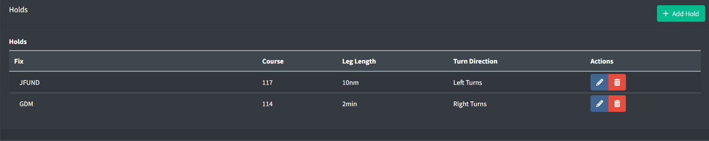

*Predefined Holds list*

Predefined holds allow an easy way to instruct an aircraft to hold over a fix with specific parameters such as published holds.

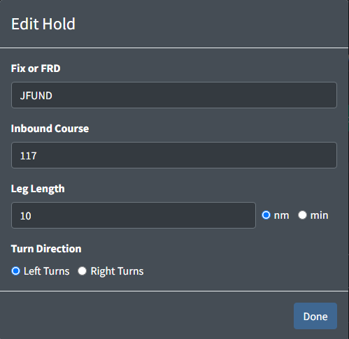

*Edit Hold*

A Hold contains the following fields:

- **Fix or FRD**: a fix or appropriately formatted FRD (Fix Radial Distance) to hold over.
- **Inbound Course**: a positive integer between 0 and 359 specifying the inbound course of the hold.
- **Leg Length**: the length of each leg of the hold. The units are specified by the adjacent radio buttons.
- **Turn Direction**: the direction of all turns within the hold.

### Radar Vector SIDs

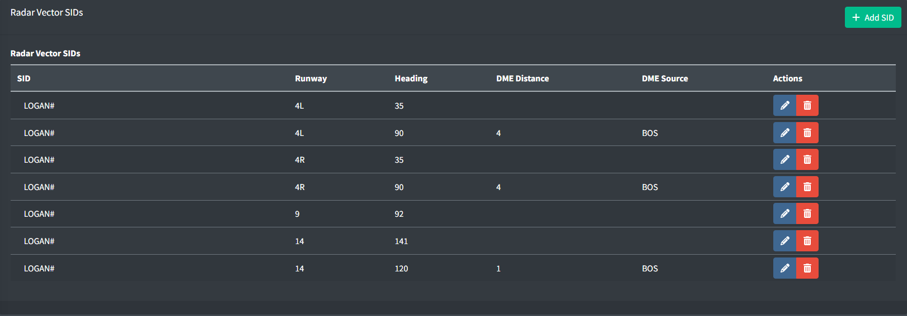

*Radar Vector SIDs list*

The FAA Charted Instrument Flight Procedures (CIFP) does not contain data for radar vector SIDs including SIDs with a radar vector segment. As a result, facilities will need to manually specify the headings for SIDs that are not available. These sids can be set up per runway and contain headings as well as optional values for a fix reference and distance to fly the specified heading at.

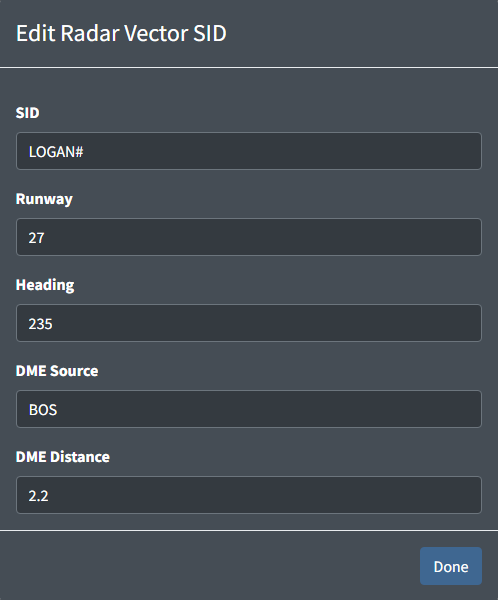

*Edit Radar Vector SID*

A Radar Vector SID contains the following fields:

- **SID**: the name of the SID as displayed in the flight plan. A `#` can be used as a wildcard for the number and a `*` can be used to represent all SIDs for the specified runway.
- **Runway**: the identifier of the runway that this SID applies to.
- **Heading**: a positive integer between 0 and 359 specifying the heading to fly.
- **DME Source**: a NAVAID that is used as the source for the DME Distance.
- **DME Distance**: a positive number representing the distance from the DME Source to fly the specified heading.

### Custom Approaches

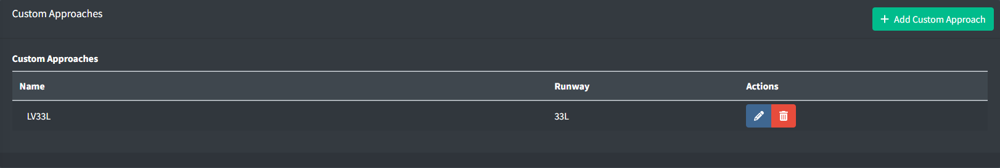

*Custom Approach list*

The FAA Charted Instrument Flight Procedures (CIFP) does not contain data for some approaches such as charted visual approaches. As a result, if a facility wishes to utilize one of these approaches in training, they must be manually defined. These approaches are set up per runway and contain a list of waypoints that are used to build the approach.

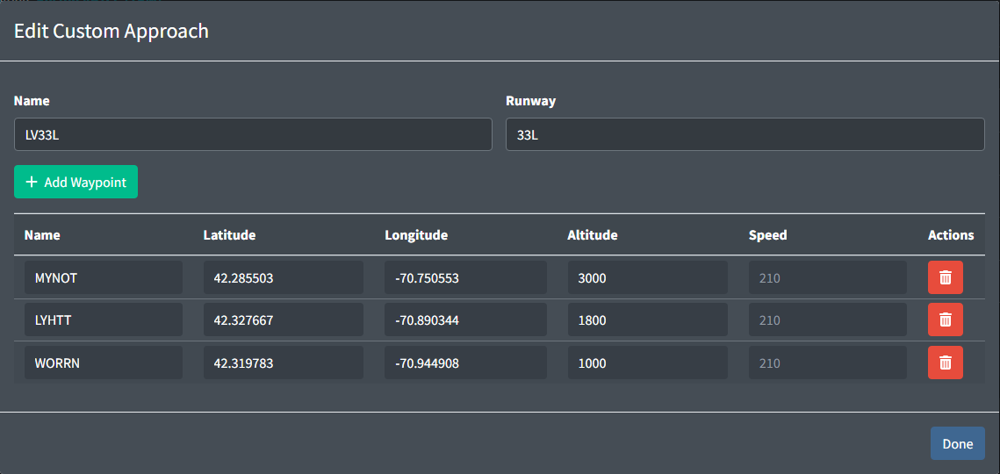

*Edit Custom Approach*

A Custom Approach contains the following fields:

- **Name**: the name of the Approach to be used in the command. The name must contain 1 to 2 characters, followed by the runway identifier, and lastly an optional character for the variant.

  Table 1 - Custom approach name examples

  |  Valid Approach Names |  Invalid Approach Names |
  | --- | --- |
  | V11 | VISUAL11 |
  | LV33L | LV |
  | L33V | LHV33L |
- **Runway**: the identifier of the runway that this approach applies to.

Additionally, a custom approach contains a list of custom waypoints that are used to build the approach. The waypoints are ordered in the order they should be flown. Each Waypoint contains the following fields:

- **Name**: the identifier of the waypoint. This does not have to be a valid FIX or NAVAID identifier and can be any string of numbers and characters between 3 and 8 characters inclusive.
- **Latitude and Longitude:** the location of the waypoint.
- **Altitude**: the altitude to fly at in feet MSL. This value is optional.
- **Speed**: the speed to fly at in knots. This value is optional.

## Scenarios

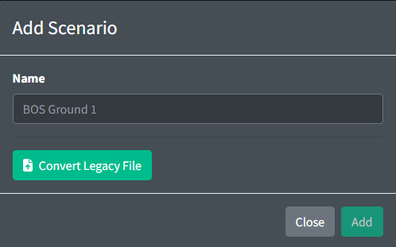

*Adding a scenario*

Scenarios are initially created with just the name of the scenario. This value should be a unique description that will be visible when selecting the scenario from the scenario list or from the client.

All scenario editing is done through the scenario editing page. Scenarios can not be exported or modified externally.

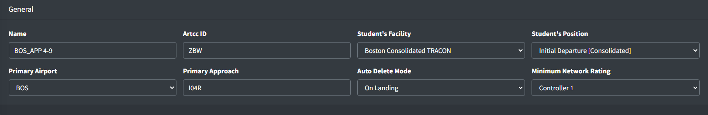

*Scenario general configuration*

A Scenario contains the following optional general fields:

- **Primary Airport**: the primary airport to use as a reference for airport operations. This can be overridden by each individual aircraft.
- **Primary Approach**: the primary approach for all aircraft to expect where no Expected Approach is provided. This can be overridden by each individual aircraft. This value will be used when an aircraft is instructed to join or cleared for an approach.
- **Student's Facility**: the facility of the student in training. Must be accompanied by `Student's Position`.
- **Student's Position**: the position of the student in training. This value is used for auto handoff features.
- **Auto Delete Mode**: the mode to use for automatically deleting aircraft. This value is used to determine when to delete aircraft. The following modes are available:

  - **None**: aircraft will not be automatically deleted.
  - **On Landing**: aircraft will be automatically deleted when they land.
  - **Parked**: aircraft will be automatically deleted when they park.
- **Minimum Network Rating**: the minimum network rating required for a training staff member to run this scenario.

### Aircraft

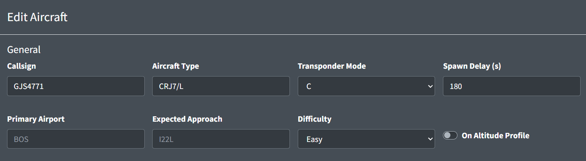

*Aircraft general configuration*

An individual aircraft contains the following general fields:

- **Callsign**: a unique identifier for the aircraft consisting of up to 8 characters and numbers.
- **Aircraft Type**: a valid ICAO aircraft code for the aircraft. This field may contain a wake turbulence prefix and an equipment suffix.

  > ℹ️ The aircraft type is the primary source for aircraft performance information. This aircraft type field will also be used in the filed flight plan unless the `Filed Aircraft Type` is included.
- **Transponder Mode**: the initial transponder mode setting of the aircraft.

  > ℹ️ VATSIM servers only allow for aircraft to either be squawking normal or standby. At this time, `C` and `A` will be represented as normal and `Standby` and `Off` will be represented as standby.
- **Spawn Delay**: the number of seconds to delay spawning the aircraft.
- **Primary Airport**: the primary airport to use as a reference for airport operations. This overrides the scenario's Primary Airport value.

  > ℹ️ Unlike the scenario Primary Airport, this value can be any 3 letter FAA ID including non-towered airports.
- **Expected Approach**: the approach for this aircraft to expect. This value will be used when an aircraft is instructed to join or cleared on an approach and no approach is provided.
- **Difficulty**: the difficulty of this aircraft. This value is used to determine if an aircraft should be loaded.

  > ℹ️ When loading the scenario, the user will be prompted to select a difficulty. All aircraft with a difficulty value above the selected difficulty will not be loaded.
- **On Altitude Profile**: a boolean value representing if an aircraft should follow altitude restrictions after spawning it.

#### Flight Plan


*Aircraft With no Flight Plan*

By default, aircraft will not have flight plans and no flight plans will be sent to the server.

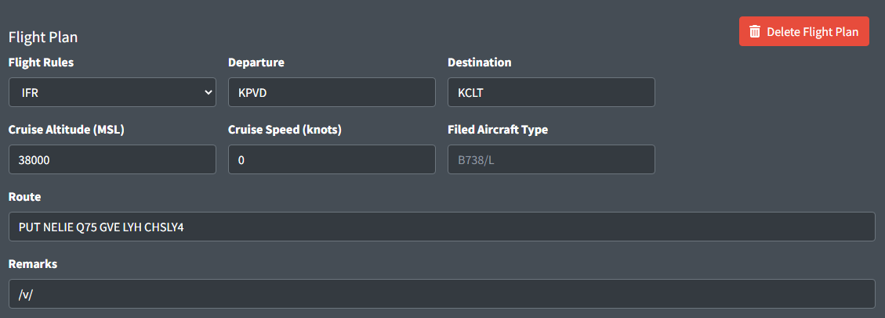

*Aircraft With Flight Plan*

An aircraft's flight plan contains the following fields:

- **Flight Rules**: the flight rules type for this flight plan.
- **Departure**: a 3 or 4 character code for the departure airport.
- **Destination**: a 3 or 4 character code for the flight plan destination airport.
- **Cruise Altitude**: the filed cruise altitude of the aircraft MSL.
- **Cruise Speed**: the filed cruise speed of the aircraft.

  > ℹ️ Cruise speed is used as the default cruise speed for this aircraft.
- **Filed Aircraft Type**: the aircraft type to be filed in the flight plan. This field will not affect aircraft performance.
- **Route**: the filed route string for the aircraft.

  > ℹ️ The route is only used for departures and will be pulled directly from the vatsim flight plan when cleared for takeoff. Any amendments will be processed at that time so flight plans can contain incorrect data.
- **Remarks**: the filed remarks in the flight plan.

  > ℹ️ The departure, destination, cruise altitude, filed aircraft type, and remarks values have no affect on aircraft behavior.

#### Starting Conditions

There are 5 different types of starting conditions for aircraft. `Coordinates`, `Parking`, `Fix or FRD`, `On Runway`, or `On Final`. Each type has it's own associated optional and required properties.

##### Coordinates

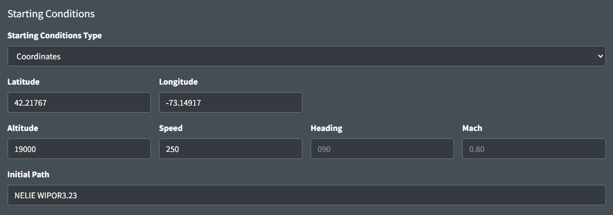

*Aircraft Coordinates Starting Conditions*

- **Latitude/Longitude**: a decimal formatted version of the aircraft's coordinates
- **Altitude**: the aircraft's starting altitude in feet MSL. If left blank this aircraft will be spawned on the ground.
- **Speed**: the aircraft's initial speed (IAS). Can be left blank if the aircraft is on the ground.
- **Heading**: the aircraft's initial heading. Can be left blank if the aircraft is on the ground, or if initial path is not empty.
- **Mach**: the aircraft's assigned mach.
- **Initial Path**: the aircraft's initial path. Initial heading will be derived from this value.

  > ℹ️ STARs can be formatted with the runway or transition. If multiple parallel runways use the same transition append `B` to the end of the runway instead of the L, C, or R.

##### Parking

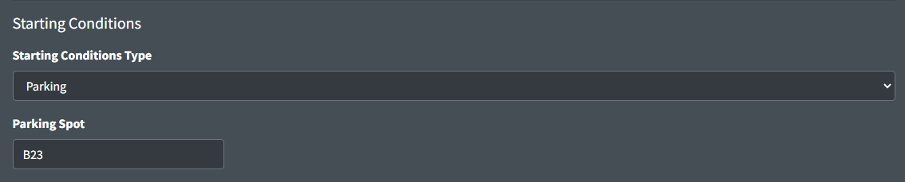

*Aircraft Parking Starting Conditions*

- **Initial Path**: the airport specified parking spot to generate the aircraft at.

##### Fix or FRD

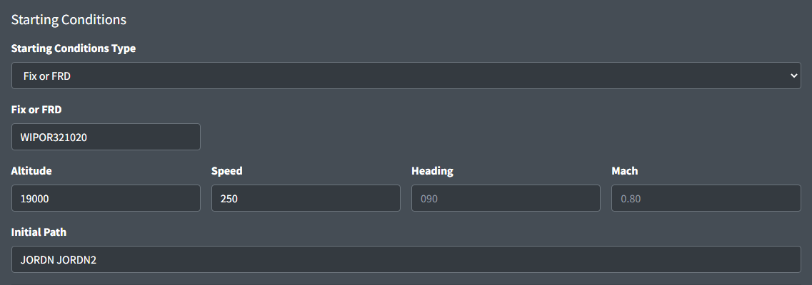

*Aircraft Fix or FRD Starting Conditions*

- **Fix or FRD**: a fix or appropriately formatted FRD (Fix Radial Distance) to generate the aircraft at.
- **Altitude**: the aircraft's starting altitude in feet MSL. If left blank this aircraft will be spawned on the ground.
- **Speed**: the aircraft's initial speed (IAS). Can be left blank if the aircraft is on the ground.
- **Heading**: the aircraft's initial heading. Can be left blank if the aircraft is on the ground, or if initial path is not empty.
- **Mach**: the aircraft's assigned mach.
- **Initial Path**: the aircraft's initial path. Initial heading will be derived from this value.

##### On Runway

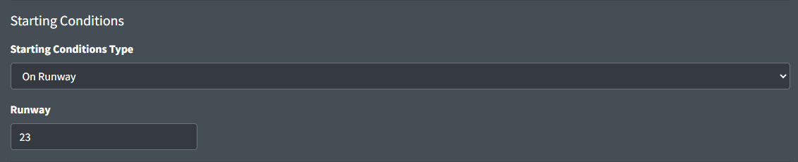

*Aircraft On Runway Starting Conditions*

- **Runway**: the runway for the aircraft to spawn on.

  > ℹ️ An aircraft spawned on a runway will be automatically lined up on the runway and can be cleared for takeoff with a simple command.

##### On Final

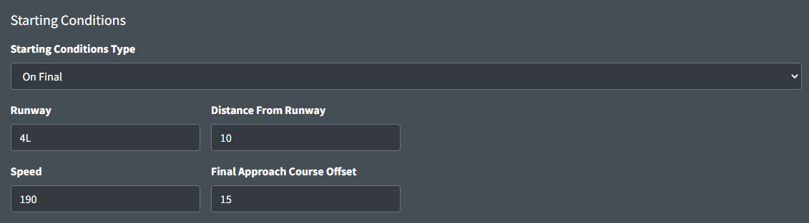

*Aircraft On Final Starting Conditions*

- **Runway**: the runway for the aircraft to spawn on final for.
- **Distance From Runway**: the distance in nautical miles from the first point of the runway.
- **Speed**: the initial speed the aircraft will fly when spawned. This value is optional and will be automatically generated if left empty.

  > ℹ️ Unless a specific speed is needed, leaving this value empty is recommended to ensure a consistent speed of all aircraft on final.
- **Final Approach Course Offset**: the number of degrees to offset from the final approach course.

#### Preset Commands

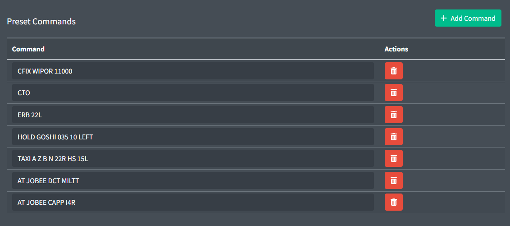

*Preset Commands*

Preset commands are commands that will be run when the aircraft is loaded. If a spawn delay is specified these commands will not be executed until after the spawn delay has expired and the aircraft is spawned.

You can be very creative with these commands and make some amazing scenarios with the combination of spawn delays and the `AT` command.

> ℹ️ Commands may be client specific. See client documentation for command information.

#### Auto Track Configuration

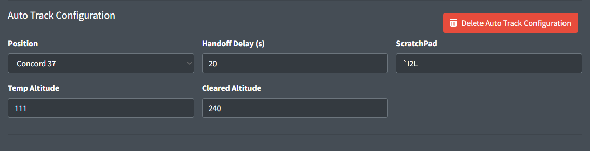

*Auto Track Configuration*

Auto track configuration is used to automatically track aircraft when they are spawned. This is commonly used for scenarios where the student is put into a situation where a neighboring position would have already been tracking the aircraft and may have manipulated data block information.

Auto track configuration is configured using the following required property:

- **Position**: the position that will be tracking the aircraft. Only positions that are selected in the scenario ATC configuration will be available.

Auto track configuration is configured with the following optional properties:

- **Handoff Delay**: the number of seconds to wait before automatically handing off the aircraft to the scenario specified student's position.
- **Scratch Pad**: the scratchpad value to enter into the aircraft's data block.

  > ℹ️ The scratchpad value should match the syntax of the ERAM or STARS scratchpad commands. ERAM free form text scratchpad entries must be prefixed with a backtick (`` ` ``).

  Table 2 - Valid scratchpad entries

  |  Valid ERAM Scratchpad Entries |  Valid STARS Scratchpad Entries |
  | --- | --- |
  | `` `I2L `` | `I2L` |
  | `230` |  |
  | `/280+` |  |
  | `110/0.78-` |  |
- **Temp Altitude**: the temporary altitude to enter into the aircraft's data block. The value entered will be processed using the ERAM `QQ` and the STARS `+` commands.
- **Cleared Altitude**: the cleared/filed altitude to enter into the aircraft's data block. The value entered will be processed using the ERAM `QZ` and the STARS `++` commands.

  > ℹ️ Temp Altitude and Cleared Altitude can be any value that is accepted by the respective ERAM or STARS command processor. Values such as VFR, OTP, or block altitudes may be accepted by ERAM but will not be accepted by STARS.

### Importing aircraft

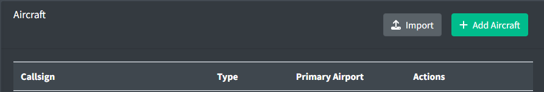

*Import Button*

Creating large amounts of aircraft one by one can be tedious. To help with this, the import button can be used to import aircraft from a different scenario. This will copy all selected aircraft from the selected scenario into the current scenario.

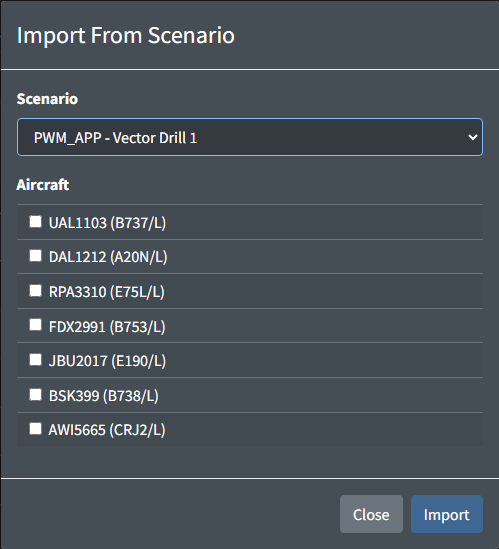

*Import Aircraft from Scenario*

### ATC

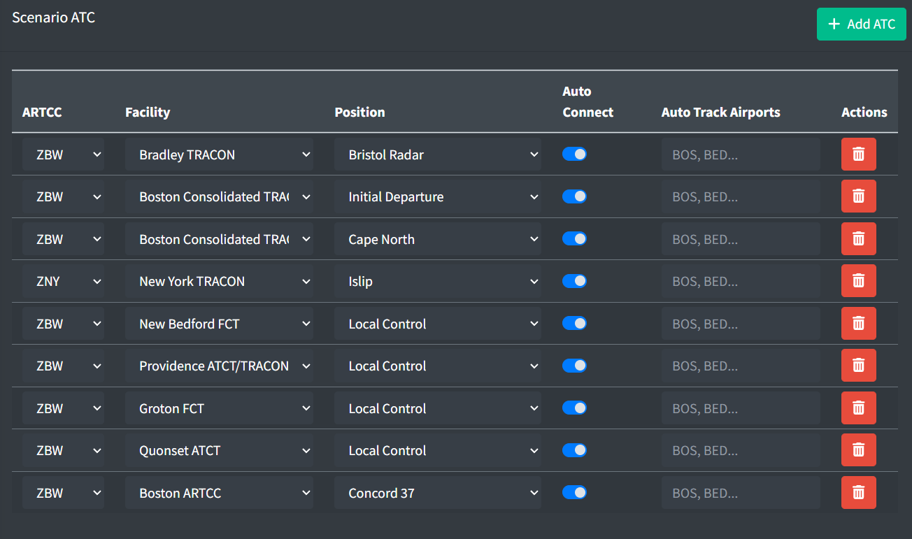

*Scenario ATC Configuration*

Scenario ATC are generated using the following properties

- **ARTCC**: the owning artcc of the intended position.
- **Facility**: the owning artcc of the intended position.
- **Position**: the intended position to automatically generate.
- **Auto Connect**: defines whether the controller should automatically connect when the scenario is loaded or require the user to manually press the connect button.
- **Auto Track Airports**: the list of airports to auto track departures.

### Initialization Triggers

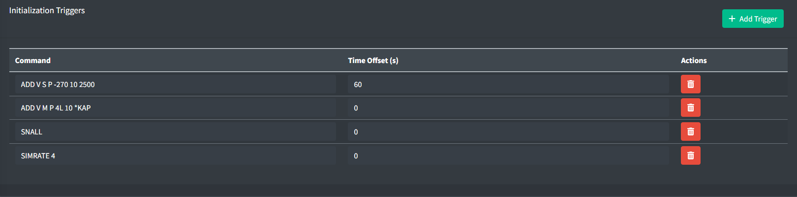

*Scenario Initialization Triggers*

Scenario Initialization Triggers are global commands that are executed on startup. They are not aircraft specific and are commonly used to set up the environment for the scenario.

> ℹ️ Commands may be client specific. See client documentation for command information.

### Arrival Generators

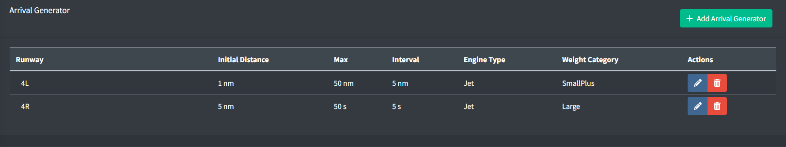

*Scenario Arrival Generators*

Arrival generators are preset configurations for spawning aircraft on final. They are commonly used in scenarios where a large number of randomly generated arrivals is needed at the start of the scenario.

Distance based Arrival generators are run once when the scenario is loaded and will not be run again unless the scenario is reloaded.

Time based Arrival generators are run once when the scenario is loaded and will be run again after the specified interval has expired.

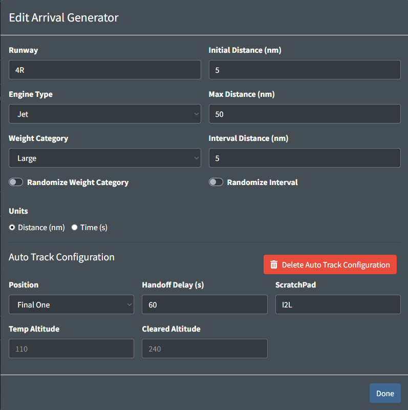

*Edit Arrival Generator*

Arrival generators are configured using the following properties:

- **Runway**: the runway to generate arrivals on final for.
- **Initial Distance**: the distance in nautical miles from the first point of the runway for the first arrival.
- **Engine Type**: the engine type of the aircraft to generate.
- **Weight Category**: the weight category of the aircraft to generate.
- **Units**: the units to use for the arrival generator. This can be either distance in nm or time in s.
- **Randomize Weight Category**: a boolean value representing whether to randomize the weight category of the aircraft.

  > ℹ️ If the weight category is randomized there is a 20% chance that an aircraft will be generated with a different weight category.
- **Randomize Interval**: a boolean value representing whether to randomize the interval between each arrival.

  > ℹ️ If the interval is randomized, the actual interval will be between 90% and 110% of the specified interval.

The following are the properties used for distance based arrival generators:

- **Max Distance**: the maximum distance in nautical miles from the first point of the runway for the last arrival.
- **Interval Distance**: the spacing in nautical miles between each arrival.

The following are the properties used for time based arrival generators:

- **Start Time Offset**: the amount of time in seconds to wait before starting the arrival generator.
- **Max Time**: the amount of time for the arrival generator to run for in seconds.
- **Interval Time**: the spacing in seconds between each arrival.

Scenario ATC can be configured to autotrack all arrivals generated by individual arrival generators.

Arrival Generator Auto Track Configurations can be configured using the following properties:

- **Position**: the position that will be tracking the aircraft. Only positions that are selected in the scenario ATC configuration will be available.
- **Handoff Delay**: the number of seconds to wait before automatically handing off the aircraft to the scenario specified student's position.

  > ℹ️ The Handoff Delay property value only applies to the first aircraft generated by the arrival generator. All subsequent aircraft will have the value incremented to match the interval between aircraft.
- **Scratch Pad**: the scratchpad value to enter into the aircraft's data block.

  > ℹ️ The scratchpad value should match the syntax of the ERAM or STARS scratchpad commands. ERAM free text scratchpad commands should be prefixed with a backtick.

  Table 3 - Valid scratchpad entries

  |  Valid ERAM Scratchpad Entries |  Valid STARS Scratchpad Entries |
  | --- | --- |
  | `` `I2L `` | `I2L` |
  | `230` |  |
  | `/280+` |  |
  | `110/0.78-` |  |
- **Temp Altitude**: the temporary altitude to enter into the aircraft's data block. The value entered will be processed using the ERAM `QQ` and the STARS `+` commands.
- **Cleared Altitude**: the cleared/filed altitude to enter into the aircraft's data block. The value entered will be processed using the ERAM `QZ` and the STARS `++` commands.

  > ℹ️ Temp Altitude and Cleared Altitude can be any value that is accepted by the respective ERAM or STARS command processor. Values such as VFR, OTP, or block altitudes may be accepted by ERAM but will not be accepted by STARS.

### Flight Strip Configuration

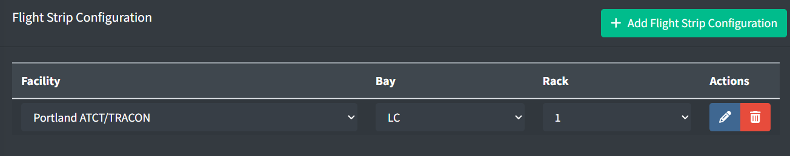

*Flight Strip Configuration List*

Flight Strip Configurations are used to automatically configure the flight strips for aircraft when they are loaded.

They are commonly used to set up the flight strips for scenarios involving a specific set up or where the student is put into a situation where the flight strips would already be setup.

Flight Strip Configuration are configured using the following properties:

- **Facility**: the facility to configure the flight strips for.
- **Bay**: the bay to configure the flight strips for. These bays are defined in the facility configuration.
- **Rack**: the rack to configure the flight strips for. The maximum number of racks is defined in the facility configuration.

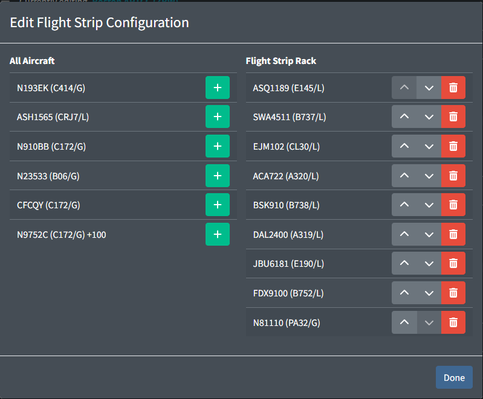

*Edit Flight Strip Configuration*

Each flight strip configuration has a list of aircraft. This order that the aircraft are listed is the order that the flight strips will be ordered in.

Aircraft with delayed start times will have the start time delay indicated after the aircraft type and prefixed with a `+`.

> ℹ️ Aircraft that have a delayed start, spawn in the air, or do not have a flight plan originating at the specified facility may not result in strips being ordered correctly.

## Weather Scenarios

Weather Scenarios are used to generate dynamic weather conditions to affect aircraft performance.

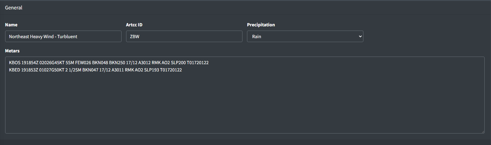

*Weather Scenario General Configuration*

Weather scenarios are configured using the following properties:

- **Name**: the name of the weather scenario.
- **Precipitation**: the precipitation type to use for the weather scenario.
- **Metars**: the metars to use for the weather scenario. These values have no affect on the aircraft performance and are only used for display purposes within vNAS clients.

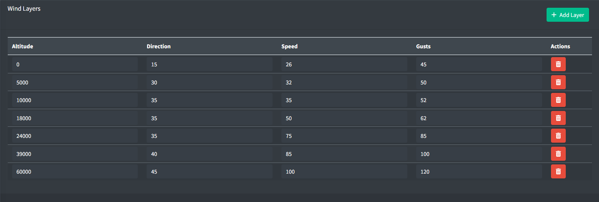

*Wind Layer Configuration*

Wind layers affect aircraft lateral motion. Wind layers are configured using the following properties:

- **Altitude**: the altitude in feet MSL for the wind layer.

  > ℹ️ If an aircraft is between layers, linear interpolation will be used to determine the wind direction, speed, and gusts to use.
- **Direction**: the direction in degrees for the wind layer.
- **Speed**: the speed in knots for the wind layer.
- **Gusts**: the gusts factor in knots for the wind layer. This value is optional. An empty value will assume no gusts and wind speeds will be constant.

## Flight Plan Search and Replace

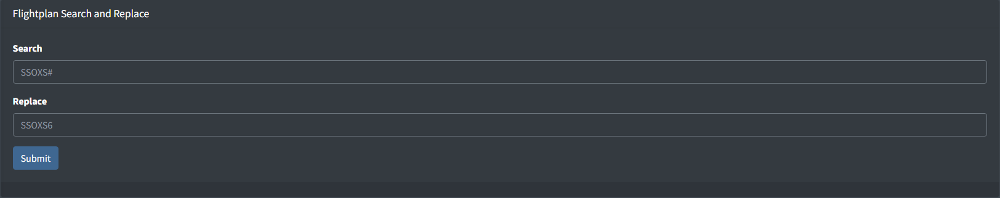

*Flight Plan Search and Replace*

Flight plan search and replace is a tool that allows you to search and replace text in flight plan routes. This tool is commonly used to replace certain portions of routes such as SIDs and STARs when the revision number changes, for example, changing all occurrences of `SSOXS#` to `SSOXS6`.

The flight plan search and replace function accepts exact strings and can accept # as a wildcard for any number.

> ⚠️ The search and replace function will occur instantaneously and can not be undone. Please be careful when using this tool.

> ℹ️ For advanced users, regex statements can be entered to match more complex patterns.
