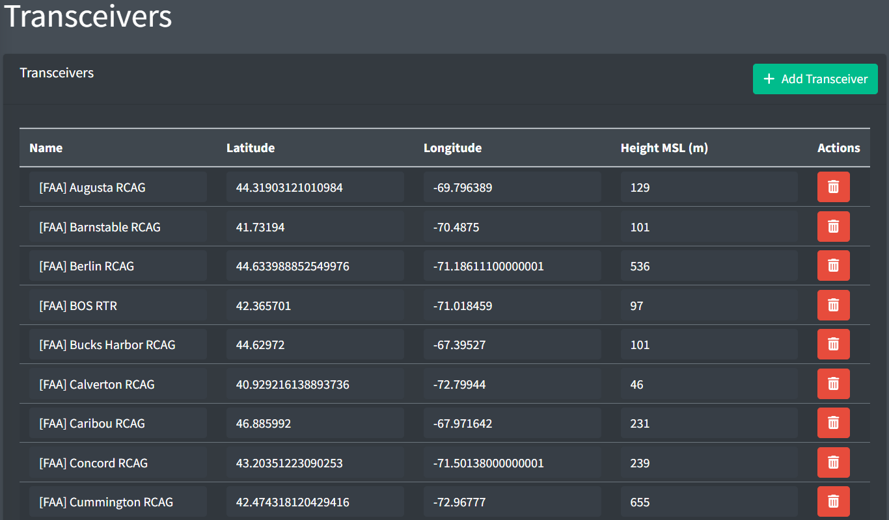

# Transceivers

Transceivers facilitate voice communication with pilots by transmitting and receiving radio waves at their simulated locations. Each controlling position is linked to one or more transceivers that offer radio coverage for their respective area of responsibility.

*Transceivers page*

A transceiver contains the following fields:

- **Name:** the name of the transceiver
- **Latitude and Longitude**: the latitude and longitude of the transceiver
- **Height MSL:** the height in meters above mean sea level of the top of the transceiver's antenna

> ⚠️ Height is expressed in **meters**, not feet
