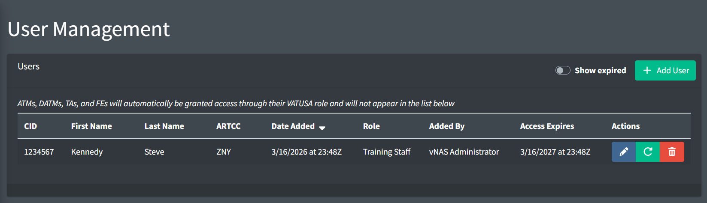
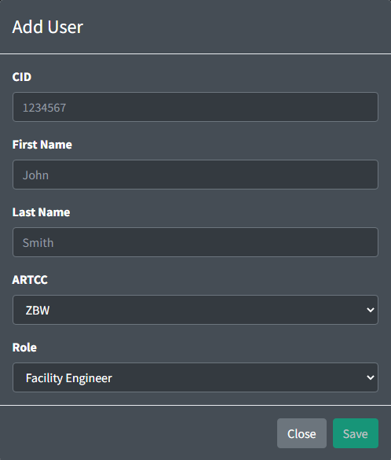

# User Management

*User Management page*

The User Management page allows ATMs, DATMs, and TAs to grant access to their ARTCC's data to other members of their community, such as assistant facility engineers, and training staff members.

> ℹ️ The User Management page is unavailable for users who were added by ATMs, DATMs and TAs.

> ⚠️ Do not add ATMs, DATMs, TAs, or FEs to this list. ATMs, DATMs, TAs, and FEs will **not** appear on the users list. These users are automatically granted access through their VATUSA role.

*Adding a user*

Users contain the following fields:

- **CID:** the user's VATSIM assigned CID
- **First Name**
- **Last Name**
- **ARTCC:** the ARTCC to grant the user access to
- **Role:** the user's role in the ARTCC. The available roles and their permissions are:

  - **Facility Engineer:** access to all pages.
  - **Training Administrator:** access to the training pages and ability to add Training Staff users.
  - **Training Staff:** access to training pages.

> ℹ️ After being manually added by an ARTCC administrator, a user is granted access to the Data Admin website for one year. A user's access can be renewed by an ARTCC administrator by clicking the green renew access button.
