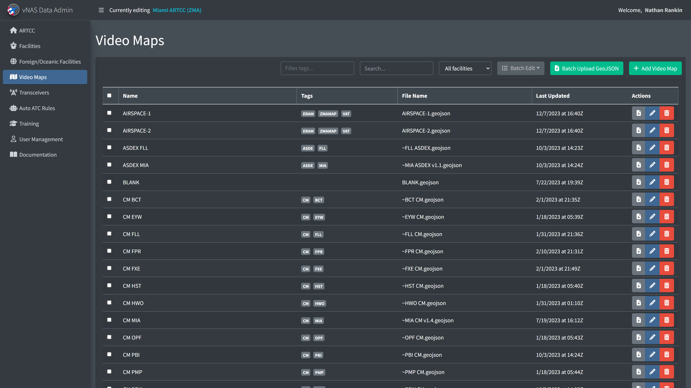
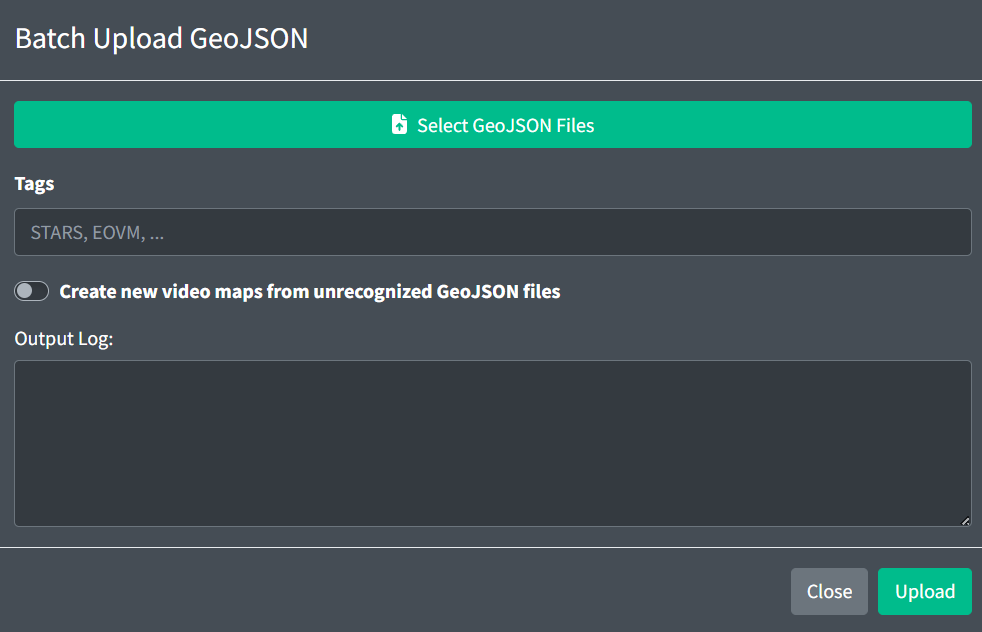
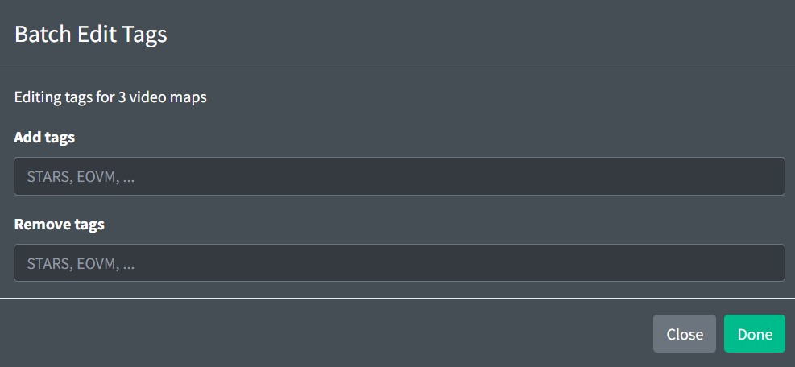
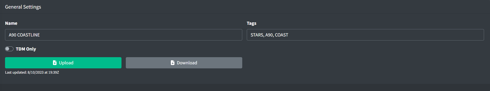
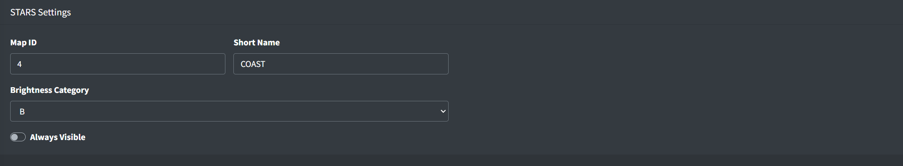

# Video Maps

Video Maps are used by many vNAS systems. To prevent unnecessary Video Map duplication across systems, each ARTCC contains a central repository of Video Maps. Video Maps are saved in the [GeoJSON](https://geojson.org/) format, and can be constructed and edited in many third-party GIS programs. To support the transition from legacy systems, Video Maps in old `.sct2`, vSTARS and vERAM file formats can be converted through programs such as [FE Buddy](https://github.com/Nikolai558/FE-BUDDY/releases).



*Video Maps page*

Adding a Video Map requires the Video Map's name and its GeoJSON data.

Video Maps cannot be deleted if they are referenced by a facility's configuration.

## Batch updating GeoJSON files



*Batch uploading GeoJSON files*

To save time uploading individual GeoJSON files, you can upload multiple GeoJSON files through the Batch Upload GeoJSON modal. By default, this will only replace existing GeoJSON files with the same name. To create a new Video Map from an unrecognized GeoJSON files, select the checkbox. This will create new Video Maps populated with default values. You can also specify the tags each Video Map will receive.

> ⚠️ If two Video Maps have GeoJSON files with the same name, the batch uploader will be unable to update that file.



*Batch editing tags*

You can also add or remove tags to multiple Video Maps at a time by selecting their checkboxes, then clicking "Batch Edit" > "Edit Tags" to open the modal.

## GeoJSON Specification

One VideoMap is represented by a GeoJSON FeatureCollection:

```
{
  "type": "FeatureCollection",
  "features": []
}
```

The GeoJSON FeatureCollection contains definitions for VideoMap Elements: Line, LineString, Polygon, Symbol, and Text.

Any GeoJSON Feature may contain the following optional properties:

- `color`: a hex color string. If displayed on a Tower Cab display, the feature will be rendered in the specified color.
- `bcg`: an integer in the range [`1`, `40`]. This assigns an ERAM brightness control group to this Feature. For more information, see the [GeoMaps](facilities.md#geomaps) section of the documentation.
- `filters`: an array of integers in the range [`0`, `40`]. This assigns an ERAM filter to this Feature. Features in filter `0` will be shown at all times. For more information, see the [GeoMaps](facilities.md#geomaps) section of the documentation.
- `zIndex`: any positive integer. Features with a higher zIndex value will be rendered above Features with lower zIndex values.

### Line

A Line element is represented by a GeoJSON LineString. LineStrings contain an array of coordinates and the following optional properties:

- `style`: can be set to one of the following strings: `solid`, `shortDashed`, `longDashed`, or `longDashShortDash`.
- `thickness`: integers in the range [`1`, `3`].

Example:

```
{
  "type": "Feature",
  "geometry": {
    "type": "LineString",
    "coordinates": [
      [51.32, -66.54],
      [21.26, -57.04],
      [74.0, -52.85],
      [55.1, -63.93]
    ]
  },
  "properties": {
    "style": "shortDashed",
    "thickness": 3,
    "color": "#ffffff",
    "bcg": 1,
    "filters": [1, 8]
  }
}
```

Another example:

```
{
  "type": "Feature",
  "geometry": {
    "type": "LineString",
    "coordinates": [
      [42.055599, -102.804001],
      [42.143902777777775, -102.34948055555554],
      [42.33310277777778, -101.33650277777777],
      [42.46358888888889, -100.60425555555555]
    ]
  },
  "properties": {
    "style": "solid",
    "thickness": 3,
    "color": "#ffffff",
    "bcg": 1,
    "filters": [1, 8]
  }
}
```

> ℹ️ `MultiLineString` is also supported. For more information, please see [section 3.1.5](https://datatracker.ietf.org/doc/html/rfc7946#section-3.1.5) of the GeoJSON format.

### Polygon

A Polygon element is represented by a GeoJSON Polygon. Polygons contain an array of coordinates and the following property:

- `asdex`: one of the following strings to render the polygon in the following colors (displayed in the following order):

Table 1 - ASDE-X Polygon colors

|  | Day Mode | Night Mode |
| --- | --- | --- |
| `structure` |  |  |
| `runway` |  |  |
| `taxiway` |  |  |
| `apron` |  |  |

Example:

```
{
  "type": "Feature",
  "geometry": {
    "type": "Polygon",
    "coordinates": [
      [
        [50, -10],
        [52, -15],
        [25, -35]
      ],
      [
        [49, -5],
        [50, -10],
        [25, -35]
      ]
    ]
  },
  "properties": {
    "asdex": "runway"
  }
}
```

- `said`: same as `asdex` for SAID (Saab)

> ℹ️ `MultiPolygon` is also supported. For more information, please see [section 3.1.7](https://datatracker.ietf.org/doc/html/rfc7946#section-3.1.7) of the GeoJSON format.

### Symbol

A Symbol element is represented by a GeoJSON Point. Points contain a single coordinate and the following property:

- `style`: one of the following strings: `obstruction1`, `obstruction2`, `heliport`, `nuclear`, `emergencyAirport`, `radar`, `iaf`, `rnavOnlyWaypoint`, `rnav`, `airwayIntersections`, `ndb`, `vor`, `otherWaypoints`, `airport`, `satelliteAirport`, `tacan`, or `dme`.

Points can also contain the following optional properties:

- `size`: integers in the range [`1`, `4`].

Example:

```
{
  "type": "Feature",
  "geometry": {
    "type": "Point",
    "coordinates": [100.0, 0.0]
  },
  "properties": {
    "style": "vor"
  }
}
```

### Text

Text can be added to ERAM Video Maps, top down mode STARS Video Maps, and labels in EDST's GPD. A Text element is represented by a GeoJSON Point. Points contain a single coordinate and the following property:

- `text`: an array of strings. Each string represents a line of text.

Points may also contain the following optional properties:

- `size`: integers in the range [`0`, `5`].
- `underline`: `true` or `false`.
- `xOffset`: any integer.
- `yOffset`: any integer.

Points for ERAM Video Maps also contain the following optional property:

- `opaque`: `true` or `false`.

Example:

```
{
  "type": "Feature",
  "geometry": {
    "type": "Point",
    "coordinates": [112.0, 3.0]
  },
  "properties": {
    "text": ["Line 1", "Line 2"],
    "underline": true
  }
}
```

> ℹ️ `MultiPoint` is also supported. For more information, please see [section 3.1.3](https://datatracker.ietf.org/doc/html/rfc7946#section-3.1.3) of the GeoJSON format.

### Map Defaults

Default values for line, symbol, and text properties can be specified by defining Point features. These features are identified by the following properties:

- `isSymbolDefaults`: a boolean denoting the point contains default symbol properties
- `isLineDefaults`: a boolean denoting the point contains default line properties
- `isTextDefaults`: a boolean denoting the point contains default text properties

These Points will only be used to set the default values and will not be rendered. Any values set within these features will be used for any feature that doesn't explicitly override these defaults.

> ℹ️ Map defaults Points may be placed anywhere.

Example:

```
{
  "type": "Feature",
  "geometry": {
    "type": "Point",
    "coordinate": [-71.1685, 42.3355]
  },
  "properties": {
    "isSymbolDefaults": true,
    "bcg": 15,
    "filters": [12, 15],
    "style": "Ndb",
    "size": 2
  }
}
```

### Display Type Support

GeoJSON properties are supported/utilized by display types as follows:

Table 2 - GeoJSON property support

|  | Tower Cab | ASDE-X | STARS | ERAM |
| --- | --- | --- | --- | --- |
| `color` |  |  |  |  |
| `bcg` |  |  |  |  |
| `filters` |  |  |  |  |
| `zIndex` |  |  |  |  |
| `line.style` |  |  |  |  |
| `line.thickness` |  |  |  |  |
| `polygon.asdex` |  |  |  |  |
| `symbol.style` |  |  |  |  |
| `symbol.size` |  |  |  |  |
| `point.text` |  |  |  |  |
| `point.size` |  |  |  |  |
| `point.underline` |  |  |  |  |
| `point.xOffset` |  |  |  |  |
| `point.yOffset` |  |  |  |  |
| `point.opaque` |  |  |  |  |

## Video Map Configuration



*Video Map general settings*

A Video Map contains the following general fields:

- **Name:** the name of the Video Map.
- **Tags:** an optional set of labels to organize Video Maps.
- **TDM Only:** configures if the Video Map is only visible in top down mode in ERAM or STARS.

### STARS Settings



*Video Map STARS settings*

If a Video Map is to be used in a STARS system, the following fields must be specified:

- **Map ID:** a numeric ID used by STARS for creating Map Groups. For more information on STARS Map Groups, please see the [STARS Configuration](facilities.md#video-maps) section of the documentation.
- **Short Name:** a shorter name of the Video Map to display on its DCB button within STARS
- **STARS Brightness Category:** configures if the Video Map is part of STARS brightness group A or B
- **Always Visible:** configures if the Video Map is always visible in STARS. This is useful for Video Maps that should always be available in top-down mode, such as airport diagrams.
