# vTDLS Controller Manual

Virtual Tower Data Link Services (vTDLS) is a web application that simulates the real-world system used by FAA controllers to issue pre-departure clearances (PDCs). vTDLS is used in conjunction with other vNAS clients, such as CRC.

This manual is intended to teach controllers how to utilize vTDLS to issue PDCs on the VATSIM network.

<figure>
    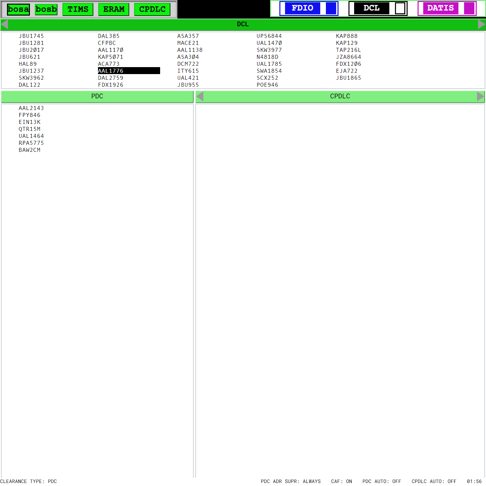
    <figcaption>Fig.  - A vTDLS display</figcaption>
</figure>

> :link: vTDLS is accessed at <https://tdls.virtualnas.net/>.

> :link: This guide is intended for controllers. If you are a Facility Engineer seeking TDLS configuration documentation, please see the [TDLS configuration section](https://data-admin.virtualnas.net/docs/#/facilities?id=tdls-configuration) of the vNAS Data Admin website documentation.

## Logging In

Logging in to vTDLS requires authentication through [VATSIM Connect](https://auth.vatsim.net/). Upon logging in to your VATSIM account and authorizing vNAS access, you are redirected back to the vTDLS login page.

<figure>
    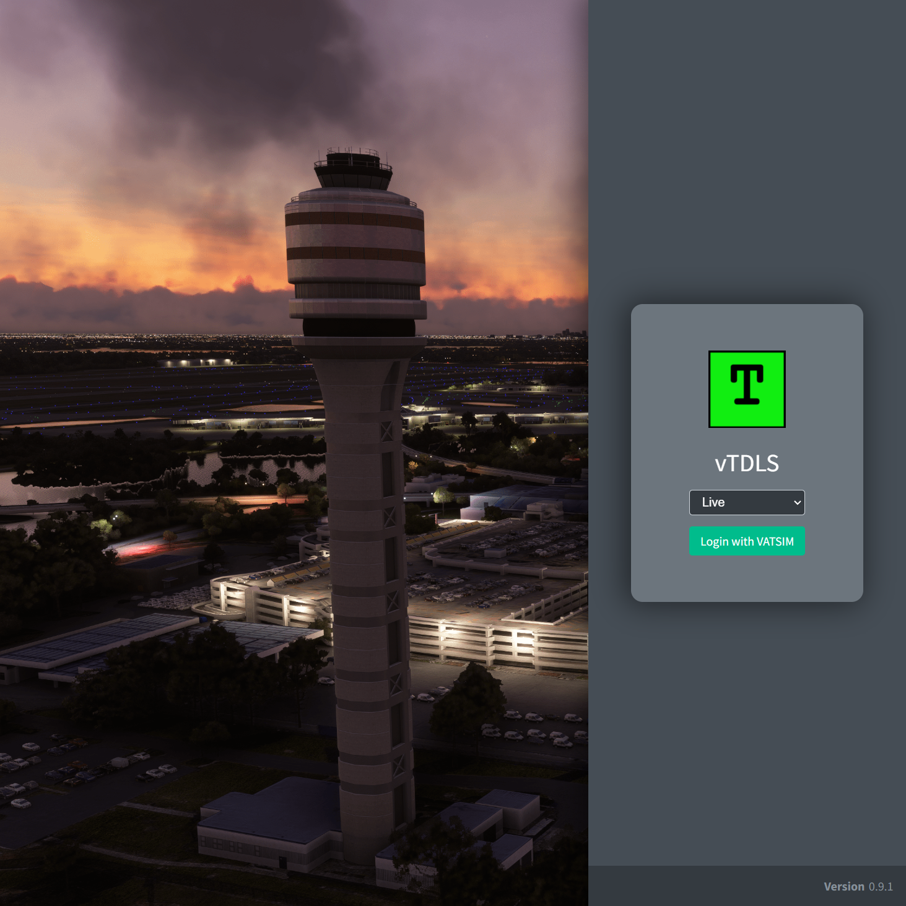
    <figcaption>Fig.  - vTDLS login</figcaption>
</figure>

vTDLS then searches for your active position on a vNAS radar client, such as CRC.

If you are not logged in to a vNAS radar client, the message **No vNAS Connection** is displayed:

<figure>
    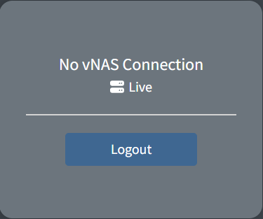
    <figcaption>Fig.  - No vNAS connection</figcaption>
</figure>

If you are working a facility that does not utilize TDLS, the message **No TDLS Facility Available** is displayed:

<figure>
    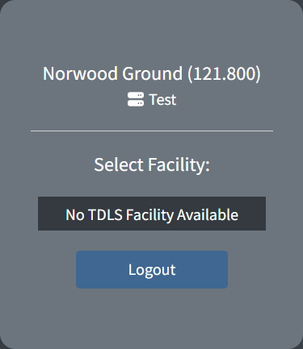
    <figcaption>Fig.  - No TDLS facility available</figcaption>
</figure>

If you are working a facility that does utilize TDLS, that facility appears in the selection menu:

<figure>
    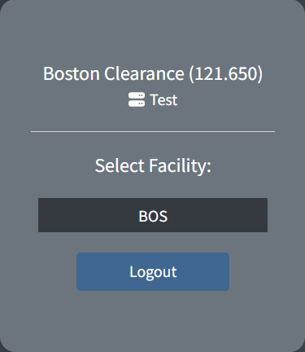
    <figcaption>Fig.  - Selecting a facility</figcaption>
</figure>

If you are working a facility that assumes responsibility for one or more TDLS facilities when consolidated top-down, those child facilities also appear in the selection menu. For example, ALB, BDL, BOS, and PVD all utilize TDLS. When working ZBW (the parent ARTCC), all four facilities appear in the selection menu. While unrealistic, the parent facility (in this example ZBW) can also be selected to view flight plans from all child TDLS facilities on one consolidated page. For more information, see the [Switching Facilities](#switching-facilities) section of the documentation.

## TDLS Window Layout

<figure>
    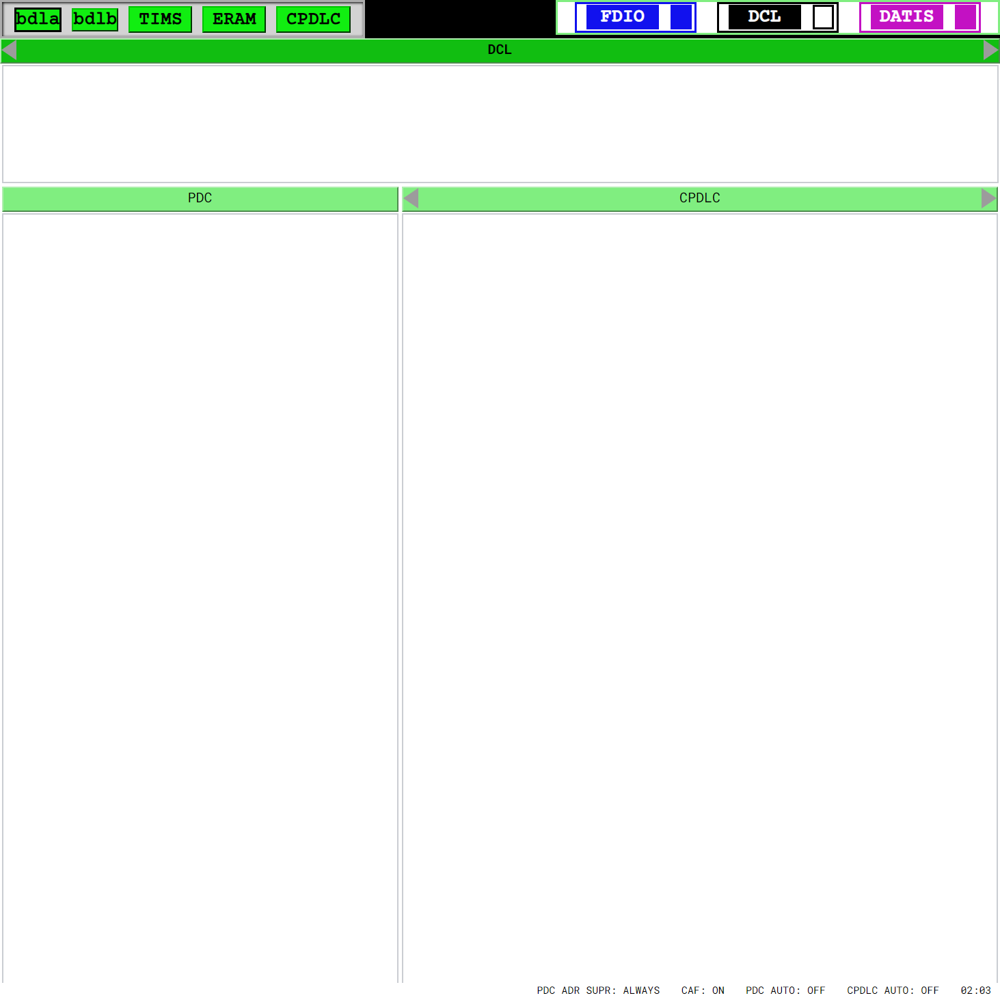
    <figcaption>Fig.  - A TDLS window</figcaption>
</figure>

### Header

The TDLS header contains system information, most of which is not simulated in vTDLS. The active facility indicator on the top left displays the current TDLS facility ID (**bdla** in Figure ). Clicking this indicator opens the [Facility Menu](#switching-facilities).

### DCL (Departure Clearance)

When a pilot files a flight plan that departs the TDLS facility, their aircraft ID (callsign) appears in the DCL list. Flight plans remain in the DCL list until:

- a [PDC is sent](#sending-a-pdc)
- the flight plan is manually [dumped](#dumping-a-flight-plan) from TDLS
- the flight plan is activated on departure
- a time out of two hours

> :information_source: If a pilot pre-files prior to connecting to the network, their flight plan is displayed in the DCL list, even if the pilot is not yet connected.

### PDC (Pre-Departure Clearance)

After sending a PDC, the aircraft ID moves from the DCL list to the PDC list. Flight plans remain in the PDC list until they are activated on departure, or a time out of two hours.

### CPDLC (Controller-Pilot Data Link Communications)

This list is not currently simulated as VATSIM does not officially support CPDLC. The CPDLC list is hidden when the vTDLS window width is small.

### Footer

The TDLS footer displays system status information. Although most information is not simulated in vTDLS, there is a system clock on the right that displays the current Zulu time.

When preparing a valid PDC, the status message **CLEARANCE TYPE: PDC** appears on the left side of the footer. If a [mandatory field](#mandatory-fields) is not set, the status message **MANDATORY FIELD NOT SET** appears instead, and the **Send** button is disabled.

## Preparing a PDC

To prepare a PDC, left-click an aircraft ID in the DCL list or use the [keyboard commands](#key-commands) to select the aircraft. This displays the aircraft's flight plan in a new window at the bottom of the TDLS page.

### Flight Plan Layout

<figure>
    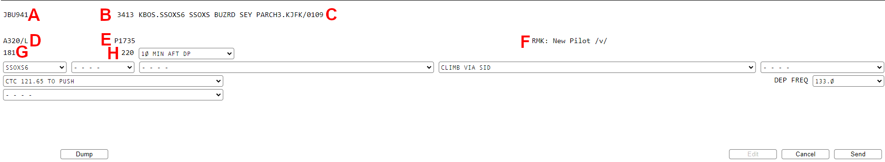
    <figcaption>Fig.  - A TDLS flight plan</figcaption>
</figure>

Figure  labels the flight plan fields as follows:

| Field | Description                                                                       |
| ----- | --------------------------------------------------------------------------------- |
| A     | Aircraft ID (callsign)                                                            |
| B     | Beacon code                                                                       |
| C     | Route with departure and destination, and estimated time en route in /HHMM format |
| D     | Aircraft type and FAA equipment suffix                                            |
| E     | Proposed departure time                                                           |
| F     | Remarks                                                                           |
| G     | Aircraft CID                                                                      |
| H     | Requested cruise altitude in hundreds of feet (flight level)                      |

<figcaption>Table  - Flight plan fields</figcaption>

### Selecting PDC Field Values

A PDC consists of up to nine fields. Each field has a corresponding dropdown menu to choose a value to send to the pilot. From left to right, top to bottom, the fields are as follows:

| Field               | Description                                                    |
| ------------------- | -------------------------------------------------------------- |
| Expect              | The time at which the cruise altitude may be expected          |
| SID                 | The assigned SID                                               |
| Transition          | The assigned SID's transition                                  |
| Climb out           | Climb out instructions (e.g. heading or charted climb)         |
| Climb via           | Climb via SID instructions                                     |
| Maintain            | Initial top altitude instructions                              |
| Contact info        | The frequency the pilot should contact after receiving the PDC |
| Departure frequency | The departure frequency                                        |
| Local info          | Any additional information to include in the PDC               |

<figcaption>Table  - Clearance fields</figcaption>

TDLS attempts to populate these fields based on the aircraft's filed routing. Dashed lines (**- - - -**) indicate no option is selected, or none are available.

> :information_source: Only values predefined by the Facility Engineer may be selected.

Selecting a SID and transition pair also populates the remaining fields with default values defined by the Facility Engineer. However, other pre-defined values can be selected by clicking the corresponding dropdown menu and selecting the desired value.

> :warning: Flight plans cannot be amended through TDLS, even if the selected SID differs from the flight plan. Amendments must be done through a radar client.

### Mandatory Fields

Some fields are marked as mandatory by the Facility Engineer. This means a value must be selected for the field before sending the PDC. If a mandatory field is not set, the message **MANDATORY FIELD NOT SET** appears on the left side of the [footer](#footer). If all required fields are set, the message **CLEARANCE TYPE: PDC** appears instead.

### Special Fields

Due to VATSIM's top-down workflow, departure and initial contact frequencies may not be standard, such as when an en route controller is working the departure sector of a TRACON.

To send a non-standard departure frequency in a PDC, open the [Facility Menu](#switching-facilities) and input any non-standard frequencies in the **Temp. Dep Freqs** field (Figure +1). If **Add current frequency to Temp. Dep Freqs** is enabled, the Temp. Dep Freqs list is initialized with your current primary frequency. Frequencies inputted in the Facility Menu are available for [selection](#selecting-pdc-field-values) in the departure frequency field.

<figure>
    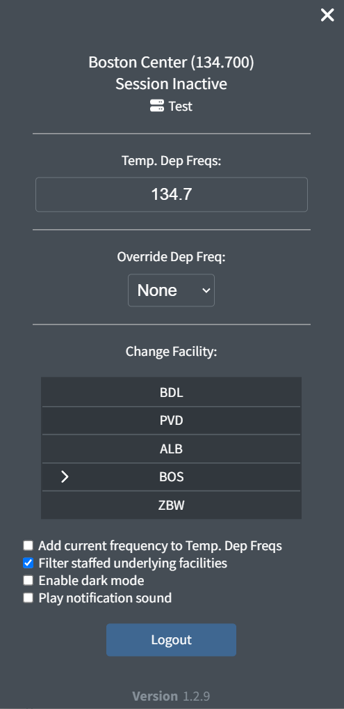
    <figcaption>Fig.  - Adding temporary departure frequencies</figcaption>
</figure>

To override the departure frequency that's selected by default when opening the clearance editor, select one of the temporary departure frequencies in the **Override Dep Freq** field. This dropdown includes the frequencies entered above in the **Temp. Dep Freqs** field.

> :information_source: Facility Engineers are able to specify a variable in contact information values that is automatically substituted by your active frequency. If the Facility Engineer utilizes this feature, your active frequency is automatically listed in the contact information values.

### Sending a PDC

When the PDC is correct, press **Send** to send the PDC to the pilot client. The aircraft ID moves from the DCL to the PDC list and the aircraft receives a PDC message from **ACARS** similar to the one depicted below:

<figure>
    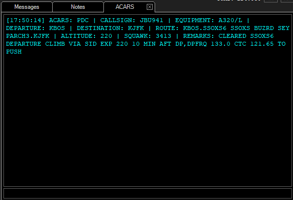
    <figcaption>Fig.  - A PDC received in a pilot's client</figcaption>
</figure>

To close the clearance editor without sending, press `Cancel` to discard any changes made to the PDC. This does not amend or cancel the flight plan.

> :information_source: PDCs can be sent before the aircraft connects to the network. In this situation, the pilot receives the PDC as soon as they connect.

> :information_source: If a pilot disconnects and then reconnects before departure, a new copy of their PDC is automatically sent to them.

> :warning: In order to send PDCs, your controlling session must be activated on your primary controlling client.

> :warning: A PDC cannot be amended once it has been sent. Any amendments to the clearance must be done over voice (or text).

## Managing vTDLS

### Dumping a Flight Plan

A flight plan can be dumped (removed) from TDLS by clicking the **Dump** button on the bottom left of the flight plan. Once a flight plan has been dumped, it cannot be re-added to TDLS, and a clearance must be given over voice or text.

### Reviewing a Sent PDC

Selecting an aircraft ID from the PDC list reopens the flight plan window. However, the PDC field dropdown menus only display the value that was sent with the PDC and cannot be changed.

### Switching Facilities

If multiple TDLS facilities are being worked top-down, the displayed facility is switched by pressing the `Esc` key or clicking the facility ID on the top-left of the header to open the Facility Menu. A different facility can then be selected from the **Change Facility** menu. While unrealistic, a parent facility can also be selected to view flight plans from all unstaffed child TDLS facilities on one consolidated page. The available [key commands](#key-commands) can also be used to quickly cycle through facilities.

> :information_source: When viewing a parent facility, only flight plans for unstaffed child facilities are displayed. When a child facility is staffed, flight plans for that facility are hidden and the facility's ID appears in the facility menu under **Hidden Facilities**. This filter can be enabled or disabled in the facility menu.

<figure>
    
    <figcaption>Fig.  - Switching facilities</figcaption>
</figure>

### Key Commands

| Action                      | Key                  |
| --------------------------- | -------------------- |
| Highlight aircraft in list  | (`↑`, `↓`)           |
| Change selected list        | (`Tab`, `` ` ``)     |
| Select highlighted aircraft | `Enter`              |
| Dump flight plan            | `F4`                 |
| Cancel                      | `F10`                |
| Send clearance              | `F12`                |
| Change to next facility     | `Ctrl` + `Alt` + `→` |
| Change to previous facility | `Ctrl` + `Alt` + `←` |

<figcaption>Table  - Key commands</figcaption>

### Notification sound

While unrealistic, a notification sound can be played when a new aircraft is added to the DCL. This feature may be toggled on and off through the [Facility Menu](#switching-facilities).

### Dark Mode

While unrealistic, dark mode may be toggled on and off through the [Facility Menu](#switching-facilities).

### Installing as a Desktop Application (Chrome)

With Google Chrome, it is possible to install vTDLS as a desktop application. This allows vTDLS to be pinned to the Windows taskbar and launches the application in a dedicated window without the browser toolbar.

To install as a desktop application from Chrome, click the three dots on the top right of the toolbar, and select **More tools** then **Create shortcut...**.

<figure>
    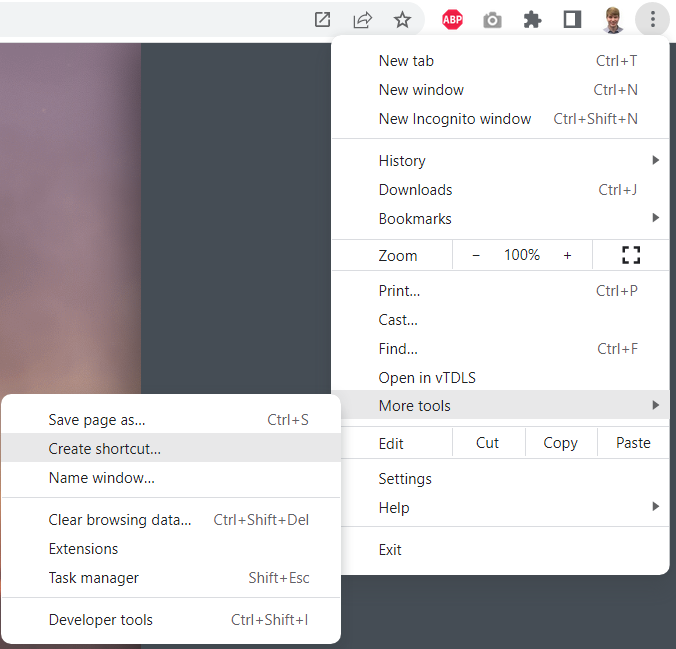
    <figcaption>Fig.  - Saving as a desktop application</figcaption>
</figure>

Finally, check **Open as window** and click **Create** to add the shortcut. vTDLS is then installed as a standalone desktop application.

<figure>
    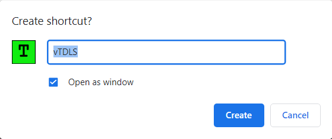
    <figcaption>Fig.  - Creating the shortcut</figcaption>
</figure>
